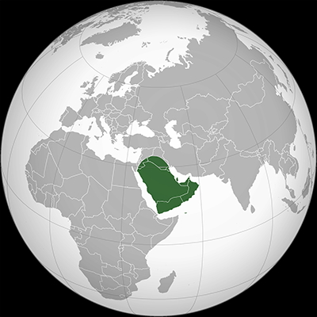

# Arabic (Arabian Peninsula)

## Introduction

The Arabic (Arabian Peninsula) sky culture reflects the oral folk tradition of star names and asterisms in the Arabian Peninsula, primarily found scattered in poetry and proverbs.

## Description

The Arabian Peninsula is a region covering the southwestern corner of Asia, bordered by the Gulf of Aden and Arabian Sea to the south, the Gulf of Oman and the Arabian/Persian Gulf to the east, and the Red Sea to the west. The northern border is not precisely defined, but according to ancient geographers, it is bordered by rivers, notably the Euphrates River [#16] [#17]. This region is inhabited by Arabs and includes Jordan, Saudi Arabia, Kuwait, Bahrain, Qatar, United Arab Emirates, Oman, Yemen, and parts of Syria and Iraq.

Bedouins and farmers across the Arabian Peninsula relied heavily on stars to time their nomadic journeys, care for animals, forecast weather, and conduct agricultural activities. Stars are frequently mentioned in their proverbs and poetry. Fortunately, oral poetry and proverbs have been documented and preserved by various scholars. Surveying the collections of these scholars alongside oral traditions reveals the star knowledge of the people in this region.

The stars used for timing are the same as those of ancient Arabs, but the system is simplified by beginning the year with the heliacal rising of al-Thurayyā, the Pleiades, at the start of summer, then counting 13 days for each lunar station, except al-Ǧabhah, which has 14 days. This results in a 27 lunar stations × 13 days + 14 days (al-Ǧabhah) = 365-day cycle. Other timing methods were also used, such as the monthly Pleiades-Moon conjunction or using stars like those of the Big Dipper.

The sources indicate that star names and asterisms are fewer compared to those of ancient Arabs. Only the brightest stars and prominent asterisms were named and used. An important source of continuing star knowledge is the poetry of al-Ḫalāwī, a poet whose era is uncertain but estimated to be in the 17th century [#3]. Another key source is a poem by Moḥammad al-Qāḍī (~1809–1886), in which he described all 28 lunar stations, citing their local names [#2].

## Constellations

##### The Two Guards

The Two Guards are the stars β Ursae Minoris and γ Ursae Minoris, traditionally used in desert navigation. Their name comes from an old legend in which al-Jady (Polaris) kills the father of the Seven Sisters—represented by the stars of the Big Dipper—who then carry their father’s bier and circle al-Jady, vowing revenge. Seeking protection from their wrath, al-Jady turned to these two nearby stars, which became known as the “Two Guards.” [#1].

##### The Two Refugees

Another name for the two stars β Ursae Minoris and γ Ursae Minoris. According to a different version of the legend, these stars are the killers who fled to al-Jady for protection [#1].

##### The Family Of Aba Bzay

Yet another name for the two-star asterism β UMi and γ UMi [#1].

##### Al-Nayem

The meaning is uncertain; it could refer to camels. Composed of the seven stars of the Big Dipper [#1].

##### The Seven

The seven stars of the Big Dipper [#1].

##### Daughters Of Na'sh

The seven stars of the Big Dipper, known as the seven sisters carrying their father's bier, the father killed by al-Ǧady (Polaris) [#1].

##### The Saddle Of The Camel

The five bright stars of Cassiopeia, a name used in western areas along the Red Sea in Saudi Arabia [#1].

##### The Wool Spindle

The cross-shaped arrangement of α Cyg (Deneb), ε Cyg (Gienah), γ Cyg (Sadr), δ Cyg, and β1+β2 Cyg (Albireo). This comes from oral tradition in Zulfi, central Saudi Arabia [#1].

##### The Front

The front mouth of the bucket (24th mansion of the Moon) [#2].

##### The Rear

The rear mouth of the bucket (25th mansion of the Moon) [#2].

##### The Bucket Rope

The rope used to pull the bucket from the well (26th mansion of the Moon) [#2].

##### The Two Marks

Stars α Ari and β Ari (27th mansion of the Moon) [#2].

##### The Little Abdomen

The little abdomen of al-Ḥamal (28th mansion of the Moon) [#2].

##### Al-Thurayya

Proper name of the Pleiades (1st mansion of the Moon) [#3].

##### The Little Follower

Star Aldebran (2nd mansion of the Moon) [#2].

##### The Arm

The two stars of Canis Minor, considered the arm of the lion (5th mansion of the Moon) [#2].

##### The Two Little Dogs

An asterism of stars δ CMa and ε CMa. Their heliacal rising marks timing (coinciding with the 6th mansion of the Moon). The name is common in central Arabia [#2] [#3].

##### The Nostrils

M 44 and two adjacent stars represent the nose tip of the Arab lion (6th mansion of the Moon) [#2].

##### The Eyes

The eyes of the lion (7th mansion of the Moon) [#2].

##### The Forehead

The forehead of the lion (8th mansion of the Moon) [#2].

##### The Mane

The mane of the lion (9th mansion of the Moon) [#2].

##### Star Of Weather Change

(10th mansion of the Moon) [#2].

##### The Bend

An arc of five stars. The Arabic "al-ʿAwwā" may also mean “the Howlers,” dogs barking at the lion (11th mansion of the Moon) [#2].

##### The High Unarmed One

(12th mansion of the Moon) [#2].

##### The Cover

A three-star asterism (13th mansion of the Moon) [#2].

##### Claws Of The Scorpion

The two bright stars of Libra (14th mansion of the Moon) [#2].

##### The Diadem

An arc of three stars on the forehead of Scorpius (15th mansion of the Moon) [#2].

##### The Heart

(16th mansion of the Moon) [#1].

##### Raised Tail Of The Scorpion

The sting of Scorpius (17th mansion of the Moon) [#2].

##### The Scorpion

Represents the scorpion figure [#2].

##### The Empty Place

An area with no bright stars in Sagittarius (19th mansion of the Moon) [#2].

##### The Ostriches

Four stars in the Milky Way representing ostriches drinking at a river and another four away from the Milky Way representing ostriches returning. A ninth star between and above the two groups is included. All are located in Sagittarius (18th mansion of the Moon) [#2].

##### The Lucky Star Of The Slaughterer

An ancient Arab asterism depicting a man slaughtering a sheep (20th mansion of the Moon) [#2].

##### The Lucky Star Of The Swallower

An ancient Arab asterism representing a man swallowing a bite (21st mansion of the Moon) [#2].

##### The Luckiest Of The Lucky Stars

An ancient Arab asterism of three stars that rise in the morning in spring (22nd mansion of the Moon) [#2].

##### The Lucky Star Of The Tents

An ancient Arab asterism consisting of a triangle of three stars with a fourth star inside, symbolizing a man inside a tent (23rd mansion of the Moon) [#2].

##### The Circular Mark

An ancient Arab asterism of a small triangle of stars (head of Orion) representing a mark on the side of a horse (3rd mansion of the Moon) [#2].

##### Stoopness

An ancient Arab asterism (4th mansion of the Moon) [#2].

##### Back Of Al-Jawza

The three stars at Orion’s belt. This name, along with Northern Horn of al-Jawza and Southern Horn of al-Jawza star names, originates from western Saudi Arabia and is used by Red Sea fishers. The source is oral tradition from the seaport Umluj, Saudi Arabia [#1].

##### Claws Of Al-Jawza

Refers to stars α, γ, β, and κ Ori, transmitted orally from the Qasseem region of Saudi Arabia [#1].

##### Claws Of Al-Jawza (Alternate)

Another name for the α, γ, β, and κ Ori stars, also from Qasseem, Saudi Arabia [#1].

##### Mosque Of Al-Thurayya

A triangle of stars that rise before al-Thurayya (the Pleiades). It includes α Ari, α Tri, and β Tri. The name comes from oral tradition in Wadi al-Dawasir, southwestern Saudi Arabia [#1].

##### Al-Jawza

A proper name for a woman; this constellation represents a female figure formed by the Orion stars, identical to the ancient Arab tradition. Some oral traditions limit the name to the three stars of Orion’s belt [#2] [#3].

## References

- [#1]: Oral tradition  
- [#2]: Al-Ajaji, Khalid, *Šarḥ Qaṣidat al-Qāḍī fi al-anwāʾ wal-nuǧūm*, Explanation of al-Qāḍī poem of anwāʾ and stars, Riyadh, Saudi Arabia, 2013., خالد بن عبد الله العجاجي، شرح قصيدة القاضي في الأنواء والنجوم، الرياض، المملكة العربية السعودية، 1434 هـ.  
- [#3]: Al-Ajaji, Khalid, *Šarḥ Maʾthūrāt al-Ḫalāwī al-falakiyah*, Explanation of al-Ḫalāwī astronomy poems, Riyadh, Saudi Arabia, 2018., خالد بن عبد الله العجاجي، شرح مأثورات الخلاوي الفلكية، الرياض، المملكة العربية السعودية، 1439 هـ.  
- [#4]: Ibn Ḫamīs, ʿAbd Allah b. Muḥammad, *Rāshid al-Ḫalāwī*, Riyadh, Saudi Arabia, 2002., عبدالله بن محمد بن خميس ، راشد الخلاوي ، الرياض، المملكة العربية السعودية، 1423 هـ.  
- [#5]: Al-Blādī, ʿAtiq b. Ġayth, *Al-adab al-šaʿbī fi al-ḥiǧāz*, Folk literature in Ḥijaz, Dar Makkah, Makkah, Saudi Arabia, 1982, عاتق بن غيث البلادي (ت 1431 ه)، الأدب الشعبي في الحجاز، دار مكة، مكة المكرمة، ط 2، 1402 هـ.  
- [#6]: Al-Suwaydā, ʿAbd al-Raḥman, *Al-Amthāl al-šaʿbiyah al-sāʾirah fi manṭiqat Ḥāʾil*, The local common proverbs of the Ḥayel region, Riyadh, Saudi Arabia, 2007., عبد الرحمن بن زيد السويداء، الأمثال الشعبية السائرة في منطقة حائل، الرياض، المملكة العربية السعودية، 1428 هـ.  
- [#7]: Al-Ḥatim, ʿAbd Allah Khalid, *Diwān ʿAbd Allah bin Ḥmūd al-Sbayel*, The poetry collection of ʿAbd Allah b. Ḥumūd al-Sbayel, 1984, عبدالله الخالد الحاتم ، ديوان عبدالله بن حمود السبيِّل، 1404 هـ.  
- [#8]: Al-Suwaydā, ʿAbd al-Raḥman, *Šuʿarāʾ al-ǧabal al-šaʿbiyūn*, The Poets of the mountain, 5-volume poetry collection, Riyadh, Saudi Arabia, 2013., عبد الرحمن بن زيد السويداء، شعراء الجبل الشعبيون، الرياض، المملكة العربية السعودية، 1434 هـ.  
- [#9]: Al-ʿAnsī, Yaḥyā, *Al-Maʿalim al-ziraʿiyah fi al-Yaman*, Agricultural signs in Yemen, Yemen, 2010, يحيى العنسي، المعالم الزراعية في اليمن، اليمن، 1431 هـ.  
- [#10]: Ibn Bišir, ʿUṯmān ibn ʿAbd Allah (died 1873), *ʿInwān al-maǧd fi tarīḫ Naǧd*, The Title of Glory on the History of Najd (Arabic critical edition by Dr. Muḥammad ibn Nāṣir al-Šiṯrī), Riyadh, Saudi Arabia, 2012., ابن بشر، عثمان بن عبد الله بن بشر، عنوان المجد في تاريخ نجد، تحقيق الدكتور محمد بن ناصر الشثري، الرياض، المملكة العربية السعودية، 1433 هـ.  
- [#11]: Al-ʿUbūdī, Moḥammad b. Nāṣir, *Al-Amthāl al-ʿāmiyah fi Naǧd*, The folk proverbs in Najd, 4 volumes, Dar Al-Thulūthiyah, Riyadh, Saudi Arabia, 2010., محمد بن ناصر العبودي، الأمثال العامية في نجد، دار الثلوثية، الرياض، المملكة العربية السعودية، 1431 هـ.  
- [#12]: Al-ʿUbūdī, Moḥammad b. Nāṣir, *Muʿǧam al-Uṣūl al-faṣīḥah lil-alfāẓ al-dariǧah*, Lexicon of the classical root of the common dialect words, 13 volumes, King AbdulAzeez Library, Riyadh, Saudi Arabia, 2009., محمد بن ناصر العبودي، معجم الأصول الفصيحة للألفاظ الدارجة، مكتبة الملك عبد العزيز، الرياض، المملكة العربية السعودية، 1430 هـ.  
- [#13]: *Al-Azhār al-nadiyah min ashʿār al-badiyah*, A collection of Bedouin poetry titled The Moist Flowers of Bedouin Poetry, 18 volumes, Al Ma'arif library, Tayef, Saudi Arabia. الأزهار النادية من أشعار البادية، مكتبة المعارف، الطائف، المملكة العربية السعودية.  
- [#14]: *Min ādābinā al-shaʿbiyah fi al-ǧazīrah al-ʿarabiyah*, A collection of poetry by Mandeel al-Fuhaid, Our local literature of the Arabian Peninsula, 10 volumes, Riyadh, Saudi Arabia. منديل بن محمد الفهيد، من آدابنا الشعبية في الجزيرة العربية.  
- [#15]: Al-Suwaydā, ʿAbd al-Raḥman, *Durar min al-shiʿr al-shaʿbī*, The Best of Folk Poetry, 3-volume poetry collection, Riyadh, Saudi Arabia, 1999. عبد الرحمن بن زيد السويداء، درر من الشعر الشعبي، الرياض، المملكة العربية السعودية، 1420 هـ.  
- [#16]: Al-Hamdânîʼs *Geographie der Arabischen Halbinsel*, David Heinrich Müller, Leiden: E. J. Brill, 1884, p. 47.  
- [#17]: Le Bon, Gustave, *La civilisation des Arabes*, Paris, Librairie de Firmin-Didot, 1884, livre premier, p. 1.

## Authors

Khalid al-Ajaji, turath.alfalak@gmail.com.

## License

CC BY-NC-ND 4.0

