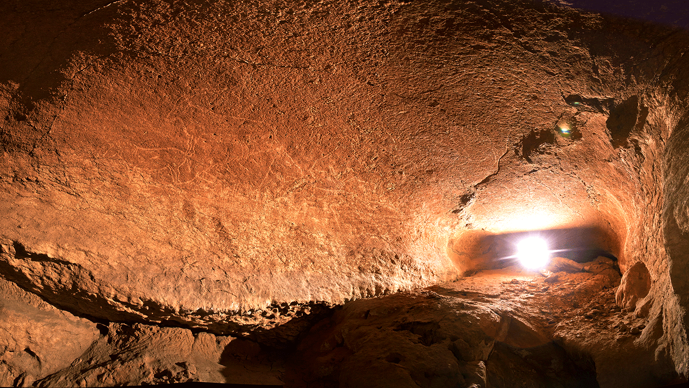

# Armintxe Cave

## Introduction

The cave of Armintxe was lost because of the urban development. On May first 2016, the group of speleology ADES entered in the cave and found a spectacular panel of Magdalenian engravings, they are supposed to be done between 12.000 to 17.000 BP, the engravings are a kind of cave art that normally is very difficult to see, they are sometimes almost invisible, located deep in the cave. This panel is more visible than others, and if you have a lateral light, the vision is very impressive.

## Description

### Animal constellations

One year later, one of the speleologists, the photographer, was studying the pictures and found out that the main panel depicted the starry firmament, the engravings were like a Paleolithic planetarium, and the animals were their constellations. Armintxe depicts the spring equinox.

If you want to see the constellations at the same position than in the cave you can use this settings: GPS coordinates:43°21′43″N 2°30′29″W, date: -10500-6-10, hour:6am, you have to choose the art layer, they are the original pictures of the cave, the constellation layer is not so important in this case, tries to copy the original pictures. A twenty inch monitor or bigger is needed. Some of the images are easy to see on an objective way, like the tail of the lion and the second ibex, and the position between each other prove that the mere coincidence is impossible. There are other pictures almost impossible too see, their shape is very subjective, it looks like the artists were trying to find in the stars these animals to complete their calendar in a forced way.

Another characteristic of Paleolithic constellations is that they use very dim stars not the brightest, it looks like they were finding a hidden message in the stars.

## Authors

This sky culture was built by Xabier Gezuraga Jauregi, member and photographer of the group of speleology ADES, and sky and weather photographer, after the discovery continued investigating and wrote the theory[#3] of the calendar of Armintxe, explaining the use of animals in cave art to name periods of time, based on stars, Sun and Moon movements

## References

 - [#1]: [Wikipedia](https://en.wikipedia.org/wiki/Armintxe_Cave).
 - [#2]: [Armintxe: an archaeological, hydrogeological, and diplomatic mess](http://actualid-ades.blogspot.com/2017/11/armintxe-archaeological-hydrogeological.html)
 - [#3]: [Xabier Gezuraga, "Armintxe, paleolithic sky culture"](https://barnebidaia.blogspot.com/2019/02/armintxe-paleolithic-sky-culture.html).
 - [#4]: [Sky pictures](http://www.lekitxokozeruak.com/).

## License
