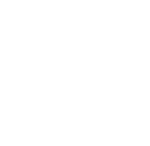
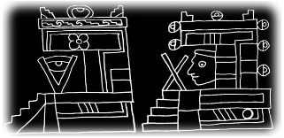
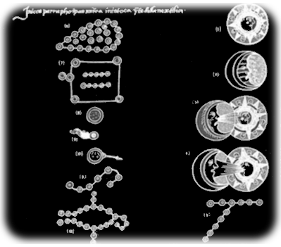
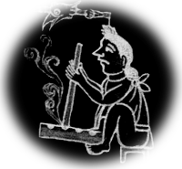
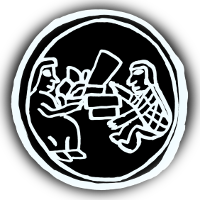
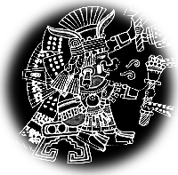
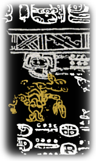

# Aztec

## Introduction

For ancient aztecs, the knowledge of the night skies and stars movement had great importance for their calendars and the measurement of both agricultural and sacred cycles. However, great part of this knowledge was lost as consequence of the Spanish conquest which occurred on continental America in the 16th century.

The elements of the Aztec society such as culture, economy and science is preserved in the <em>tlacuilos</em>, word that comes from the ancient Nahuatl word <em>tlacuiloa</em>, which means <em>writing with drawings</em>. These Tlacuilos where stored in the <em>amoxcalli</em>, meaning amoxtli: books and calli: house. Later their became known as <em>codices</em>; a word that came from the Latin word Codex which means written book.

After the  Spanish conquest many of the pre-hispanic Codexes where destroyed, their main feature is that their where drawn in many different materials such as deer skin, <em>amate</em> paper or cotton fabric and they had no text only draws or <em>glifos</em>. However the collection of Mesoamerican customs continued prior to the Spanish conquest thanks to the work of some native indians and some Spanish priests, this codexes are known as Colonial Codexes and there is a change of the way of drawing because of the new techniques of drawing and the new materials imported from Europe, also because of the incorporation of descriptive text both in Spanish and Nahuatl.

 
<em>Astronomical building</em>

Sadly, the Aztec astronomical knowledge in the remaining codexes is really small. The next image is one of the few that names some constellations and astronomical phenomena identified by the Aztec, it belong to the <em>Primeros Memoriales</em> (first memorials), which is a colonial manuscript of the 16th century written by Fray Bernardino de Sahagun.

Now, in this work we have an explanation of some Aztec stellar figures for Stellarium.

## Description

### Mamalhuaztli

Ancient Aztec identified the Orion's Belt as Mamalhuaztli, and it represented the wood sticks used to light the new fire in the commemoration celebrated every 52 years by the Mexicans and their neighbors named <em>toxiuh molpilia</em> which means binding of the years and coincided with the beginning of the new year named <em>xiuhtzitzquilo</em>.

### Tianquiztli

The group of stars that we know as Pleiades symbolized for the Mexicas <em>Tianquiztli</em>, which means market, perhaps because of the crowd that gathers on them, they're generally represented by one or two people inside a circle with goods.

Currently,  in Mexico the informal market or street markets are called <em>Tianguis</em>.

### Citlaltlachtli

The constellation of Gemini was called <em>Citlaltlachtli</em>, which means the ball game of the stars. This game was endowed with a ritual significance and used a natural rubber ball. It is said that the movement of the ball within the playing field refers to the movement of the sun and moon.

### Xonecuilli

The Ursa Minor constellation is identified as <em>Xonecuilli</em> which means twisted foot, and is related to Nanahuatzin, this character is represented with twisted feet, filled with boils and sores, this sick and poor God sacrificed himself to become <em>Tonatiuh</em> the Sun god.

Apparently, this constellation can also be associated with the Southern Cross and its surrounding stars as is referred by <em>Tezozomoc</em>. For its part, Sahagun speaks of his resemblance to bread made in the form of letter S and called by the Aztecs <em>xonecuilli</em>.

 <em>xonecuilli</em>

### Citlalcolotl

According to the Florentino Codex Sahagun's informants identified a group of stars known as <em>Citlalcolotl</em>, the scorpion star. In turn, Tezozomoc also mentions the scorpion star  and he called it  <em>Colotlixayac</em>, which means face of a scorpion.

 
<em>Paris Codex</em>

In a section of the Paris Codex called zodiac pages appears the scorpion, in this codex the icons shows figures of animals hanging from the body of the Celestial Dragon.

### Conclusion

 It is noteworthy that the interpretation of some of these constellations are still in discussion, and of course there must be other constellations to represent. Any comments and/or collaboration are welcome in order to preserve the stellar knowledge and meaning of the Aztec culture.

## References

 - [#1]: [Fuego Nuevo](http://biblioteca.itam.mx/estudios/estudio/letras30/notas3/sec_1.html)
 - [#2]: [Constelaciones Prehisp&#225;nicas](http://www.montero.org.mx/constelaciones.htm)
 - [#3]: [The Question of the Zodiac in America](http://www.jstor.org/stable/660290?origin=JSTOR-pdf)
 - [#4]: [Aztec Mythology](http://www.windows2universe.org/mythology/aztec_culture.html)
 - [#5]: [Los c&#243;dices de M&#233;xico](http://www.iconio.com/ABCD/F/INDEX.PDF)
 - [#6]: [Los c&#243;dices coloniales de M&#233;xico](http://es.wikipedia.org/wiki/C%C3%B3dices_coloniales_de_M%C3%A9xico)
 - [#7]: [Real c&#233;dula prohibiendo la historia general de las cosas de Nueva Espa&#241;a de Fray Bernardino de Sahag&#250;n](http://www.traduccionliteraria.org/1611/esc/america/sahagun.htm)
 - [#8]: [Akapochtli](http://commons.wikimedia.org/wiki/User:Akapochtli)
 - [#9]: [Iconograf&#237;a mexicana, Volumen 3](http://books.google.com.mx/books?id=kxPjdY1PJjEC&amp;pg=PA118&amp;lpg=PA118&amp;dq=Colotlixayac&amp;source=bl&amp;ots=F6xlTU1rer&amp;sig=9q_8ApdMTw5l9kagolArj5cPSMk&amp;hl=es&amp;ei=xoMeS8ToJoS1tgfpwv2cCg&amp;sa=X&amp;oi=book_result&amp;ct=result&amp;resnum=5&amp;ved=0CBsQ6AEwBA#v=onepage&amp;q=Colotlixayac&amp;f=false)
 - [#10]: [El C&#243;dice Par&#237;s](http://www.famsi.org/spanish/mayawriting/codices/paris.html)
 - [#11]: [El nacimiento del sol y la luna](http://redescolar.ilce.edu.mx/redescolar/biblioteca/literatura/leyenda/mexicas/mexsolun.html)
 - [#12]: [Diccionario n&aacute;huatl - espa&#241;ol en l&#237;nea en AULEX](http://aulex.org/nah-es/)
 - [#13]: [Tlachtli](http://sepiensa.org.mx/contenidos/fd_depo/nahuatl/tlach_1.html)

### Thanks to

 - Javier G&#243;mez Sandoval
 - Martha Patricia Rivera
 - Emilio Ram&#243;n Bola&#241;os Guerra
 - Hector Vega
 - Rafael Rojas Segoviano
 - Juan Caballero
 - SAAGS

## Authors

<strong>Enrique G&#243;mez Candelario</strong> <a href="mailto:aldeaglobal@gmail.com">aldeaglobal@gmail.com</a>

English translation by: Rafael Rojas Segoviano

## License

GNU GPL v2.0
