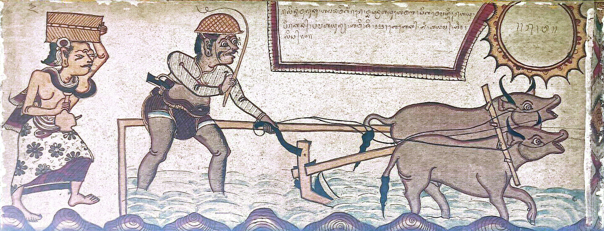

# Bali

## Introduction

Bali, one of the provinces in Indonesia, is a strategic island for cultural exchange, as the island is located between Java and Lombok Island. Most people recognize Bali as a tourist island; meanwhile, this refers to Bali Island, not Bali Province. Aside from Bali Island, Bali province has other small islands nearby, namely Nusa Penida, Nusa Lembongan, Nusa Ceningan, Serangan, and Menjangan. The majority of Bali's population is Balinese Hindus, who are slightly different from Indian Hindus. They also have their own language, Balinese. Bali utilizes its territory as a primary source of income through tourism. However, before the 18th century, its inhabitants made their living in agriculture and fishing. Through the original lifestyle, they have a system for determining the right time to do rituals and live by interpreting the sky.
From its location, Balinese sky culture is one of the unique sky cultures in Indonesia due to its mixture of cultures. This sky culture has a mixture of influences from China and India through the religion transmission, Hindu-Buddhist, and trade. Polynesian influence existed earlier, given that Polynesians were accustomed to seafaring. Furthermore, it is known that most of the ancestors of Indonesians were sailors, which is supported by the fact that Indonesia is an archipelago. 

 <i>Cultural Map that influences Balinese Sky Culture</i>

## Description

In written form, Balinese sky culture is preserved in lontar or leaves of Borassus flabellifer or palmyra which is dried and used as a material for manuscript and antique crafts. This sky culture is related to Balinese calendar, and this system is Palelintangan. Palelintangan is a set of 35 asterisms that has a deep connection between cosmic movement and human life. Basically, they rely their daily activities based on which palelintangan is appear in that time. They believe each lintang of palelintangan has their own cosmos power to handle their work.

Palelintangan is formed by combining seven-day cycle (from Redite/Sunday to Saniscara/Saturday) and five-day cycle (from Umanis to Kliwon). Palelintangan adopted Nakṣatra system and combining with the earlier existing concept in Bali. 

### How this Sky Culture was made

Alfred Maaß made a report about his journey into an article titled "Astrologische Kalender der Balinesen". In his article, he gave a description of each lintang in the Palelangan in the form of "Position in the Sky". But there are 10 lintangs that are not explained.
Then a team from the Bali Museum continued to study deeper about the Palelintangan for the ritual. Furthermore, they mentioned a little about lintang in the form of asterism. They explained that the X-star constellation was similar to the constellation Y (the constellation set by IAU).

With an explanation from the two main sources, we began to form Contellation Lines using Sky Culture Maker (SCM) from the description given, composed and triangulation. We have adjusted the full form of Contellation Lines to the images given by each lintang.

In anchoring the artwork, we chose to use the re-paint image from the existing sources with the condition that using older images and in accordance with the description given by the resource persons in the Maaß article. Based on the interviews we conducted with several people, namely Hindu Religious Instructors, Chair of the Bali Dharma Hindu Association and the seminar from Balinese astronomers, that the information contained in the Maaß manuscript can be used as a reference because this information comes from traditional leaders in Klungkung.

<table>
    <tr valign="top">
        <td><b>Name</b></td>
        <td><b>Original Balinese </b></td>
        <td><b>Translation</b> (literally)</td>
        <td><b>Picture</b></td>
    </tr>
    <tr valign="top">
        <td><notr>Kala Sungsang</notr></td>
        <td><notr>ᬓᬮᬲᬸᬗ᭄ᬲᬂ"</notr></td>
        <td>Inverted demon  Sungsang itself is inverted. Kala also means time. So the duty of this demon to remind people who forget even neglect the time </td>
        <td></td>
    </tr>
    <tr valign="top">
        <td><notr>Gajah</notr></td>
        <td><notr>ᬕᬚᬄ</notr></td>
        <td>Elephant</td>
        <td></td>
    </tr> 
    <tr valign="top">
        <td><notr>Patrem</notr></td>
        <td><notr>ᬧᬢᬺᬫ᭄</notr></td>
        <td>Keris An indigenous dagger A royal spy code or women use this kind of dagger</td>
        <td></td>
    </tr>
    <tr valign="top">
        <td><notr>Těnggala</notr></td>
        <td><notr>ᬢᭂᬗ᭄ᬕᬮ</notr></td>
        <td>Plough Betelgeuse is the red pain of the farmer. Bellatrix is the farmer's eye. Orion belt is the plough. Rigel and the other star are the animals (cow)</td>
        <td></td>
    </tr>
    <tr valign="top">
        <td><notr>Laweyan</notr></td>
        <td><notr>ᬮᬯᬾᬬᬦ᭄</notr></td>
        <td>Headless demon</td>
        <td></td>
    </tr>
    <tr valign="top">
        <td><notr>Klapa Sunda</notr></td>
        <td><notr>ᬓ᭄ᬮᬧᬲᬸᬦ᭄ᬤ</notr></td>
        <td>Leaning coconut tree There is a man in the coconut tree. He can't climb because there are two ants fighting on his foot</td>
        <td></td>
    </tr>
    <tr valign="top">
        <td><notr>Dupa</notr></td>
        <td><notr>ᬤᬸᬧ</notr></td>
        <td>Incence</td>
        <td></td>
    </tr>
    <tr valign="top">
        <td><notr>Hulanjar</notr></td>
        <td><notr>ᬳᬸᬮᬜ᭄ᬚᬃ</notr></td>
        <td>Widow</td>
        <td></td>
    </tr>
    <tr valign="top">
        <td><notr>Lěmbu</notr></td>
        <td><notr>ᬍᬫ᭄ᬩᬸ</notr></td>
        <td>Ox A white cow</td>
        <td></td>
    </tr>
    <tr valign="top">
        <td><notr>Pědati Suung</notr></td>
        <td><notr>ᬧᭂᬤᬢᬶᬲᬸᬳᬸᬂ</notr></td>
        <td>Empty horse cart</td>
        <td></td>
    </tr>
    <tr valign="top">
        <td><notr>Kuda</notr></td>
        <td><notr>ᬓᬸᬤ</notr></td>
        <td>Horse</td>
        <td></td>
    </tr>
    <tr valign="top">
        <td><notr>Yuyu</notr></td>
        <td><notr>ᬬᬸᬬᬸ</notr></td>
        <td>Crab</td>
        <td></td>
    </tr>
    <tr valign="top">
        <td><notr>Asu</notr></td>
        <td><notr>ᬳᬲᬸ</notr></td>
        <td>Dog It is not a usual dog, but Balinese dog. Balinese dogs are Proto-dogs or street dogs  </td>
        <td></td>
    </tr>
    <tr valign="top">
        <td><notr>Prahu Sarat</notr></td>
        <td><notr></notr>ᬧ᭄ᬭᬳᬸᬲᬭᬢ᭄</td>
        <td>Overloaded ship Overloaded and almost to sink </td>
        <td></td>
    </tr>
    <tr valign="top">
        <td><notr>Sidamalung</notr></td>
        <td><notr>ᬲᬶᬤᬫᬮᬸᬂ</notr></td>
        <td>Pig Wild boar </td>
        <td></td>
    </tr>
    <tr valign="top">
        <td><notr>Tangis</notr></td>
        <td><notr>ᬢᬗᬶᬲ᭄</notr></td>
        <td>Cry Mourning person because a loved one died</td>
        <td></td>
    </tr>
    <tr valign="top">
        <td><notr>Gajahmina</notr></td>
        <td><notr>ᬕᬚᬳ᭄ᬫᬶᬦ</notr></td>
        <td>Elephantfish A sea-creature that have elephant head and fish body. Being a supranatural creature and helps the inhabitants </td>
        <td></td>
    </tr>
    <tr valign="top">
        <td><notr>Lumbung</notr></td>
        <td><notr>ᬮᬸᬫ᭄ᬩᬸᬂ</notr></td>
        <td>Granary Paddy storage</td>
        <td></td>
    </tr>
    <tr valign="top">
        <td><notr>Kartika</notr></td>
        <td><notr>ᬓᬃᬢᬶᬓ</notr></td>
        <td>Star Also refering to Nakṣatra India </td>
        <td></td>
    </tr>
    <tr valign="top">
        <td><notr>Atiwa-tiwa</notr></td>
        <td>ᬳᬢᬶᬯ​ᬢᬶᬯ<notr></notr></td>
        <td>desire for purification This is the stage when the corpse has been purified and the people bring the corpse to the cremation place </td>
        <td></td>
    </tr>
    <tr valign="top">
        <td><notr>Sangkatikěl</notr></td>
        <td><notr>ᬲᬗ᭄ᬓᬢᬶᬓᭂᬮ᭄</notr></td>
        <td>Broken hoe</td>
        <td></td>
    </tr>
    <tr valign="top">
        <td><notr>Salah Ukur</notr></td>
        <td><notr>ᬲᬮᬄᬳᬸᬓᬸᬃ</notr></td>
        <td>Wrong measurement The man with keris tries to fight a big animal The unbalance of the human size and the big animal stands for this lintang </td>
        <td></td>
    </tr>
    <tr valign="top">
        <td><notr>Bade</notr></td>
        <td><notr>ᬩᬤᬾ</notr></td>
        <td>Bade Name for corpse tower in Hindu Bali rituals. Bade has different levels depending on the caste and size of the event  </td>
        <td></td>
    </tr>
    <tr valign="top">
        <td><notr>Kumba</notr></td>
        <td><notr>ᬓᬸᬫ᭄ᬩ</notr></td>
        <td>Earthen jug This vessel contains holy water </td>
        <td></td>
    </tr>
    <tr valign="top">
        <td><notr>Naga</notr></td>
        <td><notr>ᬦᬕ</notr></td>
        <td>Dragon Mystical creature has a power, one of them is famous named Basuki. Naga Basuki is the one that connected to the Bali Strait </td>
        <td></td>
    </tr>
    <tr valign="top">
        <td><notr>Banyak Angrěm</notr></td>
        <td><notr>ᬩᬜᬓ᭄ᬳᬗᬺᬫ᭄</notr></td>
        <td>Brooding Goose</td>
        <td></td>
    </tr>
    <tr valign="top">
        <td><notr>Bubu Bolong</notr></td>
        <td><notr>ᬩᬸᬩᬸᬩᭀᬮᭀᬂ</notr></td>
        <td>Leaky fish trap</td>
        <td></td>
    </tr>
    <tr valign="top">
        <td><notr>Prahu Pěgat</notr></td>
        <td><notr>ᬧ᭄ᬭᬳᬸᬧᭂᬕᬢ᭄</notr></td>
        <td>Broken ship</td>
        <td></td>
    </tr>
    <tr valign="top">
        <td><notr>Magělut</notr></td>
        <td><notr>ᬫᬕᭂᬮᬸᬢ᭄</notr></td>
        <td>Quarrel over debt</td>
        <td></td>
    </tr>
    <tr valign="top">
        <td><notr>Udang</notr></td>
        <td><notr>ᬳᬸᬤᬂ</notr></td>
        <td>Prawn or shrimp</td>
        <td></td>
    </tr>
    <tr valign="top">
        <td><notr>Děpat</notr></td>
        <td><notr>ᬤᭂᬧᬢ᭄</notr></td>
        <td>Demon without body</td>
        <td></td>
    </tr>
    <tr valign="top">
        <td><notr>Ru</notr></td>
        <td><notr>ᬭᬸ</notr></td>
        <td>Arrow Basically bow and arrow </td>
        <td></td>
    </tr>
    <tr valign="top">
        <td><notr>Sungenge</notr></td>
        <td><notr>ᬲᬸᬗᬾᬗᬾ</notr></td>
        <td>The Sun</td>
        <td></td>
    </tr>
    <tr valign="top">
        <td><notr>Puwuh Atarung</notr></td>
        <td><notr>ᬧᬸᬯᬸᬄᬳᬢᬭᬸᬂ</notr></td>
        <td>Battling quails</td>
        <td></td>
    </tr>
    <tr valign="top">
        <td><notr>Larung Paglangan</notr></td>
        <td><notr>ᬮᬭᬸᬂᬧᬕ᭄ᬮᬗᬦ᭄</notr></td>
        <td>Throwing ashes Cremation will produce the ashes. Here the family needs to throw the ashes to the sea </td>
        <td></td>
    </tr>
</table>

### Source(s)

The stick figures are interpretations by Youla A Azkarrula based on her pre-doctoral research under Dr. Dr. Susanne M Hoffmann supervision.

## References

 - [#1]: Maass, Alfred, “Astrologische Kalender der Balinesen,” in Koninklijk Bataviaasch Genootschap van Kunsten en Wetenschappen, Feestbundel bij gelegenheid van zijn 150 jarig bestaan 1778-1928, 2 vols. (Weltevreden, 1929), Vol. 2, 126-157.
 - [#2]: Pengkaji Museum Bali, "Kajian Palelintangan", (Denpasar, 2019).
 - [#3]: Museum Bali, https://museumbali.org/
 - [#4]: Kerta Gosa Museum , https://e-museum.klungkungkab.go.id/kerta-gosa/

### Fair Use

We provide this for free, but the authors of contributions certainly deserve to be cited according to the common rules. Thank you!

### Acknowledgement

The positioning of the Balinese terms in the sky and the drawing of the stick figures for Stellarium had been done by Youla A Azkarrula.
As an astronomer she thanks for the help of several scholar and her professor.
 - Dr. Dr. Susanne M. Hoffmann (Secretary Commission C5 Cultural Astronomy, IAU; FSU, Jena)
 - Ir I Made Suatjana (Balinese Astronomer)
 - I Gede Marayana (Balinese Astronomer)
 - Gede Ketut Sulistyadi (Head of Pesamuan Alit Parisada Hindu Dharma (PHDI) Tabanan Regency)

## Authors

The Balinese star names and constellation lines were compiled and added to Stellarium by <em> Youla A Azkarrula: youlaafifahrvvl@gmail.com </em>

Paintings by: <em>Jessica Gullberg </em> (consulted by Susanne M Hoffmann and Steven Gullberg)

Text in English: <em>Youla A Azkarrula</em>

## License

CC BY-ND 4.0
