# Balinese

## Introduction

Balinese people have had a strong connection to the cosmos since ancient times. They rely on the cosmos because they believe that every celestial body has power and will impact what they will or have done. Therefore, in carrying out all activities, from social to civil and ritual, they must know the right time to do so, guided by the celestial conditions.

## Description

Bali, one of the provinces in Indonesia, is a strategic island for cultural exchange, as the island is located between Java and Lombok Island. Most people recognize Bali as a tourist island; meanwhile, this refers to Bali Island, not Bali Province. Aside from Bali Island, Bali province has other small islands nearby, namely Nusa Penida, Nusa Lembongan, Nusa Ceningan, Serangan, and Menjangan. The majority of Bali's population is Balinese Hindus, who are slightly different from Indian Hindus. They also have their own language, Balinese. Bali utilizes its territory as a primary source of income through tourism. However, before the 18th century, its inhabitants made their living in agriculture and fishing. Through the original lifestyle, they have a system for determining the right time to do rituals and live by interpreting the sky.
From its location, Balinese sky culture is one of the unique sky cultures in Indonesia due to its mixture of cultures. This sky culture has a mixture of influences from China and India through the religion transmission, Hindu-Buddhist, and trade. Polynesian influence existed earlier, given that Polynesians were accustomed to seafaring. Furthermore, it is known that most of the ancestors of Indonesians were sailors, which is supported by the fact that Indonesia is an archipelago. 
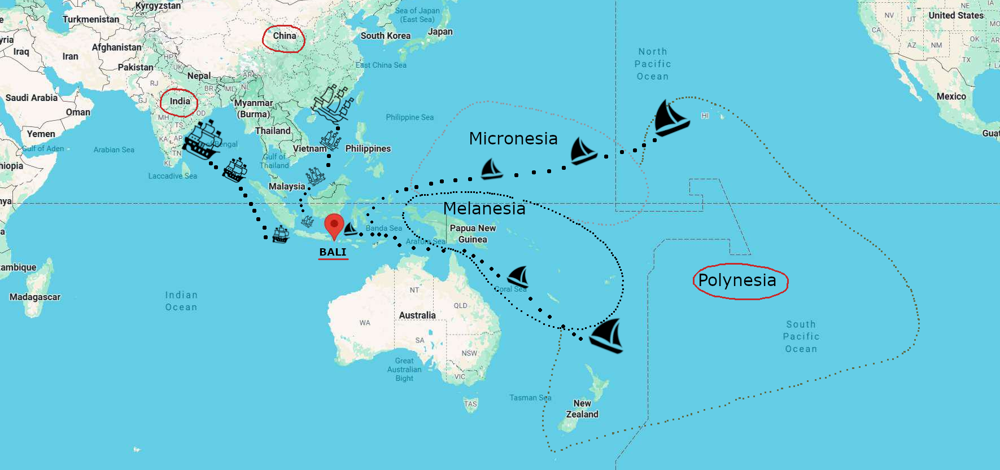
 <i>Cultural Map that influences Balinese Sky Culture</i>
In written form, Balinese sky culture is preserved in lontar or leaves of Borassus flabellifer or palmyra which is dried and used as a material for manuscript and antique crafts. This sky culture is related to Balinese calendar, and this system is Palelintangan. Palelintangan is a set of 35 asterisms that has a deep connection between cosmic movement and human life. Basically, they rely their daily activities based on which palelintangan is appear in that time. They believe each lintang of palelintangan has their own cosmos power to handle their work.
Palelintangan is formed by combining seven-day cycle (from Redite/Sunday to Saniscara/Saturday) and five-day cycle (from Umanis to Kliwon). Palelintangan adopted Nakṣatra system and combining with the earlier existing concept in Bali. 

### Sky

This sky culture has one small lintang system called "Kartika". Please zoom into the Pleiades to see it clearly. 
Balinese people are gifted in art. They use art to admire the cosmos and the gods who guard it. Consequently, the constellations depicted in this culture are found not only on palm-leaf manuscripts but also on textiles sold in the marketplace. Furthermore, they also depict them on buildings such as the Floating Pavilion, used for royal gatherings, receiving guests, and ceremonial purposes.

### Moon and Sun

Bali has two distinct calendars: the Pawukon calendar and the Balinese Saka calendar.
The Pawukon calendar is a purely arithmetic calendar with a 210-day cycle, divided into 30 seven-day units called wuku. This calendar does not have a new year but begins with the Sinta wuku. This calendar is related to the Palelintangan system. Furthermore, most feast days in Bali are determined based on the Pawukon calendar.
Next is the Balinese Saka calendar, a Balinese Hindu lunisolar calendar with a normal year consisting of 12 months. The beginning of each month is determined by the new moon (called Tilem). The waxing phase of the moon is called Penanggal, and the waning phase is called Panglong. The difference in the number of days in the solar and lunar years results in an intercalation of 11 days, which is then added to form the 13th month every three years. The New Year is called Nyepi (Silence Day), the first day of the 10th month (Sasi Kadasa). It always falls on the day after Tilem, which is closest to (but after) the March equinox. Coupled with intercalation regulations, Nyepi is kept in the mid-March to mid-April Gregorian calendar.
For the civil calendar, in Indonesia, all regions are required to follow the national calendar. However, Bali has its calendars for religious rituals. The Balinese government eventually took the initiative to combine various calendar systems and adapt all Indonesian holidays to the one civil Balinese calendar. As a result, this calendar circulating in the community has become a complex one, consisting of the Saka Balinese calendar, the Pawukon calendar, the Saka Javanese calendar, the Chinese calendar, and the Japanese calendar. Therefore, a single date contains information from various calendar systems used in Bali.

### Other Celestial Objects

The Balinese consider comets to be stars, calling them lintang Dupa. Furthermore, the lunar ascending and descending nodes are also considered stars, lintang Laweyan and lintang Děpat.

## Constellations

##### Kala Sungsang
Kala Sungsang is an upside-down demon. Sungsang itself is inverted. Kala also means time. So the duty of this demon is to remind people who forget or even neglect the time.

##### Gajah
Gajah is an elephant. In Hinduism, the elephant has a connection with deities. On the one hand, an elephant is a vehicle of the God Indra; together they eradicate the forces of evil. On the other hand, God Ganesha is a god who has an elephant’s head with a human body. 

##### Patrem
Patrem is keris (indigenous dagger). A royal spy code or women use this kind of dagger.

##### Těnggala
Těnggala is a plough. Betelgeuse is the red pain of the farmer. Bellatrix is the farmer's eye. Orion's belt is the plough. Rigel and other stars to the west are the animals (cow).

##### Laweyan
Laweyan is a headless demon. This lintang is the lunar ascending node.
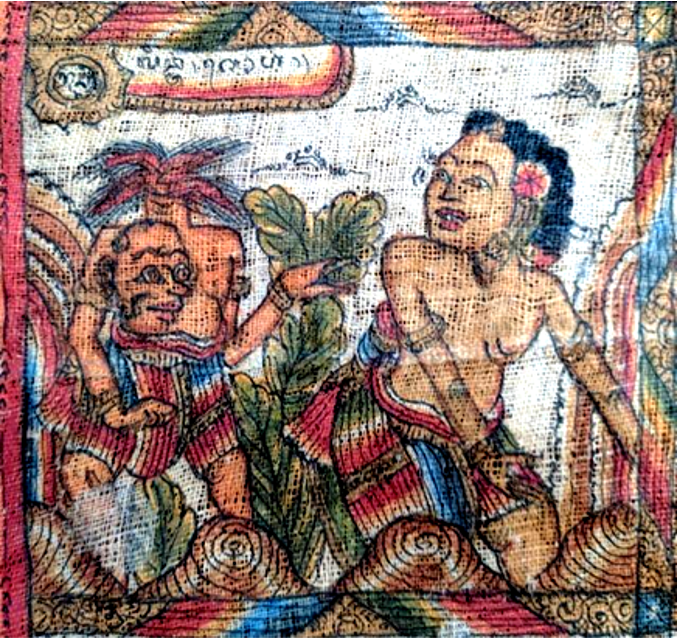

##### Klapa Sunda
Klapa Sunda is a leaning coconut tree. There is a man in the coconut tree. He can't climb because there are two ants fighting on his foot.

##### Dupa
Dupa is an incense. Balinese people see all comets as incenses.

##### Hulanjar
Hulanjar is a widow.
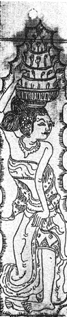

##### Lěmbu
Lěmbu is a white ox or a white cow. Lembu is a sacred animal in Bali.  Lembu are used in agricultural rituals such as traditional ploughing of fields, which contains the meaning of respect for nature. In addition, the majority of Hindus do not eat cows because cows are the mounts of the god Shiva.
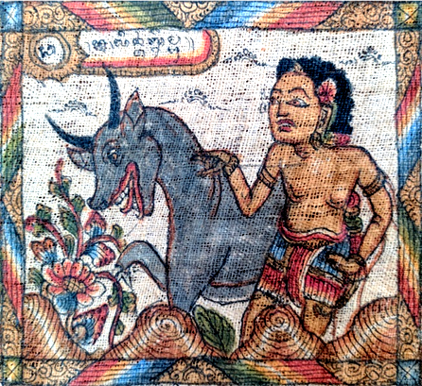
		
##### Pědati Suung
Pědati Suung is an empty horse cart.

##### Kuda
Kuda is a horse. In Bali, horses are closely related to the possessions of high-caste people. because horses are considered a luxury item that not everyone can have.

##### Yuyu
Yuyu is freshwater crab. In Bali, yuyu can be found in rice fields. However, yuyu are considered pests in rice fields because they often make holes in the ground. In addition, sometimes Balinese people make cetik using yuyu. Cetik is a traditional Balinese poison that has been legendary for hundreds of years.

##### Asu
Asu is a dog. It is not a usual dog, but Balinese dog. Balinese dogs are Proto-dogs or street dogs.
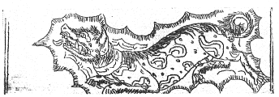

##### Prahu Sarat
Prahu Sarat is an overloaded ship and about to sink.
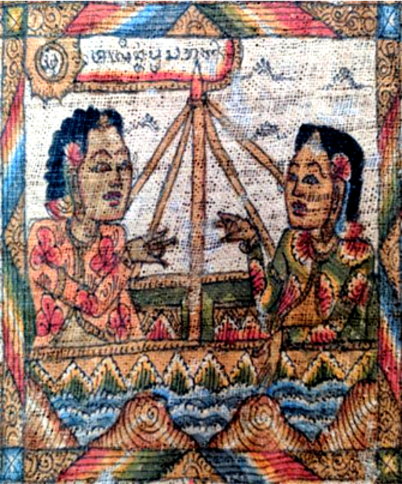

##### Sidamalung
Sidamalung is a pig or wild boar. Pigs are animals that are almost always present in various traditional and religious ceremonies, such as odalan, ngaben, and usaba.

##### Tangis
Tangis is tears  of mourning person because a loved one died.
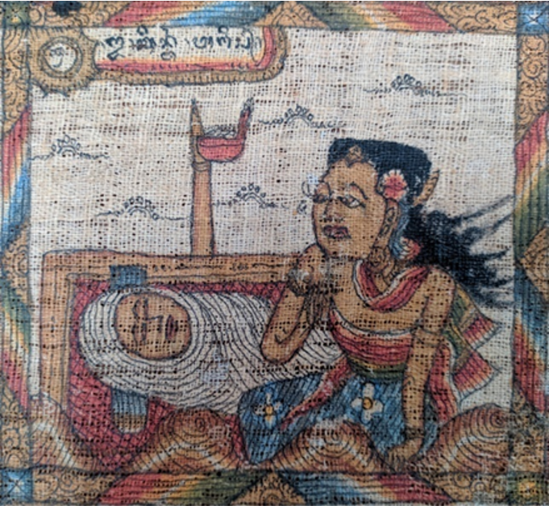

##### Gajahmina
Gajahmina is an elephantfish. A sea-creature that have elephant head and fish body. It is a supranatural creature and helps the inhabitants. 

##### Lumbung
Lumbung is granary or paddy storage. Lumbung is considered sacred by the Balinese people because it is related to the success of the harvest and the presence of Dewi Sri, the goddess of rice or the goddess of fertility.
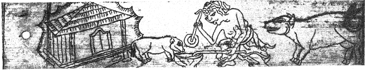

##### Kartika
Kartika is a star and also refering to Vedic Nakṣatra Kṛttika (Krittika).

##### Atiwa-tiwa
Atiwa-tiwa is bringing corpse to cremation. This is the stage when the corpse has been purified and the people bring the corpse to the cremation place.
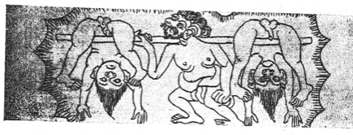

##### Sangkatikěl
Sangkatikěl is a broken hoe.
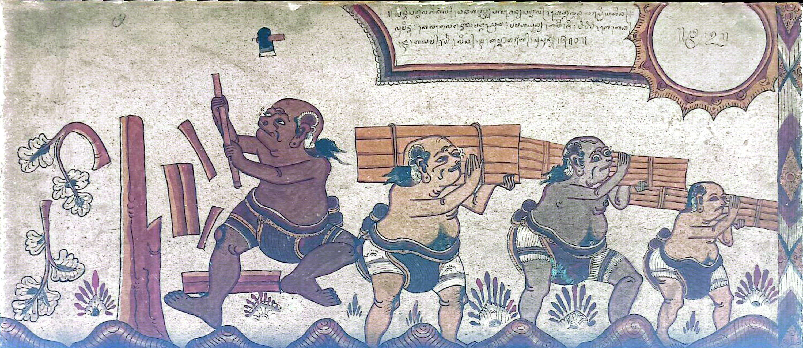

##### Salah Ukur
Salah Ukur is an error measurement. The man with keris tries to fight a big animal. The unbalance of the human size and the big animal stands for this lintang. 
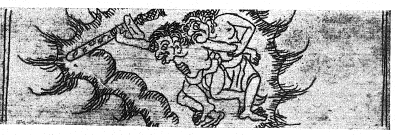

##### Bade
Bade is funeral bier. The name for corpse tower in Hindu Bali rituals. Bade has different levels depending on the caste and size of the event.
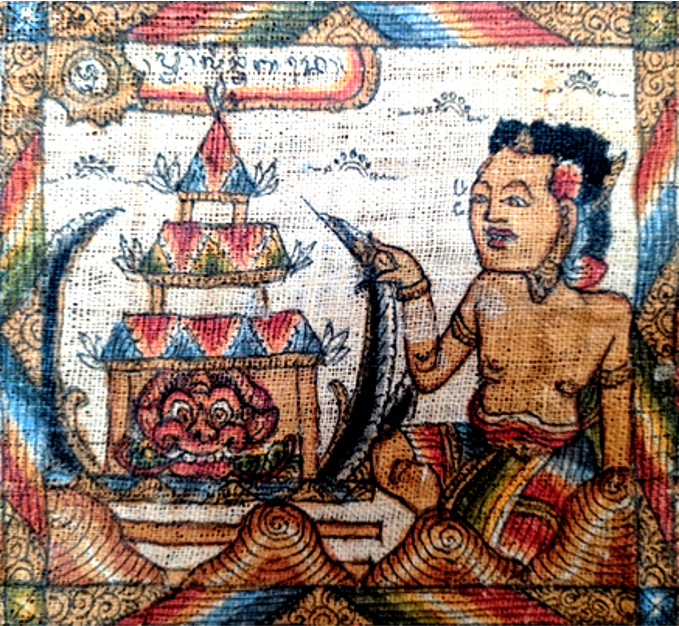

##### Kumba
Kumba is an earthen vessel. This vessel contains holy water. Kumba is used in the manusa yadnya (ceremony for humans).
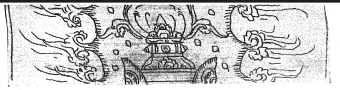

##### Naga
Naga is a dragon. Naga are mystical creatures with special powers. The famous Naga Basuki, in particular, is the one that connected to the Bali Strait. 
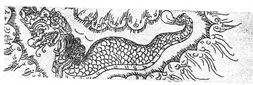

##### Banyak Angrěm
Banyak Angrěm is the brooding Goose. In some areas, this aves is believed to bring peace to those who keep it. They are usually closely related to Hindu religious ceremonies in Bali. They are vehicle for the God Brahma and the magic of the Goddess Saraswati as a symbol of widya which can filter to separate from impurities or things that can lead astray in science.

##### Bubu Bolong
Bubu Bolong is a leaky fish trap. Bubu is a traditional tool made of woven bamboo to catch fish and shrimp. Bubu is a traditional fishing tool where the structure allows fish to enter the bubu easily, but cannot get out again. While bosor is leaking. Using bubu has caught a lot of fish which means big profits, but if the bubu has holes or leaking so that it can release the catch easily. This is one of the shortcomings of bubu.

##### Prahu Pěgat
Prahu Pěgat is a broken ship
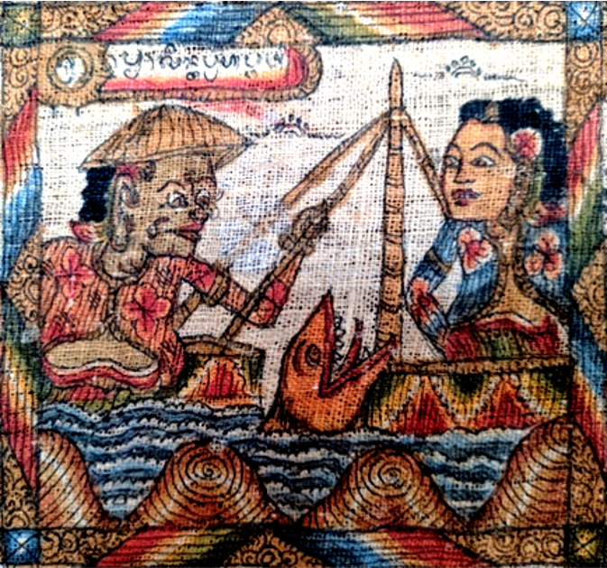

##### Magělut
Magělut is quarrel over debt.

##### Udang
Udang is a prawn or a shrimp.

##### Děpat
Děpat is demon without body. This is the head of Laweyan. This lintang is the lunar descending node.

##### Ru
Ru is an arrow, but basically bow and arrow.
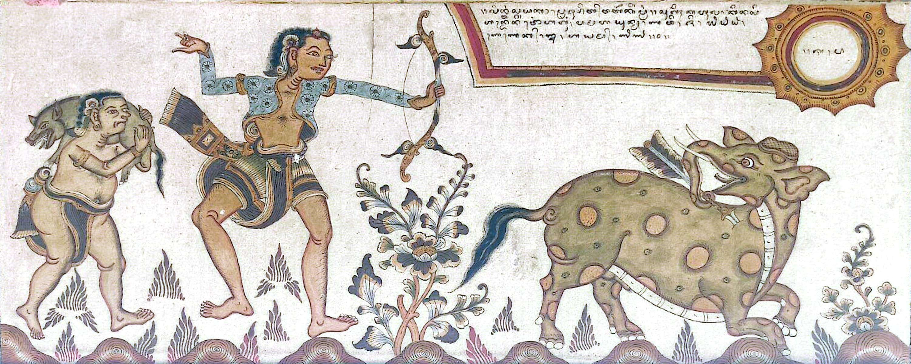

##### Sungenge
Sungenge is name for the Sun.

##### Puwuh Atarung
Puwuh Atarung is a battling quails.

##### Larung Paglangan
Larung Paglangan means throwing ashes. Cremation will produce the ashes. Here the family needs to throw the ashes to the sea.

## References

-[#1]: Maaß, Alfred, “Astrologische Kalender der Balinesen,” in Koninklijk Bataviaasch Genootschap van Kunsten en Wetenschappen, Feestbundel bij gelegenheid van zijn 150 jarig bestaan 1778-1928, 2 vols. (Weltevreden, 1929), Vol. 2, 126-157.
-[#2]: Pengkaji Museum Bali, "Kajian Palelintangan", (Denpasar, 2019).
-[#3]: Museum Bali, https://museumbali.org/
-[#4]: Kerta Gosa Museum , https://e-museum.klungkungkab.go.id/kerta-gosa/

## Authors

The Balinese sky culture were compiled and added to Stellarium by <em> Youla A Azkarrula: youlaafifahrvvl@gmail.com </em>. She is a researcher from Bali, Indonesia. She worked for this project based on her pre-doctoral research under supervision of Dr. Dr. Susanne M Hoffmann.
The paintings were repainted by: <em>Jessica Gullberg </em>. She is a great artist and illustrator, created numerous original pencil drawings, watercolor paintings, and illustrations of archaeological sites, cultural artifacts, and astronomical interpretations.

### About

This celestial culture is essentially already partially reflected in the Balinese calendar, which is published annually by the government. Later, in a seminar held by the Bali Museum, previous research by German ethnologist and explorer Alfred Maaß was presented.
Alfred Maaß made a report about his journey into an article titled "Astrologische Kalender der Balinesen"[#1]. In his article, he gave a description of each lintang in the Palelangan in the form of "Position in the Sky". But there are 10 lintangs that are not explained.
Then a team from the Bali Museum continued to study deeper about the Palelintangan for the ritual. Furthermore, they mentioned a little about lintang in the form of asterism. They explained that the X-star constellation was similar to the constellation Y (the constellation set by IAU).
With an explanation from the two main sources, we began to form Contellation Lines using Sky Culture Maker (SCM) from the description given, composed and triangulation. We have adjusted the full form of Contellation Lines to the images given by each lintang.
In anchoring the artwork, we chose to use the re-paint image from the existing sources with the condition that using older images and in accordance with the description given by the resource persons in the Maaß article. Based on the interviews we conducted with several people, namely Hindu Religious Instructors, Chair of the Bali Dharma Hindu Association and the seminar from Balinese astronomers, that the information contained in the Maaß manuscript can be used as a reference because this information comes from traditional leaders in Klungkung. 

### Acknowledgements
The positioning of the Balinese terms in the sky and the drawing of the stick figures for Stellarium had been done by Youla A Azkarrula.
As an astronomer she thanks for the help of several scholar and her professor.
 - Dr. Dr. Susanne M. Hoffmann (Secretary Commission C5 Cultural Astronomy, IAU; FSU, Jena)
 - Ir I Made Suatjana (Balinese Astronomer)
 - I Gede Marayana (Balinese Astronomer)
 - Gede Ketut Sulistyadi (Head of Pesamuan Alit Parisada Hindu Dharma (PHDI) Tabanan Regency)

## License

CC BY-ND 4.0
