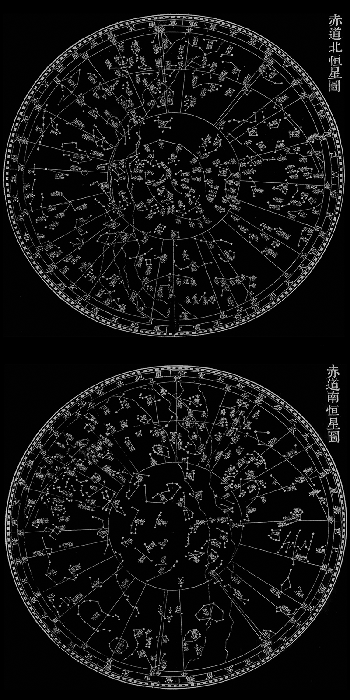

# Chinese

## Introduction

Chinese astronomy was developed independently and Chinese had its own system to connect the stars, known as "Xingguan" (Chinese: 星官; pinyin: xīngguān, meaning: Star officials). Chinese Traditional Sky Culture has far-reaching implications in East Asia. In ancient China, Xingguans and planets were associated with astrology. After thousands of years of evolution, the current Xingguans and star names was finalized in the 17th to 19th centuries.

## Description

Stellarium currently provides 300 Chinese Xingguans and more than 3000 Chinese star names from *Complete Studies of Astronomical* (Chinese: 仪象考成; pinyin: Yíxiàng kǎochéng) and *The Continuation of Complete Studies of Astronomical* (Chinese: 仪象考成续编; pinyin: Yíxiàngkǎochéng xùbiān). *Complete Studies of Astronomical* is an imperial record of astronomy finished in 1756. In 1844, the Imperial Astronomical Observatory made a revision to it and published *The Continuation of Complete Studies of Astronomical*, which is the major reference to the traditional Chinese Xingguans and star names used today. Yi Shitong has conducted textual research and summary of these records in his book*Chinese and Western Contrast Star Chart and Catalogue 1950.0* (Chinese: 中西对照恒星图表1950.0; pinyin: Zhōngxī Duìzhào Héngxīng Túbiǎo).

Chinese Traditional Sky Culture is Based on the information inside *Chinese and Western Contrast Star Chart and Catalogue 1950.0* and *Complete Studies of Astronomical*.

In addition, some stars have been added according to *The History of Stellar Observation in China* (Chinese: 中国恒星观测史; pinyin: Zhōngguó Héngxīng Guāncèshǐ) by Pan Nai, if these stars are not certified in *Chinese and Western Contrast Star Chart and Catalogue1950.0(Star Catalogue)*.

If the star name is followed by a "*", it is a star added according to *The History of Stellar Observation in China*.

If the star name is followed by a "?", it is a star added according to *The History of Stellar Observation in China*, but cannot be fully certified.

### Sun, Moon and Planets

The Western countries named the planets in mythical characters. The ancient Chinese understanding of five planets is based on five-element concepts. Therefore, Mercury is named Water Star, Venus is named Metal Star, Mars is named Fire Star, Jupiter is named Wood Star, Saturn is named Earth Star.

In Chinese, the sun and the moon are named after Yin and Yang (with prefix "great" (Chinese:太; pinyin: tài)), respectively Taiyang (Sun, Chinese: 太阳; pinyin: Tàiyáng) and Taiyin (Moon, Chinese:太阴; pinyin: Tàiyīn). Their other name belongs to pictographic characters. Ri (Sun, Chinese: 日) And Yue (Moon, Chinese: 月). But the more commonly used name for the moon is Yueliang (Chinese: 月亮; pinyin: Yuèliàng).

The sun, the moon and the five planets form Seven Luminaries (Chinese: 七曜; pinyin: qīyào), which correspond to the Five Elements and Yin and Yang.

### Xingguans

Traditional Chinese astronomy has a system of dividing the celestial sphere into asterisms or constellations, known as "Xingguan". Modern constellations refer to specific areas of the celestial sphere. Xingguans refer only to the way stars are distributed, with no specific boundaries between Xingguans.

The name and layout of the Xingguans are very social, the kingdom, the mountains, the goods, the industry all move to the sky, according to the Earth's way in the sky to copy a world.

The Xingguans are generally smaller than the constellations of Hellenistic tradition. A Xingguan contain more than dozens of stars, and fewer are only one. Medieval Chinese Astronomical Maps generally show a total of 283 Xingguans, comprising a total of 1,464 individual stars. The Xingguans are divided into 31 regions, the Twenty-Eight Mansions (Chinese: 二十八宿；pinyin: Èrshíbā Xiù) along the ecliptic, and the Three Enclosures (Chinese: 三垣; pinyin: Sānyuán) of the northern sky. Due to the influence of precession, six Xingguans near the southern horizon are getting more and more south. They were no longer easy to be observed by astronomers in the Ming and Qing Dynasties, so they were no longer recorded in *Complete Studies of Astronomical*.

Before the late Ming Dynasty (17th century), there were no Xingguans around the southern celestial pole. The Southern Sky (Chinese: 近南极星区; pinyin: JìnnánJí Xīngqū) was added as a 32th region in the late Ming Dynasty based on European star charts, comprising an additional 23 Xingguans. The Southern Sky are now also treated as part of the traditional Chinese system.

Since the late Ming Dynasty, Western missionaries entered the Imperial Astronomical Observatory. They have followed the names of the Xingguans, but changed the corresponding stars of some Xingguans, and added some stars to almost every Xingguan, called "added stars" (Chinese: 增星; pinyin: zēngxīng). The original stars are called "primary stars" (Chinese: 正星; pinyin: zhèngxīng). A Xingguan of two or more stars, each star has a number. The name of the stars in *The Continuation of Complete Studies of Astronomical* is the Xingguan plus a number. But there are also a few Xingguans, each star has a special name.

In this way, *The Continuation of Complete Studies of Astronomical* has 300 Xingguans and 3240 stars in total.

Until the Revolution of 1911, China no longer regarded Xingguan as the official constellation system. Unlike Xingguans, traditional Chinese star names are still used in modern Chinese astronomy, even more common than Western names.

*Astronomical Map of Complete Studies of Astronomical (1757)*

### Three Enclosures

Three Enclosures is three regions in the northern sky surrounded by the ecliptic. Three Enclosures is Purple Forbidden Enclosure (Chinese: 紫微垣; pinyin: Zǐwēiyuán), Supreme Palace Enclosure (Chinese: 太微垣; pinyin: Tàiwēiyuán), Heavenly Market Enclosure (Chinese: 天市垣; pinyin: Tiānshìyuán).

Each Enclosure has two walls, called the left wall and the right wall which are the main Xingguans. The walls are surrounded by many Xingguans. There are also Xingguans in the vicinity of the wall that belong to this Enclosure.

Purple Forbidden enclosure is the inner palace of the emperor, it covers the northernmost area of the night sky. From the viewpoint of the ancient Chinese, the Purple Forbidden Enclosure lies in the middle of the sky and is circled by all the other stars. It covers the modern constellations Ursa Minor, Draco, Camelopardalis, Cepheus, Cassiopeia, Auriga, Boötes, and parts of Ursa Major, Canes Venatici, Leo Minor, Hercules. Purple Forbidden enclosure has 37 Xingguans.

 - [Purple Forbidden enclosure (Wikipedia)](https://en.wikipedia.org/wiki/Purple_Forbidden_enclosure)

Supreme Palace Enclosure is the place where the emperor and the courtiers deal with their politics. Supreme Palace Enclosure has a variety of officials and government agencies. It covers the modern constellations Virgo, Coma Berenices and Leo, and parts of Canes Venatici, Ursa Major and Leo Minor. Supreme Palace Enclosure has 20 Xingguans.

 - [Supreme Palace Enclosure (Wikipedia)](https://en.wikipedia.org/wiki/Supreme_Palace_enclosure)

Heavenly Market Enclosure is a bazaar in the sky, a place where ordinary people live. The Heavenly Market Enclosure covers the modern constellations Serpens, Ophiuchus, Aquila and Corona Borealis, and parts of Hercules. Heavenly Market Enclosure has 19 Xingguans. They were named after the participants of the bazaar and the facilities of the bazaar.

 - [Heavenly Market Enclosure (Wikipedia)](https://en.wikipedia.org/wiki/Heavenly_Market_enclosure)

### Twenty-Eight Mansions

The Twenty-Eight Mansions (Chinese: 二十八宿; pinyin:Èrshíbā Xiù) also known as 28 Lunar Mansions are the ancient China divisions of the ecliptic and the sky area near the equator to divide the ecliptic into 28 regions according to the right ascension. Each region is called a Mansion (Chinese: 宿; pinyin:Xiù), The ancients let the Moon change a Mansion every day to rest.

Each Mansion has a Xingguan of the same name near the ecliptic, which is the main Xingguan. Where the Xingguans in this area belongs to the Mansion.

Each Xingguans has a main star know as determinative star (Chinese: 距星; pinyin: jùxīng). In ancient China, the determinative stars of Twenty-eight Mansions was the benchmark for determining the longitude of the equatorial coordinate system. The right ascension difference between the determinative stars of two adjacent Mansions is the equatorial mansion degrees (Chinese: 宿度; pinyin: xiùdù) of the western Mansion. The traditional equatorial coordinate system of China divides the equator into 365.25 degrees, and the Sun runs one day for one degree, which is also the sum of the equatorial mansion degrees of the 28 Mansion.

Due to the influence of precession, the equatorial mansion degrees of each Mansion has been slowly changing, and some determinative stars have also changed in history.

On traditional Chinese star maps, there are 28 lines passing through the determinative stars of The Twenty-Eight Mansions from the north celestial pole as their boundaries to facilitate the positioning of celestial bodies.

If a celestial body is east of the determinative star of a Mansion, and its right ascension does not exceed the determinative star of the next Mansion, the difference in right ascension between this celestial body and the determinative star, is know as mansion distance degrees (Chinese: 入宿度; pinyin: rùxiùdù).

Coupled with the polar distance degrees(Chinese: 去极度; pinyin: qùjídù), which is the angular distance between the star and the north celestial pole, we can determine the position of a star on the celestial sphere. Mansion distance degrees and polar distance degrees together constitute the two components of the ancient Chinese equatorial coordinate system.

The Twenty-Eight Mansions are grouped into Four Symbols (Chinese: 四象; pinyin: sìxiàng), each associated with a compass direction and containing seven Mansions, corresponds to Seven Luminaries. The correspondence between the Twenty-Eight Mansions and the Four Symbols is based on the sky at dusk on the vernal equinox in a certain period of ancient times. At this time, the Vermilion Bird is in the south, the Azure Dragon is in the east, the Black Tortoise is in the north, and the White Tiger is in the west.

### The List of The Twenty-Eight Mansions (J2000)

|Seven Luminaries|   |Wood|Metal|Earth|Sun|Moon|Fire|Water|
|----------------|---|----|-----|-----|---|----|----|-----|
|Chinese Name|<notr>东方苍龙</notr>|<notr>角宿</notr>|<notr>亢宿</notr>|<notr>氐宿</notr>|<notr>房宿</notr>|<notr>心宿</notr>|<notr>尾宿</notr>|<notr>箕宿</notr>|
|Pinyin|<notr>Dōngfāng Cānglóng</notr>|<notr>Jiǎoxiù</notr>|<notr>Kàngxiù</notr>|<notr>Dīxiù</notr>|<notr>Fángxiù</notr>|<notr>Xīnxiù</notr>|<notr>Wěixiù</notr>|<notr>Jīxiù</notr>|
|Translation|Azure Dragon of the East|Horn Mansion|Neck Mansion|Root Mansion|Room Mansion|Heart Mansion|Tail Mansion|Winnowing Basket Mansion|
|Number of xingguans|<notr>46</notr>|<notr>11</notr>|<notr>7</notr>|<notr>11</notr>|<notr>7</notr>|<notr>2</notr>|<notr>5</notr>|<notr>3</notr>|
|Determinative Star|   |<notr>α Vir</notr>|<notr>κ Vir</notr>|<notr>α2 Lib</notr>|<notr>π Sco</notr>|<notr>σ Sco</notr>|<notr>μ1 Sco</notr>|<notr>γ Sgr</notr>|
|RA of Determinative Star|   |<notr>13h25m11.6s</notr>|<notr>14h12m53.8s</notr>|<notr>14h50m52.8s</notr>|<notr>15h58m51.1s</notr>|<notr>16h21m11.3s</notr>|<notr>16h51m52.2s</notr>|<notr>18h05m48.5s</notr>|
|Equatorial Mansion Degrees 1|   |<notr>47m42s</notr>|<notr>37m59s</notr>|<notr>1h07m58s</notr>|<notr>22m20s</notr>|<notr>30m41s</notr>|<notr>1h13m57s</notr>|<notr>39m51s</notr>|
|Equatorial Mansion Degrees 2|   |<notr>12.10°</notr>|<notr>9.63°</notr>|<notr>17.24°</notr>|<notr>5.67°</notr>|<notr>7.78°</notr>|<notr>18.76°</notr>|<notr>10.11°</notr>|
|Chinese Name|<notr>北方玄武</notr>|<notr>斗宿</notr>|<notr>牛宿</notr>|<notr>女宿</notr>|<notr>虚宿</notr>|<notr>危宿</notr>|<notr>室宿</notr>|<notr>壁宿</notr>|
|Pinyin|<notr>Běifāng Xuánwǔ</notr>|<notr>Dǒuxiù</notr>|<notr>Niúxiù</notr>|<notr>Nǚxiù</notr>|<notr>Xūxiù</notr>|<notr>Wēixiù</notr>|<notr>Shìxiù</notr>|<notr>Bìxiù</notr>|
|Translation|Black Tortoise of the North|Dipper Mansion|Ox Mansion|Girl Mansion|Emptiness Mansion|Rooftop Mansion|Encampment Mansion|Wall Mansion|
|Number of xingguans|<notr>65</notr>|<notr>10</notr>|<notr>11</notr>|<notr>8</notr>|<notr>10</notr>|<notr>10</notr>|<notr>10</notr>|<notr>6</notr>|
|Determinative Star|   |<notr>μ Sgr</notr>|<notr>β Cap</notr>|<notr>ε Aqr</notr>|<notr>β Aqr</notr>|<notr>α Aqr</notr>|<notr>α Peg</notr>|<notr>γ Peg</notr>|
|RA of Determinative Star|   |<notr>18h45m39.4s</notr>|<notr>20h21m0.7s</notr>|<notr>20h47m40.6s</notr>|<notr>21h31m33.5s</notr>|<notr>22h05m47.0s</notr>|<notr>23h04m45.7s</notr>|<notr>00h13m14.2s</notr>|
|Equatorial Mansion Degrees 1|   |<notr>1h35m21s</notr>|<notr>26m40s</notr>|<notr>43m53s</notr>|<notr>34m13s</notr>|<notr>58m59s</notr>|<notr>1h08s29s</notr>|<notr>43m58s</notr>|
|Equatorial Mansion Degrees 2|   |<notr>24.19°</notr>|<notr>6.76°</notr>|<notr>11.13°</notr>|<notr>8.68°</notr>|<notr>14.96°</notr>|<notr>17.37°</notr>|<notr>11.15°</notr>|
|Chinese Name|<notr>西方白虎</notr>|<notr>奎宿</notr>|<notr>娄宿</notr>|<notr>胃宿</notr>|<notr>昴宿</notr>|<notr>毕宿</notr>|<notr>觜宿</notr>|<notr>参宿</notr>|
|Pinyin|<notr>Xīfāng Báihǔ</notr>|<notr>Kuíxiù</notr>|<notr>Loúxiù</notr>|<notr>Wèixiù</notr>|<notr>Mǎoxiù</notr>|<notr>Bìxiù</notr>|<notr>Zīxiù</notr>|<notr>Shēnxiù</notr>|
|Translation|White Tiger of the West|Legs Mansion|Bond Mansion|Stomach Mansion|Hairy Head Mansion|Net Mansion|Turtle Beak Mansion|Three Stars Mansion|
|Number of xingguans|<notr>54</notr>|<notr>9</notr>|<notr>6</notr>|<notr>7</notr>|<notr>9</notr>|<notr>14</notr>|<notr>3</notr>|<notr>6</notr>|
|Determinative Star|   |<notr>η And</notr>|<notr>β Ari</notr>|<notr>35 Ari</notr>|<notr>17 Tau</notr>|<notr>ε Tau</notr>|<notr>λ Ori</notr>|<notr>ζ Ori</notr>|
|RA of Determinative Star|   |<notr>00h57m12.3s</notr>|<notr>01h54m38.4s</notr>|<notr>02h43m27.1s</notr>|<notr>03h44m52.5s</notr>|<notr>04h28m37.0s</notr>|<notr>5h35m8.3s</notr>|<notr>05h40m45.5s</notr>|
|Equatorial Mansion Degrees 1|   |<notr>57m26s</notr>|<notr>48m49s</notr>|<notr>1h01m26s</notr>|<notr>43m44s</notr>|<notr>1h06m31s</notr>|<notr>5m32s</notr>|<notr>42m12s</notr>|
|Equatorial Mansion Degrees 2|   |<notr>14.57°</notr>|<notr>12.38°</notr>|<notr>15.58°</notr>|<notr>11.09°</notr>|<notr>16.87°</notr>|<notr>1.40°</notr>|<notr>10.70°</notr>|
|Chinese Name|<notr>南方朱雀</notr>|<notr>井宿</notr>|<notr>鬼宿</notr>|<notr>柳宿</notr>|<notr>星宿</notr>|<notr>张宿</notr>|<notr>翼宿</notr>|<notr>轸宿</notr>|
|Pinyin|<notr>Nánfāng Zhūquè</notr>|<notr>Jǐngxiù</notr>|<notr>Guǐxiù</notr>|<notr>Liǔxiù</notr>|<notr>Xīngxiù</notr>|<notr>Zhāngxiù</notr>|<notr>Yìxiù</notr>|<notr>Zhěnxiù</notr>|
|Translation|Vermilion Bird of the South|Well Mansion|Ghosts Mansion|Willow Mansion|Star Mansion|Extended Net Mansion|Wings Mansion|Chariot Mansion|
|Number of xingguans|<notr>42</notr>|<notr>19</notr>|<notr>7</notr>|<notr>2</notr>|<notr>5</notr>|<notr>2</notr>|<notr>2</notr>|<notr>5</notr>|
|Determinative Star|   |<notr>μ Gem</notr>|<notr>θ Cnc</notr>|<notr>δ Hya</notr>|<notr>α Hya</notr>|<notr>υ1 Hya</notr>|<notr>α Crt</notr>|<notr>γ Crv</notr>|
|RA of Determinative Star|   |<notr>6h22m57.6s</notr>|<notr>8h31m35.7s</notr>|<notr>8h37m39.4s</notr>|<notr>09h27m35.2s</notr>|<notr>09h51m28.7s</notr>|<notr>10h59m45.9s</notr>|<notr>12h15m48.4s</notr>|
|Equatorial Mansion Degrees 1|   |<notr>2h08m38s</notr>|<notr>6m3s</notr>|<notr>49m58s</notr>|<notr>23m54s</notr>|<notr>1h08m17s</notr>|<notr>1h16m02s</notr>|<notr>1h09m23s</notr>|
|Equatorial Mansion Degrees 2|   |<notr>32.63°</notr>|<notr>1.54°</notr>|<notr>12.67°</notr>|<notr>6.06°</notr>|<notr>17.32°</notr>|<notr>19.29°</notr>|<notr>17.60°</notr>|

note 1: Equatorial Mansion Degrees 1:Modern equatorial coordinate system.

note 2: Equatorial Mansion Degrees 2:The traditional equatorial coordinate system of China, divides the equator into 365.25 degrees.

 - <notr>[Twenty-Eight Mansions (Wikipedia)](https://en.wikipedia.org/wiki/Twenty-Eight_Mansions)</notr>

### The Southern Sky

The sky around the south celestial pole was unknown to ancient Chinese. Therefore, it was not included in the Three Enclosures and Twenty-Eight Mansions system. However, in the late Ming Dynasty, Xu Guangqi (Chinese: 徐光启; pinyin: Xú Guāngqǐ) introduced another 23 Xingguans based on the European star charts. These Xingguans were since incorporated into the traditional Chinese star maps. These Xingguans are actually variations of Western constellations, and they are mostly named after animals.

### The list of Xingguans

|Chinese Name|Pinyin|Translation|Number of Primary Stars|Number of Added Stars|
|------------|------|-----------|-----------------------|---------------------|
|<notr>紫微垣</notr>|<notr>Zǐwēiyuán</notr>|Purple Forbidden Enclosure|   |   |
|<notr>北极</notr>|<notr>Běijí</notr>|Northern Pole|<notr>5</notr>|<notr>3</notr>|
|<notr>四辅</notr>|<notr>Sìfǔ</notr>|Four Advisors|<notr>4</notr>|<notr>1</notr>|
|<notr>天乙</notr>|<notr>Tiānyǐ</notr>|Celestial Great One|<notr>1</notr>|<notr>0</notr>|
|<notr>太乙</notr>|<notr>Tàiyǐ</notr>|First Great One|<notr>1</notr>|<notr>0</notr>|
|<notr>紫微左垣</notr>|<notr>Zǐwēizuǒyuán</notr>|Purple Forbidden Left Wall|<notr>8</notr>|<notr>12</notr>|
|<notr>紫微右垣</notr>|<notr>Zǐwēiyòuyuán</notr>|Purple Forbidden Right Wall|<notr>7</notr>|<notr>12</notr>|
|<notr>阴德</notr>|<notr>Yīndé</notr>|Hidden Virtue|<notr>2</notr>|<notr>1</notr>|
|<notr>尚书</notr>|<notr>Shàngshū</notr>|Royal Secretary|<notr>5</notr>|<notr>2</notr>|
|<notr>女史</notr>|<notr>Nǚshǐ</notr>|Female Protocol|<notr>1</notr>|<notr>1</notr>|
|<notr>柱史</notr>|<notr>Zhùshǐ</notr>|Official of Royal Archives|<notr>1</notr>|<notr>2</notr>|
|<notr>御女</notr>|<notr>Yùnǚ</notr>|Maids-in-waiting|<notr>4</notr>|<notr>1</notr>|
|<notr>天柱</notr>|<notr>Tiānzhù</notr>|Celestial Pillar|<notr>5</notr>|<notr>6</notr>|
|<notr>大理</notr>|<notr>Dàlǐ</notr>|Chief Judge|<notr>2</notr>|<notr>1</notr>|
|<notr>勾陈</notr>|<notr>Gōuchén</notr>|Curved Array|<notr>6</notr>|<notr>10</notr>|
|<notr>六甲</notr>|<notr>Liùjiǎ</notr>|Six Jia|<notr>6</notr>|<notr>1</notr>|
|<notr>天皇大帝</notr>|<notr>Tiānhuángdàdì</notr>|Great Emperor of Heaven|<notr>1</notr>|<notr>0</notr>|
|<notr>五帝内座</notr>|<notr>WǔdìnèiZuò</notr>|Interior Seats of the Five Emperors|<notr>5</notr>|<notr>3</notr>|
|<notr>华盖</notr>|<notr>Huágài</notr>|Canopy of the Emperor|<notr>7</notr>|<notr>0</notr>|
|<notr>杠(附华盖)</notr>|<notr>Gàng</notr>|Canopy Support (Vassal of Canopy of the Emperor )|<notr>9</notr>|<notr>1</notr>|
|<notr>传舍</notr>|<notr>Chuánshè</notr>|Guest House|<notr>9</notr>|<notr>4</notr>|
|<notr>内阶</notr>|<notr>Nèijiē</notr>|Inner Steps|<notr>6</notr>|<notr>10</notr>|
|<notr>天厨</notr>|<notr>Tiānchú</notr>|Celestial Kitchen|<notr>6</notr>|<notr>2</notr>|
|<notr>八谷</notr>|<notr>Bāgǔ</notr>|Eight Kinds of Crops|<notr>8</notr>|<notr>34</notr>|
|<notr>天棓</notr>|<notr>Tiānbàng</notr>|Celestial Flail|<notr>5</notr>|<notr>10</notr>|
|<notr>内厨</notr>|<notr>Nèichú</notr>|Inner Kitchen|<notr>2</notr>|<notr>2</notr>|
|<notr>文昌</notr>|<notr>Wénchāng</notr>|Administrative Center|<notr>6</notr>|<notr>8</notr>|
|<notr>三师</notr>|<notr>Sānshī</notr>|Three Top Instructors|<notr>3</notr>|<notr>1</notr>|
|<notr>三公</notr>|<notr>Sāngōng</notr>|Three Excellencies|<notr>3</notr>|<notr>0</notr>|
|<notr>天床</notr>|<notr>Tiānchuáng</notr>|Celestial Bed|<notr>6</notr>|<notr>2</notr>|
|<notr>太尊</notr>|<notr>Tàizūn</notr>|Royals|<notr>1</notr>|<notr>0</notr>|
|<notr>天牢</notr>|<notr>Tiānláo</notr>|Celestial Prison|<notr>6</notr>|<notr>2</notr>|
|<notr>太阳守</notr>|<notr>Tàiyángshǒu</notr>|Guard of the Sun|<notr>1</notr>|<notr>1</notr>|
|<notr>势</notr>|<notr>Shì</notr>|Eunuch|<notr>4</notr>|<notr>19</notr>|
|<notr>相</notr>|<notr>Xiàng</notr>|Prime Minister|<notr>1</notr>|<notr>3</notr>|
|<notr>玄戈</notr>|<notr>Xuángē</notr>|Sombre Lance|<notr>1</notr>|<notr>2</notr>|
|<notr>天理</notr>|<notr>Tiānlǐ</notr>|Judge for Nobility|<notr>4</notr>|<notr>1</notr>|
|<notr>北斗</notr>|<notr>Běidǒu</notr>|Northern Dipper|<notr>7</notr>|<notr>16</notr>|
|<notr>辅(附北斗)</notr>|<notr>Fǔ</notr>|Assistant (Vassal of Northern Dipper)|<notr>1</notr>|<notr>3</notr>|
|<notr>天枪</notr>|<notr>Tiānqiāng</notr>|Celestial Spear|<notr>3</notr>|<notr>4</notr>|
|<notr>太微垣</notr>|<notr>Tàiwēiyuán</notr>|Supreme Palace Enclosure|   |   |
|<notr>太微左垣</notr>|<notr>Tàiwēizuǒyuán</notr>|Supreme Palace Left Wall|<notr>5</notr>|<notr>9</notr>|
|<notr>太微右垣</notr>|<notr>Tàiwēiyòuyuán</notr>|Supreme Palace Right Wall|<notr>5</notr>|<notr>5</notr>|
|<notr>谒者</notr>|<notr>Yèzhě</notr>|Usher to the Court|<notr>1</notr>|<notr>2</notr>|
|<notr>三公</notr>|<notr>Sāngōng</notr>|Three Excellencies|<notr>3</notr>|<notr>0</notr>|
|<notr>九卿</notr>|<notr>Jiǔqīng</notr>|Nine Senior Officers|<notr>3</notr>|<notr>9</notr>|
|<notr>五诸侯</notr>|<notr>Wǔzhūhóu</notr>|Five Lords|<notr>5</notr>|<notr>7</notr>|
|<notr>内屏</notr>|<notr>Nèipíng</notr>|Inner Screen|<notr>4</notr>|<notr>6</notr>|
|<notr>五帝座</notr>|<notr>Wǔdìzuò</notr>|Seats of the Five Emperors|<notr>5</notr>|<notr>4</notr>|
|<notr>幸臣</notr>|<notr>Xìngchén</notr>|Officer of Honour|<notr>1</notr>|<notr>0</notr>|
|<notr>太子</notr>|<notr>Tàizǐ</notr>|Crown Prince|<notr>1</notr>|<notr>0</notr>|
|<notr>从官</notr>|<notr>Cóngguān</notr>|Retinue|<notr>1</notr>|<notr>0</notr>|
|<notr>郎将</notr>|<notr>Lángjiàng</notr>|Captain of the Bodyguards|<notr>1</notr>|<notr>2</notr>|
|<notr>虎贲</notr>|<notr>Hǔbēn</notr>|Emperor's Bodyguard|<notr>1</notr>|<notr>0</notr>|
|<notr>常陈</notr>|<notr>Chángchén</notr>|Royal Guards|<notr>7</notr>|<notr>7</notr>|
|<notr>郎位</notr>|<notr>Lángwèi</notr>|Officers of the Imperial Guard|<notr>15</notr>|<notr>3</notr>|
|<notr>明堂</notr>|<notr>Míngtáng</notr>|The Hall of Glory|<notr>3</notr>|<notr>7</notr>|
|<notr>灵台</notr>|<notr>Língtaí</notr>|Astronomical Observatory|<notr>3</notr>|<notr>8</notr>|
|<notr>少微</notr>|<notr>Shàowēi</notr>|Junior Officers|<notr>4</notr>|<notr>9</notr>|
|<notr>长垣</notr>|<notr>Chángyuán</notr>|Long Wall|<notr>4</notr>|<notr>9</notr>|
|<notr>三台</notr>|<notr>Sāntái</notr>|Three Steps|<notr>6</notr>|<notr>13</notr>|
|<notr>天市垣</notr>|<notr>Tiānshìyuán</notr>|Heavenly Market Enclosure|   |   |
|<notr>天市左垣</notr>|<notr>Tiānshìzuǒyuán</notr>|Heavenly Market Left Wall|<notr>11</notr>|<notr>48</notr>|
|<notr>天市右垣</notr>|<notr>Tiānshìyòuyuán</notr>|Heavenly Market Right Wall|<notr>11</notr>|<notr>32</notr>|
|<notr>市楼</notr>|<notr>Shìlóu</notr>|Municipal Office|<notr>6</notr>|<notr>1</notr>|
|<notr>车肆</notr>|<notr>Chēsì</notr>|Commodity Market|<notr>2</notr>|<notr>2</notr>|
|<notr>宗正</notr>|<notr>Zōngzhèng</notr>|Official for the Royal Clan|<notr>2</notr>|<notr>3</notr>|
|<notr>宗人</notr>|<notr>Zōngrén</notr>|Official of Religious Ceremonies|<notr>4</notr>|<notr>4</notr>|
|<notr>宗</notr>|<notr>Zōng</notr>|Patriarchal Clan|<notr>2</notr>|<notr>0</notr>|
|<notr>帛度</notr>|<notr>Bódù</notr>|Textile Ruler|<notr>2</notr>|<notr>3</notr>|
|<notr>屠肆</notr>|<notr>Túsì</notr>|Butcher's Shops|<notr>2</notr>|<notr>3</notr>|
|<notr>候</notr>|<notr>Hòu</notr>|Astrologer|<notr>1</notr>|<notr>6</notr>|
|<notr>帝座</notr>|<notr>Dìzuò</notr>|Emperor's Seat|<notr>1</notr>|<notr>0</notr>|
|<notr>宦者</notr>|<notr>Huànzhě</notr>|Eunuch Official|<notr>2</notr>|<notr>5</notr>|
|<notr>列肆</notr>|<notr>Lièsì</notr>|Jewel Market|<notr>2</notr>|<notr>4</notr>|
|<notr>斗</notr>|<notr>Dǒu</notr>|Dipper for Liquids|<notr>5</notr>|<notr>11</notr>|
|<notr>斛</notr>|<notr>Hú</notr>|Dipper for Solids|<notr>4</notr>|<notr>7</notr>|
|<notr>贯索</notr>|<notr>Guànsuǒ</notr>|Coiled Thong|<notr>9</notr>|<notr>13</notr>|
|<notr>七公</notr>|<notr>Qīgōng</notr>|Seven Excellencies|<notr>7</notr>|<notr>16</notr>|
|<notr>天纪</notr>|<notr>Tiānjì</notr>|Celestial Discipline|<notr>9</notr>|<notr>15</notr>|
|<notr>女床</notr>|<notr>Nǚchuáng</notr>|Woman's Bed|<notr>3</notr>|<notr>0</notr>|
|<notr>角宿</notr>|<notr>Jiǎoxiù</notr>|Horn Mansion|   |   |
|<notr>角宿</notr>|<notr>Jiǎoxiù</notr>|Horn|<notr>2</notr>|<notr>16</notr>|
|<notr>平道</notr>|<notr>Píngdào</notr>|Flat Road|<notr>2</notr>|<notr>0</notr>|
|<notr>天田</notr>|<notr>Tiāntián</notr>|Celestial Farmland|<notr>2</notr>|<notr>7</notr>|
|<notr>进贤</notr>|<notr>Jìnxián</notr>|Recommending Virtuous Men|<notr>1</notr>|<notr>9</notr>|
|<notr>周鼎</notr>|<notr>Zhōudǐng</notr>|Tripod of the Zhou|<notr>3</notr>|<notr>0</notr>|
|<notr>天门</notr>|<notr>Tiānmén</notr>|Celestial Gate|<notr>2</notr>|<notr>11</notr>|
|<notr>平</notr>|<notr>Píng</notr>|Justice|<notr>2</notr>|<notr>4</notr>|
|<notr>库楼</notr>|<notr>Kùlóu</notr>|Arsenal|<notr>10</notr>|<notr>1</notr>|
|<notr>柱</notr>|<notr>Zhù</notr>|Pillars|<notr>11</notr>|<notr>0</notr>|
|<notr>衡</notr>|<notr>Héng</notr>|Railings|<notr>4</notr>|<notr>0</notr>|
|<notr>南门</notr>|<notr>Nánmén</notr>|Southern Gate|<notr>2</notr>|<notr>2</notr>|
|<notr>亢宿</notr>|<notr>Kàngxiù</notr>|Neck Mansion|   |   |
|<notr>亢宿</notr>|<notr>Kàngxiù</notr>|Neck|<notr>4</notr>|<notr>12</notr>|
|<notr>大角</notr>|<notr>Dàjiǎo</notr>|Great Horn|<notr>1</notr>|<notr>2</notr>|
|<notr>左摄提</notr>|<notr>Zuǒshètí</notr>|Left Conductor|<notr>3</notr>|<notr>4</notr>|
|<notr>右摄提</notr>|<notr>Yòushètí</notr>|Right Conductor|<notr>3</notr>|<notr>6</notr>|
|<notr>顿顽</notr>|<notr>Dùnwán</notr>|Trials|<notr>2</notr>|<notr>1</notr>|
|<notr>阳门</notr>|<notr>Yángmén</notr>|Gate of Yang|<notr>2</notr>|<notr>0</notr>|
|<notr>折威</notr>|<notr>Zhéwēi</notr>|Executions|<notr>7</notr>|<notr>7</notr>|
|<notr>氐宿</notr>|<notr>Dīxiù</notr>|Root Mansion|   |   |
|<notr>氐宿</notr>|<notr>Dīxiù</notr>|Root|<notr>4</notr>|<notr>30</notr>|
|<notr>天乳</notr>|<notr>Tiānrǔ</notr>|Celestial Milk|<notr>1</notr>|<notr>4</notr>|
|<notr>招摇</notr>|<notr>Zhāoyáo</notr>|Twinkling Indicator|<notr>1</notr>|<notr>0</notr>|
|<notr>梗河</notr>|<notr>Gěnghé</notr>|Celestial Lance|<notr>3</notr>|<notr>5</notr>|
|<notr>帝席</notr>|<notr>Dìxí</notr>|Mattress of the Emperor|<notr>3</notr>|<notr>1</notr>|
|<notr>亢池</notr>|<notr>Kàngchí</notr>|Boats and Lake|<notr>4</notr>|<notr>0</notr>|
|<notr>阵车</notr>|<notr>Zhènchē</notr>|Battle Chariots|<notr>3</notr>|<notr>2</notr>|
|<notr>骑官</notr>|<notr>Qíguān</notr>|Imperial Guards|<notr>10</notr>|<notr>0</notr>|
|<notr>车骑</notr>|<notr>Chēqí</notr>|Chariots and Cavalry|<notr>3</notr>|<notr>0</notr>|
|<notr>天辐</notr>|<notr>Tiānfú</notr>|Celestial Spokes|<notr>2</notr>|<notr>1</notr>|
|<notr>骑阵将军</notr>|<notr>Qízhènjiāngjūn</notr>|Chariots and Cavalry General|<notr>1</notr>|<notr>0</notr>|
|<notr>房宿</notr>|<notr>Fángxiù</notr>|Room Mansion|   |   |
|<notr>房宿</notr>|<notr>Fángxiù</notr>|Room|<notr>4</notr>|<notr>6</notr>|
|<notr>钩钤(附房宿)</notr>|<notr>Gōuqián</notr>|Lock (Vassal of Room)|<notr>2</notr>|<notr>0</notr>|
|<notr>键闭</notr>|<notr>Jiànbì</notr>|Door Bolt|<notr>1</notr>|<notr>0</notr>|
|<notr>罚</notr>|<notr>Fá</notr>|Punishment|<notr>3</notr>|<notr>3</notr>|
|<notr>东咸</notr>|<notr>Dōngxián</notr>|Eastern Door|<notr>4</notr>|<notr>2</notr>|
|<notr>西咸</notr>|<notr>Xīxián</notr>|Western Door|<notr>4</notr>|<notr>2</notr>|
|<notr>日</notr>|<notr>Rì</notr>|Solar Star|<notr>1</notr>|<notr>1</notr>|
|<notr>从官</notr>|<notr>Cóngguān</notr>|Retinue|<notr>2</notr>|<notr>1</notr>|
|<notr>心宿</notr>|<notr>Xīnxiù</notr>|Heart Mansion|   |   |
|<notr>心宿</notr>|<notr>Xīnxiù</notr>|Heart|<notr>3</notr>|<notr>9</notr>|
|<notr>积卒</notr>|<notr>Jīzú</notr>|Group of Soldiers|<notr>2</notr>|<notr>2</notr>|
|<notr>尾宿</notr>|<notr>Wěixiù</notr>|Tail Mansion|   |   |
|<notr>尾宿</notr>|<notr>Wěixiù</notr>|Tail|<notr>9</notr>|<notr>4</notr>|
|<notr>神宫(附尾宿)</notr>|<notr>shéngōng</notr>|Changing Room (Vassal of Tail)|<notr>1</notr>|<notr>0</notr>|
|<notr>龟</notr>|<notr>Guī</notr>|Tortoise|<notr>5</notr>|<notr>0</notr>|
|<notr>天江</notr>|<notr>Tiānjiāng</notr>|Celestial River|<notr>4</notr>|<notr>11</notr>|
|<notr>傅说</notr>|<notr>Fùyuè</notr>|Fu Yue|<notr>1</notr>|<notr>0</notr>|
|<notr>鱼</notr>|<notr>Yú</notr>|Fish|<notr>1</notr>|<notr>0</notr>|
|<notr>箕宿</notr>|<notr>Jīxiù</notr>|Winnowing Basket Mansion|   |   |
|<notr>箕宿</notr>|<notr>Jīxiù</notr>|Winnowing Basket|<notr>4</notr>|<notr>0</notr>|
|<notr>糠</notr>|<notr>Kāng</notr>|Chaff|<notr>1</notr>|<notr>1</notr>|
|<notr>杵</notr>|<notr>Chǔ</notr>|Pestle|<notr>3</notr>|<notr>1</notr>|
|<notr>斗宿</notr>|<notr>Dǒuxiù</notr>|Dipper Mansion|   |   |
|<notr>斗宿</notr>|<notr>Dǒuxiù</notr>|Dipper|<notr>6</notr>|<notr>5</notr>|
|<notr>建</notr>|<notr>Jiàn</notr>|Establishment|<notr>6</notr>|<notr>10</notr>|
|<notr>天籥</notr>|<notr>Tiānyuè</notr>|Celestial Keyhole|<notr>8</notr>|<notr>4</notr>|
|<notr>天弁</notr>|<notr>Tiānbiàn</notr>|Market Officer|<notr>9</notr>|<notr>6</notr>|
|<notr>鳖</notr>|<notr>Biē</notr>|River Turtle|<notr>11</notr>|<notr>0</notr>|
|<notr>天鸡</notr>|<notr>Tiānjī</notr>|Celestial Cock|<notr>2</notr>|<notr>3</notr>|
|<notr>狗国</notr>|<notr>Gǒuguó</notr>|Territory of Dog|<notr>4</notr>|<notr>3</notr>|
|<notr>天渊</notr>|<notr>Tiānyuān</notr>|Celestial Spring|<notr>3</notr>|<notr>3</notr>|
|<notr>狗</notr>|<notr>Gǒu</notr>|Dog|<notr>2</notr>|<notr>7</notr>|
|<notr>农丈人</notr>|<notr>Nóngzhàngrén</notr>|Peasant|<notr>1</notr>|<notr>0</notr>|
|<notr>牛宿</notr>|<notr>Niúxiù</notr>|Ox Mansion|   |   |
|<notr>牛宿</notr>|<notr>Niúxiù</notr>|Ox|<notr>6</notr>|<notr>14</notr>|
|<notr>天田</notr>|<notr>Tiāntián</notr>|Celestial Farmland|<notr>4</notr>|<notr>0</notr>|
|<notr>九坎</notr>|<notr>Jiǔkǎn</notr>|Nine Water Wells|<notr>4</notr>|<notr>0</notr>|
|<notr>河鼓</notr>|<notr>Hégǔ</notr>|Drum at the River|<notr>3</notr>|<notr>9</notr>|
|<notr>织女</notr>|<notr>Zhinǚ</notr>|Weaving Girl|<notr>3</notr>|<notr>4</notr>|
|<notr>左旗</notr>|<notr>Zuǒqí</notr>|Left Flag|<notr>9</notr>|<notr>30</notr>|
|<notr>右旗</notr>|<notr>Yòuqí</notr>|Right Flag|<notr>9</notr>|<notr>12</notr>|
|<notr>天桴</notr>|<notr>Tiānfú</notr>|Celestial Drumstick|<notr>4</notr>|<notr>2</notr>|
|<notr>罗堰</notr>|<notr>Luóyàn</notr>|Network of Dykes|<notr>3</notr>|<notr>1</notr>|
|<notr>渐台</notr>|<notr>Jiàntái</notr>|Clepsydra Terrace|<notr>4</notr>|<notr>7</notr>|
|<notr>辇道</notr>|<notr>Niǎndào</notr>|Imperial Passageway|<notr>5</notr>|<notr>9</notr>|
|<notr>女宿</notr>|<notr>Nǚxiù</notr>|Girl Mansion|   |   |
|<notr>女宿</notr>|<notr>Nǚxiù</notr>|Girl|<notr>4</notr>|<notr>5</notr>|
|<notr>十二国</notr>|<notr>Shí'èrguó</notr>|Twelve States|<notr>16</notr>|<notr>2</notr>|
|<notr>离珠</notr>|<notr>Lízhū</notr>|Pearls on Ladies' Wear|<notr>4</notr>|<notr>1</notr>|
|<notr>败瓜</notr>|<notr>Bàiguā</notr>|Rotten Gourd|<notr>5</notr>|<notr>3</notr>|
|<notr>瓠瓜</notr>|<notr>Hùguā</notr>|Good Gourd|<notr>5</notr>|<notr>8</notr>|
|<notr>天津</notr>|<notr>Tiānjīn</notr>|Celestial Ford|<notr>9</notr>|<notr>40</notr>|
|<notr>奚仲</notr>|<notr>Xīzhòng</notr>|Xi Zhong|<notr>4</notr>|<notr>7</notr>|
|<notr>扶筐</notr>|<notr>Fúkuāng</notr>|Basket for Mulberry Leaves|<notr>7</notr>|<notr>4</notr>|
|<notr>虚宿</notr>|<notr>Xūxiù</notr>|Emptiness Mansion|   |   |
|<notr>虚宿</notr>|<notr>Xūxiù</notr>|Emptiness|<notr>2</notr>|<notr>8</notr>|
|<notr>司命</notr>|<notr>Sīmìng</notr>|Deified Judge of Life|<notr>2</notr>|<notr>0</notr>|
|<notr>司禄</notr>|<notr>Sīlù</notr>|Deified Judge of Rank|<notr>2</notr>|<notr>0</notr>|
|<notr>司危</notr>|<notr>Sīwēi</notr>|Deified Judge of Disaster and Good Fortune|<notr>2</notr>|<notr>0</notr>|
|<notr>司非</notr>|<notr>Sīfēi</notr>|Deified Judge of Right and Wrong|<notr>2</notr>|<notr>3</notr>|
|<notr>哭</notr>|<notr>Kū</notr>|Crying|<notr>2</notr>|<notr>4</notr>|
|<notr>泣</notr>|<notr>Qì</notr>|Weeping|<notr>2</notr>|<notr>2</notr>|
|<notr>天垒城</notr>|<notr>Tiānlěichéng</notr>|Celestial Ramparts|<notr>13</notr>|<notr>2</notr>|
|<notr>败臼</notr>|<notr>Bàijiù</notr>|Decayed Mortar|<notr>4</notr>|<notr>1</notr>|
|<notr>离瑜</notr>|<notr>Líyú</notr>|Jade Ornament on Ladies' Wear|<notr>3</notr>|<notr>3</notr>|
|<notr>危宿</notr>|<notr>Wēixiù</notr>|Rooftop Mansion|   |   |
|<notr>危宿</notr>|<notr>Wēixiù</notr>|Rooftop|<notr>3</notr>|<notr>14</notr>|
|<notr>坟墓(附危宿)</notr>|<notr>Fénmù</notr>|Tomb (Vassal of Rooftop)|<notr>4</notr>|<notr>4</notr>|
|<notr>人</notr>|<notr>Rén</notr>|Humans|<notr>4</notr>|<notr>4</notr>|
|<notr>杵</notr>|<notr>Chǔ</notr>|Pestle|<notr>3</notr>|<notr>2</notr>|
|<notr>臼</notr>|<notr>Jiù</notr>|Mortar|<notr>4</notr>|<notr>8</notr>|
|<notr>车府</notr>|<notr>Chēfǔ</notr>|Big Yard for Chariots|<notr>7</notr>|<notr>20</notr>|
|<notr>天钩</notr>|<notr>Tiāngōu</notr>|Celestial Hook|<notr>9</notr>|<notr>18</notr>|
|<notr>造父</notr>|<notr>Zàofù</notr>|Zaofu|<notr>5</notr>|<notr>5</notr>|
|<notr>盖屋</notr>|<notr>Gàiwū</notr>|Roofing|<notr>2</notr>|<notr>0</notr>|
|<notr>虚梁</notr>|<notr>Xūliáng</notr>|Temple|<notr>4</notr>|<notr>0</notr>|
|<notr>天钱</notr>|<notr>Tiānqián</notr>|Celestial Money|<notr>5</notr>|<notr>3</notr>|
|<notr>室宿</notr>|<notr>Shìxiù</notr>|Encampment Mansion|   |   |
|<notr>室宿</notr>|<notr>Shìxiù</notr>|Encampment|<notr>2</notr>|<notr>7</notr>|
|<notr>离宫(附室宿)</notr>|<notr>Lígōng</notr>|Resting Palace (Vassal of Encampment)|<notr>6</notr>|<notr>8</notr>|
|<notr>雷电</notr>|<notr>Léidiàn</notr>|Thunder and Lightning|<notr>6</notr>|<notr>8</notr>|
|<notr>垒壁阵</notr>|<notr>Lěibìzhèn</notr>|Line of Ramparts|<notr>12</notr>|<notr>8</notr>|
|<notr>羽林军</notr>|<notr>Yǔlínjūn</notr>|Palace Guard|<notr>45</notr>|<notr>0</notr>|
|<notr>𫓧钺</notr>|<notr>Fūyuè</notr>|Axe|<notr>3</notr>|<notr>3</notr>|
|<notr>北落师门</notr>|<notr>Běiluòshīmén</notr>|North Gate of the Military Camp|<notr>1</notr>|<notr>0</notr>|
|<notr>八魁</notr>|<notr>Bākuí</notr>|Net for Catching Birds|<notr>6</notr>|<notr>0</notr>|
|<notr>天纲</notr>|<notr>Tiāngāng</notr>|Materials for Making Tents|<notr>1</notr>|<notr>0</notr>|
|<notr>土公吏</notr>|<notr>Tǔgōnglì</notr>|Official for Materials Supply|<notr>2</notr>|<notr>0</notr>|
|<notr>螣蛇</notr>|<notr>Téngshé</notr>|Flying Serpent|<notr>22</notr>|<notr>19</notr>|
|<notr>壁宿</notr>|<notr>Bìxiù</notr>|Wall Mansion|   |   |
|<notr>壁宿</notr>|<notr>Bìxiù</notr>|Wall|<notr>2</notr>|<notr>23</notr>|
|<notr>霹雳</notr>|<notr>Pīlì</notr>|Thunderbolt|<notr>5</notr>|<notr>9</notr>|
|<notr>云雨</notr>|<notr>Yúnyǔ</notr>|Cloud and Rain|<notr>4</notr>|<notr>10</notr>|
|<notr>天厩</notr>|<notr>Tiānjiù</notr>|Celestial Stable|<notr>3</notr>|<notr>1</notr>|
|<notr>𫓧锧</notr>|<notr>Fūzhì</notr>|Sickle|<notr>5</notr>|<notr>0</notr>|
|<notr>土公</notr>|<notr>Tǔgōng</notr>|Official for Earthworks and Buildings|<notr>2</notr>|<notr>11</notr>|
|<notr>奎宿</notr>|<notr>Kuíxiù</notr>|Legs Mansion|   |   |
|<notr>奎宿</notr>|<notr>Kuíxiù</notr>|Legs|<notr>16</notr>|<notr>23</notr>|
|<notr>外屏</notr>|<notr>Wàipíng</notr>|Outer Fence|<notr>7</notr>|<notr>15</notr>|
|<notr>天溷</notr>|<notr>Tiānhùn</notr>|Celestial Pigsty|<notr>4</notr>|<notr>6</notr>|
|<notr>土司空</notr>|<notr>Tǔsīkōng</notr>|Master of Constructions|<notr>1</notr>|<notr>0</notr>|
|<notr>军南门</notr>|<notr>Jūnnánmén</notr>|Southern Military Gate|<notr>1</notr>|<notr>0</notr>|
|<notr>阁道</notr>|<notr>Gédào</notr>|Flying Corridor|<notr>6</notr>|<notr>5</notr>|
|<notr>附路</notr>|<notr>Fùlù</notr>|Auxiliary Road|<notr>1</notr>|<notr>0</notr>|
|<notr>王良</notr>|<notr>Wángliáng</notr>|Wang Liang|<notr>5</notr>|<notr>14</notr>|
|<notr>策</notr>|<notr>Cè</notr>|Whip|<notr>1</notr>|<notr>0</notr>|
|<notr>娄宿</notr>|<notr>Loúxiù</notr>|Bond Mansion|   |   |
|<notr>娄宿</notr>|<notr>Loúxiù</notr>|Bond|<notr>3</notr>|<notr>15</notr>|
|<notr>左更</notr>|<notr>Zuǒgēng</notr>|Official in Charge of the Forest|<notr>5</notr>|<notr>8</notr>|
|<notr>右更</notr>|<notr>Yòugēng</notr>|Official in Charge of Pasturing|<notr>5</notr>|<notr>5</notr>|
|<notr>天仓 </notr>|<notr>Tiāncāng</notr>|Square Celestial Granary|<notr>6</notr>|<notr>21</notr>|
|<notr>天庾</notr>|<notr>Tiānyǔ</notr>|Ricks of Grain|<notr>3</notr>|<notr>3</notr>|
|<notr>天大将军</notr>|<notr>Tiāndàjiāngjūn</notr>|Great General of Heaven|<notr>11</notr>|<notr>17</notr>|
|<notr>胃宿</notr>|<notr>Wèixiù</notr>|Stomach Mansion|   |   |
|<notr>胃宿</notr>|<notr>Wèixiù</notr>|Stomach|<notr>3</notr>|<notr>5</notr>|
|<notr>天廪</notr>|<notr>Tiānlǐn</notr>|Celestial Foodstuff|<notr>4</notr>|<notr>3</notr>|
|<notr>天囷</notr>|<notr>Tiānqūn</notr>|Circular Celestial Granary|<notr>13</notr>|<notr>21</notr>|
|<notr>大陵</notr>|<notr>Dàlíng</notr>|Mausoleum|<notr>8</notr>|<notr>21</notr>|
|<notr>天船</notr>|<notr>Tiānchuán</notr>|Celestial Boat|<notr>9</notr>|<notr>10</notr>|
|<notr>积尸</notr>|<notr>JīShī</notr>|Heap of Corpses|<notr>1</notr>|<notr>0</notr>|
|<notr>积水</notr>|<notr>Jīshuǐ</notr>|Stored Water|<notr>1</notr>|<notr>1</notr>|
|<notr>昴宿</notr>|<notr>Mǎoxiù</notr>|Hairy Head Mansion|   |   |
|<notr>昴宿</notr>|<notr>Mǎoxiù</notr>|Hairy Head|<notr>7</notr>|<notr>13</notr>|
|<notr>天阿</notr>|<notr>Tiān'ē</notr>|Celestial Concave|<notr>1</notr>|<notr>0</notr>|
|<notr>月</notr>|<notr>Yuè</notr>|Lunar Star|<notr>1</notr>|<notr>1</notr>|
|<notr>天阴</notr>|<notr>Tiānyīn</notr>|Celestial Yin Force|<notr>5</notr>|<notr>6</notr>|
|<notr>刍藁</notr>|<notr>Chúgǎo</notr>|Hay|<notr>6</notr>|<notr>5</notr>|
|<notr>天苑</notr>|<notr>Tiānyuàn</notr>|Celestial Meadows|<notr>16</notr>|<notr>18</notr>|
|<notr>卷舌</notr>|<notr>Juǎnshé</notr>|Rolled Tongue|<notr>6</notr>|<notr>7</notr>|
|<notr>天谗</notr>|<notr>Tiānchán</notr>|Celestial Slander|<notr>1</notr>|<notr>0</notr>|
|<notr>砺石</notr>|<notr>Lìshí</notr>|Whetstone|<notr>4</notr>|<notr>0</notr>|
|<notr>毕宿</notr>|<notr>Bìxiù</notr>|Net Mansion|   |   |
|<notr>毕宿</notr>|<notr>Bìxiù</notr>|Net|<notr>8</notr>|<notr>18</notr>|
|<notr>附耳(附毕宿)</notr>|<notr>Fù'ěr</notr>|Whisper (Vassal of Net)|<notr>1</notr>|<notr>4</notr>|
|<notr>天街</notr>|<notr>Tiānjiē</notr>|Celestial Street|<notr>2</notr>|<notr>4</notr>|
|<notr>天节</notr>|<notr>Tiānjié</notr>|Celestial Tally|<notr>8</notr>|<notr>0</notr>|
|<notr>诸王</notr>|<notr>Zhūwáng</notr>|Feudal Kings|<notr>6</notr>|<notr>4</notr>|
|<notr>天高</notr>|<notr>Tiāngāo</notr>|Celestial High Terrace|<notr>4</notr>|<notr>4</notr>|
|<notr>九州殊口</notr>|<notr>Jiǔzhōushūkǒu</notr>|Interpreters of Nine Dialects|<notr>6</notr>|<notr>11</notr>|
|<notr>五车</notr>|<notr>Wǔchē</notr>|Five Chariots|<notr>5</notr>|<notr>19</notr>|
|<notr>柱</notr>|<notr>Zhù</notr>|Pillars|<notr>9</notr>|<notr>0</notr>|
|<notr>天潢</notr>|<notr>Tiānhuáng</notr>|Celestial Pier|<notr>5</notr>|<notr>2</notr>|
|<notr>咸池</notr>|<notr>Xiánchí</notr>|Pool of Harmony|<notr>3</notr>|<notr>0</notr>|
|<notr>天关</notr>|<notr>Tiānguān</notr>|Celestial Pass|<notr>1</notr>|<notr>6</notr>|
|<notr>参旗</notr>|<notr>Shēnqí</notr>|Banner of Three Stars|<notr>9</notr>|<notr>12</notr>|
|<notr>九斿</notr>|<notr>Jiǔyóu</notr>|Imperial Military Flag|<notr>9</notr>|<notr>7</notr>|
|<notr>天园</notr>|<notr>Tiānyuán</notr>|Celestial Orchard|<notr>13</notr>|<notr>6</notr>|
|<notr>觜宿</notr>|<notr>Zīxiù</notr>|Turtle Beak Mansion|   |   |
|<notr>觜宿</notr>|<notr>Zīxiù</notr>|Turtle Beak|<notr>3</notr>|<notr>0</notr>|
|<notr>司怪</notr>|<notr>Sīguài</notr>|Deity in Charge of Monsters|<notr>4</notr>|<notr>6</notr>|
|<notr>座旗</notr>|<notr>Zuòqí</notr>|Seat Flags|<notr>9</notr>|<notr>11</notr>|
|<notr>参宿</notr>|<notr>Shēnxiù</notr>|Three Stars Mansion|   |   |
|<notr>参宿</notr>|<notr>Shēnxiù</notr>|Three Stars|<notr>7</notr>|<notr>39</notr>|
|<notr>伐(附参宿)</notr>|<notr>Fá</notr>|Send Armed Forces To Suppress (Vassal of Three Stars)|<notr>3</notr>|<notr>2</notr>|
|<notr>玉井</notr>|<notr>Yùjǐng</notr>|Jade Well|<notr>4</notr>|<notr>3</notr>|
|<notr>屏</notr>|<notr>Píng</notr>|Screen|<notr>2</notr>|<notr>0</notr>|
|<notr>军井</notr>|<notr>Jūnjǐng</notr>|Military well|<notr>4</notr>|<notr>2</notr>|
|<notr>厕</notr>|<notr>Cè</notr>|Toilet|<notr>4</notr>|<notr>8</notr>|
|<notr>屎</notr>|<notr>Shǐ</notr>|Excrement|<notr>1</notr>|<notr>0</notr>|
|<notr>井宿</notr>|<notr>Jǐngxiù</notr>|Well Mansion|   |   |
|<notr>井宿</notr>|<notr>Jǐngxiù</notr>|Well|<notr>8</notr>|<notr>19</notr>|
|<notr>钺(附井宿)</notr>|<notr>Yuè</notr>|Battle Axe (Vassal of Well)|<notr>1</notr>|<notr>1</notr>|
|<notr>南河</notr>|<notr>Nánhé</notr>|South River|<notr>3</notr>|<notr>11</notr>|
|<notr>北河</notr>|<notr>Běihé</notr>|North River|<notr>3</notr>|<notr>4</notr>|
|<notr>天樽</notr>|<notr>Tiānzūn</notr>|Celestial Wine Cup|<notr>3</notr>|<notr>9</notr>|
|<notr>五诸侯</notr>|<notr>Wǔzhūhóu</notr>|Five Feudal Kings|<notr>5</notr>|<notr>4</notr>|
|<notr>积水</notr>|<notr>Jīshuǐ</notr>|Accumulated Water|<notr>1</notr>|<notr>0</notr>|
|<notr>积薪</notr>|<notr>Jīxīn</notr>|Pile of Firewood|<notr>1</notr>|<notr>3</notr>|
|<notr>水府</notr>|<notr>Shuǐfǔ</notr>|Official for Irrigation|<notr>4</notr>|<notr>8</notr>|
|<notr>水位</notr>|<notr>Shuǐwèi</notr>|Water Level|<notr>4</notr>|<notr>12</notr>|
|<notr>四渎</notr>|<notr>Sìdú</notr>|Four Channels|<notr>4</notr>|<notr>8</notr>|
|<notr>军市</notr>|<notr>Jūnshì</notr>|Market for Soldiers|<notr>6</notr>|<notr>7</notr>|
|<notr>野鸡</notr>|<notr>Yějī</notr>|Wild Cockerel|<notr>1</notr>|<notr>0</notr>|
|<notr>丈人</notr>|<notr>Zhàngrén</notr>|Grandfather|<notr>2</notr>|<notr>0</notr>|
|<notr>子</notr>|<notr>Zǐ</notr>|Son|<notr>2</notr>|<notr>1</notr>|
|<notr>孙</notr>|<notr>Sūn</notr>|Grandson|<notr>2</notr>|<notr>4</notr>|
|<notr>阙丘</notr>|<notr>Quèqiū</notr>|Palace Gate|<notr>2</notr>|<notr>7</notr>|
|<notr>天狼</notr>|<notr>Tiānláng</notr>|Celestial Wolf|<notr>1</notr>|<notr>6</notr>|
|<notr>弧矢</notr>|<notr>Húshǐ</notr>|Bow and Arrow|<notr>9</notr>|<notr>32</notr>|
|<notr>老人</notr>|<notr>Lǎorén</notr>|Old Man|<notr>1</notr>|<notr>4</notr>|
|<notr>鬼宿</notr>|<notr>Guǐxiù</notr>|Ghosts Mansion|   |   |
|<notr>鬼宿</notr>|<notr>Guǐxiù</notr>|Ghosts|<notr>4</notr>|<notr>19</notr>|
|<notr>积尸</notr>|<notr>Jīshī</notr>|Cumulative Corpses|<notr>1</notr>|<notr>3</notr>|
|<notr>爟</notr>|<notr>Guàn</notr>|Beacon Fire|<notr>4</notr>|<notr>11</notr>|
|<notr>天狗</notr>|<notr>Tiāngǒu</notr>|Celestial Dog|<notr>7</notr>|<notr>0</notr>|
|<notr>外厨</notr>|<notr>Wàichú</notr>|Outer Kitchen|<notr>6</notr>|<notr>17</notr>|
|<notr>天社</notr>|<notr>Tiānshè</notr>|Celestial Earth God's Temple|<notr>6</notr>|<notr>5</notr>|
|<notr>天记</notr>|<notr>Tiānjì</notr>|Judge for Estimating the Age of Animals|<notr>1</notr>|<notr>2</notr>|
|<notr>柳宿</notr>|<notr>Liǔxiù</notr>|Willow Mansion|   |   |
|<notr>柳宿</notr>|<notr>Liǔxiù</notr>|Willow|<notr>8</notr>|<notr>13</notr>|
|<notr>酒旗</notr>|<notr>Jiǔqí</notr>|Banner of Wine Shop|<notr>3</notr>|<notr>5</notr>|
|<notr>星宿</notr>|<notr>Xīngxiù</notr>|Star Mansion|   |   |
|<notr>星宿</notr>|<notr>Xīngxiù</notr>|Star Mansion|<notr>7</notr>|<notr>15</notr>|
|<notr>天相</notr>|<notr>Tiānxiàng</notr>|Celestial Premier|<notr>3</notr>|<notr>11</notr>|
|<notr>天稷*</notr>|<notr>Tiānjì</notr>|Celestial Cereals|<notr>/</notr>|<notr>/</notr>|
|<notr>轩辕</notr>|<notr>Xuānyuán</notr>|Xuanyuan|<notr>17</notr>|<notr>59</notr>|
|<notr>内平</notr>|<notr>Nèipíng</notr>|High Judge|<notr>4</notr>|<notr>11</notr>|
|<notr>张宿</notr>|<notr>Zhāngxiù</notr>|Extended Net Mansion|   |   |
|<notr>张宿</notr>|<notr>Zhāngxiù</notr>|Extended Net|<notr>6</notr>|<notr>5</notr>|
|<notr>天庙*</notr>|<notr>Tiānmiào</notr>|Celestial Temple|<notr>/</notr>|<notr>/</notr>|
|<notr>翼宿</notr>|<notr>Yìxiù</notr>|Wings Mansion|   |   |
|<notr>翼宿</notr>|<notr>Yìxiù</notr>|Wings|<notr>22</notr>|<notr>7</notr>|
|<notr>东瓯*</notr>|<notr>Dōngōu</notr>|Dongou|<notr>/</notr>|<notr>/</notr>|
|<notr>轸宿</notr>|<notr>Zhěnxiù</notr>|Chariot Mansion|   |   |
|<notr>轸宿</notr>|<notr>Zhěnxiù</notr>|Chariot|<notr>4</notr>|<notr>5</notr>|
|<notr>长沙(附轸宿)</notr>|<notr>Chángshā</notr>|Changsha (Vassal of Chariot)|<notr>1</notr>|<notr>0</notr>|
|<notr>左辖(附轸宿)</notr>|<notr>Zuǒxiá</notr>|Left Linchpin (Vassal of Chariot)|<notr>1</notr>|<notr>0</notr>|
|<notr>右辖(附轸宿)</notr>|<notr>Yoùxiá</notr>|Right Linchpin (Vassal of Chariot)|<notr>1</notr>|<notr>0</notr>|
|<notr>青丘</notr>|<notr>Qīngqiū</notr>|Green Hill|<notr>7</notr>|<notr>3</notr>|
|<notr>军门*</notr>|<notr>Jūnmén</notr>|Military Gate|<notr>/</notr>|<notr>/</notr>|
|<notr>土司空*</notr>|<notr>Tǔsīkōng</notr>|Master of Constructions|<notr>/</notr>|<notr>/</notr>|
|<notr>器府*</notr>|<notr>Qìfǔ</notr>|House for Musical Instruments|<notr>/</notr>|<notr>/</notr>|
|<notr>近南极星区</notr>|<notr>JìnnánJí Xīngqū</notr>|The Southern Sky|   |   |
|<notr>海山</notr>|<notr>Hǎishān</notr>|Sea and Mountain|<notr>4</notr>|<notr>2</notr>|
|<notr>十字架</notr>|<notr>Shízìjià</notr>|Cross|<notr>4</notr>|<notr>0</notr>|
|<notr>马尾</notr>|<notr>Mǎwěi</notr>|Horse's Tail|<notr>3</notr>|<notr>0</notr>|
|<notr>马腹</notr>|<notr>Mǎfù</notr>|Horse's Abdomen|<notr>3</notr>|<notr>0</notr>|
|<notr>蜜蜂</notr>|<notr>Mìfēng</notr>|Bee|<notr>4</notr>|<notr>0</notr>|
|<notr>三角形</notr>|<notr>Sānjiǎoxíng</notr>|Triangle|<notr>3</notr>|<notr>4</notr>|
|<notr>异雀</notr>|<notr>Yìquè</notr>|Exotic Bird|<notr>9</notr>|<notr>0</notr>|
|<notr>孔雀</notr>|<notr>Kǒngquè</notr>|Peafowl|<notr>11</notr>|<notr>4</notr>|
|<notr>波斯</notr>|<notr>Bōsī</notr>|Persia|<notr>11</notr>|<notr>0</notr>|
|<notr>蛇尾</notr>|<notr>Shéwěi</notr>|Snake's Tail|<notr>4</notr>|<notr>0</notr>|
|<notr>蛇腹</notr>|<notr>Shéfù</notr>|Snake's Abdomen|<notr>4</notr>|<notr>0</notr>|
|<notr>蛇首</notr>|<notr>Shéshǒu</notr>|Snake's Head|<notr>2</notr>|<notr>0</notr>|
|<notr>鸟喙</notr>|<notr>Niǎohuì</notr>|Bird's Beak|<notr>7</notr>|<notr>1</notr>|
|<notr>鹤 </notr>|<notr>Hè</notr>|Crane|<notr>12</notr>|<notr>2</notr>|
|<notr>火鸟</notr>|<notr>Huǒniǎo</notr>|Firebird|<notr>10</notr>|<notr>1</notr>|
|<notr>水委</notr>|<notr>Shuǐweǐ</notr>|Crooked Running Water|<notr>3</notr>|<notr>0</notr>|
|<notr>附白</notr>|<notr>Fùbái</notr>|White Patched Nearby|<notr>2</notr>|<notr>0</notr>|
|<notr>夹白</notr>|<notr>Jiābái</notr>|White Patches Attached|<notr>2</notr>|<notr>0</notr>|
|<notr>金鱼</notr>|<notr>Jīnyú</notr>|Goldfish|<notr>5</notr>|<notr>1</notr>|
|<notr>海石</notr>|<notr>Hǎishí</notr>|Sea Rock|<notr>5</notr>|<notr>3</notr>|
|<notr>飞鱼</notr>|<notr>Fēiyú</notr>|Flying Fish|<notr>6</notr>|<notr>0</notr>|
|<notr>南船</notr>|<notr>Nánchuán</notr>|Southern Boat|<notr>5</notr>|<notr>1</notr>|
|<notr>小斗</notr>|<notr>Xiǎodǒu</notr>|Little Dipper|<notr>9</notr>|<notr>1</notr>|

note 1: The Xingguans with "*", Was officially deleted in 1752.

note 2: The vassal Xingguan is not a separate Xingguan, but a vassal of the parent Xingguan.

### Deep Space Objects

Some deep space objects were also discovered in ancient China, which were also included in the Xingguans.

Include the following:

|General name|Chinese Name|Pinyin|Translation|Nick name|
|------------|------------|------|-----------|---------|
|<notr>NGC 6231</notr>|<notr>神宫</notr>|<notr>shéngōng</notr>|God's Palace|Northern Jewel Box Cluster|
|<notr>NGC 6475/M 7</notr>|<notr>鱼</notr>|<notr>Yú</notr>|Fish|Ptolemy Cluster|
|<notr>NGC 2632/M 44</notr>|<notr>积尸</notr>|<notr>JīShī</notr>|Cumulative Corpses|Beehive Cluster|
|<notr>NGC 5139</notr>|<notr>库楼增一</notr>|<notr>Kùlóu Zēng I</notr>|Arsenal Added I|Omega Centauri|
|<notr>NGC 224/M 31</notr>|<notr>奎宿增廿一</notr>|<notr>Kuíxiù Zēng XXI</notr>|Legs Mansion XXI|Andromeda Galaxy|

### Notes

This Sky Culture is Based on the information inside *Chinese and Western Contrast Star Chart and Catalogue 1950.0 (Star Catalogue)* (Chinese: 中西对照恒星图表1950.0(星表分册)) and *Complete Studies of Astronomical* (Chinese: 仪象考成).

Thanks to Liu Chunbin for the collation of the *Chinese and Western Contrast Star Chart and Catalogue 1950.0 (Star Catalogue)*. He produced *Chinese Star Catalogue for Stellarium* (Chinese: Stellarium 中国星官体系下中文星名扩展包) which is a very important reference.

Some stars have been added according to *The History of Stellar Observation in China* (Chinese: 中国恒星观测史).

For the translation of constellations, we use the *English-Chinese Glossary of Chinese Star Regions, Asterisms and Star Names* (Chinese: 中国星区、星官及星名英译表) by Hong Kong Space Museum. Only a small portion of the translation is changed, for example, when the translations of the two different Xingguans are the same.

The cultural connotations of the name cannot be explained perfectly, because thousands of years passed, the connotations behind some names are controversial. these are only possible translations. Chinese characters are ideographic characters, which leads to some completely different names having the same pronunciation. Therefore, the pinyin transliteration is provided only to make star names readable.

## References

 - [#1]: Yi Shitong. (1981). Chinese and Western Contrast Star Chart and Catalogue 1950.0. Beijing: Science Press.
 - [#2]: Pan Nai. (2009). The History of Stellar Observation in China. Shanghai: Academia Press. ISBN 9787807306948.
 - [#3]: Yi Shitong. (1980). Chinese and Western Contrast Star Chart. Encyclopedia of China - Astronomy. Beijing. Encyclopedia of China Publishing House.
 - [#4]: [English-Chinese Glossary of Chinese Star Regions, Asterisms and Star Names](http://www.lcsd.gov.hk/CE/Museum/Space/zh_CN/web/spm/starshine/resources/constemyth/glossary.html)
 - [#5]: [AEEA Astronomy Education Information-Ancient Chinese constellation system](http://aeea.nmns.edu.tw/aeea/contents_list/star_sign.html)
 - [#6]: [Chinese constellations (Wikipedia)](http://en.wikipedia.org/wiki/Chinese_constellations)
 - [#7]: [Traditional Chinese star names (Wikipedia)](https://en.wikipedia.org/wiki/Traditional_Chinese_star_names)
 - [#8]: [http://www.chinapage.com/astronomy/astronomy.html](http://www.chinapage.com/astronomy/astronomy.html)

## Authors

This sky culture was initially contributed by *Karrie Berglund* of Digitalis Education Solutions, Inc. based on Hong Kong Space Museum star maps (no longer available online).

Sun Shuwei [sunshuwei.hi@foxmail.com](mailto:sunshuwei.hi@foxmail.com) replenishes more than 200 Xingguans and more than 3,000 stars, based primarily on the book*Chinese and Western Contrast Star Chart and Catalogue 1950.0* by Yi Shitong, and add the description.

## License

CC BY-SA 4.0
