# Chinese Manchu

## Introduction

Fishing and hunting peoples represented by the Manchus have held traditions of stellar veneration since ancient times. The oldest and most primitive form of worship in Shamanism is the sacred reverence for celestial phenomena such as the cosmic dome, the sun, moon, and stars, often referred to as "worship of Heaven." Under the specific geographical and climatic conditions of northern China, the Manchu ancestors, through sustained and meticulous observation of the night sky over long-term production and life practices, developed a unique system of astronomical cognition and veneration.

## Description

### Cosmology and Cosmic Structure

In the ancient beliefs of Manchu Shamanism, the cosmos did not initially have a fixed form. Mythology describes: "In the earliest, earliest times, Heaven had no shape; it flowed like water and drifted like clouds." This reflects a naive imagination of the chaotic state before the separation of heaven and earth.

As observation deepened, the ancestors conceived various explanations for the universe's structure. One view holds that "the blue sky is lofty and vast, boundless," a direct description of the immense cosmos. Another widespread concept is the "Nine Heavens" or "Ninety-Nine Heavens" theory, positing that the cosmos naturally divides into nine layers (or ninety-nine). The uppermost layer is the Celestial Realm or Fire Realm (also called the Realm of Light), further divided into three sub-layers, inhabited by celestial deities, the sun, moon, stars, and gods of wind, thunder, rain, and snow. The middle layer is also in three sub-layers, the world where humans, animals, and lesser spirits multiply. The lower layer is the Earthly Realm or Realm of Darkness, again in three sub-layers, where the Earth Mother goddess and demons reside.

Additionally, there exists the concept of the universe as a "Cosmic Tree," "Heavenly Tree," or "Shaman Tree," believed to grow at the center of the sky. Its roots are the Earthly Realm, its trunk the Middle Realm, and its branches, divided into seven or nine forks, form the Divine Realm. These beliefs together constitute the shamanistic view of a multi-layered, interconnected cosmos where heaven and earth communicate.

### Astronomical Observation and Calendar Applications

The core of Manchu ancestral astronomical knowledge lies in the practical observation of celestial phenomena. Living in high-latitude, frigid regions with long winters and clear night skies, their stellar system particularly emphasizes winter constellations. They determined seasons, direction, time, and weather changes by observing the rise/set times, positions, and trajectories of specific asterisms, directly guiding production and daily life. For example, observing the direction of the "dipper's handle" of the *Nadan usiha*​ (Big Dipper) — "when the dipper handle points north, winter reigns over the land"; judging the deep night hour by the position of the *Ilan usiha*​ (Orion's Belt); predicting wind and snow by observing changes in the form of *Gas'ha*​ (Eagle asterism). Such experiences crystallized into rich astronomical proverbs, such as "When the eagle (star) falls in the western sky, the sun peeks over the mountains" (foretelling dawn) and "When stars braid their hair, heavy snow will fall in succession."

Star worship ceremonies themselves were closely tied to seasonal nodes. For instance, ceremonies held with the first snow prayed for bountiful winter hunts, while those in the first lunar month aimed to expel pestilence and pray for peace. This method of "determining time, direction, and the year" based on stellar movements formed an effective primitive calendrical system developed by the Manchu ancestors over long ages.

### Sun and Moon

In Manchu celestial worship, the sun holds a supremely important position. For ancestors living in the severe northern cold, the sun was the fundamental source of light, warmth, and life energy. Hence, solar deity worship was widespread in myths, rituals, and rock art. Closely related to sun worship is the veneration of the Fire Deity. Considered the "primordial incarnation of the Celestial Deity," the Fire Deity governed the light and heat of the cosmos, master of the world's brightness, darkness, and the alternation of seasons, and was revered as the "chief deity" among natural spirits in some ancient shamanic ceremonies.

In contrast, worship of the moon was relatively weaker in early times, likely due to the fishing and hunting lifestyle: snow reflection provided some illumination, while moonlight cast stark shadows of humans and animals, disadvantageous for stealth during hunting. As society gradually shifted towards settlement and agriculture, and under the influence of Central Plains culture, observations and related myths about the moon gradually became more abundant.

### Constellations

Traditional Manchu constellations mostly name prominent star groups in the northern night sky using familiar animals, objects, or mythological figures.

<table>
<thead>
<tr>
<th>Manchu and Chinese Name</th>
<th>Translation</th>
<th>Illustration</th>
<th>Corresponding Star Region</th>
<th>Introduction & Astronomical Value</th>
</tr>
</thead>
<tbody>
<tr>
<td>ᠨᠠᡩᠠᠨ ᠨᠠᡳᡥᡡ 
那丹那拉呼</td>
<td>Seven Maidens</td>
<td></td>
<td>Pleiades</td>
<td>One of the most prominent open clusters in the winter night sky. In Manchu mythology, it is the leading star deity or assistant to the Star-Spreading Goddess. Rising in the east at dusk, it is regarded as the commander leading the westward procession of winter star groups. It is a crucial astronomical marker for determining the onset of winter and for nighttime timekeeping.</td>
</tr>
<tr>
<td>ᡤᠠᠰᡥᠠ 
嘎思哈</td>
<td>Divine Eagle</td>
<td>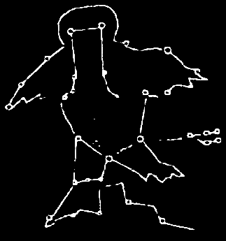</td>
<td>Orion Taurus Auriga, etc.</td>
<td>A vast asterism composed of numerous stars, envisioned as a soaring eagle. Dominating the mid-winter sky, it is majestic and imposing, serving as one of the primary stellar deities worshipped by shamans, visible only in autumn and winter skies. Its form and position were used for observing seasons and predicting weather. Its right leg is led by Nadan Narhū (Pleiades), while its left leg is bound by a rope (Eridanus constellation).</td>
</tr>
<tr>
<td>ᡝᠨᡩᡠᡵᡳ ᠰᡝᠨᡤᡤᡠ 
恩都力僧固</td>
<td>God of Hedgehogs</td>
<td>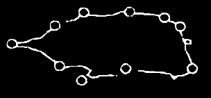</td>
<td>Cygnus</td>
<td>A prominent bright star group located within the Milky Way. Called the "Rafter Star" or "Hedgehog Star," it was venerated as a deity guarding the night and home, and served as an important directional star.</td>
</tr>
<tr>
<td>ᡨᠠᠴᡳ ᠮᠠᠮᠠ 
塔其妈妈</td>
<td>Taci (Goddess)</td>
<td></td>
<td>Cassiopeia</td>
<td>Its shape (W-shaped) resembles a knot or a winnowing basket, imagined as a snake or a dipper. It is an important timekeeping star; changes in its position and angle in the night sky were used to estimate the hour of the night. Perennially visible at high northern latitudes, it served as a crucial navigational and chronological reference.</td>
</tr>
<tr>
<td>ᡨᠣᠪᠣ ᡠᠰᡳᡥᠠ 
托包乌西哈</td>
<td>Hut</td>
<td>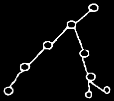</td>
<td>Perseus</td>
<td>Imagined as a resting place (hut) for the shaman's soul during its ascent to heaven.</td>
</tr>
<tr>
<td>ᡝᠨᡩᡠᡵᡳ ᡨᡝᡥᡝ 
恩都力特克</td>
<td>God of the Stand</td>
<td>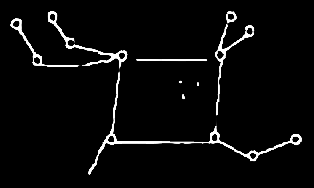</td>
<td>Pegasus</td>
<td>Located in the southern sky, moving westward, this asterism was used by shamans to observe signs of wind and snow. The Great Square of Pegasus is very prominent in the autumn night sky.</td>
</tr>
<tr>
<td>ᡳᠯᠠᠨ ᡠᠰᡳᡥᠠ 
依兰乌西哈</td>
<td>Three Stars</td>
<td>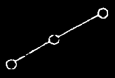</td>
<td>Orion's Belt</td>
<td>Three bright stars aligned in a row, one of the most distinctive markers of the winter night sky. As brilliant seasonal and timekeeping stars, their rising in the east at dusk signals the heart of winter; their movement can be used to estimate the time in the latter half of the night.</td>
</tr>
<tr>
<td>ᠨᠠᡩᠠᠨ ᡠᠰᡳᡥᠠ 
那丹乌西哈</td>
<td>Seven Stars</td>
<td>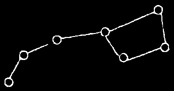</td>
<td>Ursa Major</td>
<td>The Big Dipper asterism, the most important star group for nighttime timekeeping and identifying the northern direction. The pointing of its "dipper handle" indicates the seasons and holds protective symbolism.</td>
</tr>
<tr>
<td>ᠰᡳᠩᡤᡝᡵᡳ ᡠᠰᡳᡥᠠ 
兴恶里乌西哈</td>
<td>Rat</td>
<td>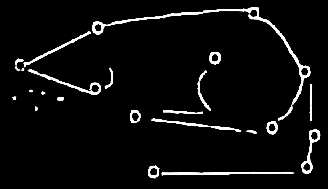</td>
<td>Leo</td>
<td>The Dawn-Greeting Rat Deity, which rises in the east before winter dawn together with the Dawn Beast Buruhun to welcome the sunrise. Used for divining snow volume and wind strength.</td>
</tr>
<tr>
<td>ᠮᠣᡵᡳᠨ ᡠᠰᡳᡥᠠ 
莫林乌西哈</td>
<td>Horse</td>
<td></td>
<td></td>
<td>A seasonal timekeeping star that rises in the east and sets in the west. It is not a single star, but a collective name for four bright stars: the bright star α Aur visible in the eastern sky at dusk after winter begins, α CMa rising in the east during the Xu hour (7-9 PM), and α Boo and α Vir rising at dawn.</td>
</tr>
<tr>
<td>ᠸᠠᡩᠠᠨ 
瓦丹星</td>
<td>Wadan (The Celestial Altar)</td>
<td>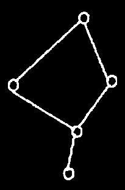</td>
<td>Corvus</td>
<td>The celestial location where ritual implements are stored, which must be worshipped when someone learns shamanism or when a shaman passes away.</td>
</tr>
<tr>
<td>ᡳᠮᠴᡳᠨ 
尼玛沁星</td>
<td>Drum</td>
<td>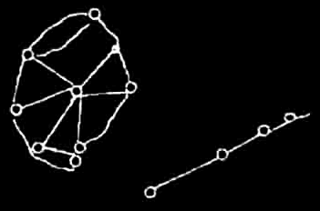</td>
<td>Aries Triangulum Andromeda</td>
<td>Along with the "Drumstick Star," considered the shaman's ritual instrument stars. It is the divine drum used by the Star-Spreading Goddess.</td>
</tr>
<tr>
<td>ᠰᡳᡵᡳ ᠮᠠᠮᠠ 
西离妈妈</td>
<td>Goddess of Carp</td>
<td>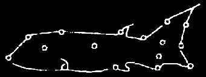</td>
<td>Lynx Camelopardalis</td>
<td>Imagined as a fish star transformed from a person, governing the fish of glacial rivers. Observing this star was used for divining the abundance or scarcity of the winter fishing and hunting season.</td>
</tr>
<tr>
<td>ᡨᡝᡵᡴᡳᠨ ᡠᠰᡳᡥᠠ ᠮᠠᠮᠠ 
妥亲乌西哈妈妈</td>
<td>Goddess of the Staircase Stars</td>
<td>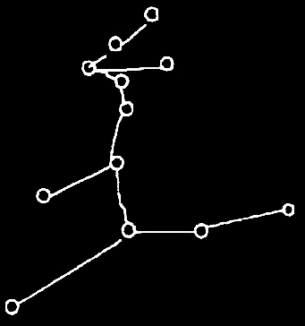</td>
<td>Virgo Coma Berenices</td>
<td>Believed to be the "stairway to heaven" that the shaman's soul could use during its ascent, represented by a goddess figure in a seated posture offering assistance.</td>
</tr>
<tr>
<td>ᡠᠰᡳᡥᠠ ᠪᡠᡵᡠᡥᡠᠨ 
乌西哈布鲁古</td>
<td>Star of Buruhun (The Dawn Beast)</td>
<td>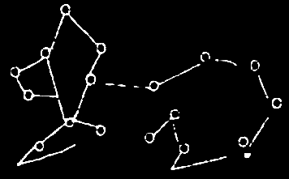</td>
<td>Boötes Canes Venatici Coma Berenices</td>
<td>An asterism depicting the Dawn Beast, rising in the east and setting in the west. It serves as the herald guiding the sunrise before winter dawn.</td>
</tr>
<tr>
<td>ᡶᠣᡩᠣᡥᠣ ᡠᠰᡳᡥᠠ 
佛朵乌西哈</td>
<td>Willow</td>
<td>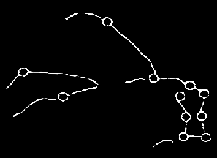</td>
<td>Head of Hydra</td>
<td>Located low in the southern sky, it was considered a divine star governing human fertility and was also used for divining the year's harvest and epidemics.</td>
</tr>
<tr>
<td>ᠠᠰᡠ ᡠᠰᡳᡥᠠ 
阿苏乌西哈</td>
<td>Net</td>
<td>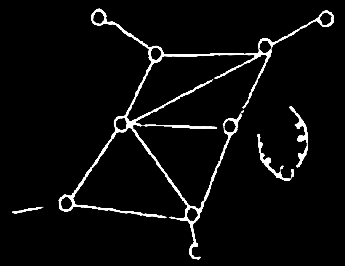</td>
<td>Hercules</td>
<td>Imagined as the hunting net used by the Hunting God (Banda mafa), reflecting the characteristics of a fishing and hunting lifestyle. The ring-like structure of Corona Borealis is easily associated with a hunting net.</td>
</tr>
<tr>
<td>ᠨᡳᠮᠠᡥᠠ ᡠᠰᡳᡥᠠ 
尼玛哈乌西哈</td>
<td>Fishhook</td>
<td>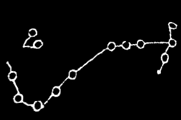</td>
<td>Scorpius</td>
<td>A summer stellar deity, commonly called the "Warm Star." Its appearance was used to determine the farming season and divine agricultural abundance or failure.</td>
</tr>
</tbody>
</table>

**Integration with the Traditional Chinese Asterism System**: After the establishment of the Qing dynasty, with the sinicization of state institutions, official astronomical agencies gradually adopted the traditional Chinese *xingguan* system (Three Enclosures and Twenty-Eight Mansions) for astronomical observation and calendar compilation, translating many asterism names into Manchu. However, among the folk in Northeast China, the aforementioned traditional shamanistic constellation system persisted, intertwined with ancient memories of production and life, myths, legends, and some folk customs, constituting the older, more indigenous layer of Manchu stellar culture. As late as the 20th century, a small number of people in Northeast China still used these shamanistic constellations.

Stellarium provides over 20 of these shamanistic constellations and also uses asterisms lines to represent *xingguans* from the official Qing dynasty star catalog (*Yixiang Kaocheng*).

### Star Worship Customs

Star worship was a significant ritual activity for the Manchus and their ancestors, historically as important as ancestor worship. Ceremonies were typically held on clear winter nights, often during the first lunar month or at specific seasonal nodes. The rituals were solemn, usually involving extinguishing lights, setting up an altar in the courtyard facing the Big Dipper or eastern stars, making blood sacrifices (often using piglets or fowl), using wooden utensils and straw as vessels, and the communal sharing of sacrificial meat by the clan. The shaman would chant "invocations to the star deities," believing that calling upon them made the stars shine brighter. In some large-scale collective star ceremonies, activities like piling firewood and setting it ablaze (called the "star bridge") and fire-skill competitions were held. The purposes of star worship included praying for blessings, dispelling pestilence, celebrating harvests, and beseeching the smooth passage of the shaman's soul to the celestial realm. Records of these ancient customs can be found in Qing dynasty documents such as the *Jilin Tongzhi*, *Jilin Jiuwenlu*, and the *Imperially Commissioned Manchu Rites for Sacrificing to Spirits and Heaven*.

### Mythological Connections

Many traditional Manchu constellations are closely linked to the narrative of their creation myth, *The Heavenly Palace War*. The core of this myth is the cosmic battle between the three goddesses—the Sky Goddess *Abka hehe*, the Earth Goddess *Banaji hehe*, and the Star-Spreading Goddess *Elden hehe*​ (also called *Elden mama*)—and the nine-headed demon *Yeruri*.

The Star-Spreading Goddess *Elden hehe* governs light and scattered stars using a birch-bark bag. In the myth, she creates the sun and moon from the eyes of *Abka hehe*. To aid her in star-spreading, the Fire Goddess *Tumu*​ shed her luminous fur into the sky to become stars, leaving herself bare. She then swung from east to west beneath the *Ilan usiha*​ (Orion's Belt), with the Great Orion Nebula (M42) being her last flicker of light. The Milky Way is the "mountain of stars" *Elden hehe* gathered to block *Yeruri*'s path.

The movement of stars is also explained mythologically: the demon *Yeruri* once stole *Elden hehe*'s star bag and later threw it westward. *Elden hehe* chased from east to west to retrieve it. Ever since, stars have always risen in the east and moved westward.

Several constellations are assigned mythological roles. The origin of *Nadan Narhū*​ (the Pleiades) is as follows: when the Fire Goddess *Tumu* was about to extinguish, the goddess *Nadan*​ emerged from *Elden*'s bag and transformed into hundreds of small stars amidst the evil winds stirred by *Yeruri*, forming the Pleiades cluster, becoming the leading star deity of the stellar array.

*Singgeri usiha*​ (the Rat Star) is the dawn-greeting Rat Goddess. *Usiha Buruhun*​ (the Dawn Beast asterism) is the three-eared, six-eyed Dawn Beast dispatched by *Abka hehe*. They rise before winter dawn, facing east to welcome and guide the sun's rays, preventing *Yeruri* from causing trouble in the pre-dawn darkness.

*Siri Mama*​ (the Carp Star Goddess) transformed into a carp to search for *Yeruri* when he fled into a river, which is why carps in the world prefer dwelling in deep water. *Taci Mama*​ is the timekeeping star entrusted by *Abka hehe* to measure time for the deities day and night.

Furthermore, the myth explains seasonal changes through celestial phenomena: the giant star where the Snow Deity resided, called the "Snow Star" or "Cold Star" (possibly Antares, α Sco), was split in two by *Abka hehe*. One half remained in the sky, the other fell to earth and transformed into the northern sacred mountain "*Nimanggi Uyan hada*"​ (meaning "Snow Peak", Gorod-Makit Mountain in modern Russia). Consequently, the Snow Deity dwells in two places, and its residence determines the season—when in the sky, spring blooms and flowers flourish; when on earth, heavy snow blankets the land for years. This star (or the mountain derived from it) is also called "*Niyengniyeri*"​ Sacred Mountain (meaning "spring"), becoming a marker for seasonal transition.

## References

 - [#1]: Fu Yuguang. (2005). Fu Yuguang's Collected Works on Folk Culture. Changchun: Jilin University Press.
 - [#2]: Fu Yuguang, Jing Wenli. (2009). The Heavenly Palace War & Sirin Amban mafa. Jilin People's Publishing House.
 - [#3]: [Ursan Manchu-Chinese Online Dictionary](http://www.dorontu.com/#/homePage)

## Authors

This sky culture was contributed by Lyu Haocheng. [lvhc2016@126.com](mailto:lvhc2016@126.com)

## License

CC BY-SA 4.0
