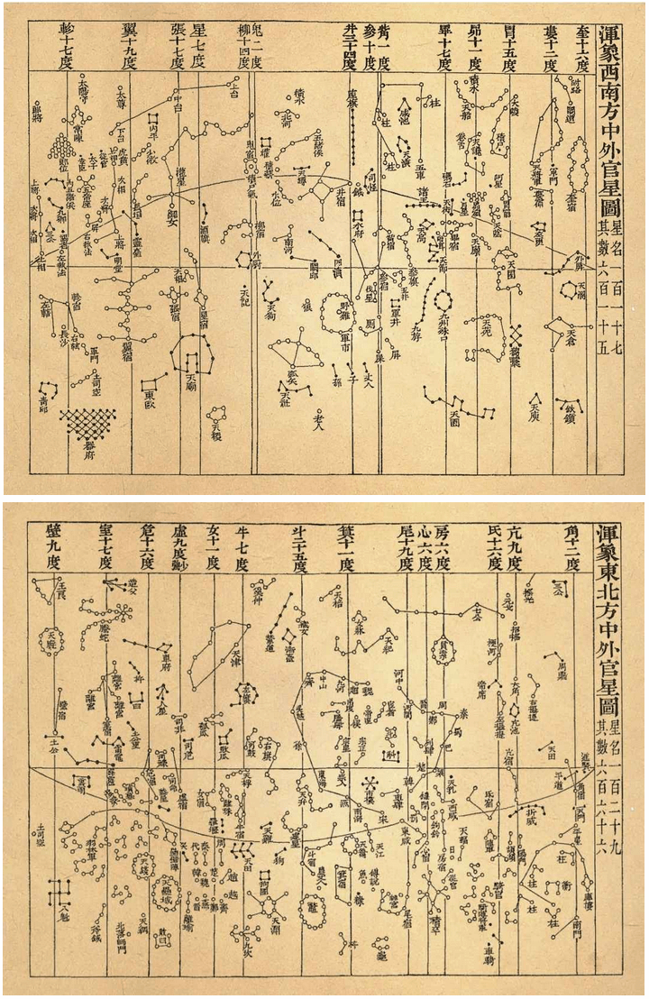

# Chinese Medieval

## Introduction

This sky culture is based on the observation data of Huangyou four years (1052 AD), and presents the medieval Chinese sky map as faithfully as possible. This sky culture includes 283 Xingguans (星官, Chinese Constellations) and 1464 stars (including clusters M7, M44) of the *Xinyixiangfayao Star Map*. And the determinative star is marked for each Xingguan that can determine the determinative star. The boundaries of Twenty-eight Lunar Mansions are based on 1052 AD.

## Description

### Medieval Xingguans

From the Three Kingdoms Period to the Ming Dynasty, covering the whole of the Middle Ages, China's star map is similar.

The Xingguans originated in ancient times. Wuxian (巫咸) of Shang Dynasty(16th century BC-1046 BC), Gan De (甘德) and Shi Shen (石申) of The Warring States Period (475–221 BC), created their own Xingguan system respectively. During the Three Kingdoms period (220–280 AD), Chen Zhuo (陈卓) summarized the Xingguans system of Gan De, Shi Shen and Wuxian, including 283 Xingguans and 1464 stars. Since then, Xingguan system has been basically defined, and after a thousand years, there has not been much change. Since the 17th century, Western astronomy has had an impact on Chinese astronomy, and the shape and number of Xingguans have changed significantly. Only about half of the constellations maintained the medieval style.

Determinative star is an important concept. In the Middle Ages, Chinese astronomers did not name all stars, and each Xingguans was chosen as a major star called determinative star. In ancient China, astronomical measurements measured its coordinate position, and other stars in the Xingguan were rarely mentioned. However, some important constellations will be selected more stars for observation and recording. In ancient China, astronomers used mansion distance degrees (determinative star distance) and polar distance degrees to record the position of stars. **In ancient China, the determinative stars of Twenty-eight Lunar Mansions was the benchmark for determining the longitude of the equatorial coordinate system**.

The *Song of the Sky Pacers* (步天歌) is an early Chinese star catalogue in the form of poem in heptasyllabic verse, enumerating the names of stars.

Below is *Xinyixiangfayao Star Map* from Su Song(苏颂, 1020-1101 AD).

*Xinyixiangfayao Star Map(1088 AD)*

### Restore Sky Map

The sky map of the Song dynasty is typical of the Chinese medieval sky map. In 1052 AD, the Song Dynasty official conducted accurate stellar measurements, leaving a lot of data.

Pan Nai(潘鼐) collated these astronomical observations data and based on the *Xinyixiangfayao Star Map*, he restored most of the Song Dynasty's Xingguan in his masterpiece *The History of Stellar Observation in China*, which is the most important reference book. Qi Rui (齐锐) and Wan Haoyi (万昊宜) also restored the Xingguans of the Song Dynasty in the book *Roving China Heavens*, which is also an important reference book.

Due to the limitation of observation conditions in Song Dynasty, combined with instruments, circulated errors and other reasons, different scholars restored the sky map is somewhat different.

Based on these books, Stellarium can almost truly present the Chinese medieval sky map of Huangyou four years (1052 AD).

### Planets

Taiyang (太阳), Sun. The name comes from yin and yang, meaning a lot of yang,

Taiyin (太阴), Moon. The name comes from yin and yang, meaning a lot of Yin,

Chen Star (辰星), Mercury. Chen is an angle unit, which refers to about 30 degrees. Mercury is always within 30 degrees of the sun.

Taibai (太白), Venus. Taibai means big and white.

Yinghuo (荧惑), Mars. The colors of Mars are like fire, and movement is confusing.

Sui Star (岁星), Jupiter. It means the old star. Jupiter travels around the celestial sphere for a week every 12 years. The ancients took Jupiter's position as the standard of the chronology.

Zhen Star (填星), Saturn. Zhen, means passing Lunar Mansions. Saturn travels around the celestial sphere about every 28 years. Saturn will pass through a Lunar Mansion every year.

## References

 - [#1]: Pan Nai. The History of Stellar Observation in China
 - [#2]: Qi Rui and Wan Haoyi. Roving China Heavens
 - [#3]: Su Song. *Xinyixiangfayao Star Map*
 - [#4]: *Records of the Grand Historian*
 - [#5]: *Book of Sui*
 - [#6]: *History of Song*

### External links

 - [wikipedia - Su Song](https://en.wikipedia.org/wiki/Su_Song)
 - [History of Song](http://chinesenotes.com/songshi.html)
 - [Records of the Grand Historian](http://chinesenotes.com/shiji.html)
 - [(Chinese) Song of the Sky Pacers](https://www.lcsd.gov.hk/CE/Museum/Space/archive/Research/Literature/c_research_literature_9.htm)
 - [wikipedia - Song of the Sky Pacers](https://en.wikipedia.org/wiki/Song_of_the_Sky_Pacers)
 - [(Chinese) Chinese Heaven in WWT Community Beijing](http://wwt.china-vo.org/why/chineseheaven.htm)

## Authors

This sky culture was contributed by Stellarium user *Sun Shuwei* (孙殳玮) . [sunshuwei.hi@foxmail.com](mailto:sunshuwei.hi@foxmail.com)

## License

CC BY-SA 4.0
