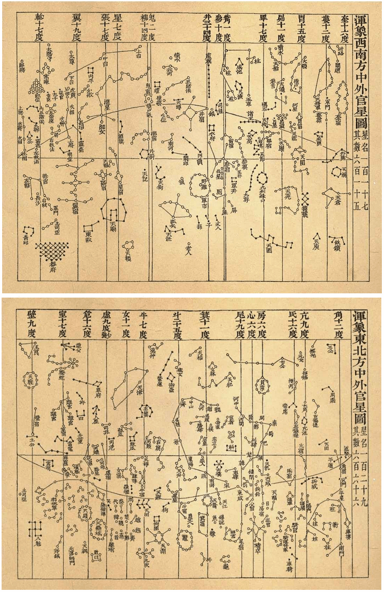

# Chinese Song Dynasty Sky

## Introduction

This sky culture is based on the observation data from the 4th year of the Huangyou era (1052 AD), and aims to faithfully reconstruct the star map of China during the Song Dynasty. This sky culture comprises 283 Xingguans (星官, Chinese Constellations) and 1464 stars (including clusters M7, M44) from the *Xinyixiangfayao Star Map*. 

## Description

###  Xingguan System

The Chinese system of Xingguans originated in antiquity. During the Warring States period (475–221 BC), astronomers Gan De (甘德) and Shi Shen (石申) established independent systems. Another system was attributed to the legendary figure Wuxian (巫咸) of the Shang Dynasty  (16th century BC–1046 BC), though modern scholarship suggests it was likely compiled by later generations in his name. In the Three Kingdoms period (220–280 AD), astronomer Chen Zhuo (陈卓) synthesized these three systems into a unified one, defining 283 Xingguans and 1464 stars. This framework became the standard and was later immortalized in the *Song of the Sky Pacers (步天歌)*, a Tang Dynasty astronomical text written in verse. It remained largely stable until the introduction of Western astronomy in the 17th century.

An important concept within this system is the *determinative star*. Before the 17th century, Chinese astronomers generally did not assign names to individual stars; instead, they designated a primary star—though not necessarily the brightest—within each Xingguan as its determinative star. Astronomical observations primarily documented the coordinates of these determinative stars, though in particularly important or special Xingguans, additional stars could also be selected for observation and recording, or even assigned names. For each Xingguan from which a determinative star can be identified, we have marked its determinative star.

**The determinative stars of the Twenty-eight Lunar Mansions were of particular importance, forming—together with the North Celestial Pole—the fundamental reference framework for the ancient Chinese equatorial coordinate system.** 

Due to precession, the determinative stars of the Twenty-Eight Lunar Mansions have varied across different historical periods. A notable example involves the mansions of Turtle Beak and Three Stars. During the Song Dynasty and earlier periods, the determinative star for Turtle Beak was φ¹ Ori, while for Three Stars it was δ Ori. By the 13th century, however, precession had caused φ¹ Ori to shift to a position east of δ Ori, resulting in the phenomenon known as "Turtle Beak lying within Three Stars," which contradicted the traditional sequence of the Twenty-Eight Mansions. This discrepancy became increasingly pronounced by the Qing Dynasty, leading the Imperial Observatory to redefine the determinative stars: for Three Stars, it was changed from δ Ori to ζ Ori, and for Turtle Beak, from φ¹ Ori to λ Ori.

In ancient China, the *Du* (度, Chinese degree) served as the fundamental angular unit for measuring celestial coordinates. It was defined as the mean daily distance traveled by the Sun along the ecliptic. Accordingly, the full celestial circumference was divided into 365.25 *Du*. Historical records note that the radius of the celestial equator measured “slightly more than 91 *Du*” from the North Celestial Pole. Evidently, the *Du* is slightly smaller than the modern degree, equivalent to approximately 0.9856°. Unlike modern angular units, there were no precise subdivisions below the Du (such as arcminutes or arcseconds). Instead, a set of descriptive terms was used to roughly approximate divisions of one Du, either into quarters or tenths.

Another angular unit used in traditional Chinese astronomy was the *Chen* (辰). One *Chen* corresponds to a 30-degree segment, and the celestial circle was divided into twelve such units. Thus, one *Chen* equals 30 modern degrees—or slightly more than 30 *Du*, though *Chen* was generally not converted into *Du* in practice. Due to its relatively large scale, the *Chen* was seldom used for precise angular measurement. In later periods, it became more common as a unit of time, dividing one full day into twelve *Chen*, each equivalent to two modern hours.

Below is *Xinyixiangfayao Star Map* from Su Song (苏颂, 1020-1101 AD).

Xinyixiangfayao Star Map (1088 AD)
{: .img_and_caption }

### Reconstruction of the Sky Map

The Imperial Observatory of the Song Dynasty conducted several large-scale stellar observations with remarkable accuracy, surpassing all previous eras in precision. The data from the 4th year of the Huangyou era (1052 AD) is the most complete set that survives today. Based on these records, two significant star charts were produced: the *Xinyixiangfayao Star Map* (based on observational data from 1052 AD, created in 1088 AD) and the *Suzhou Star Map* (based on observational data from 1078 to 1085 AD, carved in 1247 AD).

The historian of astronomy Pan Nai (潘鼐) systematically compiled the observational data from the Huangyou era into the *Huangyou Star Catalog*. By cross-referencing it with the *Xinyixiangfayao Star Map* in his work *The History of Stellar Observation in China*[#1], he reconstructed most of the Song Dynasty Xingguans, serving as the primary reference for this project.

In their work *Roving China Heavens*[#2], Qi Rui (齐锐) and Wan Haoyi (万昊宜) also reconstructed the Song Dynasty Xingguans. Their research primarily referenced the *Suzhou Star Map* . Since the observational data used for this star map dates from slightly later than 1052 AD, *Roving China Heavens* serves as supplementary reference material for this study.

Due to the limitations of observational technology and potential errors in transmission, different scholarly reconstructions may vary slightly. Based on the aforementioned works, Stellarium faithfully reconstructs the Chinese night sky of 1052 AD.

### The Milky Way

The Chinese imagine the Milky Way as a river. During the Song Dynasty in China, the official name for the Milky Way was "天汉" (pinyin: Tiānhàn), meaning "river in the heavens." It was also referred to as "银河" (pinyin: Yínhé)—which remains the modern Chinese official name for the Milky Way—meaning "silver river." In traditional Chinese culture, the Milky Way has also been referred to as "天河" (pinyin: Tiānhé), similarly meaning "river in the heavens"; "银汉" (pinyin: Yínhàn), also meaning "silvery river"; "河汉" (pinyin: Héhàn), meaning "river in the sky"; "星河" (pinyin: Xīnghé) or "星汉" (pinyin: Xīnghàn), meaning "river of stars"; and "云汉" (pinyin: Yúnhàn), meaning "cloud-like river."

### Seven Luminaries

The Sun, the Moon, and the five major planets are collectively referred to as the *Seven Luminaries*. The sun and moon are named after *yin and yang*, while the pictographic characters "日" (the Sun, pinyin: Rì) and "月" (the Moon, pinyin: Yuè) are also used. The five major planets represent the *five elements*, but the following names were the most orthodox designations at the time. Similar to other civilizations around the world, Venus also had additional names depending on whether it appeared in the morning or the evening.

Great Yang (太阳, pinyin: Tàiyáng): The Sun. In Chinese philosophy, it represents the pinnacle of Yang energy.

Great Yin (太阴, pinyin: Tàiyīn): The Moon. It represents the pinnacle of Yin energy.

Division Star (辰星, pinyin: Chénxīng): Mercury. From Earth, Mercury's angular distance from the Sun never exceeds 28 degrees, remaining within one *Chen* (a 30-degree unit, see discussion of *Chen* above), and thus it is historically known as *Division Star*.

Grand White (太白, pinyin: Tàibái): Venus. It is named for its extremely high brightness and pure white color.

Spark-Weaver (荧惑, pinyin: Yínghuò): Mars. It is named for its fiery red color and its erratic, unpredictable orbit.

Year Star (岁星, pinyin: Suìxīng): Jupiter. Jupiter's orbital period of approximately 12 years was used by the ancients to mark the cycle of years, hence its name.

Stabilizer Star (填星, pinyin: Zhènxīng): Saturn. In traditional theory, Saturn was believed to take about 28 years to orbit the heavens, *guarding* or *filling* one lunar mansion each year.

## References

 - [#1]: Pan Nai. *Zhongguo Hengxing Guance Shi [The History of Stellar Observation in China]*. Shanghai: Xuelin Publishing House, 2009.
 - [#2]: Qi Rui, Wan Haoyi. *Manbu Zhongguo Xingkong [Roving China Heavens]*. Beijing: Science Popularization Press, 2014.
 - [#3]: Su Song (Song Dynasty). *Xinyixiangfayao Yizhu [Annotated Translation of Xinyixiangfayao]*. Translated and annotated by Lu Jingyan and Qian Xueying. Shanghai: Shanghai Ancient Books Publishing House, 2008.
 - [#4]: Sima Qian (Han Dynasty). *Shiji [Records of the Grand Historian]*. Compiled with commentary by Pei Yin (Liu Song Dynasty), indexed by Sima Zhen (Tang  Dynasty), and annotated by Zhang Shoujie (Tang  Dynasty). Beijing: Zhonghua Book Company, 2014.
 - [#5]: Wei Zheng, et al. (Tang Dynasty). *Suishu [Book of Sui]* Beijing: Zhonghua Book Company, 1997.
 - [#6]: Tuotuo, et al. (Yuan Dynasty). *Songshi [History of Song]*. Beijing: Zhonghua Book Company, 1985.

### External links

 - [wikipedia - Su Song](https://en.wikipedia.org/wiki/Su_Song)
 - [History of Song](http://chinesenotes.com/songshi.html)
 - [Records of the Grand Historian](http://chinesenotes.com/shiji.html)
 - [(Chinese) Song of the Sky Pacers](https://www.lcsd.gov.hk/CE/Museum/Space/archive/Research/Literature/c_research_literature_9.htm)
 - [wikipedia - Song of the Sky Pacers](https://en.wikipedia.org/wiki/Song_of_the_Sky_Pacers)
 - [(Chinese) Chinese Heaven in WWT Community Beijing](http://wwt.china-vo.org/why/chineseheaven.htm)

## Authors

This sky culture was contributed by Stellarium user *Sun Shuwei* (孙殳玮) . [sunshuwei.hi@foxmail.com](mailto:sunshuwei.hi@foxmail.com)

## License

CC BY-SA 4.0
