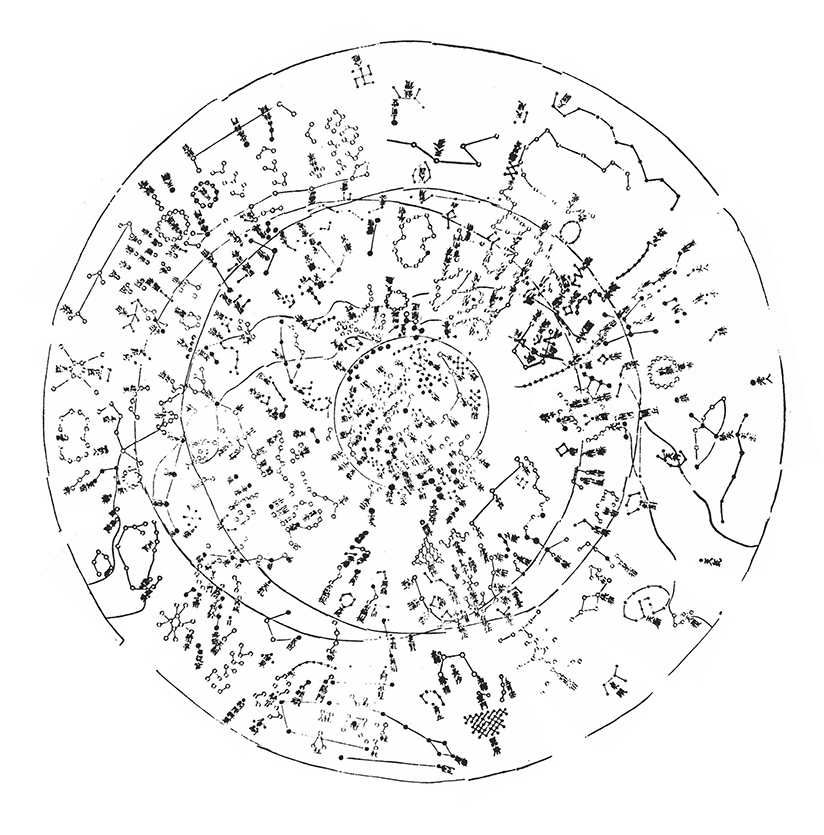
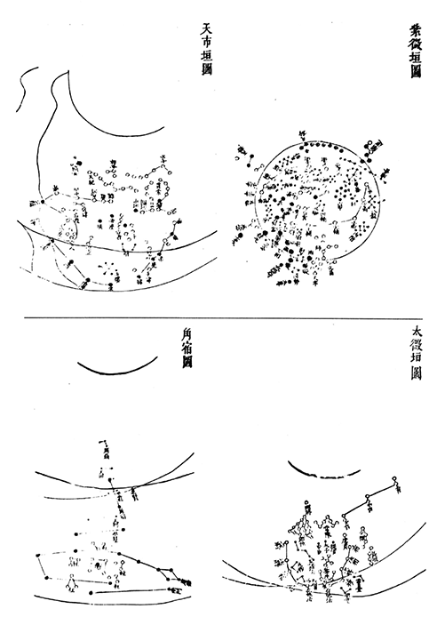
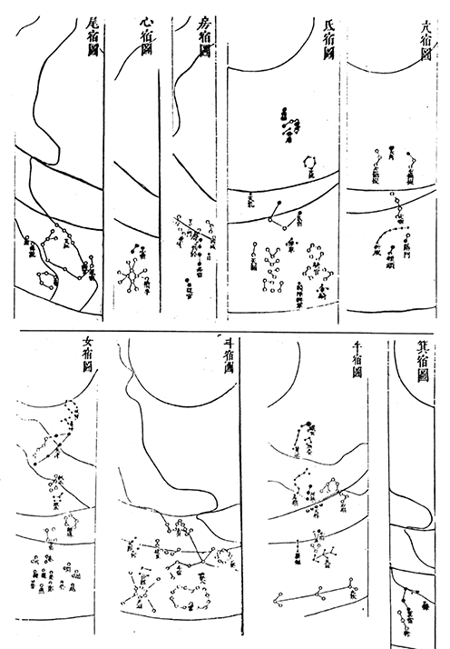
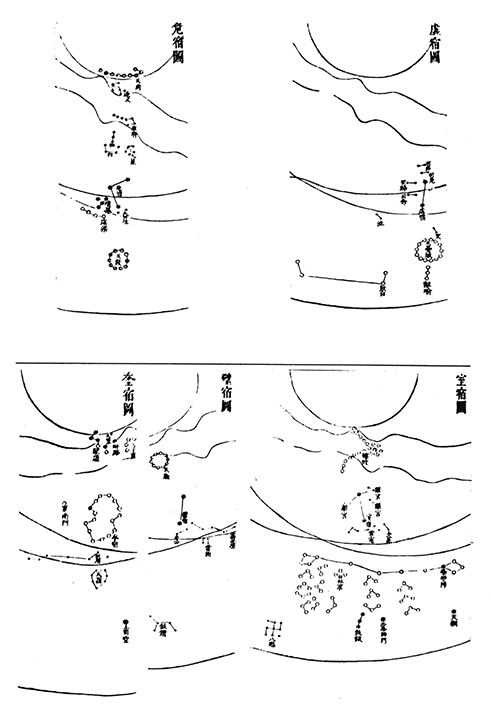
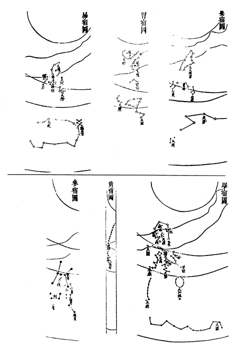
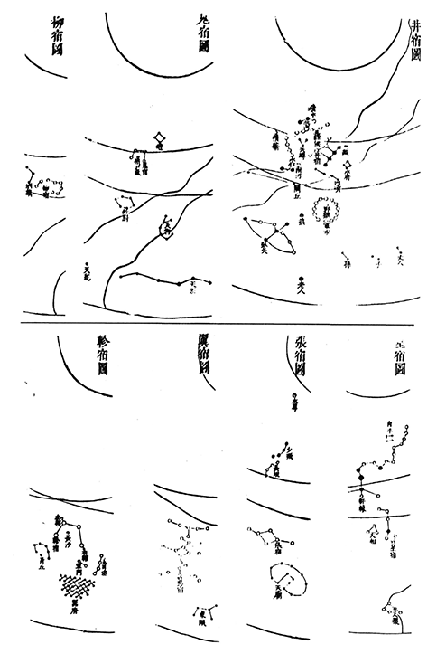

# Chinese Xianglin Star Chart

## Introduction

This sky culture is based on the *Xianglin* (象林, "Forest of Constellations") star chart, compiled by the late Ming dynasty scholar **Chen Jinmo**​ (陈荩谟) in **1634 CE**. It represents one of the last precise mappings of the traditional Chinese star system before significant Western astronomical influence altered subsequent charts. Created independently of the contemporaneous, Jesuit-influenced official star catalogues, the *Xianglin* chart is a crucial document for understanding indigenous Chinese astronomy on the eve of its major transformation.

## Description

### Author and Sources

Chen Jinmo, a scholar from Xiushui (modern Jiaxing, Zhejiang), was a student of the renowned intellectual Huang Daozhou. His work *Xianglin* was intended as a commentary and refinement of Huang's esoteric text *Sanyi Dongji* (三易洞玑). For his star chart, Chen meticulously consulted and cross-referenced classical Chinese astronomical texts, primarily relying on the Southern Song dynasty "**Zhongxing Astronomical Records**"​ (*Zhongxing Tianwen Zhi*). He critically examined stellar positions, magnitudes, and asterism names, noting discrepancies and advocating for verification through actual observation where possible.

### Historical Context

The *Xianglin* chart was completed in the same year (1634) as the official *Chongzhen Reign Treatise on Astronomy and Calendrical Science* (*Chongzhen Lishu*), which extensively incorporated data from European astronomers like Tycho Brahe. While the official work achieved high positional accuracy, it marked a departure from traditional Chinese star-mapping conventions. In contrast, Chen Jinmo's *Xianglin* chart consciously **preserved the authentic Ming-era star system**.

### Cartographic Features

The chart is organized according to the classic Three Enclosures and Twenty-Eight Lunar Mansions​ system. It comprises 31 individual sectional maps​ that, when assembled, form a complete all-sky dome centered on the North Celestial Pole. These maps clearly delineate key celestial reference lines: the Celestial Equator, the Ecliptic, and the Circles of Perpetual Visibility and Invisibility.

In its depiction of constellations, the chart adheres to the traditional “Three Schools” convention: stars from the Shi​ and Wuxian​ schools are denoted with outlined circles, while those from the Gan​ school are marked with solid dots.

Crucially, the chart introduces a significant innovation within this traditional framework: it departs from the common Chinese practice of not indicating stellar brightness.​ This is achieved by filling in the outlined circles​ representing particularly bright stars (e.g., ε Boo​ and β And) that belong to the Shi or Wuxian schools, thereby visually distinguishing them from fainter stars within the same constallation.

!

*The Xianglin Star Chart (composited from 31 sectional maps)*

### The original set of 31 sectional star maps 

(Reading order: Start from the top row, reading each row **from right to left**. Move to the next lower row upon completion.)

 

*Three Enclosures (Purple Forbidden Enclosure, Heavenly Market Enclosure, Supreme Palace Enclosure) and Horn Mansion*

 

*Neck, Root, Room, Heart, Tail, Winnowing Basket, Dipper, Ox, Girl Mansions*

 

*Emptiness, Rooftop, Encampment, Wall, Legs Mansions*

 

*Bond, Stomach, Hairy Head, Net, Turtle Beak, Three Stars Mansions*

 

*Well, Ghosts, Willow, Star, Extended Net, Wings, Chariot Mansions*

### Constellations in Xianglin star chart

The constellations in the *Xianglin* Star Chart fully adhere to the traditional Chinese system of 283 constellations (*Xingguans*) and 1464 stars, reflecting the constellation patterns prevalent in Ming dynasty folk astronomy. This stands in direct contrast to the contemporaneous official versions modified by Jesuit missionaries (such as those in the *Chongzhen Lishu* (Treatise on Calendrical Science of the Chongzhen Reign), *Lingtai Yixiang Zhi* (Records of the Observatory and Its Instruments), and *Yixiang Kaocheng* (Compendium of Astronomical Instruments and Observations)). The "Chinese" sky culture in Stellarium lists the *Xingguans* and star counts from this missionary-modified official system. The discrepancies between the *Xianglin* chart and this official system are noted below:

**Constellations Omitted in the Official System**

|Chinese Name|Pinyin|Translation|Number of Stars|
|------------|------|-----------|---------------|
|<notr>天稷</notr>|<notr>Tiānjì</notr>|Celestial Cereals|<notr>5</notr>|
|<notr>天庙</notr>|<notr>Tiānmiào</notr>|Celestial Temple|<notr>14</notr>|
|<notr>东瓯</notr>|<notr>Dōngōu</notr>|Dongou|<notr>5</notr>|
|<notr>军门</notr>|<notr>Jūnmén</notr>|Military Gate|<notr>2</notr>|
|<notr>土司空（轸宿）</notr>|<notr>Tǔsīkōng(Zhěnxiù)</notr>|Master of Constructions (In Chariot Mansion)|<notr>4</notr>|
|<notr>器府</notr>|<notr>Qìfǔ</notr>|House for Musical Instruments|<notr>32</notr>|

**constellations with Reduced Star Counts in the Official System**

|Chinese Name|Pinyin|Translation|Number of Stars in *Xianglin*|Number of Stars in *Yixiang Kaocheng*|
|------------|------|-----------|-----------------------------|-------------------------------------|
|<notr>柱（角宿）</notr>|<notr>Zhù(Jiǎoxiù)</notr>|Pillars (In Horn Mansion)|<notr>15</notr>|<notr>11</notr>|
|<notr>亢池</notr>|<notr>Kàngchí</notr>|Boats and Lake|<notr>6</notr>|<notr>4</notr>|
|<notr>骑官</notr>|<notr>Qíguān</notr>|Imperial Guards|<notr>27</notr>|<notr>10</notr>|
|<notr>积卒</notr>|<notr>Jīzú</notr>|Group of Soldiers|<notr>12</notr>|<notr>2</notr>|
|<notr>天渊</notr>|<notr>Tiānyuān</notr>|Celestial Spring|<notr>10</notr>|<notr>3</notr>|
|<notr>鳖</notr>|<notr>Biē</notr>|River Turtle|<notr>14</notr>|<notr>11</notr>|
|<notr>天田（牛宿）</notr>|<notr>Tiāntián(Niúxiù)</notr>|Celestial Farmland (In Ox Mansion)|<notr>9</notr>|<notr>4</notr>|
|<notr>离珠</notr>|<notr>Lízhū</notr>|Pearls on Ladies' Wear|<notr>5</notr>|<notr>4</notr>|
|<notr>天钱</notr>|<notr>Tiānqián</notr>|Celestial Money|<notr>10</notr>|<notr>5</notr>|
|<notr>人</notr>|<notr>Rén</notr>|Humans|<notr>5</notr>|<notr>4</notr>|
|<notr>八魁</notr>|<notr>Bākuí</notr>|Net for Catching Birds|<notr>9</notr>|<notr>6</notr>|
|<notr>天厩</notr>|<notr>Tiānjiù</notr>|Celestial Stable|<notr>10</notr>|<notr>3</notr>|
|<notr>天溷</notr>|<notr>Tiānhùn</notr>|Celestial Pigsty|<notr>7</notr>|<notr>4</notr>|
|<notr>九州殊口</notr>|<notr>Jiǔzhōushūkǒu</notr>|Interpreters of Nine Dialects|<notr>9</notr>|<notr>6</notr>|
|<notr>军市</notr>|<notr>Jūnshì</notr>|Market for Soldiers|<notr>13</notr>|<notr>6</notr>|

While omitting the constellations mentioned above, the official system added new constellations near the southern celestial pole, which are not present in the *Xianglin* Star Chart.

## References

 - [#1]: Pan Nai. (2009). Atlas of Ancient Chinese Astronomy. Shanghai: Shanghai Scientific & Technological Education Publishing House. ISBN 9787542849137.
 - [#2]: Pan Nai. (2009). The History of Stellar Observation in China. Shanghai:  Academia Press. ISBN 9787807306948.

## Authors

This sky culture was contributed by Lyu Haocheng. [lvhc2016@126.com](mailto:lvhc2016@126.com)

## License

CC BY-SA 4.0
