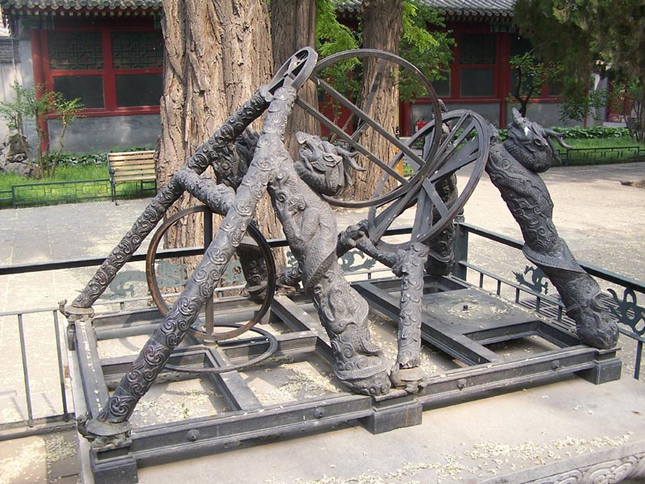
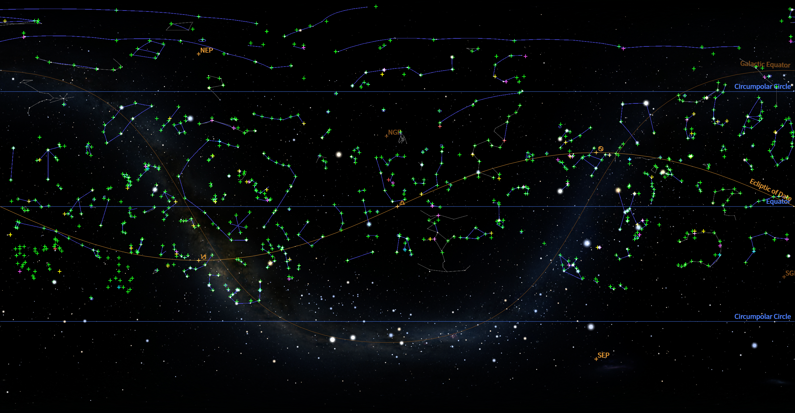
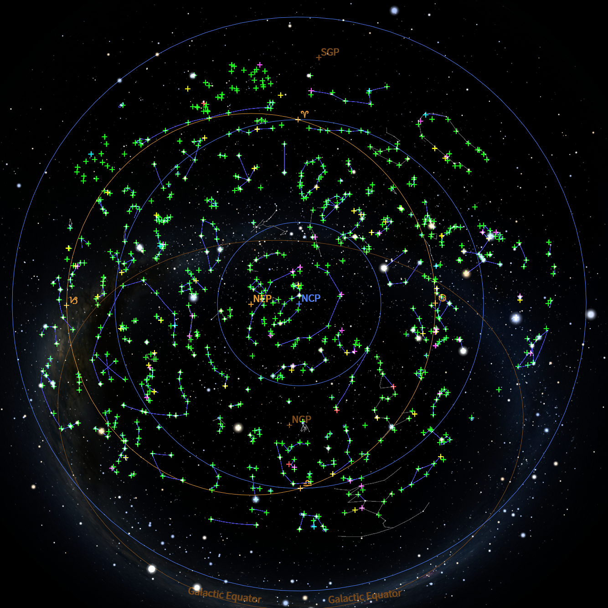
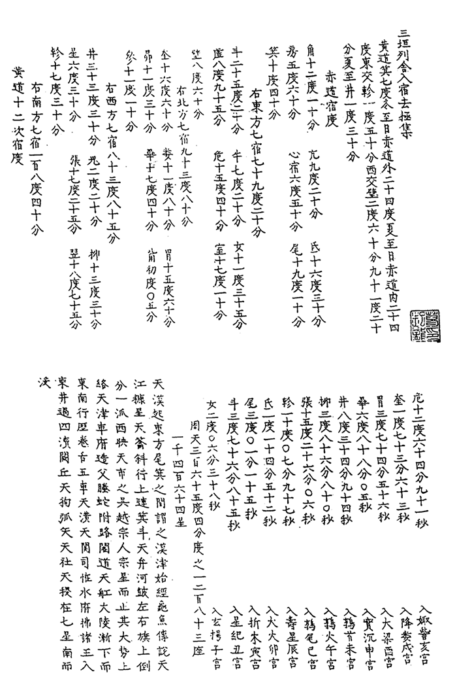
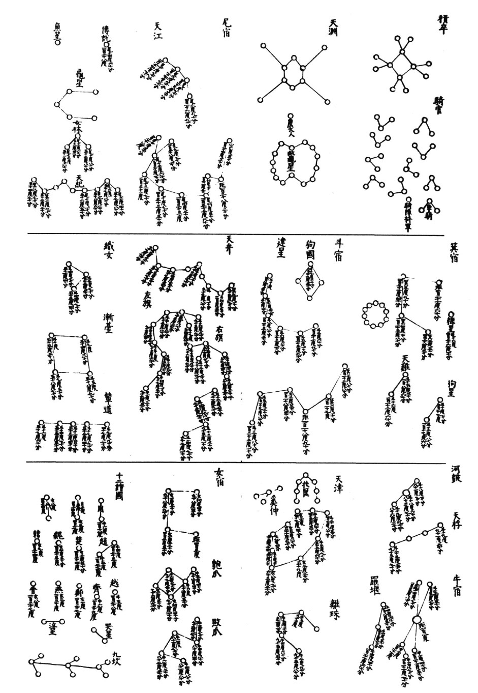
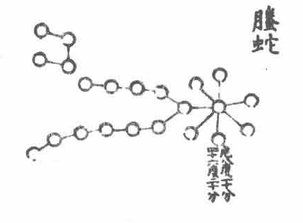

# Chinese Yuan Dynasty (14th Century)

## Introduction

The *Tianwen Huichao*(天文汇钞) star catalog is an important record of stellar observations completed in the late Yuan Dynasty (around 1363 CE). It adopts a unique "chart-plus-table" format, in which data are attached beneath the plotted stars, recording high-precision positional data for 741 stars. This format is unparalleled in ancient Chinese star catalogs. This catalog  represents one of the highest achievements of traditional Chinese stellar observation before the introduction of Western astronomy.

## Description

The *Tianwen Huichao* star catalog is preserved in the *Sanyuan Lieshe Ruxiu Quji Ji* (三垣列舍入宿去极集, Compilation of Lunar-Mansion Longitudes and Polar Distances for the Three Enclosures and Twenty-Eight Mansions), a section of the Ming-Dynasty (1368-1644) manuscript *Tianwen Huichao*. It was discovered in 1983 by the scholar Pan Nai at the National Library of China.

In traditional Chinese astronomy, *ruxiu du* (入宿度, "entering degree") measures the angular distance of a star eastward from the determinative star of a lunar mansion along the equator. It is functionally analogous to right ascension, but its zero point is defined by the mansion's determinative star rather than the vernal equinox. *Quji du* (去极度, "departure-from-pole degree") measures the angular distance of a star from the north celestial pole, which is essentially the complement of declination (i.e., 90° minus declination). Although both concepts are similar to modern right ascension and declination, their calculation methods differ because they are based on the 28-lunar-mansion system and polar distance rather than a full spherical coordinate frame.

Early scholars speculated that the catalog might have been measured by Guo Shoujing in the early Yuan Dynasty (late 13th century). However, precise calculations using Fourier analysis and Bootstrap statistics have determined that its actual observational epoch is around 1362 CE, in the late Yuan Dynasty. Hence it was not the work of Guo Shoujing.

Nevertheless, Guo Shoujing made indelible contributions to the development of astronomy during the Yuan Dynasty. He directed the construction of thirteen precision astronomical instruments, including the Simplified Armilla (简仪, Jianyi), the Gnomon (仰仪, Yangyi), and the Large Gnomon (高表, Gaobiao). The Simplified Armilla drastically simplified the traditional armillary sphere; its equatorial design predated similar European instruments by more than three hundred years, and it incorporated two alignment lines (similar to cross-hairs) in the sighting tube to improve aiming accuracy.

*Simplified Armilla (简仪) in Beijing Ancient Observatory, invented by Guo Shoujing*

He also initiated the "Four Seas Survey" (四海测验, Sihai Ceyan), establishing 27 observation stations across the territory of the Yuan Dynasty to systematically measure the altitude of the North Pole and the summer solstice shadow lengths. The geographical coverage was unprecedented in the history of world astronomy. Based on these empirical data, Guo Shoujing and his collaborators compiled the Shoushi Calendar (授时历, Season-Granting Calendar) in 1280. Its tropical year length of 365.2425 days is exactly the same as that of the Gregorian calendar, yet it was completed more than three hundred years earlier, and it remained in use in China for 364 years – the longest-lasting calendar in ancient China. It can be said that Guo Shoujing pushed traditional Chinese stellar observation and calendrical computation to their zenith. The Tianwen Huichao star catalog was precisely another important achievement, completed in the late Yuan under the tradition of instruments and empirical measurement that he had established.

 

 

*The images show the positions of all 741 coordinates in the Tianwen Huichao star catalog. The green crosses represent the data from the original source, while the other colors represent the results of scholars' corrections to the coordinates.*

### Historical background of the star catalog

During the late Yuan period, Emperor Shundi (Toghon Temür) showed a strong interest in astronomy. He not only personally crafted an elaborate automatic water-clock, but also valued simple instruments such as portable sundials presented by officials of the Bureau of Astronomy, and he dabbled in numerology and astrological divination. This imperial enthusiasm provided external impetus for large-scale stellar observations in the late Yuan. At the same time, precision instruments like the Abridged Armilla, cast by Guo Shoujing during the Zhiyuan reign, were still preserved at the observatory, offering good internal conditions for observation.

Although social upheaval in the late Yuan may have affected the training of observers and the proper maintenance of instruments, the completion of the *Tianwen Huichao* star catalog demonstrates that the Bureau of Astronomy at that time was still capable of high-level stellar observation.

The catalog was transmitted during the Ming Dynasty in manuscript form, and its unique chart-plus-table format later spread to Japan, where it was inherited by the famous Edo-period astronomer Shibukawa Harumi, influencing the development of traditional Japanese star lore.

### Features of the star catalog

 

 

The *Tianwen Huichao* star catalog possesses several characteristics that are extremely rare in ancient Chinese star catalogs. First, it adopts a "chart-plus-table" format: within each constellation diagram stars are drawn, and for more than half of the stars the values of *ruxiu du* (entering degree) and *quji du* (polar distance) are directly annotated below them. This close integration of chart and data is unparalleled in Chinese history.

Second, the catalog contains 741 stellar coordinate entries, covering the Twenty-Eight Mansions and a large number of inner and outer constellations. Unlike earlier catalogs that usually measured only the determinative star (距星, primary star) of each constellation, this catalog gives coordinates for all or most of the member stars of the constellations it covers, revealing an intention to systematically measure the entire sky.

Third, the graduation values are precise to 0.1 degree, significantly finer than most earlier catalogs (e.g., Song-Dynasty catalogs were usually only precise to whole degrees or half degrees).

Moreover, the catalog forms an independent volume without any attached astrological omens, which is completely different from the traditional style of astrological texts, and is much closer to a purely astrometric work. It is precisely these unique features that have attracted great scholarly attention since its discovery.

### Epoch and accuracy of the star catalog

Through rigorous mathematical-statistical filtering, the observational epoch of the Tianwen Huichao star catalog has been determined to be around 1362 CE (late Yuan). In terms of observational accuracy, the overall systematic error is about 0.12°, the standard deviation of the measured polar distances is 0.32°, and the random error after removing the systematic component is 0.21°. After further filtering out anomalous data, a stable sample of 509 stars is obtained, for which the standard deviation drops to 0.15° and the random error to 0.12°. Compared with the Huangyou star catalog of the Northern Song Dynasty (random error about 0.44°), the accuracy is improved by a factor of about two. However, it is still slightly inferior to the accuracy of the twenty-eight mansion polar distances measured by Guo Shoujing himself (about 4.3 arcminutes), which likely reflects the social turmoil, loss of skilled observers, and inadequate instrument maintenance during the late Yuan period.

### Historical significance

The appearance of the *Tianwen Huichao* star catalog fills the gap in Chinese stellar observational records between Guo Shoujing's time and the Ming Dynasty, providing crucial material for studying the level of astronomical observation in the late Yuan. Together with the early Ming *Datong Tongzhan* star catalog, it demonstrates the process of continuous improvement in traditional Chinese stellar observation from the Song Dynasty to its peak in the late Yuan / early Ming.

More importantly, this catalog represents the highest accuracy achievable by indigenous Chinese stellar observation before the large‑scale introduction of Western astronomy – a random error as low as about 5 arcminutes. As a rare "chart-plus-table" star catalog devoid of astrological content, it provides invaluable material evidence for the study of ancient astronomical instrument use, observation methods, changes in constellation transmission, and star-chart drawing techniques. Its unique format later spread to Japan and was inherited by astronomers such as *Shibukawa Harumi*, becoming an important example of East Asian astronomical exchange.

### Explanation regarding the sky culture

In the traditional Chinese constellation system (in Chinese, "constellation" is called "Xingguan"), the number of stars and the connecting lines of each constellation are fixed. The entire system comprises 283 constellations, with a total of 1464 stars.

However, the Tianwen Huichao star catalog records positional data for only 741 stars, which means it does not cover the full traditional system. Some constellations have no star with annotated data at all, while others have only a portion of their stars annotated. For constellations with missing data, the handling is more difficult. The original text is itself a star chart, from which the relative positions of the missing stars and the annotated stars within the constellation can be clearly seen. If one connects only the stars that have data, although this respects the principle of rigor, it would lose the positional information of the unannotated stars and thus undermine the integrity of the constellation.

To address this issue, scholars such as Pan Nai, Cao Jun, and Yang Boshun have conducted restoration work for the missing stars in the Tianwen Huichao star catalog. Following their efforts, the present study adopts a compromise solution: the constellation lines connect all stars that have data; at the same time, asterism lines are used to restore the complete form of the traditional constellation, including those stars without data. The restoration of the traditional constellations follows mainly the research of Yang Boshun.

Nevertheless, a small number of constellations remain difficult to restore due to extremely sparse data. One notable example is Tengshe (Flying Serpent), which traditionally consists of 22 stars, but only one of them has positional data in the catalog. In such a case, a reliable restoration is impossible, and therefore no asterism line is used for this constellation. The image below shows the depiction of Tengshe in the Tianwen Huichao star catalog, where the vast majority of its stars lack annotated coordinates.

*Tengshe (Flying Serpent) in the Tianwen Huichao star catalog – only one star has data.*

It should be noted that if a given constellation has no star with data at all, it will not be displayed, and such constellations will not appear in the asterism lines of this sky culture. In addition, there are two special constellations – the Shi'erguo (Twelve States) and the Yulinjun (Palace Guard). Although they contain some data, the accuracy of those data is obviously low, and they were likely intermingled early observations. Therefore, they are also omitted from presentation in Stellarium.

Additionally, the coordinates of two constellations, *Bodu* (Textile Ruler) and *Tusi* (Butcher's Shops), completely overlap. In the Stellarium implementation, only *Tusi* (Butcher's Shops) is displayed, while *Bodu* (Textile Ruler) is not shown.

## Constellations

## References

 - [#1]: Pan, N. (2009). *Atlas of Ancient Chinese Astronomy*. Shanghai: Shanghai Scientific & Technological Education Publishing House, pp. 252–258. ISBN 9787542849137.
 - [#2]: Pan, N. (2009). *The History of Stellar Observation in China*. Shanghai: Academia Press, pp. 374–413,435–443. ISBN 9787807306948.
 - [#3]: Yang, B.-S., 2023. *Zhongguo Chuantong Hengxing Guance Jingdu ji Xingguan Yanbian Yanjiu* 中国传统恒星观测精度及星官演变研究 (A Research on the Accuracy of Chinese Traditional Star Observation and the Evolution of Constellations), PhD thesis, (Hefei: University of Science and Technology of China, 2023).
 - [#4]: Chen, Y. (1986). The Star Catalog in *Tianwen Huichao* and Guo Shoujing's Stellar Observational Work. *Studies in the History of Natural Sciences*, (4), 331–340.
 - [#5]: Sun, X. (1996). A Study of the *Tianwen Huichao* Star Catalog. In Chen, M. (Ed.), *Star Charts in Ancient China* (pp. 79–108). Shenyang: Liaoning Education Press. ISBN 7538246843.
 - [#6]: Cao, J. (2019). *"Sanyuan Lieshe Rusu Quji Ji" Xingbiao Tushi* 《三垣列舍入宿去极集》星表图示 (Illustration of the Star Catalog Collection of Lunar-Mansion Longitudes and Polar Distances for the Three Enclosures and Twenty-Eight Mansions). *Astronomy Lover*, (6), 80–85.

### External links

 - [wikipedia - Guo Shoujing](https://en.wikipedia.org/wiki/Guo_Shoujing)
 - [Complete machine-readable data of Tianwen Huichao star catalog (JSON format, Chinese)](https://github.com/Guanjin0562/stellarium/blob/chinese-skyculture-enhancement/starcatalog/English%20titles/Tianwen_Huichao_(14th_century).json)

## Authors

This sky culture was contributed by Lyu Haocheng. [lvhc2016@126.com](mailto:lvhc2016@126.com)

## License

CC BY-SA 4.0