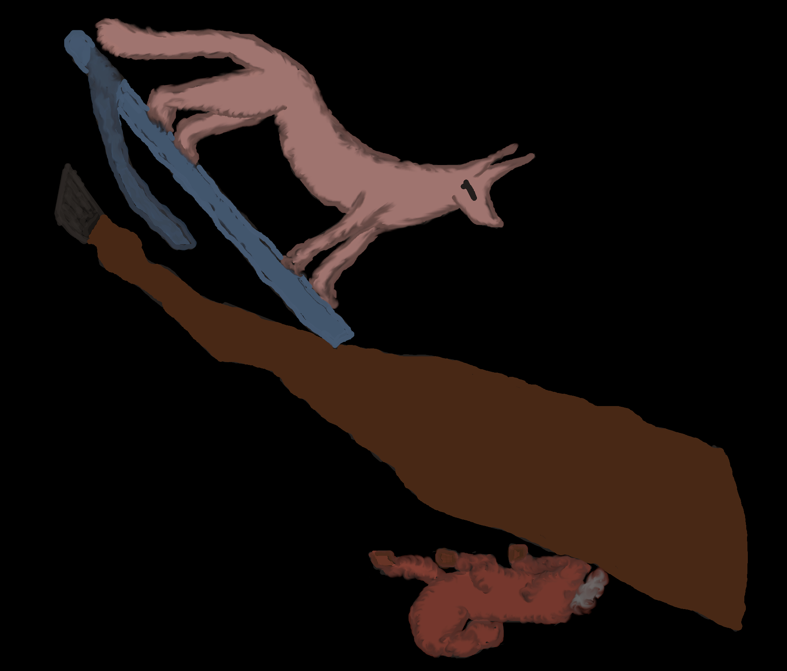

# Egyptian (Dendera)

## Introduction

The sculptured Dendera zodiac (or Denderah zodiac) is a widely known Egyptian bas-relief from the ceiling of the pronaos (or portico) of a chapel dedicated to Osiris in the Hathor temple at Dendera. This chapel was begun in the late Ptolemaic period when Egypt was ruled by (Greek) successors of Alexander the Great (hellenistic Egypt: 305-30 BCE). Its <i>pronaos</i> (a hall in front of the holy chamber) was added by the Roman emperor Tiberius (14-37 CE). This led Jean-François Champollion (18th century) to date the relief to the Greco-Roman period (while most of his contemporaries believed it to be of a millennium earlier because of the Egyptian style of the figures - this is not believed anymore). Today, French archaeologists date it to exactly 54 BCE [1].  The relief is now on display at the Musée du Louvre, Paris (France).

## Description

The temple in (today's) Egypt probably dates to the Roman (or Late Greek) time of Egypt and, thus, does not show the original Egyptian sky but a mixture of Greco-Roman, Egyptian and Babylonian figures, all drawn in an Egyptian style.

<i>Photograph for the display in Musée du Louvre (Paris), Public Domain/ CC0. The plate is 255 x 253 cm in size.</i>

### List of constellation figure

<table>
<tr valign="middle">
	<td> </td>
	<td>zodiac</td>
	<td><b>Aries</b> a ram (not the Babylonian Hired Man, not the Roman ram that jumps through a ring)</td>
</tr>
<tr valign="middle">
	<td></td>
	<td>zodiac</td>
	<td><b>Taurus</b> a bull (not the Babylonian halfed bull)</td>
</tr>
<tr valign="middle">
	<td></td>
	<td>zodiac</td>
	<td><b>Gemini</b> a couple (Shu & Tefnut), i.e. a woman and a man (neither the Babylonian warriors nor the Greek heros)</td>
</tr>
<tr valign="middle">
	<td></td>
	<td>zodiac</td>
	<td><b>Cancer</b> a crab (as usual)</td>
</tr>
<tr valign="middle">
	<td></td>
	<td>zodiac</td>
	<td><b>Leo</b> a lion (as usual) with a woman whose head is at Coma Berenices</td>
</tr>
<tr valign="middle">
	<td></td>
	<td>zodiac</td>
	<td><b>Virgo</b> a maiden, depicted like the Babylonian goddess Shala (clay tablet AO 6448 from Uruk)</td>
</tr>
<tr valign="middle">
	<td></td>
	<td>zodiac</td>
	<td><b>Libra</b> a balance (as usual)</td>
</tr>
<tr valign="middle">
	<td></td>
	<td>zodiac</td>
	<td><b>Scorpius</b> a scorpion (as usual)</td>
</tr>
<tr valign="middle">
	<td></td>
	<td>zodiac</td>
	<td><b>Sagittarius</b> this figure is an Egyptised version of the Babylonian god Pabilsang; the double-head indicates a mythical context</td>
</tr>
<tr valign="middle">
	<td></td>
	<td>zodiac</td>
	<td><b>Capricornus</b> a goat-fish (Babylonian)</td>
</tr>
<tr valign="middle">
	<td></td>
	<td>zodiac</td>
	<td><b>Aquarius</b> Egyptian god of the Nile, Hapi</td>
</tr>
<tr valign="middle">
	<td></td>
	<td>zodiac</td>
	<td><b>Pisces</b> two fish (not the Babylonian "tails of the Giant Swallow" and not "Swallow-Fish")</td>
</tr>
<tr valign="middle">
	<td></td>
	<td>north</td>
	<td><b>Ursa Major</b> the Bull's Thigh is Egyptian (also depicted on diagonal star clocks, two millennia earlier),
  the Jackal and the Sheep are at the places of the Babylonian asterisms "Fox" and "Ewe"</td>
</tr>
<tr valign="middle">
	<td></td>
	<td>south</td>
	<td><b>Lupus</b> the beast is at the place of the Babylonian "Mad Dog" (rabid dog) and the Greco-Roman Lupus</td>
</tr>
<tr valign="middle">
	<td></td>
	<td>north</td>
	<td><b>Bootes, Corona Borealis and others</b> the hippo goddess is an old Egyptian goddess who guards the celestial pole and the Bull's Thigh (constellation)</td>
</tr>
<tr valign="middle">
	<td></td>
	<td>north</td>
	<td><b>Hydra and Corvus</b> the huge snake with the bird on its tail is the new interpretation of the Babylonian constellations Snake (Mush-Dragon) and Raven</td>
</tr>
<tr valign="middle">
	<td></td>
	<td>south</td>
	<td><b>Orion</b> Osiris is a deified Egyptian king</td>
</tr>
<tr valign="middle">
	<td></td>
	<td>south</td>
	<td><b>southwesternmost part of Argo plus Columba</b> a falcon sitting on a canopy - obviously an Egyptian constellation that remains today as a star name</td>
</tr>
<tr valign="middle">
	<td></td>
	<td>south</td>
	<td><b>Canis Major</b> Sothis is the Egyptian name of a constellation around Sirius; in Babylon, there is a goddess with Bow and Arrow at this place</td>
</tr>
<tr valign="middle">
	<td></td>
	<td>south</td>
	<td><b>Canis Minor</b> as all other bright stars in the area are already decorated, this heavenly cow apparently needs to be placed on Procyon</td>
</tr>
<tr valign="middle">
	<td></td>
	<td>south</td>
	<td><b>Lepus</b> in Babylonian uranology, a rooster is placed below the Orion-constellation in the modern Lepus; this bird is apparently the Egyptian version of it</td>
</tr>
<tr valign="middle">
	<td></td>
	<td>north</td>
	<td><b>Pegasus area</b> the Babylonian constellation of The Field is a quadrilateral of bright stars. It looks like the Egyptian hieroglyph for "water" which makes sense in the neighbourhood of fish.</td>
</tr>
 <tr valign="middle">
	<td></td>
	<td>north</td>
	<td><b>Aquila area</b> this small dark bird (a duck?) apparently is located in the area of Aquila. For the time being, I put it on the bright star (Altair).</td>
</tr>
<tr valign="middle">
	<td></td>
	<td>north</td>
	<td><b>Delphinus area</b> next to this bird, there is a cadaver of an animal - interestingly at the place of the Babylonian constellation of "the Corpse"</td>
</tr>
 <tr valign="middle">
	<td></td>
	<td>north</td>
	<td><b>Cygnus / Cepheus area</b> ?</td>
</tr>
 <tr valign="middle">
	<td></td>
	<td>north</td>
	<td><b>Lyra / Ophiuchus area</b> there is a huge Egyptian figure in the area of Lyra and Ophiuchus. In Lyra was the Babylonian constellation of the goddess of medicine, while Ophiuchus is the Greek equivalent. Thus, this might possibly be the Egyptian mythological founder of medicine, Imhotep.</td>
</tr>
 <tr valign="middle">
	<td></td>
	<td>south</td>
	<td><b>Cetus area</b> ?</td>
</tr>
 <tr valign="middle">
	<td></td>
	<td>south</td>
	<td><b>Centaurus area</b> the Egyptian figure shows a landworker and at this place, there is the Babylonian god of agriculture and war (Ningirsu), so this might be a very strange depiction of the Egyptian god Min who was merged with Greek Pan in late epochs</td>
</tr>
 <tr valign="middle">
	<td></td>
	<td>south</td><td>
	<b>eastern and southern Argo area</b> the image shows a mother goddess, in Egyptian this is Isis and in Babylonian this would be Ninmakh (who is indeed positioned at this place)</td>
</tr>
 <tr valign="middle">
	<td></td>
	<td>south</td>
	<td><b>northwestern Argo area</b> the hat of this woman resembles the Egyptian goddess Anuket, the goddess of the Nile flood. In Babylonian uranology of the middle first millennium, there is the goddess Nunki at this area: due to the sound of the names, an exchange or transfer is likely.</td>
</tr>
 <tr valign="middle">
	<td></td>
	<td>north</td>
	<td><b>Auriga</b> goat is at the position of the constellation Auriga (neither in Babylonian nor in Greek tradition, there is a goat at this place. Highly likely, the Roman star name Capella (the Goat) resembles this Egyptian constellation.</td>
</tr>
 <tr valign="middle">
	<td></td>
	<td>south</td>
	<td><b>alpha Centauri area</b> the ceiling clearly depicts an Egyptian Chenti Irti figure: this little creature should be positioned in the area around/ above the bright star alpha Centauri, and there is no Greek or Babylonian equivalent. The meaning of Chenti Irti is unclear but a suggestion is "the sharp sighted one" which could make sense for a bright star that is only roughly 5° above the horizon (2nd c. BCE in Egypt)</td>
</tr>
 <tr valign="middle">
	<td></td>
	<td>north</td>
	<td><b>"above" Aries</b> the udjat eye in this context probably refers to the spring equinox</td>
</tr>
 <tr valign="middle">
	<td></td>
	<td>north</td>
	<td><b>Perseus area</b> the baboon is an attribute or representation of the Egyptian god Thoth and therefore worshipped. However, it is uncertain whether this particular baboon is connected to Thoth.</td>
</tr>
 <tr valign="middle">
	<td></td>
	<td>north</td>
	<td><b>Ursa Minor area</b> a falcon (one of the many falcon deities)</td>
</tr>
 <tr valign="middle">
	<td></td>
	<td>north</td>
	<td><b>Cassiopeia area (or Cas/And)</b> ?</td>
</tr>
</table>

### Planets

In this sky culture, some Egyptian names are attached to the planets. Honestly, each planet had many names, sometimes depending on the context (e.g. Venus as morning star and evening star). We cannot include all names in the Stellarium name but they are stored in other database. On the Dendera ceiling, the planets are represented at fixed positions and as deities.

The planets are depicted as deities in their "standard position". As planets move, they can only be presented in the sky by defining fixed positions where the figurative representation is found in every celestial map, every star list and catalogue.

These standard positions:
 <table class="layout">
  <tr><td>Sun</td> <td>Aries</td></tr>
  <tr><td>Moon</td> <td>Taurus</td></tr>
  <tr><td>Venus</td> <td>Pisces</td></tr>
  <tr><td>Jupiter</td> <td>Cancer (or betw. Cnc and Leo)</td></tr>
  <tr><td>Mercury</td> <td>Virgo</td></tr>
  <tr><td>Mars</td> <td>Capricornus</td></tr>
  <tr><td>Saturn</td> <td>Libra</td></tr>
 </table>
These positions are equal to the "secret places" in Babylonian astrology and the "hypsomata" (exaltation points) in Greek astrology.

Additionally, the equinoxes are marked with great disks: One in Libra and one Aries.

## Constellations

### Zodiac

The zodiac came to Greece from Babylonian sources. It is unknown whether or not the Egyptians had similar figures: The origin of the zodiac is the path of the Moon and was, thus, important for the Egyptian calendar, too. However, the zodiac depicted in Dendera is definitely the Greek (partially misunderstood) interpretation of the Babylonian one.

The Zodiac is the Babylonian one with the semi-exception of Pisces: Pisces are depicted as two fish which is never found in Babylon and only an analogon is known in Late Babylonian epoch in the city of Uruk. In Uruk, the constellation  was changed to the constellation of the Swallow-Fish connecting a swallow and a fish. In contrast, in Babylon it has always been "The Tails of the Giant Swallow" (Steele 2018).

 The other constellations of the zodiac are the Babylonian versions, partially egyptized. Virgo is depicted as the Babylonian Goddess Shala with the Ear of Grain, Capricornus as a Goat-Fish accompanying the Babylonian god of witchcraft (Aquarius), Sagittarius as the Babylonian god Pabilsang. Scorpion, Aries and Cancer leave rather no room for interpretation. Leo is depicted as a usual lion but carries the Egyptian queen Berenice (whose name was given to the constellation Coma Berenices) at his tail. Gemini are not depicted as Twins but as a couple, the Bull is not halved.

### Outside the Zodiac

The rest of the sky  also shows a mixture of several cultures: The hippo goddess who guards the Ox Thigh is a clearly Egyptian constellation. Interestingly, there is a desert fox and a sheep next to the ox thigh which refers to same positions in the sky as the Babylonian constellations of the Fox and the Ewe.

In contrast to these native Egyptian constellations, there are also native Sumerian ones that are depicted in an Egyptized way: This is marked in the "Translation" of the Stellarium labels.

Interestingly, this depiction explains several Greek names of single stars: e.g. at the position of Capella, there is a whitish Goat in the Dendera ceiling, and at the position of the star Canopus whose name is already attested in Ptolemy's Almagest, there is a Horus-falcon on a canopy jar. It suggests that these were originally Egyptian images that have been transformed to star names in a later epoch in order to commemorate the outdated constellations.

### Source(s)

This <em>sky culture</em> is a mapping of historical figures onto the stars. The figures are directly copied by hand from the digital photographs that are provided by the Louvre and the <a href="https://en.wikipedia.org/wiki/File:Zodiaque_de_Denderah_aux_couleurs_d'origine.jpg">colours follow roughly the reconstruction by Alexandre N.Isis  (wikicommons, 2013)</a>.

### Fair Use

This sky culture originates from research. We provide this for free but the authors of contributions certainly deserve to be cited according to the common rules. Thank you!

## References

 - [#1]: [Photographs of the Louvre Collection](https://collections.louvre.fr/en/ark:/53355/cl010028871#)
 - [#2]: Aubourg, E. (1995), ‘La date de conception du zodiaque du temple d’Hathor à Dendera’, Bulletin de l’Institut Français d’Archéologie Orientale 95, 1–10
 - [#3]: Biot, J.-B. (1846), ‘Mémoire sur le zodiaque circulaire de denderah.’, Mémoires de l’Institutnational de France16(2ème partie), 1–101
 - [#4]: Hoffmann, Susanne M. (2017), Hipparchs Himmelsglobus, Springer, Wiesbaden/ New York, Chapter 4.2.2
 - [#5]: Hoffmann, Susanne M. (2022), Preliminary Observations on the Dendera Zodiac (Egypt), in: Hoffmann and Wolfschmidt (ed.), Astronomy in Culture - Cultures of Astronomy, Nuncius Hamburgensis, Vol. 57, tredition, Hamburg
 - [#6]: Steele, John M. (2018), The development of the Babylonian zodiac: Some preliminary observations.’, Mediterranean Archaeology and Archaeometry, 18, 4, 97-105
 - [#7]: [wikipedia (some things wrong)](https://en.wikipedia.org/wiki/Dendera_zodiac)

## Authors

This Greco-Egyptian sky culture was painted and added to Stellarium by:

<em>Susanne M. Hoffmann:   service@uhura-uraniae.com </em>

Written in English: <em>SMH</em>

## License

CC BY-ND 4.0
