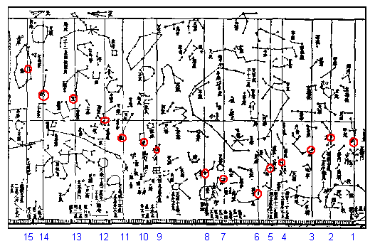

# Japanese Yasui Map

## Introduction

Most astronomical observation in the Japan until the Meiji Restoration was closely tied to astrological purposes. For ancient Chinese and later Korean and Japanese cartographers four seasons and four cardinal directions is marked as four talismanic animals - the Azure Dragon of the East (Spring), the Red Bird of the South (Summer), the White Tiger of the West (Fall), and the "Genbu" (Black Tortoise) of the North (Winter). Corresponding to each of the talismanic animals the celestial "palaces" were seven *sei shuku* or what are sometimes called "lunar lodges". The moon "stations" or "lodges" probably may be used to determine position of sun and planets as well as the moon, and their number may or may not have been related to the period of the moon's orbit. Origins of these associations are obscure and even controversial.

## Description

Determination of the talismanic animals and associated star "palaces" together with the associated 28 *sei shuku* or lunar lodges represent some of the most complex aspects of Asian "astronomy". An apparent anomaly is the fact that the actual positional path of the sun seems to move in a direction opposite the seasonal associations of Spring and Fall. Some scientists argues that this is due to the animals and sei shuku being created some 17 to 18 millennia ago (precession creating the anomaly), but it does not really explain the apparent "backward" motion of the sun through seasons.

According to some scientists, the talismanic animals with their associated sei shuku were probably used in conjunction with the direction to which the handle of the big dipper (often called the "North Seven Stars" in China, Korea, and Japan) pointed at the equinoxes and solstices. Before the Christian Era, when the sei shuku were created, the big dipper did not appear to set, because they had a relatively "higher" position than now.

Like myths and traditions in Western cultures, these views still wield influence in the daily life of people in China, Korea, and Japan (this despite quite prominent scientific literacy). However, it should be pointed out that astrological divination in China, Korea and Japan was and is rather complex.

The lore related to moon stations is one of the most interesting aspects of Asian Ethnoastronomy. Japanese interpretations of these associations tended to revolve around agricultural needs and animistic views of nature. Unlike many Western myths and traditions, japanese gods in the similitude of the talismanic animals can be seen as manifestations of nature.

Below is an example of a star chart from Edo Era Japan.

*Close-Up of Yasui's Map Showing the First 15 Moon Stations*

### The Azure Dragon of the East (Spring)

The 7 Moon Stations of the "East" or "Blue Dragon".

|<notr>#</notr>|Chinese Character|Meaning|Key Star|Japanese Name|
|-----------------------------------------------------------------------------|-----------------|-------|--------|-------------|
|<notr>1</notr>||Horn(s), perhaps Angle, Corner|<notr>&alpha; Vir</notr>|<notr>SuBoshi</notr>|
|<notr>2</notr>||Neck, Throat|<notr>&kappa; Vir</notr>|<notr>AmiBoshi</notr>|
|<notr>3</notr>||Root, perhaps Shoulder or Base|<notr>&iota; Lib; </notr>sometimes<notr> &alpha; Lib</notr>|<notr>TomoBoshi</notr>|
|<notr>4</notr>||Chamber, perhaps Breasts|<notr>&delta; Sco; </notr>sometimes<notr> &pi; Sco</notr>|<notr>SoiBoshi</notr>|
|<notr>5</notr>||Heart|<notr>&sigma; Sco</notr>|<notr>NakagoBoshi</notr>|
|<notr>6</notr>||Tail|<notr>&mu; Sco</notr>|<notr>AshitareBoshi</notr>|
|<notr>7</notr>||Basket|<notr>&gamma; Sgr; </notr>sometimes<notr> &eta; Sgr</notr>|<notr>MiBoshi</notr>|

### The "Genbu" (Black Tortoise) of the North (Winter)

The 7 Moon Stations of the "North" (Genbu) or "Black Tortoise of Winter" (also "Somber" or "Black" Warrior).

|<notr>#</notr>|Chinese Character|Meaning|Key Star|Japanese Name|
|-----------------------------------------------------------------------------|-----------------|-------|--------|-------------|
|<notr>8</notr>||Dipper; Measure|<notr>&phi; Sgr</notr>|<notr>HikitsuBoshi</notr>|
|<notr>9</notr>||Cow|<notr>&beta; Cap</notr>|<notr>InamiBoshi</notr>|
|<notr>10</notr>||Woman; perhaps Waiting Maid|<notr>&epsilon; Aqr</notr>|<notr>UrukiBoshi</notr>|
|<notr>11</notr>||Emptiness|<notr>&beta; Aqr</notr>|<notr>TomiteBoshi</notr>|
|<notr>12</notr>||Roof Top, perhaps Danger, Steep|<notr>&alpha; Aqr</notr>|<notr>UmiyameBoshi</notr>|
|<notr>13</notr>||Room, perhaps Encampment|<notr>&alpha; Peg</notr>|<notr>HatsuiBoshi</notr>|
|<notr>14</notr>||Wall|<notr>&gamma; Peg</notr>|<notr>NamameBoshi</notr>|

### The White Tiger of the West (Fall)

The 7 Moon Stations of the "West" or "White Tiger".

|<notr>#</notr>|Chinese Character|Meaning|Key Star|Japanese Name|
|-----------------------------------------------------------------------------|-----------------|-------|--------|-------------|
|<notr>15</notr>||Stride, Foot|<notr>&delta; And</notr>|<notr>TokakiBoshi</notr>|
|<notr>16</notr>||Hill, Lasso; perhaps Bellows|<notr>&beta; Ari</notr>|<notr>TataraBoshi</notr>|
|<notr>17</notr>||Stomach|<notr>35 Ari</notr>|<notr>EkieBoshi</notr>|
|<notr>18</notr>||Stopping Place, United; perhaps "Getting Together"|<notr>17 Tau; </notr>sometimes<notr> 16 Tau</notr>|<notr>SubaruBoshi</notr>|
|<notr>19</notr>||Net; perhaps related to Rain|<notr>&epsilon; Tau</notr>|<notr>AmefuriBoshi</notr>|
|<notr>20</notr>||Turtle Snout, perhaps Tuft on Owl's Head|   |<notr>TorokiBoshi</notr>|
|<notr>21</notr>||Investigator, Three|<notr>&delta; Ori; </notr>sometimes<notr> &beta; Ori</notr>|<notr>KagasukiBoshi</notr>|

### The Red Bird of the South (Summer)

The 7 Moon Stations of the "South" or "Red Bird".

|<notr>#</notr>|Chinese Character|Meaning|Key Star|Japanese Name|
|-----------------------------------------------------------------------------|-----------------|-------|--------|-------------|
|<notr>22</notr>||Well|<notr>&mu; Gem</notr>|<notr>ChichiriBoshi</notr>|
|<notr>23</notr>||Ogre, Devil, perhaps Ghost|<notr>&delta; Cnc; </notr>sometimes<notr> &theta; Cnc</notr>|<notr>TamahomeBoshi</notr>|
|<notr>24</notr>||Willow|<notr>&delta; Hya</notr>|<notr>NurikoBoshi</notr>|
|<notr>25</notr>||Stars|<notr>&alpha; Hya</notr>|<notr>HotohoriBoshi</notr>|
|<notr>26</notr>||Stretched Net|<notr>&nu; Hya</notr>|<notr>ChirikoBoshi</notr>|
|<notr>27</notr>||Wings|<notr>&alpha; Crt</notr>|<notr>TasukiBoshi</notr>|
|<notr>28</notr>||Chariot Cross-Board, perhaps strings of Koto|<notr>&gamma; Crv</notr>|<notr>MitsukakeBoshi</notr>|

## References

 - [#1]: <notr>[A Cultural History of Astronomy in Japan](http://www.academia.edu/5293593/A_Cultural_History_of_Astronomy_in_Japan)</notr> by Steve Renshaw

## Authors

Alexander Wolf

## License

CC BY-SA 4.0
