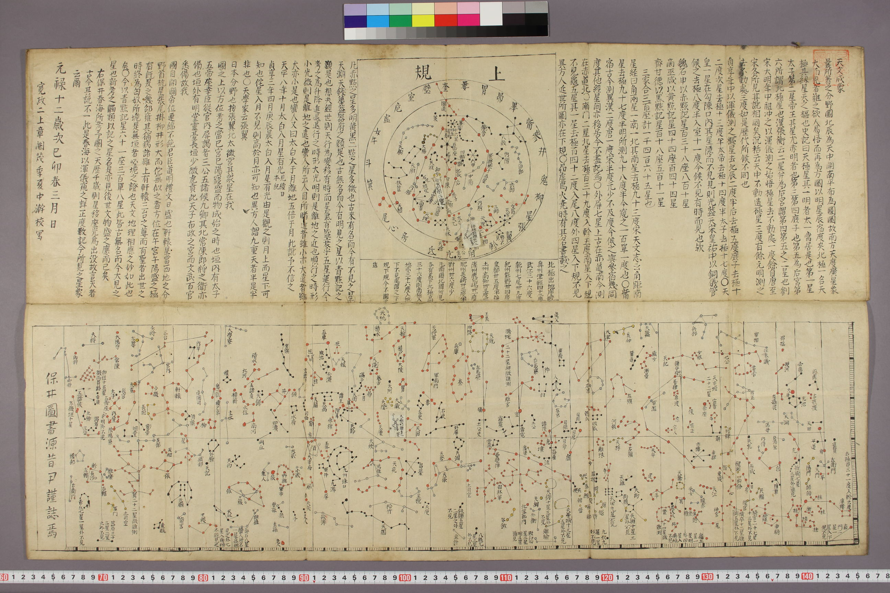
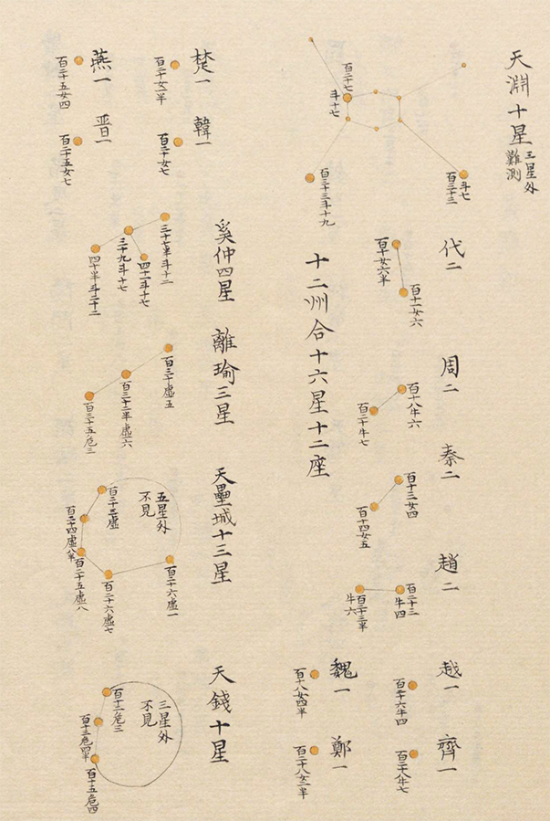
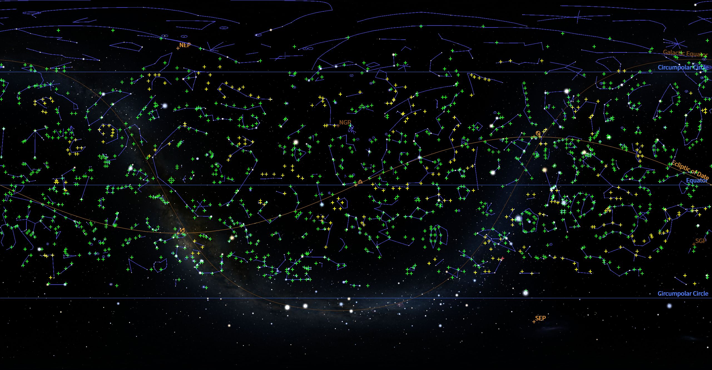

# Japanese Yasui Map

## Introduction

Most astronomical observation in the Japan until the Meiji Restoration was closely tied to astrological purposes. For ancient Chinese and later Korean and Japanese cartographers four seasons and four cardinal directions is marked as four talismanic animals - the Azure Dragon of the East (Spring), the Red Bird of the South (Summer), the White Tiger of the West (Fall), and the "Genbu" (Black Tortoise) of the North (Winter). Corresponding to each of the talismanic animals the celestial "palaces" were seven *sei shuku* or what are sometimes called "lunar lodges". The moon "stations" or "lodges" probably may be used to determine position of sun and planets as well as the moon, and their number may or may not have been related to the period of the moon's orbit. Origins of these associations are obscure and even controversial.

## Description

Determination of the talismanic animals and associated star "palaces" together with the associated 28 *sei shuku* or lunar lodges represent some of the most complex aspects of Asian "astronomy". An apparent anomaly is the fact that the actual positional path of the sun seems to move in a direction opposite the seasonal associations of Spring and Fall. Some scientists argues that this is due to the animals and sei shuku being created some 17 to 18 millennia ago (precession creating the anomaly), but it does not really explain the apparent "backward" motion of the sun through seasons.

According to some scientists, the talismanic animals with their associated sei shuku were probably used in conjunction with the direction to which the handle of the big dipper (often called the "North Seven Stars" in China, Korea, and Japan) pointed at the equinoxes and solstices. Before the Christian Era, when the sei shuku were created, the big dipper did not appear to set, because they had a relatively "higher" position than now.

Like myths and traditions in Western cultures, these views still wield influence in the daily life of people in China, Korea, and Japan (this despite quite prominent scientific literacy). However, it should be pointed out that astrological divination in China, Korea and Japan was and is rather complex.

The lore related to moon stations is one of the most interesting aspects of Asian Ethnoastronomy. Japanese interpretations of these associations tended to revolve around agricultural needs and animistic views of nature. Unlike many Western myths and traditions, japanese gods in the similitude of the talismanic animals can be seen as manifestations of nature.

Below is an example of a star chart from Edo Era Japan.

 

*Close-Up of Yasui's Tenmon Seishō Map*

### The Azure Dragon of the East (Spring)

The 7 Moon Stations of the "East" or "Blue Dragon".

|<notr>#</notr>|Chinese Character|Meaning|Key Star|Japanese Name|
|-----------------------------------------------------------------------------|-----------------|-------|--------|-------------|
|<notr>1</notr>||Horn(s), perhaps Angle, Corner|<notr>&alpha; Vir</notr>|<notr>SuBoshi</notr>|
|<notr>2</notr>||Neck, Throat|<notr>&kappa; Vir</notr>|<notr>AmiBoshi</notr>|
|<notr>3</notr>||Root, perhaps Shoulder or Base|<notr>&iota; Lib; </notr>sometimes<notr> &alpha; Lib</notr>|<notr>TomoBoshi</notr>|
|<notr>4</notr>||Chamber, perhaps Breasts|<notr>&delta; Sco; </notr>sometimes<notr> &pi; Sco</notr>|<notr>SoiBoshi</notr>|
|<notr>5</notr>||Heart|<notr>&sigma; Sco</notr>|<notr>NakagoBoshi</notr>|
|<notr>6</notr>||Tail|<notr>&mu; Sco</notr>|<notr>AshitareBoshi</notr>|
|<notr>7</notr>||Basket|<notr>&gamma; Sgr; </notr>sometimes<notr> &eta; Sgr</notr>|<notr>MiBoshi</notr>|

### The "Genbu" (Black Tortoise) of the North (Winter)

The 7 Moon Stations of the "North" (Genbu) or "Black Tortoise of Winter" (also "Somber" or "Black" Warrior).

|<notr>#</notr>|Chinese Character|Meaning|Key Star|Japanese Name|
|-----------------------------------------------------------------------------|-----------------|-------|--------|-------------|
|<notr>8</notr>||Dipper; Measure|<notr>&phi; Sgr</notr>|<notr>HikitsuBoshi</notr>|
|<notr>9</notr>||Cow|<notr>&beta; Cap</notr>|<notr>InamiBoshi</notr>|
|<notr>10</notr>||Woman; perhaps Waiting Maid|<notr>&epsilon; Aqr</notr>|<notr>UrukiBoshi</notr>|
|<notr>11</notr>||Emptiness|<notr>&beta; Aqr</notr>|<notr>TomiteBoshi</notr>|
|<notr>12</notr>||Roof Top, perhaps Danger, Steep|<notr>&alpha; Aqr</notr>|<notr>UmiyameBoshi</notr>|
|<notr>13</notr>||Room, perhaps Encampment|<notr>&alpha; Peg</notr>|<notr>HatsuiBoshi</notr>|
|<notr>14</notr>||Wall|<notr>&gamma; Peg</notr>|<notr>NamameBoshi</notr>|

### The White Tiger of the West (Fall)

The 7 Moon Stations of the "West" or "White Tiger".

|<notr>#</notr>|Chinese Character|Meaning|Key Star|Japanese Name|
|-----------------------------------------------------------------------------|-----------------|-------|--------|-------------|
|<notr>15</notr>||Stride, Foot|<notr>&delta; And</notr>|<notr>TokakiBoshi</notr>|
|<notr>16</notr>||Hill, Lasso; perhaps Bellows|<notr>&beta; Ari</notr>|<notr>TataraBoshi</notr>|
|<notr>17</notr>||Stomach|<notr>35 Ari</notr>|<notr>EkieBoshi</notr>|
|<notr>18</notr>||Stopping Place, United; perhaps "Getting Together"|<notr>17 Tau; </notr>sometimes<notr> 16 Tau</notr>|<notr>SubaruBoshi</notr>|
|<notr>19</notr>||Net; perhaps related to Rain|<notr>&epsilon; Tau</notr>|<notr>AmefuriBoshi</notr>|
|<notr>20</notr>||Turtle Snout, perhaps Tuft on Owl's Head|   |<notr>TorokiBoshi</notr>|
|<notr>21</notr>||Investigator, Three|<notr>&delta; Ori; </notr>sometimes<notr> &beta; Ori</notr>|<notr>KagasukiBoshi</notr>|

### The Red Bird of the South (Summer)

The 7 Moon Stations of the "South" or "Red Bird".

|<notr>#</notr>|Chinese Character|Meaning|Key Star|Japanese Name|
|-----------------------------------------------------------------------------|-----------------|-------|--------|-------------|
|<notr>22</notr>||Well|<notr>&mu; Gem</notr>|<notr>ChichiriBoshi</notr>|
|<notr>23</notr>||Ogre, Devil, perhaps Ghost|<notr>&delta; Cnc; </notr>sometimes<notr> &theta; Cnc</notr>|<notr>TamahomeBoshi</notr>|
|<notr>24</notr>||Willow|<notr>&delta; Hya</notr>|<notr>NurikoBoshi</notr>|
|<notr>25</notr>||Stars|<notr>&alpha; Hya</notr>|<notr>HotohoriBoshi</notr>|
|<notr>26</notr>||Stretched Net|<notr>&nu; Hya</notr>|<notr>ChirikoBoshi</notr>|
|<notr>27</notr>||Wings|<notr>&alpha; Crt</notr>|<notr>TasukiBoshi</notr>|
|<notr>28</notr>||Chariot Cross-Board, perhaps strings of Koto|<notr>&gamma; Crv</notr>|<notr>MitsukakeBoshi</notr>|

### Shibukawa Harumi (Yasui Sanpaku / Yasui Sanpaku) and the Tenmon Seishō Star Map

Shibukawa Harumi (渋川 春海, 1639-1715) was an astronomer of the early Edo period in Japan, the first astronomical official (Tenmongata) of the Tokugawa shogunate, and the creator of Jōkyō Calendar, the first independent calendar of Japan. His name changed several times during his life: born into the Yasui family of professional Go players, he was first named Yasui Sanpaku (II), later took the surname Yasui to become Yasui Sanpaku, and finally changed his surname to Shibukawa in his later years with the art name Harumi.

In his early years, Harumi followed the family tradition of studying Go, but in his middle age he devoted himself entirely to astronomy and calendrical science. In 1684, he was ordered to compile a new calendar. He thoroughly studied Guo Shoujing's Shoushi Calendar of China's Yuan Dynasty, and combining it with his own observational data, he completed the Jōkyō Calendar in 1685, which replaced the Chinese Xuanming Calendar that had been used in Japan for more than 800 years. This marked the beginning of an independent Japanese calendar. In the same year, he was appointed the first Tenmongata (shogunate astronomer).

Shibukawa Harumi deeply understood that the accuracy of a calendar relies on reliable star charts and stellar coordinates. Over several decades before and after the compilation of the calendar, he extensively collected Chinese star charts from various dynasties and produced several highly influential star maps. His early works, such as *Tenshō Retsuji no Zu* (天象列次之図, 1670) and *Tenmon Bunya no Zu* (天文分野之図, 1677), primarily referenced the Chinese star chart *Cheonsang Yeolcha Bunyajido* (천상열차분야지도, 天象列次分野之圖, 1395) engraved in Korea. He did not simply copy them, however. Referring to works like Huang Ding's *Tianwen Dacheng Guankui Jiyao* (天文大成管窥辑要, 1645), he systematically corrected the charts, including identifying errors in the determinative stars of the Twenty-Eight Mansions, adjusting the shapes of constellations such as "Bow and Arrow" and "Xuanyuan", and relocating bright stars like "Wolf" (α CMa) and "Old Man" (α Car).

The most critical turning point in Harumi's star-chart production came when he obtained a copy of the Yuan-Dynasty Chinese star catalog (i.e., the *Sanyuan Lieshe Ruxiu Quji Ji*, also known as the *Tianwen Huichao* star catalog) in the 1690s. According to the research of Takesako Shinobu, the stellar data that Harumi used in his late star charts show almost perfect agreement with the coordinates of the Yuan catalog after precession correction. In Tenmon Kyūtō (天文瓊統, 1698), the coordinates of more than 600 successfully identified Chinese stars are consistent with those of the Yuan catalog. The fundamental reason he so heavily relied on this catalog was its high accuracy: the Yuan catalog used a graduation of 0.1 degree, with an error of only about 0.1 degree, far surpassing any material Harumi had previously encountered.

  

*Left image: Tianwen Huichao star chart and catalogue (China)*

*Right image: Harumi's Tenmon Kyuto star chart and catalogue*

Harumi adopted the most unique presentational format of the Yuan-Dynasty Chinese star catalog: in both Tenmon Kyūtō (1698) and Tenmon Seishō (天文成相, 1699), he used a "chart-plus-table" format — within each constellation diagram stars were drawn, and for most of these stars the values of *ruxiu du* (lunar-mansion longitude) and *quji du* (polar distance) were directly annotated beneath them. This format is unparalleled in ancient Chinese star catalogs, and it is even more unique in the history of Japanese astronomy. Moreover, beyond the traditional Chinese system of 283 constellations (Xingguan), he created 61 original Japanese constellations, totalling 308 stars, whose names were often based on the Japanese government office system of the Edo period. This demonstrates his originality in merging the Chinese astronomical tradition with indigenous Japanese observation.

Shibukawa Harumi also constructed the earliest celestial globe in Japan; one of them was dedicated to Ise Jingū in 1690 and remains an important cultural heritage asset today.

 

*The positions of coordinates in the Tianwen Huichao star catalog (Completed in the late Yuan Dynasty in China, 14th century). The green crosses represent the data from the original source, while the other colors represent the results of scholars' corrections to the coordinates.*

 

*The positions of coordinates in Harumi's Tenmon Kyūtō star catalog. The green crosses represent Chinese constellations, and the yellow crosses represent the 61 new Japanese constellations added by Yasui.*

## Constellations

##### Ministry of Central Affairs

This ministry was the highest administrative body in the ancient Japanese government, responsible for the Imperial family's affairs and the administration of the court.

##### Ministry of Ceremonies

Responsible for the management of the court rank system, personnel records, and the oversight of rites and ceremonies held within the imperial palace.

##### Ministry of Civil Administration

In charge of the administration of court rituals, the management of temples and shrines, and the oversight of the Buddhist clergy.

##### Ministry of Popular Affairs

Managed the census, taxes, civil engineering projects, and the general welfare of the common populace under the Ritsuryō system.

##### Ministry of Military Affairs

Overseeing the defense and military structure of the nation, including the mobilization of soldiers and the management of military records.

##### Ministry of Justice

Responsible for the administration of laws, the conduct of trials, and the maintenance of order and security within the capital.

##### Ministry of Finance

Managed the national treasury, including taxation, currency, and the distribution of salaries to government officials.

##### Ministry of the Imperial Household

Dedicated to the management of the private affairs of the Imperial family, including the maintenance of the palace grounds and services for the Emperor.

##### Tutor to the Crown Prince

Representing the figures responsible for the education, guidance, and character development of the next Emperor.

##### Lady of the Bedchamber

A high-ranking lady in waiting who served the Emperor within the Inner Palace and held significant political influence.

##### Palace Table Office

Responsible for the preparation and management of food and banquet services for the court and official functions.

##### Inner Palace Table Office

Focusing specifically on the preparation of meals served directly to the Emperor and the Empress within the private residential quarters.

##### Department of Divinities

A government agency that operated outside the standard civil ministries, dedicated to the administration of Shinto rites and ancestral worship.

##### Celestial Sail

Symbolizing the movement and navigation of heavenly bodies across the sky, often associated with the imperial transition.

##### Major Captain

Refers to a high-ranking military officer who commanded the Imperial Guards and held significant influence in the imperial court.

##### Middle Captain

A mid-level military official in the Imperial Guard divisions, serving as a vital link in the command structure of the capital.

##### Minor Captain

A junior officer rank in the Imperial Guard, often held by young nobles as a stepping stone in their political careers.

##### Bureau of Onmyō

The government department responsible for divination, astronomy, calendar-making, and protection against spiritual misfortunes.

##### Councilor

Represents high-ranking advisors who participated in the Council of State to assist the Emperor in national policy.

##### Pacification Command Headquarters

Historically referred to regional military commands tasked with the pacification and administration of frontier areas.

##### Director of Market

An official in charge of regulating commerce, market prices, and the standard of goods within the capital's designated market areas.

##### Military Inspector

An official designated to oversee military readiness and report on the discipline and status of provincial troops.

##### Left Division of Outer Palace Guards

The guard division responsible for the security of the palace, specifically the areas on the left side of the Imperial precinct.

##### Celestial Lake

A symbolic heavenly body representing a reservoir or source of water in the sky, vital for the cultivation of the realm.

##### Imperial Bath Matron

A high-ranking attendant responsible for the ritual purification and bathing of the infant imperial family members.

##### Imperial Bath Attendant

The staff responsible for the physical preparation and assistance during the ritual bathing procedures for the court.

##### Mistress of Staff

A female official who acted as a messenger and intermediary between the Emperor and the court, holding significant administrative authority.

##### Court Lady

Lower-ranking women in the service of the palace, performing tasks ranging from cleaning to assisting noblewomen.

##### Trout

Named after the river fish, this constellation likely reflects the cultural importance of the imperial food supply and seasonal tributes.

##### Celestial Silkworm

Representing the origins of sericulture, a vital industry in ancient Japan that produced the silk worn by the nobility.

##### Right Capital

Refers to the western division of the ancient capital (Heian-kyō), an area centered on administration and housing.

##### Left Capital

Refers to the eastern division of the ancient capital, which was historically the more prestigious and developed side of the city.

##### Office of Imperial Tombs

Responsible for the maintenance, protection, and ritual care of the tombs of past Emperors and noble families.

##### Right Division of Bureau of Horses

A government office that managed the imperial stables and horses specifically assigned to the western division.

##### Outer Palace Guard

A general term for the military units responsible for maintaining security around the outer boundaries of the imperial palace.

##### Left Division of Bureau of Horses

A government office responsible for the management and care of the horses in the eastern division of the imperial palace.

##### Bureau of Accounting

An office that audited and managed the state budgets, expenditures, and the overall balance of government finances.

##### Bureau of Military Stores

An office responsible for the storage, maintenance, and distribution of military weapons, armor, and equipment.

##### Celestial Rice Bale

A symbol of prosperity and the agrarian basis of the nation, representing the collection of rice as tax.

##### Bureau of Taxation

Managed the collection of agricultural taxes and handled the administration of national revenue.

##### Bureau of Palace Storehouses

Responsible for the management of the palace's dry goods, grains, and other essential supplies required for court life.

##### Pine and Bamboo

Plants often used as symbols of longevity and constancy, reflecting the desired stability of the Imperial court.

##### Wild Geese

A migratory bird constellation reflecting the changing seasons and the traditional observations of nature by the court.

##### Miscanthus × Giganteus

A tall grass native to Japan, symbolizing the autumnal landscape and the natural beauty favored by the nobility.

##### Celestial Shaft

Represents the structural axle or support, potentially symbolizing the central governance of the state.

##### Dazaifu

The administrative center for the Kyushu region, which served as a crucial site for diplomacy with foreign lands.

##### Senior Assistant

A high-ranking administrative post within the Dazaifu, responsible for regional policy and border defense.

##### Junior Assistant

A subordinate official in the Dazaifu administration who assisted the senior leadership in governing the region.

##### Bureau of Foreign Affairs and Buddhism

Handled diplomatic relations with foreign envoys and supervised the affairs of Buddhist temples.

##### Great-grandson

A symbolic constellation representing the lineage of the Imperial family and the importance of succession.

##### Great-great-grandson

Representing the extended genealogy and the continuity of the imperial bloodline over multiple generations.

##### Open Quiver

A traditional military accessory used for carrying arrows, symbolizing the readiness and defensive posture of the state.

##### Closed Quiver

A protected case for arrows, representing the disciplined storage and control of military armaments.

##### Hayato (Southern Barbarian Guard)

Refers to warriors from southern Japan who were famous for their specialized skills and service in the Imperial palace.

##### Bureau of Higher Education

The imperial university dedicated to training the sons of the aristocracy in Confucian classics and governance.

##### Bureau of Water Supply

Responsible for the management and purification of the water supply used for the Emperor’s consumption and daily needs.

##### Bureau of Textiles

An office in charge of the production and weaving of high-quality fabrics and garments for court officials.

##### Bureau of Sake Brewing

Managed the production of sake, which was essential for religious ceremonies and official court banquets.

##### Saiku (The Palace of the Saio)

The official residence of the Saio, an Imperial princess who served as a high priestess at the Ise Grand Shrine.

##### Bureau of Court Music

Responsible for the performance, training, and preservation of court music and dance, including Gagaku.

##### Right Division of Outer Palace Guards

The guard division tasked with the security of the right side of the imperial palace and its residential quarters.

## References

 - [#1]: <notr>[A Cultural History of Astronomy in Japan](http://www.academia.edu/5293593/A_Cultural_History_of_Astronomy_in_Japan)</notr> by Steve Renshaw
 - [#2]: Study of the Star Charts made by Harumi Shibukawa (<notr>[PDF](http://www.kotenmon.com/dld/20250621/%E6%B8%8B%E5%B7%9D%E6%98%A5%E6%B5%B7%E3%81%AE%E6%98%9F%E5%9B%B3_20250621F.pdf)</notr>|<notr>[Youtube](https://youtu.be/fnyyRLhAZzM)</notr>) by Takesako Shinobu
 - [#3]: <notr>[Harumi Shibukawa's Tenmon Kyūtō Star Catalog (Japanese)](https://www.kotenmon.com/star/catalog/harumi.html)</notr>
 - [#4]: <notr>[Identification of Chinese Constellations Using Medieval Star Charts, Star Catalogs, and Xingfan (Star Encroachment) Records (Japanese)](https://www.kotenmon.com/str/china/china.html)</notr>

## Authors

This sky culture was initially contributed by Alexander Wolf.

Lyu Haocheng [lvhc2016@126.com](mailto:lvhc2016@126.com) replenishes more than 300 constellations, and add the description.

## License

CC BY-SA 4.0
