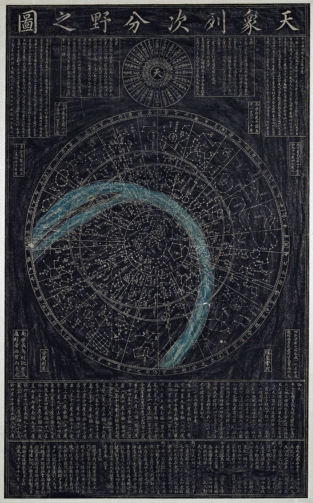

# Korean

## Introduction

The *Cheonsang Yeolcha Bunyajido* (天象列次分野之圖, "Chart of Constellations, Each Star Division, and Their Field Allocations") is one of the oldest and most representative ancient star maps existing in Korea. It was first carved on stone in 1396 AD (the 3rd year of King Taejo of the Joseon Dynasty), but its original source can be traced back to the Unified Silla and Goryeo period, and even directly to Chinese star charts from the Tang Dynasty (or earlier). Today, it serves not only as an important physical artifact for studying East Asian ancient astronomy, but also as a testament to the long-term exchange and integration among East Asian countries in the fields of astronomy, calendrics, and astrology.

## Description

*Rubbing of the Second Carving of the Cheonsang Yeolcha Bunyajido*

The Chinese, Korean, and Japanese constellations have the same origin and look very similar in shape. The names of the constellations first appeared in the Records of the Grand Historian (史記) of the Western Han dynasty, which recorded more than 100 constellations before 100 BC. In the 3rd century AD, the constellations were standardized, eventually establishing 283 constellations with 1464 stars. During the Sui and Tang dynasties (7th-8th c. AD), Chinese astronomical works spread to Korea and Japan. Representative works from this period include the Dunhuang Star Map from China, the *Cheonsang Yeolcha Bunyajido* from Korea, and the Moon's path chart (格子月進図) from Japan. After the Tang dynasty, the star patterns of the three countries began to develop independently, and the *Cheonsang Yeolcha Bunyajido* became the representative star map of Korean constellations.

### Historical Background

According to the postscript at the bottom of the stone tablet, there was originally an astronomical map stone in Pyongyang, which sank into the Taedong River during a war, and its rubbings were gradually lost. Shortly after King Taejo (이성계, 李成桂) ascended the throne, someone presented a rubbing. The king regarded it as a great treasure and ordered the Office of Astronomical Observation (書雲觀) to re-carve a stone based on this rubbing. The office noted that the star positions had shifted due to precession and recommended re-measuring the meridian transit stars at dawn and dusk for different seasons to produce a new map. After the king's approval, the office submitted a new treatise *Jungseonggi* (中星記) in mid-1395, and then a new star map was carved on stone using the old chart and the newly measured stars. The inscription is dated "December of the 28th year of the Hongwu era", i.e., January 1396.

This stone tablet has star maps and inscriptions on both sides, identical in content but upside down relative to each other. Side A has the star map at the top and the title/inscription below, shifted to one side and misaligned vertically. Side B has a typical layout (title, star map, inscription), but the figures and text are almost completely worn away. Various guesses exist about the reason for double-sided carving: scarcity of large stone, a re-carving during King Sejong or Sejo's reign, or even that Side A is a draft.

By the reign of King Sukjong (1674-1720), the original stone was badly worn (another account says it was buried in ruins after the Japanese invasion of 1592-1598). In 1687 (13th year of Sukjong), a new stone was re-carved from rubbings and placed under a small shelter at the Royal Observatory outside Changdeokgung. The original is called "First Carving", and the new one "Second Carving". In 1770 (46th year of King Yeongjo), the First Carving was found at Gyeongbokgung; Yeongjo ordered it moved to the Royal Observatory to be kept together with the Second Carving, and named the storage place "Geungyeongak", inscribing the plaque with his own handwriting.

After the fall of the Joseon Dynasty in 1910, Geungyeongak was destroyed, and both stones were left under the eaves of Myeongjeongjeon in Changgyeongwon (later renamed Changgyeongwon). In 1936, the American missionary W. C. Rufus praised the map in his book *Astronomy in Korea* as "a detailed and accurate astronomical chart that is a compilation of Asian planetariums", bringing the stones to world attention. After wars and turbulence, they returned to public view only in the 1960s, and were collected by museums in the 1970s. In 1985, the First Carving was designated as National Treasure No. 228 of Korea, and the Second Carving as Treasure No. 837. Both are now housed in the National Palace Museum of Korea next to Gyeongbokgung.

### Content and Characteristics

The Cheonsang Yeolcha Bunyajido depicts 1467 stars, a slight change from the traditional Chinese count of 1464: it adds one constellation "Jongdaebu" (宗大夫, 4 stars, e.g. 74 Oph) in the Heavenly Market Enclosure; adds one star to Munchang (文昌, e.g. τ UMa), one to Yeondo (輦道, e.g. 17 Cyg), and one to Cheonwon (天園, e.g. κ Eri); removes three stars from Gibu (器府, e.g. δ Cen); and omits the constelltion Cheongi (天記, 1 star, possibly γ Pyx). Some star names differ from common versions (e.g., Cheonchang "天槍" written as "天倉", Donggu "東甌" as "東區", Gyeonha "梗河" as "更河" with different characters, Jwagyeong/Ugyeong "左/右更" as "左/右梗" with different characters). In this sky culture, these errors have been corrected.

Compared with the Suzhou Star Map and most traditional Chinese star maps, the *Cheonsang Yeolcha Bunyajido* has three notable features:

1. Variable star sizes: Bright stars such as Sirius (Wolf), Canopus (Old Man), and Arcturus (Great Horn) are drawn significantly larger than others.
2. Labeling characteristics: Many constellations are labeled with their star counts, but important groups like the Northern Dipper and the walls of the Three Enclosures are not labeled.
3. Different connections and positions: The connection patterns and relative positions of some constellations differ markedly from the post-Song Dynasty Chinese tradition, largely because China continued frequent astronomical observations after the Song, leading to many changes in the constellations.

### Astronomical Structure

The *Cheonsang Yeolcha Bunyajido* belongs to the typical "covering diagram" (a representation under the gaitian cosmology). It features three concentric circles centered on the north celestial pole:

- Inner circle (circumpolar circle / circle of perpetual apparition): The smallest circle; stars inside never set at the observing latitude.
- Equator: The middle circle.
- Outer circle (circle of perpetual occultation): The largest circle; stars outside never rise.

In addition, a circle inclined 24° to the equator represents the ecliptic – the apparent path of the Sun. From the inner circle, 28 radial lines of unequal spacing correspond to the lunar mansion degree lines, with their values inscribed outside the outer circle, matching the Shi Shi's (石氏) degree values listed below.

Outside the outer circle, there are texts for the twelve Earthly Branches, the twelve states/fields, and the twelve zodiacal signs. Above the map, surrounding the character "天" (heaven), are the dawn/dusk meridian stars for the 24 solar terms (as measured by the Office for the Jungseonggi). At the top left and right are the solar and lunar mansions, explaining the relationship between the Sun's motion and seasonal changes, the Moon's nine paths, and the nodes. Eight small patches contain the star counts, degrees, and configurations of the four directions' seven mansions each. On the lower side, the right section is "On Heaven" (mainly from the Book of Jin: Treatise on Astronomy, discussing the celestial sphere theory and other cosmologies), and the left section gives the Shi Shi's 28 mansion degree values and polar distances. The bottommost postscript records the origin of the carving, praises King Taejo, and lists the officials involved and the date.

### Controversy over the Source Epoch

The date of the original stone (the Pyongyang stone) on which the *Cheonsang Yeolcha Bunyajido* is based has long been a key question.

W. C. Rufus believed the map came from Goguryeo and derived from a Chinese star chart of the year 672 AD (Xianheng 3rd year of Tang). This view was once widely accepted.

Pan Nai, a Chinese historian of astronomy, argued from the positions of the equinoxes, relative positions of bright stars, and stars near the ecliptic and equator that the map must have been transmitted to Korea before the unification of Silla (675 AD), and that its source dates to the early Tang or earlier. He noted that the "On Heaven" text and the twelve divisions are quoted from the Book of Jin and Book of Sui (completed by Li Chunfeng in the mid-7th century), so the source cannot be earlier than that; but the lunar mansion degrees use the Shi Shi's values (observed around 100 BC) rather than Yi Xing's new measurements (early 8th century), so it cannot be later than Yi Xing. Thus the source map was drawn between the Zhenguan period and the early Kaiyuan period (ca. 627-713 AD).

Additionally, the constellation "Geonseong" (建星, e.g. ξ2 Sgr) is carved as "Ipseong" (立星) on Side A of the First Carving (Side B is too worn), but restored to "Geonseong" on the Second Carving. This avoidance of the character "建" is thought to be a taboo for the name of Wang Geon (王建), the first king of the Goryeo Dynasty (Korean kings were posthumously tabooed). That suggests the source map came from the Goryeo period (918-1392), not Goguryeo. Early Joseon astronomers inherited many practices from Goryeo; if the original had no taboo, they would not have deliberately altered it, but if the original already had the taboo, they would naturally follow it.

Taken together, a plausible reconstruction is that the map obtained by King Taejo was not a rubbing but a Goryeo copy. The copy changed "Geonseong" to "Ipseong" to avoid taboo, and when the First Carving was made, the Office followed that copy. Only later, for the Second Carving, was it changed back. Nevertheless, the star patterns and degree data retain early Tang to early Kaiyuan features, so the original source likely dates to the early 8th century or earlier.

### Epoch of the Map

The dating of the *Cheonsang Yeolcha Bunyajido* is complex. Its source may be Tang Chinese, but the data may be older. Most constellations indeed reflect early (pre-7th century) Chinese forms.

However, mathematical calculations (e.g., Kim Dong-guk, 2020) show that different parts of the map yield different epochs. Roughly by polar distance: regions within 30° of the north celestial pole give an epoch around 1270 AD; the second group (45°-105°) around 240 AD; the third group (>105°) as early as 500 BC. The third group is problematic – Chinese constellations were not fully formed until the Han dynasty, and the earliest all-sky star catalog (Shi Shi's) dates only to around 100 BC. Moreover, historical records say the map was re-measured in 1395, yet the computed epochs never reach the 14th century.

From the data, the lunar mansion degrees are Shi Shi's (ca. 100 BC), and many constellations correspond well to Shi Shi's data, but counterexamples exist. Some constellations are drawn differently from Chinese tradition, e.g., Cheongyun (天囷, e.g. α Cet) and Chilgong (七公, e.g. δ Boo). The constellations Gigwan (騎官, e.g. c1 Cen) and Urimgun (羽林軍, e.g. δ Aqr), which in Chinese tradition are described as "three stars linked in groups of three", are drawn as a single continuous chain in the Korean map. These details may indicate modifications between the Tang era and the 14th-century recarving.

Re-examining the three groups: The first (polar region) clearly shows early Chinese shapes (pre-7th century) but enlarged. The map places star HIP 62572 at the north celestial pole – this star was closest to the pole in the 9th century, suggesting this region was adjusted (perhaps simply shifted and scaled) between the 7th and 14th centuries to put the new pole star at the center. The second group's computed date (3rd century AD) coincides with the time when Chen Zhuo Integrated the three star catalogs (including Shi Shi's) and standardized the 283 constellations. The third group's bizarre early date is likely due to large drawing errors and severe distortion near the map's periphery, making mathematical results unreliable.

Overall, the *Cheonsang Yeolcha Bunyajido* has a very complex chronology. Its origins go back to Shi Shi's catalog (ca. 100 BC) and Chen Zhuo's standardization (3rd century AD), but later modifications are evident. Different regions have different epochs, indicating that the map was split and reassembled. Although it can be divided into three groups, the relative positions of constellations – for example, the obvious offset near the lunar mansion Jeo (氐宿, e.g. α2 Lib) – suggest that it may have undergone even more fragmentation. The method of reassembly was likely unscientific, resulting in different degrees of translation, rotation, and scaling in different regions of the map. Without considering these factors and preprocessing the data to correct such distortions, direct mathematical dating of the *Cheonsang Yeolcha Bunyajido* yields results that may contain significant errors.

### Details Found During Identification

Some small details were noticed during the identification. Though isolated and inconclusive, they may still be worth noting for future research.

For example, Buyeol (傅說, G Sco) and Eo (魚, M7) have polar distances >105° (third group). In both the Korean map and Shi Shi's catalog, Buyeol is placed north of Eo, which contradicts the actual relative positions. This consistency in error may indicate a direct data inheritance from Shi Shi.

Conversely, there are also mismatches: Daereung (大陵) and Cheonseon (天船) (second group) – in Shi Shi's catalog, the northern stars are η Per and k Per, which do not match the Korean map; the only ancient Chinese record that matches the Korean map is a star catalog compiled during the Jingyou era of the Northern Song dynasty (1034 AD).

Proper motion also affects shapes: η Cas in Wangnyang (王良) and λ Aur in Hamji (咸池) have positions in the Korean map that fit a later epoch rather than an early one; while ο2 Eri in Gujusugu (九州殊口) shows an early shape, though its identification is doubtful.

Some scholars argue that such small details are insufficient to draw conclusions, given the map's inherent inaccuracy.

### Identification of the Constellations

Like the dating, the identification of the Korean map's stars is difficult and has no single accepted result.

Because the map was likely split and reassembled, we must correctly assign each constellation to its original block, as positions shift between blocks. The constellations are highly consistent with early Chinese constellations, requiring deep familiarity with ancient Chinese star names. Moreover, because the map may have been modified several times between the Tang dynasty and the 14th century, one must also consider historical changes in Chinese constellations to decide which may have been altered. Later modifications can cause more serious problems: if carelessly done at that time, altered constellations might overlap with others; if many such overlaps exist, identification becomes extremely difficult.

Our identification aims to reflect the original appearance of the Korean map. We fully considered historical changes. When choosing between shape and brightness, we gave priority to shape and position, even if that meant using fainter stars. In extreme cases, stars fainter than magnitude 6.5 had to be used – probably due to inaccuracies in the map rather than intentional choice. We did not directly assume that constellations overlap; however, when no other explanation was possible, we had to present them as overlapping (e.g., Gigwan 騎官 and Guyu 九斿).

### Note on Constellation IDs for East Asian Sky Cultures

China, Japan, and Korea share the same constellation system. The Chinese characters used for constellation names are largely identical, but their English translations differ, and the pronunciations in each language are completely different. Given the unique consistency of East Asian sky cultures, it is necessary to have an identical field as a primary key to identify the same constellation across different cultures. This will facilitate further comparative cultural research based on Stellarium.

According to Stellarium's specification, constellation IDs (Abbreviated names) should use pronunciation-based abbreviations for ease of memorization, rather than plain numbers. However, as noted above, using a numeric ID as a common primary key across East Asian sky cultures is a more suitable choice. Therefore, we have decided to use numeric IDs instead of pronunciation-based abbreviations — not only because pronunciations vary across regions, but also because a dedicated `pronounce` field already exists, so there is no need for a redundant ID that reflects pronunciation.

The order of constellation IDs in the current East Asian sky culture is derived from the Tang-Dynasty Chinese constellation poem Bu Tian Ge (Song of the Sky Pacers). This poem is widely known, and the constellation sequence it records is regarded as a conventional standard. Specifically, all 283 constellations are divided into 31 groups based on the Three Enclosures and the 28 Mansions. The Three Enclosures each use an initial letter (P, S, H) as a prefix, followed by numbers for the constellations within each Enclosure. Here P stands for the Purple Forbidden Enclosure, S for the Supreme Palace Enclosure, and H for the Heavenly Market Enclosure. In contrast, the 28 Mansions are numbered from 01 to 28, and the constellations within each mansion are named with letters. For example, 01A denotes the first constellation of the Horn Mansion.

## References

 - [#1]: [Wikipedia - Cheonsang Yeolcha Bunyajido](http://en.wikipedia.org/wiki/Cheonsang_Yeolcha_Bunyajido)
 - [#2]: Kim, Dong-guk. (2020). *Analysis of Korean traditional planisphere, Cheonsang yeolcha bunya jido* (Master's thesis). Department of Physics and Astronomy, Seoul National University. (In Korean, with English title)
 - [#3]: [Namuwiki - Cheonsang Yeolcha Bunyajido](https://en.namu.wiki/w/%EC%B2%9C%EC%83%81%EC%97%B4%EC%B0%A8%EB%B6%84%EC%95%BC%EC%A7%80%EB%8F%84)
 - [#4]: Miyajima, Kazuhiko. (2014). Several Problems on the Chosen Ten-shō Retsuji Bunya no Zu (Cheonsang Yeolcha Bunyajido). *Bulletin of the Osaka City Museum of Natural History*, 24, 57-64. (In Japanese)
 - [#5]: Takesako, Shinobu. (2019). [On the Relationship between the Inscription and the Star Map of the *Cheonsang Yeolcha Bunyajido*](https://www.kotenmon.com/str/gesshinzu/tensyouzu.html). (In Japanese)
 - [#6]: Pan, Nai. (2009). The History of Stellar Observation in China. Shanghai: Academia Press. ISBN 9787807306948.
 - [#7]: [A Proposed Identification of the *Cheonsang Yeolcha Bunyajido*](http://afnmp3.homeip.net/~kohyc/calendar/skymap.html)
 - [#8]: [National Palace Museum of Korea](https://www.gogung.go.kr/gogungEn/main/main.do)

## Authors

This sky culture was contributed by Stellarium user *[Jeong, Tae-Min](http://user.chollian.net/~jtm71/)*

Lyu Haocheng [lvhc2016@126.com](mailto:lvhc2016@126.com) re-identified the star map and improved the description.

The identification process was very difficult and the results are not unique. If you have any questions about the identification or any other content, even very small details, please feel free to contact me: [lvhc2016@126.com](mailto:lvhc2016@126.com).

## License

GNU GPL v2.0
