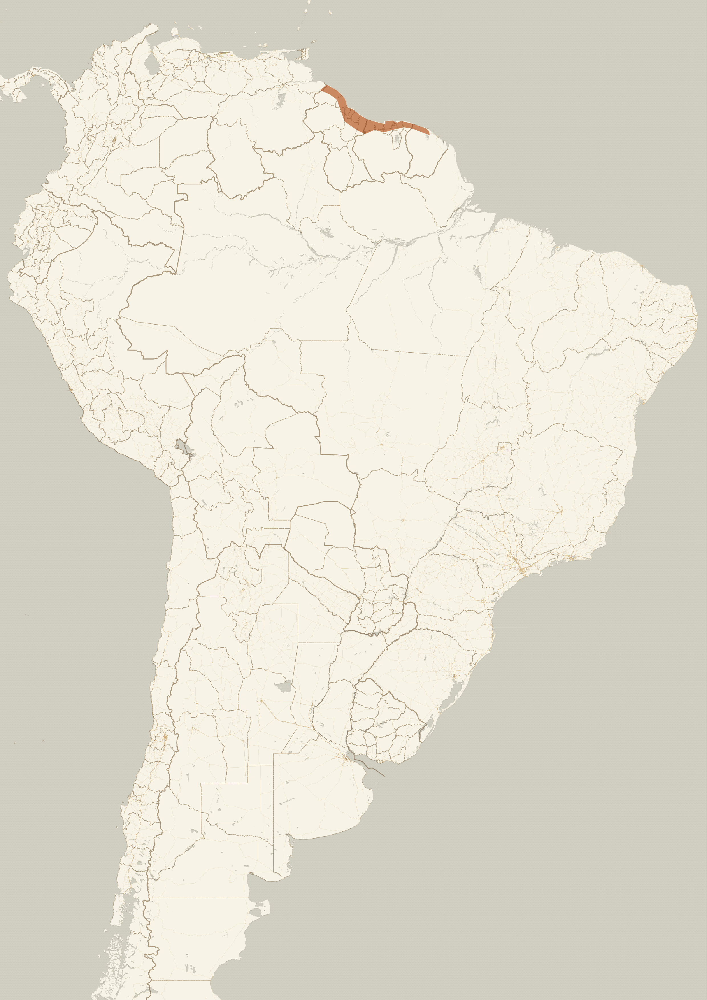
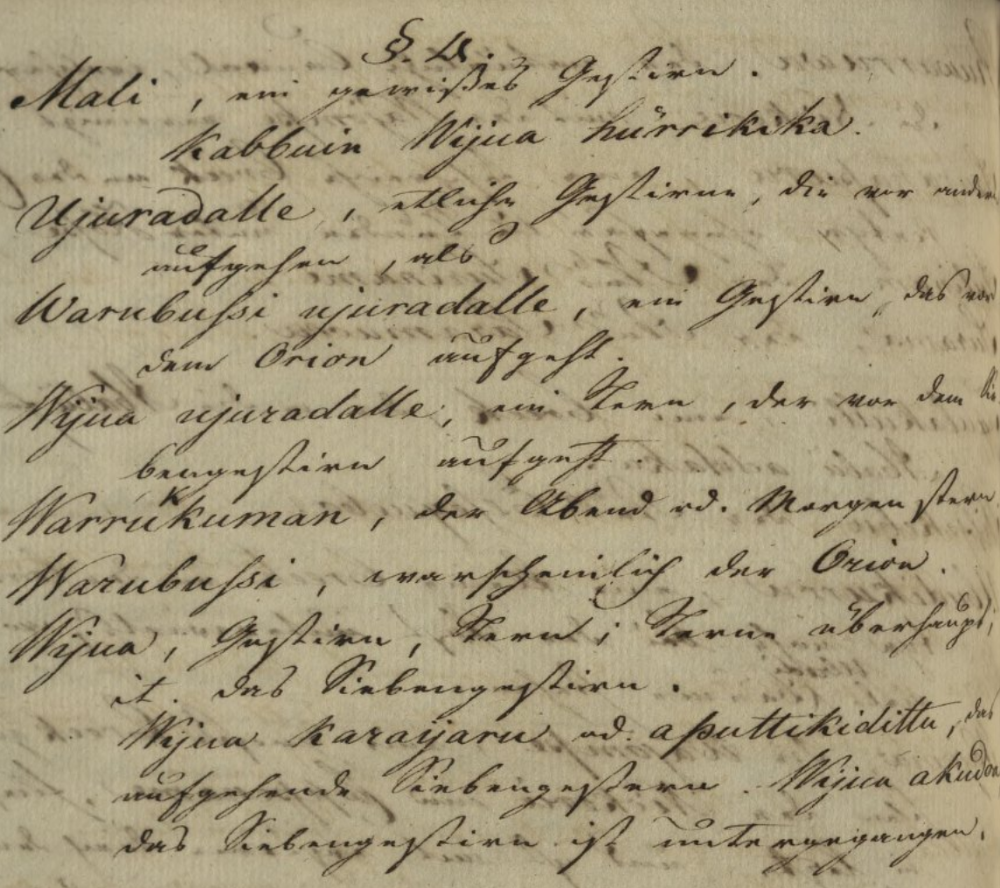

# Lokono

## Introduction

The *Lokono*, also known as *Arawak*, are an indigenous people of the Guianas, whose territory stretches along the coast of the Atlantic Ocean, from northwestern Guyana, through Suriname, to northwestern French Guiana (see map).[#1] The Lokono speak a language that belongs to the Arawakan language family&mdash;one of the largest linguistic groupings on the continent. Like many of their linguistic relatives, the Lokono are agriculturalists specializing in the farming of manioc (*Manihot esculenta*), who also practice fishing, hunting, and gathering of wild plant. However, as one of the first indigenous groups that was encountered by the Europeans at the time of conquest, the Lokono have been in contact with non-indigenous populations for over 500 years.[#2] This contact has intensified in the last century, leading to a substantial loss of the Lokono language, traditional material and immaterial culture, changes in subsistence practices, and in particular to the disappearance of *medicine-men*&mdash;the traditional carriers of spiritual knowledge, most likely including ethnoastronomical knowledge. As a consequence, the modern knowledge about celestial bodies appears to be but a fraction of what the Lokono knew about stars in the past. Several constellations mentioned in older sources are forgotten or are only known from their names, while the combinations of stars they represent and the oral traditions explaining their origin and significance have been forgotten. The Skyculture presented here includes only identified constellations but the following description provides a more comprehensive account of Lokono astronomical knowledge including information extracted from historical sources about all the celestial objects named in the table below.

## Description

### Lokono constellations and other celestial objects

|Lokono name|Literal translation in English|Approximate location|
|-----------|------------------------------|--------------------|
|<notr>Hadali</notr>|   |Sun|
|<notr>Kathi</notr>|   |Moon|
|<notr>Warhokoma</notr>|   |Venus|
|<notr>Waya nukuthi bunaha</notr>|Path of the carriers of clay|Milky Way|
|<notr>Mali</notr>|   |Sirius|
|<notr>Yôkoro wiwa</notr>|Scores of stars|Pleiades|
|<notr>Wiwa kalemero</notr>|Shining star|Jupiter|
|<notr>Yorhada</notr>|Grill|Pegasus|
|<notr>Kamodokoya</notr>|Spirit of the green anaconda|unclear|
|<notr>Kibiwarhakoya</notr>|Spirit of the capibara|unknown|
|<notr>Mabukuli</notr>|Man without a thigh|Orion's belt|
|<notr>Kama tâla</notr>|Jaw of the tapir|Hyades|
|<notr>Hithikoya</notr>|Spirit of the black curassow|Crux|
|<notr>Yokhârhin</notr>|Hunter|α Centauri|
|<notr>Alêti</notr>|Torch|β Centauri|
|<notr>Anorhâkoya</notr>|Spirit of the cocoi heron|Ursa Major|
|<notr>Honolikoya</notr>|Spirit of the rufescent tiger heron|unknown|
|<notr>Kasorhowakoya</notr>|Spirit of the four-eyed fish|λ Sco and υ Sco|
|<notr>Katarokoya</notr>|Spirit of the green sea turtle|Hercules|
|<notr>Hikorhikoya</notr>|Spirit of the yellow-footed tortoise|unknown|
|<notr>Kwakoya</notr>|Spirit of the blue crab|Orion|
|<notr>Ifakoya</notr>|Spirit of the Muscovy duck|Corona Australis|
|<notr>Awarhakoya</notr>|Spirit of the awara palm|Coma Berenices|
|<notr>Hadorhikoya</notr>|Spirit of the red acouchi|unknown|
|<notr>Hokorherokoya</notr>|Spirit of the red-rumped agouti|unknown|
|<notr>Kabadarokoya</notr>|Spirit of the jaguar|unknown|
|<notr>Korhirhwathekoya</notr>|Spirit of the ocelot|unknown|
|<notr>Hawkoya</notr>|Spirit of the pale-throated sloth|unknown|
|<notr>Warhemedokoya</notr>|Spirit of the two-toed sloth|unknown|
|<notr>Yôwanakoya</notr>|Spirit of the green iguana|unknown|
|<notr>Yarheyarherokoya</notr>|Spirit of the lilac-tailed parrot|unknown|
|<notr>Marodikoya</notr>|Spirit of the marail guan|unknown|
|<notr>Hikarowanakoya</notr>|Spirit of the little cuckoo|unknown|
|<notr>Sûtukoya</notr>|Spirit of the red-handed tamarin|unknown|
|<notr>Howakoya</notr>|Spirit of the white-faced saki|unknown|
|<notr>Imenarikoya</notr>|Spirit of the scorpion|unknown|
|<notr>Korherokoya</notr>|Spirit of the parrot|unknown|
|<notr>Kasipenikoya</notr>|Spirit of a tortoise|unknown|
|<notr>Shimarhabokoya</notr>|Spirit of the bow and arrow|unknown|
|<notr>Arakabosakoya</notr>|Spirit of the gun|unknown|
|<notr>Maraka</notr>|Medicine-men’s rattle|unknown|

### Lokono astronomical knowledge: an introduction

From contemporary and historical accounts, it appears that astronomical knowledge was not restricted to particular members of the Lokono society. However, it was the medicine-men in particular&mdash;the spiritual leaders of the Lokono known as *semethi*&mdash;who were required to master the various aspects of star knowledge and who might have been responsible for passing the oral traditions associated with them from one generation to another. From Rodrigo de Navarette, who around 1550 wrote one of the first accounts of the Lokono, we learn, for instance, that:

*&ldquo;old and wise men whom they call Cemetu assemble in the houses designed for their meetings and [&hellip;] recount the traditions and exploits of their ancestors and great men, and also narrate what those ancestors heard from their forefathers; so that in this manner they remember the most ancient events of their country and people. And, in like manner they recount or preach about events relating to the heavens, the sun, moon, and stars.&rdquo;*[#1]

Navarette's *cemetu*, the medicine-men known in modern Lokono as *semethi*, have largely given up their practices today, which may be the reason why the transmission of astronomical knowledge has been interrupted. Many Lokono constellations appear to have been forgotten today. Our sources are therefore often limited to historical accounts written by early explorers and ethnographers of the Guianas, one of the oldest examples of which is illustrated below.
 
 <figure>  
<figcaption>Fig.1 List of Lokono stars by Theodor Schulz, circa 1803.[#23]</figcaption>
 </figure> 

It is this literature that allows us to party reconstruct the Lokono stellar knowledge, described below. Before discussing the individual celestial bodies, however, several general features of Lokono astronomy merit a mention, namely:

 - the overlap with the astronomical traditions of neighboring indigenous groups.
 - the oral traditions explaining the origin and significance of celestial bodies.
 - the use of the term *koya* &lsquo;spirit&rsquo; in the names of numerous constellations.
 - the use of the general term *wiwa* &lsquo;star, year&rsquo; and the lack of other astronomical terms.
 - the sky watching practices of the Lokono.

### 1. Shared Guianan knowledge

The Lokono territory borders that of two linguistically unrelated indigenous peoples, the Kari&rsquo;na, speaking a Cariban language, and the Warao, speaking a language isolate. Though unrelated and traditionally not intermarrying, the three groups share a great deal of material and immaterial culture. Ethnoastronomical tradition of the three peoples also shows a number of striking similarities, such as shared stellar myths, similar names of constellations, and parallels in the stellar calendar. This speaks to the contacts between the three groups and to the exchange of astronomical knowledge, possibly facilitated by their respective spiritual leaders, such as the Lokono *semethi*. The degree to which these traditions overlap and the directionality of their exchange require further study. Here, we focus on the Lokono and therefore do not discuss these cultural borrowings in detail, unless they shed light on the Lokono ethnoastronomy.

### 2. Stellar oral traditions

One of such shared features are myths about stars. Such oral traditions tell of the origins of particular celestial bodies, link them to one another, and explain their influence on the natural world. The Lokono constellation *Hithikoya* &lsquo;Spirit of the black curassow&rsquo;, for instance, is linked in a Lokono myth to that of *Yokhârhin* &lsquo;Hunter&rsquo; and *Al&ecirc;ti* &lsquo;Torch&rsquo;, all three of which have Kari&rsquo;na and Warao equivalents. It is these oral traditions, preserved by the medicine-men, that likely served as the main vehicle through which astronomical knowledge was passed from one generation to another. For this reason, summaries of the relevant myths are given in the description of particular constellations. Occasionally, when the relevant Lokono myth is not documented, myths of the neighboring groups are referred to in order to illuminate the significance of particular celestial bodies. Given that many of such oral traditions are shared by the Lokono and the neighboring groups, this enhancement of the poorly preserved Lokono astronomical knowledge is justified.

### 3. Calendar of spirits

The term *koya* &lsquo;spirit&rsquo;, found in numerous constellation names typically following a term for a particular plant or animal, is a key feature of Lokono astronomy. Walter Roth, an ethnographer of the Guianas, explains that such constellations are the spirits of the corresponding beings.[#4] At a time of the year when the constellation appears, the spirit travels from the sky to earth to breathe life into the beings it represents. As such, the *koya*-constellations formed a calendar, indicating what the best time is to engage in subsistence activities related to these plants and animals (e.g. hunting or gathering). The Lokono may have also known where such spirits would descend on earth; Walter Roth suggests that they called these places with the same names as the constellations but the evidence of that remains poor. Thus, *Hadorhikoya* &lsquo;Spirit of the red acouchi&rsquo; would refer to the spirit, the constellation, and the place where the *hadorhi* is found in plenty when its constellation appears. While this toponymic knowledge is forgotten today, the *koya*-constellations remind us of the great understanding of the plant and animal life that the Lokono possessed.

### 4. *Wiwa*, the star and the year

The Lokono also have another general term that is used to refer to stars, *wiwa*. The term lacks the spiritual connotations of *koya.* It refers, on the one hand, to the physical quality of stars as something shining and, on the other hand, to the calendar year. As such, it is used, for instance, when talking about one&rsquo;s age. While it can apply to any star, *wiwa* appears only in two proper names of celestial bodies. *Y&ocirc;koro wiwa*, literally &lsquo;Scores of stars&rsquo; (Pleiades), is the most important of all Lokono constellations, whose appearance traditionally commences the Lokono calendar year. Following *Y&ocirc;koro wiwa* are the numerous *koya*-constellations, each signaling a different season in the Lokono calendar. On the other hand, *Wiwa kalemero*, literally &lsquo;Shining star&rsquo; (Jupiter) appears to have been singled out solely due to its brightness. Apart from *wiwa* and *koya*, there are no generic terms distinguishing planets, stars, moons, suns, galaxies and so on in the Lokono language. For this reason, the Lokono equivalent of the Milky Way, for instance, is included among other constellations.

### 5. Sky watching practices

While the Lokono can admire the sky in the evening, to follow the Lokono stellar calendar, one has to look at the constellations around 4 am in the morning, the time when the Lokono usually wake up. The Lokono thus observe the rising of the constellations in the morning. To get the right idea of the yearly cycle of constellations, one should also set the viewing location to the Guianas (e.g. Georgetown, Paramaribo, or Cayenne in the location menu). It merits a mention that many Lokono, when drawing constellations, did not connect the stars with lines and that in some cases, there was little agreement among speakers as to which star within a constellation corresponds to which parts of the plant or animal it represents. In Stellarium, we represent constellations with lines, but it should be kept in mind that this may be a distortion of the Lokono tradition, which allows for more flexibility in interpreting particular star groups. Finally, there are restrictions on looking at some celestial bodies, since it is believed that a spirit can harm one if looked at.[#5] For instance, by full moon, mothers covered the eyes of their children so that they would not become sick.[#6] Young people were also told not to look at *Y&ocirc;koro wiwa* (Pleiades), or else they would not grow.[#7] Such practices applied also to other objects believed to harbor powerful spirits and included other ways of avoiding eye-contact with spirits such rubbing peppers, limes, or salt into one&rsquo;s eyes.

### Lokono celestial bodies

##### *Hadali* 'Sun'

The Lokono term for the Sun is *Hadali*, also pronounced as *Adali*. Claaudius de Goeje suggests that the variously spelled names of the Lokono culture hero, the first medicine-man known as *Harlitvanli*, *Haliwalika*, *Halwanli*, *Hariwalli*, and *Arawanili*, and sometimes *Arawidi,* may all refer to the same hero identified as the Sun.[#8] While we cannot confirm this hypothesis, the myth of *Arawidi* is worth mentioning. In the Lokono myth, *Arawidi*, the Sun, is the father of a man that becomes the constellation *Mabukuli* &lsquo;Man without a thigh&rsquo; (Orion&rsquo;s belt).[#9], [#10], [#11] According to the story, the Sun used to come to earth in the shape of a man called *Arawidi* to meet his lover with whom he had twins. In a later episode of the myth, one of the twins marries a woman, whose mother the couple decide to kill. When they try to escape, the wife&rsquo;s sister chases them and manages to cut off his leg in revenge. As a result, the man ascends to the sky and becomes the constellation *Mabukuli*. Another Lokono myth warns against offending the Sun: a man, stuck on an uninhabited island in the middle of a swamp, cries out for help. A boat passes him, but inside the boat is the Sun, which does not want to help the man, since people always complain that the Sun shines too hard.[#11]. As far as practices related to the Sun, Im Thurn reported that among the Lokono, the eclipse of the Sun was considered a war between *Hadali* and *Kathi*, the Moon, and that the Lokono would shout and make all kinds of noises to stop them from fighting.[#12]

##### *Kathi* 'Moon'

The moon is known as *Kathi*, a term first recorded by Joannes de Laet as *cattehee* around 1598, and used also to refer to the lunar month.[#13] According to the Lokono, the Moon, like the Sun, was once a man. Walter Roth reports a Lokono myth, in which a young woman was visited by a mysterious lover night after night.[#10] To find out who the lover was, the woman smeared her hands with the soot from the bottom of a pot. Next day, when she woke up, she found that her brother&rsquo;s face was covered in soot and realized it was him who visited her at night. Everybody in her community started to avoid the incestuous brother, who became so ashamed that he kept away from the people and ultimately ascended to the sky, becoming the Moon. This is why, according to the Lokono, the face of the moon is dirty today. The Moon appears also in another myth. In the Lokono myth about a man stuck on an uninhabited island mentioned above, another boat passes the man, but this time inside is the Moon, which decides to help the man, since people are always happy to see the Moon come out at night.[#11] The Moon and Sun are also depicted as opponents. In previous times, the Lokono believed that the eclipse of the Moon is its death (*kathi &ocirc;don* &lsquo;moon dying&rsquo;) and would keep watch all night.[#6] The Lokono say during the eclipse of the Moon that the Moon has fallen asleep on the Sun&rsquo;s path.[#11] Therefore, they make a lot of noise, play drums, and blow shell trumpets to wake him up. By full moon, mothers would cover the eyes of their children so that they do not become sick.

##### *Warhokoma* 'Venus'

The planet Venus, both when it appears in the morning as the Morning Star and when it appears in the evening as the Evening Star, is called *Warhokoma* by the Lokono.[#8], [#14], [#15] Charles Dance, on the other hand, reports the terms *Eweiwah* and *Huewah*, probably the equivalents of the general term *wiwa* &lsquo;star&rsquo; which can be used for any shining celestial body.[#16] The Lokono also speak of Venus as *Hiyaro wiwa* &lsquo;women&rsquo;s star&rsquo;. In relation to this, it merits a mention that Claudius de Goeje reports that when *Hiyaro wiwa* appears close to the Moon, and a girl is about to have her first menstruation, the Lokono say that the girl will soon be touched by the Moon.[#5] There is no myth about *Warhokoma* specifically and its relation to the Moon, but it is worth reminding that the Lokono know a story, in which the Moon was originally a man who committed incest with his sister (see the myth mentioned under *Kathi*), and has a name as a womanizer.[#10] Interestingly, the name *Warhokoma* for Morning or Evening Star appears also in Kari&rsquo;na, who see it also as the Moon's wife.[#17], [#18]

##### *Waya nukuthi bunaha* 'Milky Way'

The Milky Way is known among the Lokono as *Waya nukuthi bunaha,* literally &lsquo;Path of the carriers of clay&rsquo;. The Milky Way represents the footprints of men who once went to fetch clay for making pots, an art that is, rarely if at all, practiced by the Lokono today. The origin of the name, however, is still known, and is summarized in a myth.[#19] The same name for Milky Way was noted by William Brett who adds that it is named after a specific whitish type of clay.[#14] Charles Dance, on the other hand, says that the Milky Way represents the footprints of peccaries rooting up the clay, while Walter Roth mentions a different Lokono explanation, according to which the Milky way represents a tapir chased by a dog and jaguar.[#10], [#16] However, these two sources do not give the corresponding Lokono name for the Milky Way, and it is possible that these two explanations are a Kari&rsquo;na influence, who recognize a constellation of a tiger following the constellation of a tapir within that of the Milky Way.[#17]

##### *Mali* 'Sirius'

The modern Lokono call Sirius *Mali*, the literal meaning of which is unknown. Cornelius van Coll describes a Lokono star called *Mali* and explains that it is a very powerful star.[#7], [#17] When it comes up in the morning in August, it kills the fish in the swamps, and one should not point at it or one&rsquo;s finger will become lame. Cornelius van Coll&rsquo;s *Mali* marks the beginning of the big dry season (August to December), called in Lokono *malidalithe*, a term derived from *Mali*. Older sources identified *Mali* tentatively as Lyra, Aquila, or Crux, but given that the big dry season starts around August and that the Lokono observe the stars in the morning, these identifications must be incorrect; Lyra, Aquila, and Crux cannot be seen at this time from the Lokono territories.[#11], [#17] There are no Lokono myths about *Mali*, but there is evidence that is may correspond to the Kari&rsquo;na constellation *Ombatapo* &lsquo;Previous face&rsquo;. The Kari&rsquo;na myths explain the origin of the constellation and its name, which, like the Lokono *Mali*, is believed to kill the fish in the swamps and announces the beginning of the big dry season. Moreover, the Kari&rsquo;na *Ombatapo* is identified as parts of Puppis and Canis Major, the latter of which includes Sirius.[#18], [#20]

##### *Yôkoro wiwa* 'Scores of stars'

The constellation *Y&ocirc;koro wiwa* or *Wiwa y&ocirc;koro*, literally &lsquo;Score of stars&rsquo;, refers to the Pleiades and is easily recognized by the contemporary Lokono. This is likely because *Y&ocirc;koro wiwa* is described as the most important of Lokono constellations, since it announce the beginning of the Lokono year.[#17] After it comes out first in June in the east, it is followed by the numerous *koya*-constellations referring to the spirits of animals and plants that constitute the Lokono calendar. At that time of the year, the Lokono say *Y&ocirc;koro wiwa kayaran* &lsquo;the birth of *Y&ocirc;koro wiwa*&rsquo;. It is said that if *Y&ocirc;koro wiwa* shines strong when it appears for the first time, many people will die in the coming year.[#5] Cornelius van Coll also warns that young people should not look at it, or else they will not grow.[#7] These omens and warnings are related to a Lokono myth. According to the story, there were once twin brothers, one of which had a wife, and said that death would come when their star, *Y&ocirc;koro Wiwa*, rises.[#7] Death came indeed, killing even his wife, roasting her on the fire, and the Lokono became angry and brought a giant green anaconda to swallow the twins. The snake ate one of the brothers, but because it was already 5 am and the day broke, the snake could not eat the other brother. The snake is now the constellation *Kamodokoya* &lsquo;Spirit of the green anaconda&rsquo;, in the belly of which *Y&ocirc;koro Wiwa* is said to be located (see also the *Yorhada* myth). In another narrative, the Lokono explain that the *Y&ocirc;koro Wiwa* represents seven brothers lost in a savannah on their way back home, a motif also known from a Kari'na story.[#20]

##### *Yorhada* 'Grill'

The constellation *Yorhada* &lsquo;Grill&rsquo;, or *Wiwa yorhadale* &lsquo;Star&rsquo;s grill&rsquo;, represents a wooden grill, on which meat is roasted.[#4], [#11], [#21] Its origin is explained in a myth related by Walter Roth about a man who killed his wife, roasted her, and fed her liver to his mother-in-law because she called him a worthless hunter.[#10] In revenge, the mother asked her brother, *Kamodo* to kill the man when he went hunting. The man suspected the woman set a trap and escaped death by sending his brother instead. The grill on which the wife was roasted became the Western constellation Pegasus, according to contemporary Lokono, marking the beginning of the small dry season (April), the time when the Lokono roast a lot of fish. The myth is similar to that of *Y&ocirc;koro wiwa* and the twins, in which the older brother is responsible for roasting his wife and may be the same as the man who roasted his wife in the *Yorhada* myth. In both myths, the younger brother killed by the anaconda becomes *Y&ocirc;koro wiwa*, while the grill becomes *Yorhada*. Claudius de Goeje suggested that *Yorhada* is the Western constellation Corvus, but Corvus does not appear at beginning of the small dry season.[#11] The neighboring Warao also know Pegasus as the grill, and are familiar with the myth.[#10]

##### *Kamodokoya* 'Spirit of the green anaconda'

*The constellation Kamodokoya*, &lsquo;Spirit of the green anaconda (*Eunectes murinus*)', also called *Waroboshi* remains poorly described.[#5] Older sources suggest it is Perseus, Pleiades, Scorpio, or Ophiuchus, but the exact stars remain unidentified.[#10], [#11], [#21] Several myths explain its origin. According to Walter Roth, a man killed his wife, roasted her, and fed her liver to her mother because she called him a worthless hunter.[#10], In revenge, she asked *Kamodo* to kill him, but the man escaped the snake who ate his younger brother instead. The constellation *Kamodokoya* has *Y&ocirc;koro wiwa*, the brother, inside, and is close to *Yorhada* &lsquo;Grill&rsquo;, on which the wife was roasted. Notably, Theodor Schultz list the constellation *Waroboshi yorhadale* 'The grill of the green anaconda' which could be the same as the constellation *Yorhada*.[#23] Cornelius van Coll speaks of twins, one of whom had a wife, and warned that their star brings death.[#7] Indeed, even his wife died, roasted on the fire. The Lokono had the snake kill the man, and ascend to the sky as *Kamodokoya*. Finally, Claudius de Goeje relates a myth of a woman who felt a desire for men, and put a *katuburi* flower in her vagina, and became pregnant. Her child was partly a snake, and people wanted to kill it, so it ascended to the sky.

##### *Kibiwarhakoya*  'Spirit of the capybara'

The constellation *Kibiwarhakoya* &lsquo;Spirit of the capybara&rsquo; (*Hydrochoerus hydrochaeris*) was mentioned by the Penard brothers.[#17] The same source also informs us that it is followed by the constellation *Kamodokoya* &lsquo;Spirit of the green anaconda&rsquo;. The constellation remains unidentified and its significance is unknown. No related myths have been documented.

##### *Mabukuli* 'Man without a thigh'

The constellation *Mabukuli* &lsquo;Man without a thigh&rsquo; is well known among the Lokono and appears in a few myths. According to Charles Dance, an unsuccessful huntsman cut off his own leg, wrapped it up in a leaf, and gave to his step mother so that she had something to eat, and ascended to sky.[#16] Similarly, the Penard brothers speak of an unsuccessful hunter who cut off his leg and gave it to his wife and mother-in-law, telling them it was tapir meat.[#17] He then asked other people to follow his traces to help him bring the rest of the tapir, but when they arrived at the place they only found the *akalali* plant with which he treated his wounds. His body turned into the *Kama t&acirc;la* constellation and his spirit into *Mabukuli*. Claudius de Goeje relates a strikingly different myth.[#11] The Sun, once a man called *Arawidi* (see the myth about *Hadali* 'Sun'), took a woman as his wife, who followed him with unborn twins inside her. One day, she lost the way and ended up being eaten by vulture spirits, but her twins were brought up by an old woman, whom they later killed and ran away. While hiding in a treetop, they saw a woman catching fish with a sifter. She saw their reflection in the water and tried to catch it, at which they laughed. She then realized they were up in the tree, and sent ants up the tree to make them come down. When they came down, she killed one of them and took the other home. One of her daughters fell in love with the man and married him. Now the husband had to catch a lot of fish every day for the mother-in-law. One day, tired of his demanding mother-in-law, he tricked her into getting into the water to help him unload a boat full of fish, where she was eaten by a shark. When her other daughter arrived, the liver of her mother was still floating on the water and told her that the man killed her. The daughter wanted to kill him but he flew away on wings of cotton that his wife made for him, so she only cut his thigh off, which is why he is now the constellation *Mabukuli*. It appears the Orion's belt represents the cut-off leg, not the man himself.

##### *Kama tâla* 'Jaw of the tapir'

The constellation *Kama t&acirc;la* &lsquo;Jaw of the tapir&rsquo; is one of the few constellations identified easily by the contemporary Lokono, just like *Mabukuli*, to which it is related in a myth.[#8], [#15] The Penard brothers recount the story of an unsuccessful hunter, who cuts meat off his leg and gives it to his wife and mother-in-law, telling them it is tapir meat (*Tapirus terrestris*).[#17] He then asks his fellow people to follow him and help bring the rest of the tapir, but when they arrive at the place they only find the *akalali* plant with which he treated his wounds. His body turned into *Kama t&acirc;la* and his spirit into *Mabukuli*. In a Kari&rsquo;na story, on the other hand, *Kama t&acirc;la* was the remains of a tapir that the mythical twins were hunting, one of whom accidentally gets his leg severed and becomes the constellation of man without a thigh.

##### *Hithikoya* 'Spirit of the black curassow'

The constellation *Hithikoya* is the &lsquo;Spirit of the black curassow&rsquo; (*Crax alector*), a commonly hunted bird, often kept as a pet for its feathers and eggs. According to a Lokono myth, *Hithikoya* lived on earth, but the Lokono kept shooting him.[#11] As a result, he ascended to the sky to warn black curassows about the approaching hunter (see *Yokh&acirc;rhin*) and his companion with a torch (see *Al&ecirc;ti*). The Lokono identify *Hithikoya* as the Western constellation Crux. When it appears just above the trees in January, the curassows roam on the ground and are easy to catch. Over the following months, the higher *Hithikoya* rises in the morning, the higher the birds climb up the trees. By March, it appears high in the sky and the birds are found in the tops of the trees. *Hithikoya* thus informs the Lokono where to search for the birds at a given time of the year. The Lokono even make hunting charms (*bina*) from a plant, whose leaves resemble the bird, rubbed into the lips of the hunter so that he can imitate the calls of the bird, increasing his chances of catching one.[#10], [#17]

##### *Yokhârhin* 'Hunter'

The constellation *Yokh&acirc;rhin* &lsquo;Hunter&rsquo; corresponds to &alpha; Centauri and represents the man hunting *Hithikoya*, the &lsquo;Spirit of the black curassow&rsquo; (see *Hithikoya*).[#9], [#10], [#11] His companion holding a torch known as *Al&ecirc;ti* is represented by &beta; Centauri. The myth reported by the Penard brothers that explains the origin of *Hithikoya* includes also these two characters.[#11] According to the story, *Hithikoya* used to live on earth, but the Lokono kept tracking him down at night and shoot him. As a result, it ascended to the sky to serve as a signal for black curassows warning them about the approaching hunter (*Yokh&acirc;rhin*) and his companion with a torch (*Al&ecirc;ti*). As *Hithikoya* appears higher and higher in the morning between January and March, *Yokh&acirc;rhin* and subsequently *Al&ecirc;ti* appear on the horizon following it. This indicates to the Lokono that the black curassow can now be found high in the tress and the hunters can set out at night to hunt it in the tree tops.

##### *Alêti* 'Torch'

The constellation&nbsp;*Al&ecirc;ti* &lsquo;Torch&rsquo; corresponds to&nbsp;&beta; Centauri and represents the companion of the hunter *Yokh&acirc;rhin*, holding a torch torch made from a piece of cloth dipped in beeswax known as *Al&ecirc;ti*.[#9], [#10], [#11]&nbsp; *Al&ecirc;ti* follows *Yokh&acirc;rhin* so as not to scare the black curassow bird with the light of the torch. The myth reported by the Penard brothers that explains the origin of *Hithikoya* 'Spirit of the black curassow' includes also these two characters (see *Hithikoya*).[#11] According to the story, *Hithikoya* used to live on earth, but the Lokono kept tracking him down at night and shoot him. As a result, it ascended to the sky to serve as a signal for black curassows warning them about the approaching hunter (*Yokh&acirc;rhin*) and his companion with a torch (*Al&ecirc;ti*). As *Hithikoya* appears higher and higher in the morning between January and March, *Yokh&acirc;rhin* and subsequently *Al&ecirc;ti* appear on the horizon following it. This indicates to the Lokono that the black curassow can now be found high in the tress and the hunters can set out at night to hunt it in the tree tops.

##### *Anorhâkoya* 'Spirit of the cocoi heron'

The constellation *Anorh&acirc;koya* represents the spirit of the cocoi heron (*Ardea cocoi*). It is recognized by contemporary Lokono as Ursa Major, in keeping with earlier identifications.[#11], [#15] Claudius de Geoje reports that when it shines strong, the Lokono believe that strong winds will come, bringing dust into peoples&rsquo; eyes and consequently diseases: the heron picks their eyes with its beak, it is said.[#11] Similarly, according to Cornelius van Coll, *Anorh&acirc;koya* is a heron whose beak is upside down. Should its beak be turned downwards, people would get all kinds of eye diseases.[#7] This can still happen when strong winds blow and carry the light from the beak into peoples&rsquo; eyes, since the light of *Anorh&acirc;koya* (and other stars) travels with the wind according to the Lokono. The constellation is associated with the big dry season (August to December) and the storms and winds that are typical of this time. It appears in the morning in mid-November in the northeast with its beak down.

##### *Honolikoya* 'Spirit of the rufescent tiger heron'

Another Lokono constellation named after a species of a heron is *Honolikoya* &lsquo;*Spirit of the rufescent tiger heron*&rsquo; (*Tigrisoma lineatum*). It is reported in historical sources as the equivalent of the Kari&rsquo;na constellation *Kumawari yumï* (&lsquo;Father of the cocoi heron&rsquo;). This is likely a mistake as *honoli* is a different and well-known species of a heron. It is possible that *Honolikoya* refers to the same constellation as *Anorhâkoya*, interpreted differently by different Lokono consultants, but it is also possible it is a different constellation. In any case, *Honolikoya* remains unidentified.[#17] Just like *Anorh&acirc;koya*, the constellation is said to bring diseases of the eyes when it appears in the morning sky. From the Penard brothers' description we can infer that *Honolikoya* should appear between June and the big dry season, which lasts from end of August until the beginning of December. There appears to be no specific myth associated with this constellation.[#17]

##### *Kasorhowakoya* 'Spirit of the four-eyed fish'

The constellation *Kasorhowakoya* &lsquo;Spirit of the four-eyed fish&rsquo; (*Anableps anableps*) was identified by the contemporary Lokono as &lambda; Scorpii and &upsilon; Scorpii. In earlier sources it is identified as the upper part of Scorpio&rsquo;s tail, which is in keeping with the 21st century data.[#8] The constellation represents the two eyes of the four-eyed fish, which is known for the fact that its eyes are always sticking above the water, and is therefore sometimes considered an incarnation of the water spirit. There is no Lokono myth concerning the four-eyed fish, and it remains unknown what the appearance of this constellation signifies. However, it merits a mention that the Kari&rsquo;na have a constellation representing the same fish, which corresponds to the same two stars. Maga&ntilde;a and Jara explain that the appearance of the Kari&rsquo;na constellation announces the fishing season for this species.[#18] It is not unlikely that the Lokono constellation had the same function.

##### *Katarhokoya* 'Spirit of the green sea turtle'

The constellation *Katarhokoya* &lsquo;Spirit of the green sea turtle&rsquo; is still known on the Pomeroon River in Guyana. It represents the *katarho* turtle (*Chelonia mydas*), swimming towards the shore, represented in turn by the Milky Way. When the constellation appears in the morning high in the sky, it is a signal that turtles are arriving on the beaches to lay eggs. The constellation was identified in earlier sources as *Corona Borealis* and *Orion's belt.* [#8], [#11] While the former overlaps with the stars indicated by the Lokono on the Pomeroon, the latter is likely a mistake as *Orion&rsquo;s belt* is consistently recognized as *Mabukuli* &lsquo;Man without a thigh&rsquo;. The constellation *Katarhokoya* rises early in the year, but it appears upside down most of the time from the vistas of the Lokono in the Guianas. Only by mid-March, a time when several species of turtles indeed lay their eggs on the Atlantic coast of the Guianas, does it look like a turtle swimming to the shore (Milky Way).

##### *Hikorhikoya* 'Spirit of the yellow-footed tortoise'

The constellation *Hikorhikoya* &lsquo;Spirit of the yellow-footed tortoise&rsquo; was documented by the Penard brothers for the Lokono in Suriname; it remains unidentified but it should appear around August (i.e. around the beginning of the big dry season).[#11], [#17] The Penard brothers explain that when the water in the swamps rises, the yellow-footed tortoise, known in Lokono as *hikorhi* (*Chelonoidis denticulatus*), seeks higher grounds, and, presumably, can be more easily found. There are no myths related to the constellation specifically. However, it is worth pointing out that the tortoise is considered a delicacy among the Lokono. When caught, they are often kept around the house in small corrals for long periods of time until they are consumed. The Lokono joke that they are &lsquo;fridges&rsquo; since if fed, the tortoise will stay alive for a long time, as opposed to an animal that was shot and has to be prepared and eaten immediately.

##### *Kwakoya* 'Spirit of the blue crab'

The constellation *Kwakoya* &lsquo;Spirit of the blue crab&rsquo; is still known in the Lokono communities closer to the coast, which practice the annual crab feats. The crab species is likely the same as that represented by the Kari&rsquo;na constellation *Kusa yumï* &lsquo;Father of the blue crab&rsquo; (*Ucides cordatus*). The constellation appears in the east in the middle of July. By the beginning of August, it is high in the sky, signaling that the crabs arrive at the beaches to lay their eggs. At this time, the Lokono and other indigenous groups of the area congregate to the shore of the Atlantic to catch the marching crabs. The crabs are considered a delicacy and when the villagers return to the communities with the catch, large feasts are organized during which the crabs are eaten. The Penard brothers write that *Kwakoya* appears when the crabs come to lay their eggs in May and June but this appears to be incorrect, both given that crabs march later and that the constellation recognized by the modern Lokono is not visible in May and June from the Guianas.[#17]

##### *Ifakoya* 'Spirit of the Muscovy duck'

The constellation *Ifakoya* &lsquo;Spirit of the Muscovy duck&rsquo; (*Cairina moschata*) was mentioned by the Penard brothers and Claudius de Goeje but remained unidentified until now.[#11], [#17] The contemporary Lokono on the Pomeroon River in Guyana recognize it in parts of the Western constellation Corona Australis. There are no myths related to this constellation but the Lokono say that when the head of the duck points toward the ground, looking as if the duck has its head under the water, the ducks are busy feeding on plants. The constellation assumes this position from mid-May. At this time, it is said that the birds are easier to catch. The Muscovy duck is considered a delicacy and is also often kept around the house like chickens. The Kari'na and the Warao also recognize the constellation of the Muscovy duck, and at least the Warao one corresponds to the same stars.[#17]

##### *Awarhakoya* 'Spirit of the awara palm'

The constellation *Awarhakoya* &lsquo;Spirit of the awara palm&rsquo; has the shape of an awara palm (*Astrocaryum vulgare*). Its appearance high in the sky in January means that awara fruits are ripening. In the following months, *Awarhakoya* moves closer to the horizon, meaning that the fruits will soon fall to the ground to be picked. This occurs in the small dry season (mid-February to April), known as *awarhadlithe*, a term derived from the name of the palm.[#7], [#17] There are no myths about *Awarhakoya* but it is said that the constellation is followed by that of the *Hadorhikoya* &lsquo;Spirit of the red acouchi&rsquo; and *Hokorherokoya* &lsquo;Spirit of the red-rumped agouti&rsquo;. Their appearance signals that the rodents are gathering by the palms to eat the fallen fruit. *Awarhakoya* is recognized today in stars close to the Western constellation Coma Berenices, but older sources suggest it is near Sirius.[#11] It is the only constellation named after a plant, which speaks to the importance of the awara palm to the Lokono. The Kari'na also have a constellation of the awara, sometimes recognized in the same stars.[#17], [#20]

##### *Hadorhikoya* 'Spirit of the red acouchi'

The unidentified constellation *Hadorhikoya* &lsquo;Spirit of the red acouchi&rsquo; (*Myoprocta acouchy*) was mentioned by the Penard brothers.[#17] It should follow the constellation *Awarhakoya* appearing near it sometime after February. Its appearance signals that the ripe fruits of the palm attract the red acouchi to the awara grooves, where they can be hunted. There is no Lokono myth about *Hadorhikoya*, but a Kari&rsquo;na myth about the unidentified Kari&rsquo;na constellation of the red acouchi relates it to the several other constellations. According to the story, there were two brothers, of which one had a wife. The unmarried brother killed his brother, fed his liver to the wife, took her as his wife, and had a child with her. The spirit of the dead brother told the woman that his brother killed him, so she and her child decided to run away and ascend to the sky as the constellation of the agouti and acouchi. The spirit also told his brother to cut open his corpse and scatter his insides, which became the Pleiades, while the killer became the constellation of the anaconda.[#11]

##### *Hakorherokoya* 'Spirit of the red-rumped agouti'

The unidentified constellation *Hokorherokoya* &lsquo;Spirit of the red-rumped agouti&rsquo; was mentioned by the Penard brothers, who explain that like *Hadorhikoya*, it follows *Awarhakoya*.[#17] It signals that the ripe fruit attracts the agouti (*Dasyprocta leporina*) to the awara palms, where they can be hunted. Claudius de Goeje adds that it is followed by *Kabadarokoya* &lsquo;Spirit of the tiger&rsquo;, which, like humans, knows agouti's habits.[#11] There is no Lokono myth about *Hokorherokoya*, but a Kari&rsquo;na myth about the unidentified constellation of the agouti explains its origin. According to the story, there were two brothers, one married, the other not. The unmarried one killed the other, fed his liver to the wife, took her as his wife, and had a child with her. The dead brother's spirit told her that his brother killed him, so she and her child ran away, becoming the agouti and acouchi constellations. The spirit then told his brother to open his corpse and scatter his insides, which became the Pleiades, while the killer became the anaconda constellation.[#11]

##### *Kabadarokoya* 'Spirit of the jaguar'

*Kabadarokoya* or *Arhwakoya* &lsquo;Spirit of the jaguar&rsquo; was mentioned by the Penard brothers, who link it to a Lokono myth.[#7], [#11] According to the story, *Kabadaro* (*Panthera onca*) was the father of *Korhirhwathe* (*Leopardus species*), whom he loved so much, he did not want to marry her out.[#33] One day a thorn got stuck in his paw and a man helped him take it out, so he gave the man his daughter as his wife. The family always had meat, so other people were jealous and told the man that his wife cheated on him. He started mistreating her. When the jaguar learned about this, he ran away with his daughter but the man followed them everywhere, so finally they ascended to the sky. But when the Lokono kill a jaguar, they can come back to earth to kill people. According to Claudius de Goeje, it follows the agouti star, a delicacy of the jaguars.[#11] The constellation is unidentified. The Kari&rsquo;na constellation of the jaguar is said to appear around the small dry season, when jaguars roar more because they suffer from insects.[#17], [#20]

##### *Korhirhwathekoya* 'Spirit of the ocelot'

The constellation *Korhirhwathe* &lsquo;Spirit of the ocelot&rsquo; was mentioned by the Penard brothers, who link it to the same Lokono myth summarized above for *Kabadarokoya*.[#11] According to the story, *Kabadaro* (*Panthera onca*) was the father of *Korhirhwathe* (*Leopardus species*), whom he loved so much, he did not want to marry her out. However, one day a thorn got stuck in his paw and a man helped him take it out, so he gave the man his daughter as his wife. The family always had plenty of meat, so other people became jealous and told the man that his wife cheated on him. As a result, he started mistreating *Korhirhwathe*. When the jaguar learned about this, he took his daughter, and ran away with her into the forest, but the man followed them everywhere, so finally they ascended to the sky becoming constellations. Now, when the Lokono kill a jaguar, they can come back to earth to kill people.

##### *Hawkoya* 'Spirit of the pale-throated sloth'

The constellation *Hawkoya* &lsquo;Spirit of the pale-throated sloth&rsquo; was mentioned by Claudius de Goeje.[#11] It represents a species of a sloth (*Bradypus tridactylus*) and is an omen of storms and windy weather that occur at the beginning of the big dry season (between August and December). At this time, the sloths start to wander about more, and the Lokono say that it is because of the winds.[#17] The constellation remains unidentified.

##### *Warhemedokoya*  'Spirit of the two-toed sloth'

Similarly, *Warhemedokoya* &lsquo;Spirit of the two-toed sloth&rsquo;, mentioned by the Penard brothers, is said to appear when the storms and winds of the big dry season are about to start and make the sloths move about more.[#17] It represents the two-toed sloth (*Choloepus didactylus*). The constellation remains unidentified.

##### *Yôwanakoya*  'Spirit of the green iguana'

The constellation *Y&ocirc;wanakoya* &lsquo;Spirit of the green iguana&rsquo; is mentioned by the Penard brothers.[#17] It represents the green iguana (*Iguana iguana*) and appears when the iguanas lay their eggs in the sand, which should be sometime in April and May, but the constellation remains unidentified.

##### *Yarheyarherokoya*  'Spirit of the lilac-tailed parrot'

The constellation *Yarheyarherokoya* &lsquo;Spirit of the lilac-tailed parrot&rsquo; (*Touit batavicus*) was mentioned by Claudius de Goeje.[#11] The constellation is not known to contemporary Lokono; neither do we know what its appearance used to signify.

##### *Marodirokoya*  'Spirit of the marail guan'

The constellation *Marodikoya* &lsquo;Spirit of the marail guan&rsquo; was mentioned by Claudius de Goeje, who comments that it has the shape of the marail guan (*Penelope marail*).[#11] The constellation is not known to contemporary Lokono; neither do we know what its appearance used to signify.

##### *Hikarowanakoya*  'Spirit of the little cuckoo'

The constellation *Hikarowanakoya* &lsquo;Spirit of the little cuckoo&rsquo; was only mentioned by Claudius de Goeje.[#11] It represents the little cuckoo (*Coccycua minuta*). The constellation remains unidentified; neither do we know what its appearance used to signify. However, the Penard brothers mention the Kari&rsquo;na constellation of a cuckoo species identified as the very similar *Piaya cayana*.[#17], [#22] The Kari'na constellation is said to bring luck to hunters. Interestingly, the Lokono link hunter&rsquo;s luck to the little cuckoo as well. They say that if the bird passes you calling *pikwan pikwan pikwan*, you have to watch out, as something bad might happen to you.

##### *S&ucirc;tukoya*  'Spirit of the red-handed tamarin'

The constellation *S&ucirc;tukoya* &lsquo;Spirit of the red-handed tamarin&rsquo; (*Saguinus midas*) was mentioned by Cornelius van Coll and the Penard brothers but it remains poorly identified.[#7], [#11], [#43] According to Claudius de Goeje, it should correspond to the Western constellation Coma Berenices.[#17] It is not clear whether this is correct, however, given that today we find the constellation *Awarhakoya* in this part of the sky, which is easily recognized by numerous speakers. There are no myths related to this constellation.

##### *Howakoya*  'Spirit of the white-faced saki'

The constellation *Howakoya* 'Spirit of the white-faced saki&rsquo; was only mentioned by de Claudius de Goeje.[#17] It represents the spirit of white-faced saki (*Pithecia pithecia*) but the constellation and its significance remain unknown.[#44]

##### *Imenarikoya*  'Spirit of the scorpion'

The constellation *Imenarikoya* &lsquo;Spirit of the scorpion&rsquo; was only mentioned by Claudius de Goeje.[#11] The constellation refers to a spirit of an unidentified species of a large poisonous scorpion. There are no known myths about *Imenarikoya*. The constellation could be a case of cultural borrowing from non-indigenous populations, as has been suggested for the Kari'na constellation representing a scorpion.

##### *Maraka*  'Rattle of the medicine-man'

The constellation  *Maraka*  'Rattle of the medicine-man' was mentioned by Claudius de Goeje, and refers to a rattle used by the Lokono medicine-men, which is made of a calabash pierced with a stick, adorned with feathers of a certain parrot, and filled with numerous small crystals, each of which harbors a different spirit, that is a different type of *koya*.[#11] The constellation remains unidentified; there is no Karin'a or Warao equivalent and there are no myths related to it.

##### *Shimarhabokoya*  'Spirit of the bow and arrow' and  *Arakabosakoya*  'Spirit of the gun'

The constellation *Shimarhabokoya* ‘Spirit of the bow and arrow’ and *Arakabosakoya* ‘Spirit of the gun’ were mentioned by Claudius de Goeje.[#11] Both constellations remain unidentified and do not have Kari’na and Warao counterparts, and there are no myths related to them.

##### *Korherokoya*  'Spirit of the parrot'

The constellation&nbsp;*Korherokoya* &lsquo;Spirit of the parrot&rsquo; was only mentioned by Claudius de Goeje.[#11] The constellation refers to a spirit of an unidentified species of a parrot, but it was mentioned as the equivalent of the Kari’na constellation *Kurewako yumï* ‘Father of the orange-winged parrot’, representing the orange-winged parrot (*Amazona amazonica*). There are no known myths about *Korherokoya*. It should appear in February when the parrots are big enough to be taken out of their nests, but the constellation remains unidentified.

##### *Kasipenikoya*  'Spirit of the sea turtle'

The constellation *Kasipenikoya* &lsquo;Spirit of the sea turtle&rsquo; was mentioned by Claudius de Goeje.[#11] It refers to the spirit of an unidentified species of a turtle. It may be the case that it is the same as *Katarokoya*. The term *kataro* (*Chelonia mydas*) appears to be a term borrowed from Kari&rsquo;na, it is thus possible that *kasipeni* is the original Lokono term for the same turtle. However, there are several species of turtles in the Guianas, thus *kataro* and *kasipeni* can also refer to different species, and their spirits be identified with different constellations.

## Authors

This sky culture was contributed by [Konrad Rybka](https://uva.academia.edu/KonradRybka) and produced with the help of Lokono speakers in Suriname (Cassipora) and Guyana (Wakapoa). The research was carried out as part of the project supported by a Rubicon postdoctoral grant from the Netherlands Organization for Scientific Research (project number 446-15-012). Quote as: Rybka, Konrad 2018. *Lokono sky culture: a description of Lokono ethnoastronomical knowledge for Stellarium software.*  Version 1.0

## References

 - [#1]: Rybka, Konrad. 2015. [“State-of-the-Art in the Development of the Lokono Language.”](https://scholarspace.manoa.hawaii.edu/handle/10125/24635) Language Documentation and Conservation 9: 110–13.
 - [#2]: Rybka, Konrad. 2017. [“Contact-Induced Phenomena in Lokono (Arawakan).”](https://www.degruyter.com/view/books/9781614514886/9781614514886-010/9781614514886-010.xml) In Boundaries and Bridges, edited by Kofi Yakpo and Pieter C. Muysken. Berlin, Boston: De Gruyter, pp 257-281.
 - [#3]: Navarette, Rodrigo Pérez de. 1964. “Relación de Las Provicias y Naciones Que Los Indios Llamados Aruacas [Tienen] [...].” In Relaciones Geográficas de Venezuela, edited by Antonio Arellano Moreno, 83–87. Caracas: Academia Nacional de la Historia.
 - [#4]: Roth, Walter Edmund. 1924. An Introductory Study of the Arts, Crafts, and Customs of the Guiana Indians. Washington, DC: U.S. Government Printing Office.
 - [#5]: Goeje, Claudius Henricus de. 1943. Philosophy, Initiation and Myths of the Indians of Guiana and Adjacent Countries. Archives Internationales d’ethnographie. 44.
 - [#6]: Abbenhuis, M.F. 1939. Arawakken in Suriname: Enquête-Materiaal Voor Een Volkenkundige Studie. Paramaribo: Leo Victor.
 - [#7]: Coll, Cornelius van. 1903. “Gegevens over Land En Volk van Suriname I - Suriname’s Oorspronkelijke Bevolking.” Bijdragen Tot de Taal-, Land- En Volkenkunde / Journal of the Humanities and Social Sciences of Southeast Asia 55 (1): 453–529.
 - [#8]: Goeje, Claudius Henricus de. 1928. The Arawak Language of Guiana. Amsterdam: Uitgave van der Koninklijke Akademie von Wetenschappen te Amsterdam.
 - [#9]: Brett, William Henry. 1880. Legends and Myths of the Aboriginal Indians of British Guiana. London: Williams Wells Gardner.
 - [#10]: Roth, Walter Edmund. 1915. An Inquiry into the Animism and Folk-Lore of the Guiana Indians. Annual Report, Smithsonian Institution Bureau of American Ethnology 30. Washington: U.S. Government Printing Office.
 - [#11]: Goeje, Claudius Henricus de. 1942. “De Inwijding Tot Medicijnman Bij de Arawakken (Guyana) in Tekst En Mythe.” Bijdragen Tot de Taal-, Land- En Volkenkunde van Nederlandsch-Indië 101: 211–76.
 - [#12]: Im Thurn, Everard Ferdinand. 1883. Among the Indians of Guiana: Being Sketches Chiefly Anthropologic from the Interior of British Guiana. London: K. Paul, Trench & Company.
 - [#13]: Laet, Joannes de. 1633. Novus Orbis, Seu Descriptionis Indiae Occidentalis Libri XVIII. Leiden: Apud Elzevirios.
 - [#14]: Brett, William Henry. 1868. The Indian Tribes of Guiana: Their Condition and Habits. London: Bell and Daldy.
 - [#15]: Baarle, Peter van, Mauricius Alberto Sabajo, van der Stap Gerdy, Sabajo Andreas L., and Sabajo Lucia L. 1989. Arhwaka lokonong djang: Arowakse taalkursus en woordenboek. Haarlem; Amsterdam: Sociaal-culturele Vereniging Ikyoshie ; Instituut voor Algemene Taalwetenschap, Universiteit van Amsterdam.
 - [#16]: Dance, Charles D. 1881. Chapters from a Guianese Log Book. Georgetown, Guyana.
 - [#17]: Penard, Frederik Paul, and Arthur Philip Penard. 1907. De Menschetende Aanbidders Der Zonneslang. Paramaribo: H.B. Heyde.
 - [#18]: Magaña, Edmundo, and Fabiola Jara. 1982. “The Carib sky.” Journal de la Société des Américanistes 68 (1): 105–32.
 - [#19]: Bennett, John P. 1995. Twenty-Eight Lessons in Loko (Arawak): A Teaching Guide. Georgetown, Guyana: Walter Roth Museum of Anthropology.
 - [#20]: Ahlbrinck, Willem. 1931. Encyclopaedie Der Karaïben. Amsterdam: Koninklijke Akademie van Wetenschappen.
 - [#21]: Schumann, Christian Ludwig. 1882. “Arawakish-Deutsches Wörterbuch.” In Grammaires Et Vocabulaires Roucouyenne, Arrouague, Piapoco Et D’autres Langues De La Région Des Guyanes, Par J. Crevaux, P . Sagot, L. Adam..., edited by Jules Nicolas Crevaux, Paul Antoine Sagot, and Lucien Adam, 7–165. Paris: Maisonneuve.
 - [#22]: Courtz, H. 2008. A Carib Grammar and Dictionary. Toronto, ON, Canada: Magoria Books.
 - [#23]: Arawak manuscripts, American Philosophical Society, manuscript number:[ Mss.498.3.Sch8. ](https://search.amphilsoc.org/collections/view?docId=ead/Mss.498.3.Sch8-ead.xml)Page 562 in the original manuscript, which corresponds to page 576 in the digitalized document. The image was reduced in size, cropped, and reproduced here with the kind permission of the American Philosophical Society.

## License

CC BY-NC-ND 4.0
