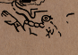

# Maya

## Introduction

Maya culture was one of the most sophisticated civilizations in the pre-columbian american continent. They developed a writing system which let them store and use their knowledge in a variety of forms: e.g. on how to perform rituals or delivering particular messages to an audience (political and sacred facts from rulers to the people, sculpted in monuments and stelae). These records allow us explore, through the laborious work of many researchers, their cosmovision and how they thought the cosmos came to be. Their knowledge was recorded in books (academically known as “codex”), like the Dresden codex (which describes the dates that Venus would pass through each of its visibility phases and also a table of lunar and solar eclipses), the Paris codex (which is believed to describe some of their constellations), the Madrid codex (which relates astronomy and agriculture data) and lately, the Grolier codex (it was thought that it was an abbreviated version of the Dresden codex, but it is not accepted yet as original by some scholars).

## Description

 <em>Page 49 of the Dresden Codex showing a section of the Venus Table.</em>

All mayan codices are thought to have been taken to Europe by the first explorers of the New World, as evidence of their discoveries. The Paris Codex in particular was then long forgotten, until priest Leon Rosny found it in 1859 in a chimney corner of the National Library of Paris. It has suffered substantial damage, as can be seen in page 23 shown below. In spite of this, the Paris codex describes asterisms and constellations seen by the mayas, some of them probably related to a group of zodiacal constellations (Love, 1994)(Freidel et al., 1993)(Aveni, 2005), while others do not (Špoták, 2015).

 
<em>Page 23 of the Paris Codex showing some Constellations.</em>

In this approach to representing the constellations in Stellarium, we assume that are related to the ecliptic, since in the Paris codex they seem to "swallow" the Sun, so they are placed as close as possible to this line while trying to adjust the star patterns to the images of the different animals thought to represent zodiacal constellations. Other constellations are placed according to what ethnographic sources state are their most probable location.  Constellation lines were drawn trying to adjust to the images taken from the above mentioned sources and they appear according to the interpretation of the contributors of this culture.

## Constellations

Some of the identified constellations from the Paris Codex are:

##### Bird *[Ch’oom]*

<table class="layout">
<tr><td></td><td>Not clearly identified, but some researchers describe it as a vulture, since it is not decorated and relates better to some ethnographic descriptions (Špoták, 2015).</td></tr>
</table>

##### Shark *[Xoc]*

<table class="layout">
<tr><td></td><td>The picture used for this constellation is in fact a combination of the elements of two animals: head of a snake and tail of a fish, so some scholars conclude this is a representation of a shark.</td></tr>
</table>

##### Owl *[Kulte']*

<table class="layout">
<tr><td></td><td>Identified as such by some scholars, specially because of the small body and feathers on the head that it exhibits.</td></tr>
</table>

##### Jaguar *[Balaam]*

<table class="layout">
<tr><td></td><td>Identified as such because of the typical marks exhibited which are related to the skin of this animal.</td></tr>
</table>

##### Death *[Kimi]*

<table class="layout">
<tr><td></td><td>This constellation appears in the Paris Codex as a skeleton, not yet clear whether it's an animal or not.</td></tr>
</table>

##### Scorpion *[Sina'an]*

<table class="layout">
<tr><td></td><td>Scholars agree that this maya constellation is in accordance to our Western culture Scorpion constellation, because of the "twisted" body that is suggested by this pattern of stars, however, for the mayas the sting is closer to the star Antares, because it should be next to the path of the Sun, as suggested by its position in the Paris Codex.</td></tr>
</table>

##### Rattlesnake *[Chaan]*

<table class="layout">
<tr><td></td><td>This animal is present through many species in the central america environment, but the one represented in the Paris codex is thought to be the Rattlesnake, because of the ending of the tail which shows the typical rattling ending of this reptile.</td></tr>
</table>

##### Bat *[Zool]*

<table class="layout">
<tr><td></td><td>Identified as such by its wings, as well as by the characteristic nose that this animal displays in the upper lip, typical in maya iconography.</td></tr>
</table>

##### Toad *[Uo]*

<table class="layout">
<tr><td></td><td>This animal is identified as such because of its necklace and the lack of teeth in its mouth (Špoták, 2015).  Freidel et al. (1993) place this animal in the Western culture constellation of Virgo.</td></tr>
</table>

##### Turtle *[Aak]*

<table class="layout">
<tr><td></td><td>The turtle was present during the creation of the world, located on the Western culture Orion's Belt asterism. This position in the sky is not really deduced from the Paris codex, but from the analysis made on the Bonampak murals, where the picture of the turtle is decorated with three points, very similar in position and orientation to Orion’s Belt, so this turtle representation has been used to place it in the Stellarium sky, instead of the one depicted in the Paris Codex.</td></tr>
</table>

Asterisms and constellations obtained through other archaeological and ethnographic sources (such as murals and manuscripts like the <i>Popol Vuh</i>) are described below:

##### Hole-backed Caiman: *[Way Paat Ahiin]*

The Milky Way in a vertical position relative to the horizon. This half-crocodile half-deer creature was sacrificed in a mythical time before the present one, an event which caused a storm of blood marking the end of the primordial chaos. On its back, the four trees -that lifted and hold the sky were placed- along with another supernatural being stepping on top of the decapitated body, thus fertilizing, founding or establishing the current order of things.

##### Paddler Gods:

This picture shows the Maize God being carried by a couple of paddler gods in a canoe to the place of creation: the Three Hearthstones (defined by the stars Alnitak, Saiph and Rigel, in the Western culture constellation Orion, and in Stellarium shown encircling the Oxib' Xk'ub', or Primordial Fire asterism), where he would be self-sacrificed for the creation of the cosmos to take place.

##### Primordial Fire: *[Oxib'Xk'ub]*

<table class="layout">
<tr><td></td><td>This fire was lighted at the moment of creation, and mayas saw its smoke represented as the Orion's nebula (M42), between three bright stars representing the three hearthstones.</td></tr>
</table>

##### Peccaries:

<table class="layout">
<tr><td></td><td>These pig-like animals are represented together just like the stars Castor and Pollux. The picture included in Stellarium was taken from the Bonampak mural.</td></tr>
</table>

### Stars and Planets Names

 Maya people, just as other ancient cultures, used stars to keep track of time. The stars included in this version of Stellarium are:

<ul>
<li> <b>Two brilliant ones: </b><i>[kib' chuplinik]</i>, <b>Castor and Pollux</b>, used at the beginning of the dry season to track the time at night.</li>
<li> <b>Single Star: </b><i>[jun ch'umil]</i>, <b>Regulus</b>, used in February to track the time at night.</li>
<li> <b>Corner Star: </b><i>[xukut ch'umil]</i>, <b>Alpha Centauri</b>, called like this because it marked the southern corner of the night sky at the end of the dry season, in April.</li>
<li> <b>Bright Star: </b><i>[Chac 'Ek]</i>, <b>Venus</b>, this planet was the God of War for the maya. In the Dresden Codex there is an almanac that was used to predict this planet's appearances and disappearances during its synodic period.</li>
</ul>

## Authors

This sky culture was contributed by <i>Eduardo Rodas-Quito</i> and <i>Javier Mejuto</i> of the Archaeoastronomy and Cultural Astronomy Department at Space Sciences Faculty, Universidad Nacional Autonoma de Honduras based primarily on the work of the authors described as follows:

## References

 - [#1]: [The Paris Codex: Complex Analysis of an Ancient Maya Manuscript (Dissertation)](https://www.academia.edu/25028815/The_Paris_Codex_Complex_Analysis_of_an_Ancient_Maya_Manuscript_Dissertation_?auto=download) by Jakub Špoták
 - [#2]: Freidel, D., Schele, L., Parker, J.(1993) *Maya Cosmos: Three Thousand Years On The Shaman's Path*, New York: William Morrow and Company Inc.
 - [#3]: Aveni, A.(2005) *Observadores del Cielo en el Mexico Antiguo*, Mexico D.F.: Fondo de Cultura Economica.
 - [#4]: Tedlock, B.(1999) Maya Astronomy: What We Know and How We Know It, *Archaeoastronomy, The Journal of Astronomy in Culture*, XIV(1), pp.: 39-58.
 - [#5]: Garcia Barrios, A. (2015) [El mito del diluvio en las ceremonias de entronización de los gobernantes mayas. Agentes responsables de la decapitación del saurio y nuevas fundaciones](https://www.sciencedirect.com/science/article/pii/S0185257415300010), *Estudios de cultura maya*, 45(45), pp. 9-48.

### Links of Interest

 - [Wikipedia: The Paris Codex](https://en.wikipedia.org/wiki/Paris_Codex)
 - [Bonampak, Viviendo el tiempo maya](https://maya.nmai.si.edu/es/gallery/bonampak)

## License

CC BY-NC-SA 4.0
