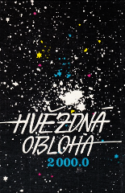
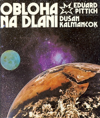

# Modern (O. Hlad)

## Introduction

Constellations according to classical Czech publication: *Hvězdná obloha 2000.0*[#1].

## Description

Another (rather similar) Czech and Slovak references are: [#2], [#3].

 

Constellation lines are designed so they mostly connect stars with Greek-letter (α, β, γ, ...) designations, brightest, or at least similarly bright stars, and especially if they form a mnemotechnic figure (like 'W' in case of Cas, or 'hurdles-runner' instead of Vir). We usually do *not* use 5th magnitude stars, because they are difficult to spot in towns affected by light pollution. The resulting figures are also a bit simpler and easier-to-remember for children. We use these constellations at the Observatory and Planetarium Hradec Králové ([http://www.astrohk.cz](http://www.astrohk.cz)).

Notes: UMa is taken from Pittich and Kalmančok (1981); M81 and M82 galaxies are just behind Bear's head. Gem is a similar case. Cam seems upside-down with respect to a mythological figure, but HIP 29997, 33694 stars are indeed brighter.

### Updates

Version 1.0 for Stellarium 0.13.1

Future updates should be available at [http://sirrah.troja.mff.cuni.cz/~mira/souhvezdi/](http://sirrah.troja.mff.cuni.cz/~mira/souhvezdi/)

## References

 - [#1]: Hlad, Hovorka, Polechová, Weiselová (1988): *Hvězdná obloha 2000.0*. Praha: Geodetický a kartografický podnik.
 - [#2]: Hlad, Hovorka, Sojka, Weiselová (2000): *Atlas Coeli Novus 2000.0*. Praha: Hvězdárna a planetárium hl. m. Prahy, ETC publishing.
 - [#3]: Pittich, Kalmančok (1981): *Obloha na dlani*. Bratislava: Obzor.

## Authors

Miroslav Broz

## License

GNU GPL v2.0
