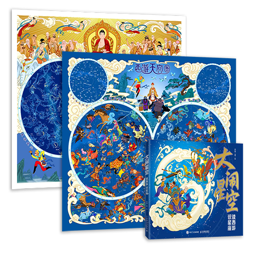

# Modern Journey to the West

## Introduction

*Journey to the West* is a classic of Chinese God and devil novels. It is written in the 16th-century Ming dynasty. It mainly chronicles the epic pilgrimage of the monk Xuanzang (Tang Monk) as he travels westward to obtain sacred Buddhist scriptures. He is accompanied by his three formidable disciples: the rebellious and powerful Monkey King, Sun Wukong; the humorous yet often gluttonous Zhu Bajie; and the steadfast Sha Wujing. Throughout their journey, they encounter a captivating array of celestial beings, demons, and deities, battling hardships and overcoming eighty-one tribulations to reach their ultimate goal.

This unique sky culture reimagines the classical Greco-Roman constellations, replacing their figures with deities, monsters, and magical artifacts from *Journey to the West*, creating an entirely new constellation world imbued with the rich hues of Chinese mythology.(The Journey to the West sky culture includes 84 of the 88 IAU standard constellations. The four constellations Circinus, Pictor, Pyxis and Telescopium have no corresponding figures or elements in the story.)

## Constellations

##### Yellow Wind Monster

Corresponding to the modern constellation *Ursa Minor*.

A golden-furred marten spirit who captured Tang Monk and wounded Sun Wukong's eyes with his Samadhi Wind. Lingji Bodhisattva later subdued him.

##### Black Bear Spirit

Corresponding to the modern constellation *Ursa Major*.

A monster from Black Wind Mountain who stole Tang Monk's precious robe. He was later tamed by Guanyin and converted to Buddhism.

##### Dragon King of the Eastern Sea

Corresponding to the modern constellation *Draco*.

The supreme ruler of the Four Seas and all aquatic creatures, appointed by the Jade Emperor.

##### Jade Emperor

Corresponding to the modern constellation *Cepheus*.

The supreme ruler of Heaven.

##### Erlang Shen (Yang Jian)

Corresponding to the modern constellation *Bootes*.

Also known as the True Lord Erlang, nephew of the Jade Emperor. A powerful deity who once captured Sun Wukong.

##### Vairocana Hat

Corresponding to the modern constellation *Corona Borealis*.

A monastic hat bestowed upon Tang Monk by Emperor Taizong of Tang, named for the Vairocana Buddha image adorning it.

##### Great Sage Equalling Heaven (Sun Wukong)

Corresponding to the modern constellation *Hercules*.

After defeating the Heavenly armies, Sun Wukong was given the hollow title "Great Sage Equalling Heaven." He was put in charge of the Peach Orchard but ended up stealing the peaches and ruining the Peach Banquet, leading to his rebellion.

##### Lute of the Heavenly King

Corresponding to the modern constellation *Lyra*.

The lute held by Dhṛtarāṣṭra (the Heavenly King of the East).

##### Mythical Azure Bird

Corresponding to the modern constellation *Cygnus*.

A divine bird similar to a phoenix, often found in celestial mountains and blessed lands in "Journey to the West."

##### Queen Mother of the West

Corresponding to the modern constellation *Cassiopeia*.

The head of all female divinities. She hosts the Peach Banquet at the Jade Pool, which Sun Wukong famously disrupted.

##### Zhu Bajie

Corresponding to the modern constellation *Perseus*.

In Chapter 79, Zhu Bajie kills a white-faced fox demon and drags it by the tail to present to the King of Bhīṣaṇa.

##### Keeper of the Heavenly Horses

Corresponding to the modern constellation *Auriga*.

The lowly official title given to Sun Wukong when he was tricked into ascending to Heaven, tasked with tending horses.

##### Heavenly King Virūpākṣa

Corresponding to the modern constellation *Ophiuchus*.

One of the Four Heavenly Kings, a divine general who guards the Heavenly Gate. His sacred treasure is the snake he holds.

##### Divine Serpent

Corresponding to the modern constellation *Serpens*.

The magical implement of Virūpākṣa is a serpent imbued with immense spiritual power.

##### Fire Arrow

Corresponding to the modern constellation *Sagitta*.

One of the fire tools of the Fire Virtue Star Officer, used to assist Sun Wukong in a fire attack.

##### Golden-Winged Great Peng

Corresponding to the modern constellation *Aquila*.

A mighty demon who established himself as king in the Kingdom of Lion-Camel. He allied with the Lion and Elephant demons to capture Tang Monk and was finally subdued by Buddha.

##### Zhu Bajie Transformed into a Catfish

Corresponding to the modern constellation *Delphinus*.

Zhu Bajie transforms into a catfish and swims into the Hot-Filth Spring to harass the seven spider spirits.

##### Horse-Face

Corresponding to the modern constellation *Equuleus*.

A denizen of the Underworld with a horse's head and a human body.

##### Heavenly Steeds

Corresponding to the modern constellation *Pegasus*.

Divine horses are kept in the Heavenly stables.

##### Chang'e

Corresponding to the modern constellation *Andromeda*.

A celestial maiden who resides in the Moon Palace.

##### Black Vulture Flag

Corresponding to the modern constellation *Triangulum*.

Owned by Zhenwu, the Celestial Honored One. In Chapter 33, Nezha unfurls this flag at the South Heaven Gate, blotting out the sun, moon, and stars.

##### Great Immortal Antelope

Corresponding to the modern constellation *Aries*.

One of the three master magicians of Tarrycart. An antelope spirit who competes with Sun Wukong meets his end in a pot of boiling oil.

##### Bull Demon King

Corresponding to the modern constellation *Taurus*.

Also known as the Great Sage Who Pacifies Heaven. A former sworn brother of Sun Wukong, his true form is a great white bull.

##### Golden Horn King & The Silver Horn King

Corresponding to the modern constellation *Gemini*.

Two boys who tended Laozi's furnace. They stole five of Laozi's treasures and became demons on Earth.

##### Crab General

Corresponding to the modern constellation *Cancer*.

A general serving under the Dragon King.

##### Nine-Headed Lion

Corresponding to the modern constellation *Leo*.

The mount of the Savior Celestial Honored One. He descended to the mortal world and was worshipped as a patriarch by other lions.

##### Queen of the Womanland

Corresponding to the modern constellation *Virgo*.

The ruler of an all-female kingdom who wished to marry Tang Monk.

##### Luggage Pole

Corresponding to the modern constellation *Libra*.

The pole carrying the luggage of the pilgrimage team.

##### Scorpion Spirit

Corresponding to the modern constellation *Scorpius*.

A demoness who captured Tang Monk with a whirlwind as the pilgrimage team passed the Womanland.

##### Wooden Unicorn (Dou)

Corresponding to the modern constellation *Sagittarius*.

One of the Twenty-Eight Lunar Mansions, who helped Sun Wukong capture three rhinoceros spirits.

##### Jade Dragon Transforming into a White Horse

Corresponding to the modern constellation *Capricornus*.

The third son of the Dragon King of the Western Sea. As punishment, Guanyin transformed him into a white horse to carry Tang Monk. The image captures his hybrid dragon-horse form during transformation.

##### Guanyin (Avalokiteśvara)

Corresponding to the modern constellation *Aquarius*.

The Bodhisattva who inspired the pilgrimage and frequently aided the team. Her vase can hold an entire ocean's worth of water.

##### Benborba & Baborben

Corresponding to the modern constellation *Pisces*.

Two minor fiends under the Dragon King of the Green Wave Pool—a catfish and a black fish spirit—were captured by Sun Wukong.

##### Water-Avoiding Golden-Eyed Beast

Corresponding to the modern constellation *Cetus*.

The mount of the Bull Demon King, a mythical beast capable of traveling through the sky and sea.

##### Nezha

Corresponding to the modern constellation *Orion*.

The Third Lotus Prince, son of Pagoda-Bearing Heavenly King Li. He assisted Sun Wukong in capturing the Bull Demon King.

##### Flowing-Sand River

Corresponding to the modern constellation *Eridanus*.

The place where Sha Wujing was exiled, a river so wide and treacherous that goose down would sink.

##### Jade Hare

Corresponding to the modern constellation *Lepus*.

The immortal hare of the Moon who pounds the elixir of life. She fled to the mortal world, disguised as a princess, and tried to marry Tang Monk.

##### Yellow Robe Monster

Corresponding to the modern constellation *Canis Major*.

Originally, the Wood Wolf (Kui) of the Lunar Mansions. He became a demon to be with a mortal princess he loved.

##### Metal Dog (Lou)

Corresponding to the modern constellation *Canis Minor*.

One of the Twenty-Eight Lunar Mansions.

##### Giant Red-Scaled Python

Corresponding to the modern constellation *Hydra*.

A massive python that occupied Mount Seven Extremes.

##### Crystal Cup

Corresponding to the modern constellation *Crater*.

The cup that Sha Wujing accidentally broke during a Peach Banquet, leading to his banishment.

##### Fire Crow

Corresponding to the modern constellation *Corvus*.

One of the fire tools of the Fire Virtue Star Officer.

##### Wooden Dragon (Jiao)

Corresponding to the modern constellation *Centaurus*.

One of the Twenty-Eight Lunar Mansions that helped capture the rhinoceros spirits.

##### Iron-Backed Grey Wolf Fiend

Corresponding to the modern constellation *Lupus*.

A minor fiend under the South Mountain King, appointed as a vanguard after capturing Tang Monk.

##### Flaming Mountains

Corresponding to the modern constellation *Ara*.

A mountain range of fire was created when Sun Wukong kicked over Laozi's furnace, causing bricks to fall to Earth.

##### Tight-Fillet

Corresponding to the modern constellation *Corona Australis*.

A treasure from Buddha used by Tang Monk to subdue Sun Wukong. It tightens and causes an immense headache when the Tight-Fillet Spell is recited.

##### Goldfish Monster

Corresponding to the modern constellation *Piscis Austrinus*.

A goldfish from Guanyin's lotus pond that achieved powers by listening to sutras. He occupied the Tongtian River, and his weapon was an unopened lotus bud.

##### Hair of the Queen of Dharma-Defying Kingdom

Corresponding to the modern constellation *Coma Berenices*.

To reform a king who vowed to kill 10,000 monks, Sun Wukong used magic to shave the heads of the entire royal court overnight.

##### Demon-Subduing Pestle

Corresponding to the modern constellation *Crux*.

A magical weapon of Nezha, sometimes depicted in a cross shape.

##### Parrot

Corresponding to the modern constellation *Columba*.

A yellow-feathered, red-beaked, white parrot, the pet of Guanyin, is often seen accompanying her.

##### White Deer

Corresponding to the modern constellation *Camelopardalis*.

The mount of the Star of Longevity, who caused trouble in the Bhīṣaṇa Kingdom.

##### Great King One-Horned Rhinoceros

Corresponding to the modern constellation *Monoceros*.

The Green Bull, the mount of Laozi, who stole the Vajra Noose and caused trouble on Earth.

##### Moon Swallow (Wei)

Corresponding to the modern constellation *Apus*.

One of the Twenty-Eight Lunar Mansions.

##### Alligator Minister

Corresponding to the modern constellation *Chamaeleon*.

A crocodile official in the Dragon Palace.

##### Mandarin Fish Matron

Corresponding to the modern constellation *Dorado*.

A strategist who advised freezing the Tongtian River to capture Tang Monk.

##### Red-Crowned White Crane

Corresponding to the modern constellation *Grus*.

The crane mount of Tai Bai Jin Xing, the Chinese deity of Venus.

##### White-Spotted Snake Monster

Corresponding to the modern constellation *Hydrus*.

A snake spirit disguised as a scholar, killed by Sun Wukong.

##### King of Purpuria

Corresponding to the modern constellation *Indus*.

A king was punished for hunting and harming a pair of peacocks, offspring of the Peacock Buddha Mother.

##### Sleep-Inducing Insect

Corresponding to the modern constellation *Musca*.

A small insect that causes drowsiness.

##### Male Peacock

Corresponding to the modern constellation *Pavo*.

The offspring of the Peacock Buddha Mother, shot by the prince who would become the King of Purpuria.

##### Nine-Headed Monstrous Bird

Corresponding to the modern constellation *Phoenix*.

A nine-headed monstrous bird who married the dragon princess and stole a sacred relic.

##### Command Flag

Corresponding to the modern constellation *Triangulum Australe*.

A triangular flag with the character "Ling" (Command), used by both heavenly troops and demons.

##### Thunder God

Corresponding to the modern constellation *Tucana*.

The god of thunder, depicted with a bird-like beak.

##### Carp Commander

Corresponding to the modern constellation *Volans*.

An aquatic officer in the Eastern Sea who presented a halberd to Sun Wukong.

##### Howling Celestial Hound

Corresponding to the modern constellation *Canes Venatici*.

Erlang Shen's sleek hound, which assisted in capturing Sun Wukong.

##### Dragon Alligator

Corresponding to the modern constellation *Lacerta*.

The nephew of the Dragon King of the Western Sea, who caused trouble in the Black River.

##### Yellow Lion Spirit

Corresponding to the modern constellation *Leo Minor*.

A lion spirit who stole the weapons of the pilgrims.

##### South Mountain King

Corresponding to the modern constellation *Lynx*.

A leopard spirit who captured Tang Monk using a clever stratagem.

##### Round Shield

Corresponding to the modern constellation *Scutum*.

A common type of round shield in ancient times.

##### Siming Spade

Corresponding to the modern constellation *Sextans*.

The weapon of the Yellow Lion Spirit. "Siming" refers to the sun, moon, stars, and cosmos; its blade resembles a 60-degree arc.

##### Nine-Tailed Vixen

Corresponding to the modern constellation *Vulpecula*.

The adoptive mother of the Golden and Silver Horn Kings, killed instantly by Sun Wukong.

##### Wind Bag

Corresponding to the modern constellation *Antlia*.

A sack controlled by the Wind Mother, capable of releasing great gales.

##### Thunder God's Wedge

Corresponding to the modern constellation *Caelum*.

The tool used by the Duke of Thunder to create thunder.

##### Eight-Trigram Furnace

Corresponding to the modern constellation *Fornax*.

Laozi's alchemical furnace was used to refine elixirs. Sun Wukong was trapped inside for 49 days.

##### Watchman's Clapper (Bangzi)

Corresponding to the modern constellation *Horologium*.

A bamboo or wooden clapper used by minor fiends for alarms or telling time.

##### Ling Sacred Mountain

Corresponding to the modern constellation *Mensa*.

Located in the Western Paradise, it is the site of the Temple of Great Thunderclap, where Buddha resides—the final destination of the pilgrimage.

##### Demon-Revealing Mirror

Corresponding to the modern constellation *Microscopium*.

A treasure of Heavenly King Li that reveals a demon's true form.

##### Ferule

Corresponding to the modern constellation *Norma*.

Used by the Patriarch Bodhi to hit Sun Wukong three times, hinting at a secret midnight lesson.

##### Old Man of the South Pole

Corresponding to the modern constellation *Octans*.

The Star of Longevity, whose identity is fused with the star Canopus. It is also known as the "South Pole Star" because Canopus was the southernmost bright star observable in ancient China.

##### Spider Web

Corresponding to the modern constellation *Reticulum*.

Web spun by the spider spirits, used to trap Tang Monk and Zhu Bajie.

##### Jade Seal of Passage

Corresponding to the modern constellation *Sculptor*.

A jade seal used to stamp the Travel Rescript (passport).

##### Soft-Shelled Turtle

Corresponding to the modern constellations *Carina, Puppis, Vela*.

A 1,300-year-old turtle that carried the pilgrims across the Tongtian River.

## Description

If you wish to learn more about the Journey to the West sky culture or to own a beautifully illustrated constellation map based on the story, we highly recommend the books and celestial charts authored and illustrated by **Xu Gang**.

https://item.jd.com/14924220.html

https://item.jd.com/14406961.html

## References

- [1]:Xu Gang. (2025). Monkey King Star Quest: A Guide to the Constellations（《大闹星空：读西游识星座》 ）. Beijing: Posts & Telecom Press. ISBN 9787115653604.
 
- [2]:Xu Gang. (2025). Monkey King Star Quest: Celestial Chart（《大闹星空：西游星座图》）. Beijing: Posts & Telecom Press. ISBN：9787115658395.

## Author

This sky culture was contributed to Stellarium by **Xu Gang, He Yuan and Sun Shuwei**.

Paintings & Text: Xu Gang（徐刚）, xg0205@163.com

Stellarium Integration: He Yuan（何原）, heyuan9965@126.com

Revision & Pinyin Transliteration: Sun Shuwei（孙殳玮）, sunshuwei.hi@foxmail.com

## License

CC BY-NC-ND 4.0
