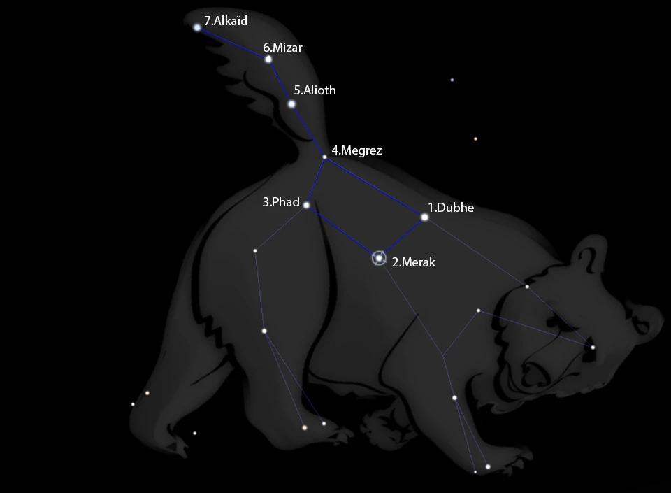

# Mongolian

## Introduction

Mongolian are nomads living on a large territory of central Asia. Their culture
is influenced by the Far Eastern (Chinese) and the Near Eastern (Persian,
Babylonian, Greek) cultures.

## Description

Mongolian constellations and cosmogony were inherited from the occidental
civilisation notably by the contact with Alexander the Great whose scholars
considered Babylonian astral science as highest standard. It was also largely
influenced by Chinese civilisation and Buddhist religion, resulting in numerous
myths and beliefs linked with what surrounds them. The local wild and fauna are
the main themes of this sky culture. The wealth of their cosmogony is probably
to link with the excellent observing conditions for whom they benefit even now.
In the past, the necessity for Mogolians to move and to get one's bearing even
during the night and at different seasons, is probably one of the elements
which developed their imagination facing the sky.

### Constellations

Generally, stars represent animals turning around the North Star which is
symbolized by the golden stick (_Altan Hadaas_). Almost all Mongolian asterisms
are similar to the modern ones but some of them have different names, e.g.: the
Swan is named _Num Sum_ (The Bow and the Arrow) and the Big Dipper is called
_Doloon Burkhan_. In the Mongolian imagination, the stars of the summer
triangle, i.e. Vega, Deneb and Altair, refer to three stags (_Gurvan Maral Od_
inMongolian) and Cassiopeia represents the Five Stars Woman (_Hun Tavan Od_).

### Planets and Stars

Originally, Tibeto-Mongolian astrology calculated the positions of each of the
five naked eye planets (Mercury, Venus, Mars, Jupiter, Saturn): planets beyond
Saturn were not recognized in the pre-telescopic era.

Like in Roman culture, the Mongolians attributed the five planets to each day
of the week, completing the seven days week with the Sun (_Nar_) for Sunday and
the Moon(_Sar_) for Monday. The names of the solar system's planets have some
peculiarities in Mongolian. Mercury is named _Bud_ (associated with Wednesday),
Venus, _Sugar_ (associated with Friday), the Earth, _Delkhii_, Mars, _Angarag_
(associated with Tuesday), Jupiter, _Barhasbadi_ (associated with Thursday),
Saturn, _Sanchir_ (associated with Saturday). The term for Uranus is
_Tengeriin-van_ and for Neptune _Dalai-van_. We can see that the two last,
invisible to the naked eye, and discovered long time after the others, have the
characteristics to have the particle _-van_ at the end of the name, indicating
the princely status in Mongolian. The Earth does not have this particle in the
name but dwarf planet Pluto (_Dalkhii-van_ in Mongolian) has a very similiar
designation and includes this particle. It is possible to translate Pluto'
Mongolian name as "The princely ground"; it is something like earth but not the
Earth (planet) but the ground/ surface on which we walk. Uranus,
_Tengeriin-van_, could be translated as "princely sky", and Neptun,
_Dalai-van_, as the "princely ocean". Nevertheless, this particle has no real
equivalent in English, and translations above are presented to give an idea of
the planets name's meaning. These names come from Sanskrit (language spoken in
India) and are largely used in the current language in Mongolia but in an
unofficial way.

It is also very interesting to see the tight link between terms designating
other celestial bodies and their beliefs: Indeed, the Milky Way is named
_Tengeriin Zadas_ which could literally be translated as the Sky Line
(_Tengeriin_, the sky, which also means the god of the sky, and _Zadas_, the
line). Well known in Mongolian star lore concerns Alcor, the star located above
Mizar in the Great Bear. It symbolises the recovery and protection star. It was
placed here by _Tengeriin_ (god of heaven) to protect Mizar. To become an
archer for Genghis Khan (13th century), it seemed that one had to be able to
discern these two stars with the naked eye.

From a historic point of view, this excellent knowledge of the sky goes back to
_Ulug Beg_ (AD 1394-1449; _Taraghay_ by his real name), astronomer,
mathematician and vice-king in Samarkand. His empire extended to Central Asia.
Turning away from his royal obligations, he examined celestial bodies and
astronomical questions of his time. He is the first to extremely precisely
measure Saturn's revolution period (_Sanchir_) with a sextant of 40 meters
radius.

### Myths and Legends

#### The Great Bear

Mongolians are particularly attached to the Great Bear. This constellation is
limited for them to the seven stars of the Dipper forming the bear's tail and
body, and the legend concerning it is probably the most famous in Mongolia.

>
> Once upon a time, there were eight orphan brothers gifted with outstanding
> capabilities living within a kingdom. The king and the queen lived within it
> peacefully. One day, a monster came and kidnapped the queen. The king asked
> the eight brothers to bring her back and said: "If one of you succeeds to
> rescue my beloved, I will give to him a golden arrow". The orphans went
> together to assist their queen. For two days and three nights they searched
> for the monster. Then, in the middle of the third night, they found and
> killed it. They brought back the queen in the castle.
>
> The king did not cut out the arrow in eight parts, he decided to throw it to
> the sky. The first to catch it could keep it. The youngest brother succeeded
> and changed immediately into the North Star. The seven others changed into
> the seven gods, the seven Buddhas visiting their younger brother every night.
> The name _Doloonburkhan_ (the Seven Buddhas) comes from this legend to
> appoint the Great Bear and the Golden Stick, _Altan Hadaas_, the Polar Star.
>

A tradition, particularly delightful, concerns the link between Mongolian
people and the Great Bear as one star of this constellation is attributed to
every Mongolian depending on their birth year in the Chinese calendar. Chinese
and Mongolian calendars have some similarities (the Mongolian calendar is a
lunar calendar). Each year is related to an animal and is associated with a
star of the constellation Great Bear. The first, Dubhe (alpha UMa), corresponds
to the rat's year, the second, Merak (beta UMa), corresponds to the year of the
ox and so on until the end of the Great Bear's tail where Alkaid symbolizes the
year of the horse. Then we start again at the first star in the year of the
sheep and we repeat the same way until the twelfth and last year of the Chinese
calendar, the one of the pig. Therefore, the two stars at the end of the tail
are assigned one time only.

This is a variant of the old Seven Buddha Sutra described by _Elverskog_. There
however, the association of the stars goes in an up-and-down movement, i.e.,
Dubhe/Rat, Merak/Ox,... Mizar/Snake, Alkaid/Horse, Mizar/Goat, ... Merak/Pig.

#### Shooting stars

Shooting stars have also a specific meaning for Mongolians: they are
personified through their beliefs. When they see these shooting stars they
imagine that it is a star which falls from the sky and which symbolizes
somebody who just died. Whereas occidental people make a wish, Mongolians say:
"Phew, it is not me!" (which is also a common belief among nomadic people of
the West Sahara and some Arabic tribes).

#### Neglected Legends

Three legends just as rich in meaning concern the Sun, eclipses and _Hun Tavan
Od_ (Cassiopeia). However, they are nowadays neglected and almost forgotten by
most Mongolians:

##### Sun

>
> At the origin of the world, there was only one man and vast particularly dry
> meadows, burned by the seven suns which lit the world. This man, a very good
> archer, made the promise to the gods that he pierced all these suns without
> missing a target even once. If he should fail, he would cut himself all the
> fingers one by one and leave to live in a hole like a marmot (groundhog) to
> ward off the curse that would weigh on him. He took his bow, pulled a first
> arrow and hit his target. A second, a third until the sixth which destroyed
> the suns. He finished by pulling his seventh arrow towards the last sun, when
> a swallow flew off and passed through its direction. The bird was hit. The man
> had not reached his goal, so he left towards exile in a hole, cut his fingers
> and turned into a marmot. The swallow had just saved our Sun, otherwise all
> life would have disappeared from the world's surface.
>

We have to see here a parallel with the number seven, important in the
Mongolian culture like all odd numbers. They bring luck in the buddhist
religion.

##### Eclipses

>
> At that time, there lived a scary monster named _Raah_ which frightened the
> entire world. He devoured all what were in its way. The god _Orchiwaani_
> owned a magic spring: whoever drank from it became immortal. One day, _Raah_
> stole the magic spring and drunk. The Moon and the Sun caught the monster in
> the act and reported to _Orchiwaani_. Seething with rage to hear about this
> piece of news he went to fight the monster. He cut its head many times but it
> grew again immediately because _Raah_ had become immortal. Then, he intended
> to cut its tail in order to allow all that it ate to leave again directly.
> Just as _Orchiwaani_ had seized the monster to finish it off, it escaped and
> disappeared between the Moon and the Sun. Then _Orchiwaani_ asked the Moon to
> help, who recaptured _Raah_ and cut its rump and its tail. In revenge, the
> monster comes back sometimes to eat the Moon or the Sun but they always
> immediately exit it. This is the mythological reason for lunar and solar
> eclipses.
>

When there is an eclipse, Mongolians know that it means that _Raah_ devours the
Moon or the Sun and they make a lot of noise in order to make the monster to
liberate the eclipsed one. In the 13th century, Guillaume de Rubruck wrote [#1]:

>
> Some \[Mongolian people\] have knowledge in astronomy and predict them \[to
> other Mongolian people\] the Lunar and Solar eclipses and, when it is about to
> produce one, everybody stocks up on food because they do not pass the door of
> their habitation. And while the eclipse happens, they play the drum and
> instruments and make big noise and clamors. When the eclipse is finished, they
> devote themselves to beverage and festivity and make a big party."
>

Eclipse travelers in 2008 still witnessed drivers and cooks hiding in their
tents and making noise with the pots. It seemed authentic, not a show for the
tourists. Also note the similarity of _Raah_ with Indian _Rahu_.

##### Cassiopeia (_Hun Tavan Od_)

Cassiopeia (_Hun Tavan Od_) symbolises unity, brotherhood, solidarity for the
Mongolians. The constellation's five stars represent unity of the five children
of Genghis Khan's wife, Oulin.

>
> Them did not get well along with each other and squabbled all the time. Their
> mother decided to strongly tie five ropes, and each one should try to untie a
> knot. If they succeeded, it meant that they didn't remain united with other,
> and that the brotherhood didn't gather in hard times. Conversely, if the knots
> withstood the test, the five brothers would remain united and close for the
> rest of their lives and would be victorious at the time of wars.
>

#### Other Beliefs Linked to the Sky

According to a Mongolian legend, a woman devoting herself to count one hundred
stars in the sky will dream about her future husband.

Sometimes, Mongolians honor the Great Bear (_Doloon Burkhan_) by throwing milk
in its direction. Milk, of white color, symbolizes purity in Mongolia. They
pray so that something may be fulfilled, but for several persons, not for just
one person, because this would bring bad luck. Milk can be replaced by vodka
which, due to its colorlessness, symbolizes the dark color and the strength for
Mongolians. By doing this, it avoids bad luck, quarrels, fear and fends off
evil spirits.

### Conclusion

The constellations are inspired by occidental ones, but the Mongolian
cosmogony, briefly exposed here, highlights a notable identity of beliefs which
are associated with it. Mongolian culture and knowledge transmission is
essentially verbal, and so few written traces exist about these subjects. It is
therefore particularly hard to relate their cosmogony with high fidelity and
precision. In order to preserve knowledge about this cosmogony, every
observation, suggestions or collaboration are welcome!

### Acknowledgements and Further Reading

*   Bayrlalaa (thank you) to Mongolians, for their kindness and their help in the gathering of these informations about their culture and their cosmogony
*   [L'Uranoscope de France](http://uranoscope.free.fr)
*   [L'Association Française d'Astronomie / The French Astronomy Association](http://www.afanet.fr)
*   [OutOfNowhere](http://www.outofnowhere.asia)

## References

 - [#1]: Les astres chez les Turcs et les Mongols_ by Jean-Paul Roux(French). _Revue de l'histoire des religions_, tome 195 n°2,1979. pp; 153-192.
 - [#2]: Johan Elverskog: The Mongolian Big Dipper Sutra. Journal of the International Association of Buddhist Studies 29 Nr1 2006(2008), pp87-123. [Link](https://journals.ub.uni-heidelberg.de/index.php/jiabs/article/download/8974/2867)

## Authors

This skyculture is a contribution from two users of Stellarium, [Anthony
Lagain](mailto:anthony.lagain@gmail.com) and [Batiste
Rousseau](mailto:batiste.rousseau@gmail.com) mainly based on oral tales of
numerous Mongolians met during a two months stay in Mongolia.

To learn more about them: [www.souslecieldemongolie.wordpress.com](http://souslecieldemongolie.wordpress.com/) (in French).

Re-worked and adapted by Susanne M Hoffmann

## License

CC BY-SA
