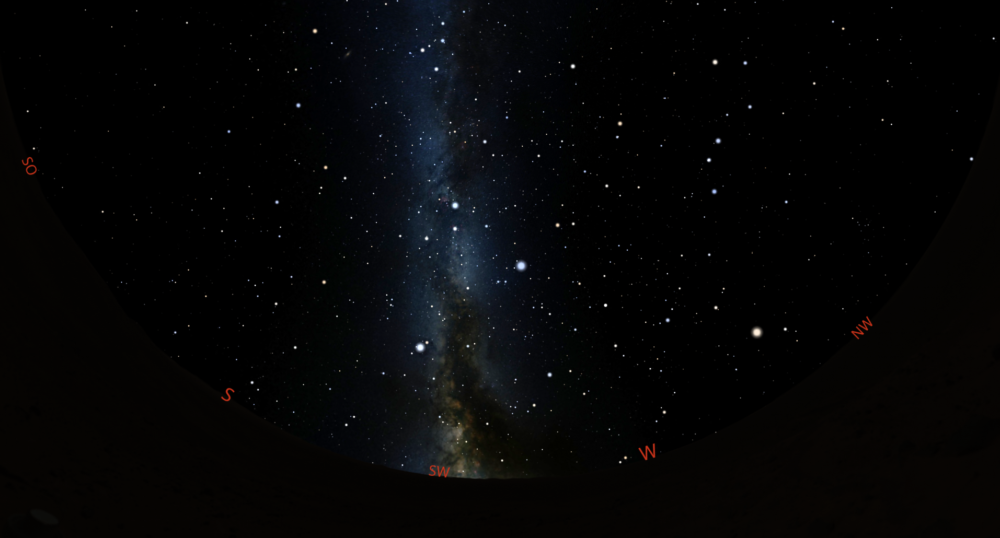

# Norse (Edda)

## Introduction

In the 13th century, Snorri Sturluson provided the most comprehensive documentation of myths from Old Norse culture that we know of today in his Edda. In this sky culture, the Eddic myths are to be brought into the sky in the form of constellations. Since there are no records of constellations from this time and region, the reconstruction of these constellations is a speculative. In our visualisations we follow various literary scholars who found parallels to Norse mythology in the Edda. 

## Description

The Eddic myths were widespread in the North Germanic cultural area, which encompasses present-day Scandinavia (Denmark, Norway, Sweden, Iceland). They were written down in the 13th century in Iceland, predominantly in two literary works, the Prose Edda and the Poetic Edda, this way representing the most important sources of our knowledge on Norse mythology. The culture referred to here therefore includes the North Germanic peoples from the 13th century and earlier. An important factor in observing the sky at this latitude is the brightness of the midnight sun in summer. During several weeks, the sky at Iceland's latitude does not get dark or only for a very short time, which severely limits the possibility of observing stars during this period. Given the fact that Snorri’s Edda was written in Iceland and under the assumption, that some of the myths describe celestial phenomena, this plays an important role in the localization of assumed constellations: for instance, the modern constellation of Scorpius, the Scorpion, is hardly visible, so, it won't be identified with any Norse constellation. More information and discussion of each one of the (hypothetical) constellations will be given in the All Skies Encyclopaedia.

### Sky

The origin of the Eddic myths remains disputed (Jonsson 1994 [#3], p. 41). In recent decades, some attempts have been made to map the sagas of the Edda onto constellations in the night sky. However, this fact does not negate Snorri's statement that the phenomena he describes are quite literally located in the sky (Sigurdson 2022 [#7], p. 239). Snorri Sturluson provides a systematic, sequential description of mythological cosmogony in his Edda. Gangleri, the protagonist of Gylfaginning, is told that in the beginning lights were assigned a staðr (place) and a path in the sky. Their movements marked the passage of time. The Sun is given salir (halls) and the stars staðir (places) by the gods (Æsir). These are the key terms in Gylfaginning for celestial locations and phenomena (Sigurdson 2022 [#7], p. 239). After that several places in the sky are described, some of which can be found here as constellations. The sky itself was created by the Æsir from the skull of the primeval giant Ymir, whom they had slain (Sturluson 2017 [#9], p. 21). Subsequently, they took sparks that had flown from Muspelheim, the realm of fire, and set them in the sky as stars (Sturluson 2017 [#8], p. 22).

### Moon and Sun

Due to the geographical latitude at which many inhabitants of ancient Scandinavia lived, summers are very bright and winters very dark. At the latitude of Iceland, there are even several weeks in summer during which hardly any stars can be observed at night. Likewise, there are several weeks in winter when the sun is barely visible and the moon rises only a few degrees above the horizon (or not at all, depending on its orbit's position). Under these unreliable conditions, it is unlikely that Old Norse peoples maintained detailed calendars based on the sun or the moon. In Eddic mythology, the sun and the moon are personified as the children of Mundilfari. The son, Mani, steers the course of the moon, and the daughter, Sol, that of the sun (Sturluson 2017 [#8], p. 24). Neither may ever stop on their paths, for both are pursued by wolves that wish to devour them. The wolf chasing the sun is called Sköll, and the one chasing the moon is called Hati. When Ragnarök begins, the downfall of the gods, both will be devoured by the wolves (Sturluson 2017 [#8], p. 25).

### Planets

Due to the lack of reliable sources, planets are excluded from this sky culture. 

### Zodiac

Considering that some parts of the zodiac are not visible at all throughout the year at Iceland’s latitude, and that almost no constellations can be observed during the summer, no attempt has been made here to include a zodiac. The same goes for a lunar system.

### Milky Way

In this model, the Milky Way serves as the embodiment of the world tree Yggdrasil. This ash tree is the largest and best of all trees, and its branches spread across the entire world (Sturluson 2017 [#8], p. 28). It has three roots, and beneath each one is a spring. Several literary scholars believe that locating Yggdrasil in the sky would be useful for understanding the topography of the Eddic myths. However, this is contradicted by the description of animals living in the tree (Lorenz 1984 [#5], p. 241). If we assume that the animals mentioned, such as squirrels and eagles, are also celestial objects/ constellations, then Yggdrasil forms a super-constellation containing these constellations, and equating it with the Milky Way becomes rather inevitable. Sigurdson (2022) [#7] and Jonsson (1994) [#3] also believe that this translucent white tree in the sky should be understood as a mythical analogue of the Milky Way (Sigurdson 2022 [#7], p. 238). 

## Constellations

Although many Eddic constellations are based on on many assumptions and guesses, those that are also mentioned in the Rimtöl-gloss (Úlfs Keptr, Asar Bardagi, Fiskikarlar) are described with more certainty. The only constellations the Edda specifically describes as stars are Aurvandils tá and Þjaza augu. 

##### Aurwandill's Toe
Aurvandils tá (Aurwandill’s toe) is the toe of the hero Aurwandill, which froze when he was carried by Thor across the icy river Eliwagar. Thor broke off the toe, cast it into the sky, and thereby transformed it into an asterism (Sturluson 2017 [#8], p. 111). Persson (2017) [#6] suggests Corona Borealis as the corresponding constellation. On the one hand, its shape resembles that of a toe; on the other, as a spring constellation, it allows an interpretation of the toe as a symbol of the victory of spring over winter (Persson 2017 [#6]).

##### Thiazi's Eyes
Þjaza augu (Thiazi’s eyes) are the eyes of the giant Thiazi, who abducted the goddess Idun. The Æsir fought and killed Thiazi, and when his daughter sought revenge, Odin, as a sign of respect, cast Thiazi’s eyes into the sky, transforming them into stars (Sturluson 2017 [#8], p. 83). There is no concrete evidence as to which stars these might be, but the two bright and closely positioned stars Castor and Pollux are obvious candidates.

##### Bifröst
Bifrǫst (bifrost) is the bridge that extends from the Earth to the heavens (Edda, 1997/2017, p. 26). The Æsir ride across Bifrǫst daily to the well of Urðr at the World Tree and hold council there (Sturluson 2017 [#8], p. 29). In literary scholarship, Bifrǫst is identified as a rainbow by day and as the Milky Way by night (Persson [#6], 2017). However, the Milky Way is already well represented by Yggdrasil, and the translation of Bifrǫst as “shimmering road” (Persson [#6], 2017) could equally well be interpreted as a stellar formation. The arc-shaped group of stars from Pegasus to Deneb in the Milky Way closely resembles a bridge leading the Æsir to the well of Urðr at Yggdrasil. 

##### Heimdall’s Castle
Himinbjǫrg (Heimdall’s castle) is the structure standing on Bifröst and inhabited by the Æsir Heimdall, who has keen eyesight and guards the bridge against giants (Sturluson 2017 [#8], p. 39). The quadrilateral formed by Algenib, Markab, Alpheratz, and Scheat at the long arc conveys a clear image of a structure atop a bridge.

##### Jaw of the Wolf
Úlfs Keptr (jaw of the wolf) is a constellation mentioned in the Rimtöl glosses and identified with the Hyades (Sigurðsson 2022  [#7], p. 241). Wolves play a significant role in Old Norse mythology, as they are foretold to devour the sun and moon at Ragnarök (Sturluson 2017 [#8], p. 25). The Hyades lie along the moon’s path, and their V-shaped arrangement naturally invites comparison with a jaw snapping at the moon. Holmberg (2022 [#2], p. 18) further proposes that this wolf-jaw constellation may already have been recorded on the Rök Runestone in the early 9th century.

##### Thor's Chariot
Þórs vagn (Thor’s chariot) is the chariot of the thunder god Thor, drawn by two goats (Sturluson 2017 [#8], p. 35). Thor, alongside Odin, was one of the principal deities in Old Norse mythology. Due to his strong connection to weather, he was crucial not only for seafaring but also for agriculture (Lorenz 1984 [#5], p. 308). The shape of a chariot formed by the brightest stars of the Big Dipper lends itself well to association with Thor’s chariot. The Rimtöl gloss also records the constellation under the name Karlvagn or “man’s chariot” (Persson [#6], 2017).

##### Freyja's Chariot
Freyju vagn (Freyja’s chariot) is the chariot of the fertility goddess Freyja, drawn by cats. When Freyja rides to a battlefield, she receives half of the slain warriors, the other half going to Odin (Sturluson [#8] 2017, p. 38). In the Rimtöl gloss, the small chariot in Ursa Minor is referred to as Kvennavagn, or “woman’s chariot” (Persson [#6], 2017).

##### Freyr's Sickle
Freys sigð (Freyr’s sickle) belongs to the god Freyr, who governs rain and sunshine and thus the fertility of the earth. He is invoked for a good harvest (Sturluson 2017 [#8], p. 37). The star Spica (“ear of grain”) served as a calendar star for sowing and harvest in various cultures and periods. A constellation corresponding to a sickle located around Spica fits into Old Norse mythology, as Freyr is depicted on an 11th-century runestone (Gotland Runic Inscription 181). The depicted shape is an approximation, but it can be traced through the brightness of the stars forming the sickle.

##### Thor
Þórr (Thor) was, alongside Odin, a central deity in Norse mythology. The two objects associated with him in the Edda are his hammer Mjöllnir and his belt, which doubles his strength (Sturluson 2017 [#8], p. 35). The constellation Orion was well known in the Middle Ages, and in various cultures figures holding objects were interpreted within it. The three bright belt stars are particularly prominent and could represent Thor’s belt of strength. Objects interpreted elsewhere as a shepherd’s staff (Babylonian) or a piece of leather (Greek) could here symbolize Thor’s hammer.

##### River Van
Ván is the river that flows from the mouth of Fenris after the Æsir bound him and inserted a sword into his jaws (Sturluson 2017 [#8], p. 44). Its proximity to Thor in this model is notable, as wading through rivers is a typical Thor motif (Lorenz [#5] 1984, p. 253).

##### The Asar Battlefield
Asar Bardagi (battlefield of the Æsir) is mentioned in the Rimtöl gloss and equated with the constellation Auriga. The Edda recounts multiple battles involving the Æsir and daily skirmishes among Odin’s warriors, the einherjar, in Valhalla (Sturluson 2017 [#8], p. 51). Holmberg (2022 [#2], p. 21) suggests possible references to the early 9th-century Rök Runestone, which also describes a battlefield, supporting the celestial interpretation.

##### Fishermen
Fiskikarlar (the fishermen) is a constellation preserved in the Rimtöl gloss. The name “fishermen” likely refers to the fishing episode in the Edda, where Thor and the giant Hymir fish for the Midgard Serpent using the head of the ox Himinhjǫrð (Sturluson 2017 [#8], p. 66). The legend predates the Rimtöl gloss, recorded already in the 10th century (Krause 2010 [#4], p. 133). The identification of the constellation with Orion’s three belt stars fits the stellar culture, as Thor is both part of the fishermen in the myth and represented by the Orion constellation. Positioning the fishermen next to the Midgard Serpent and the ox’s head is consistent with representing the fishing episode in the sky.

##### Midgard Serpent
Jormungandr (Midgard Serpent) is the serpent that spans the world in Eddic myths. As Thor’s adversary, it appears in the fishing episode (Sturluson 2017 [#8], p. 66). It can be associated with a constellation similar to Hydra, but in this model, stars visible from Iceland are used. The position along the Milky Way is notable, as the dragon or snake Nidhögg lies beneath a root of Yggdrasil and gnaws at it (Sturluson 2017 [#8], p. 28). In this model, where the Milky Way represents Yggdrasil, Jormungandr could assume Nidhögg’s role.

##### Ox Head
Himinhjǫrð (ox’s head) is the largest ox in Hymir’s herd, which Thor beheads to use as bait for fishing the Midgard Serpent (Sturluson 2017 [#8], p. 65). The bright star Procyon, situated between Thor and the Midgard Serpent, provides a suitable reference point.

##### Ratatosk
Rátatǫskr is the squirrel that scurries along the World Tree, carrying messages between Nidhögg, the serpent, and the eagle (Sturluson 2017 [#8], p. 30). Cassiopeia lies on the Milky Way between the constellations representing the eagle and the serpent.

##### Eagle Giant (Hraesvelgr)
Hræsvélgr (Hraesvelgr) is the giant in eagle form sitting at the edge of the sky, generating wind through the beating of his wings (Sturluson 2017 [#8], p. 33). The Edda also mentions an eagle perched in Yggdrasil (Sturluson 2017 [#8], p. 30). The constellation’s shape and position on the Milky Way fit this model, and the eagle is visible in the early evening during autumn, assigning Hraesvelgr a role as a sign of autumnal storms.

##### Boiling Well
Hvergelmir (the boiling well) is one of the springs under Yggdrasil’s three roots. Nidhögg also dwells there, gnawing at the root (Sturluson 2017 [#8], p. 28). The wells are represented by gaps in the bright band of the Milky Way, with a larger dark area near Alhena corresponding to the serpent’s proximity.

#####  Mimir's Well
Mímis brunnr (Mímir’s well) is the source of wisdom, from which Odin sacrificed his eye to drink (Sturluson 2017 [#8], p. 28). The wells are depicted by gaps in the bright band of the Milky Way, with the dark area near Vega serving as Mímir’s well, and Vega representing Odin’s sacrificed eye.

##### Well of Urd
Urðarbrunnr (well of Urðr) is the spring at which the Æsir hold daily council. To reach it, they ride across Bifröst (Sturluson 2017 [#8], p. 28). The wells are again represented by gaps in the Milky Way, with a larger dark spot at the end of Bifröst near Daneb representing the spring beneath Yggdrasil’s root. 

## References

 - [#1]: Beckman, N. & Kålund, K. (eds.) (1914–1916) Alfræði íslenzk II: Rímtöl. Copenhagen: Hið íslenzka bókmenntafélag.

 - [#2]: Holmberg, P. (2022) ‘Watching Star Wars with Viking Age Subtitles: An analysis of cohesion and coherence in the Rök runestone inscription’, Arkiv för nordisk filologi, 137, pp. 231–246. (Publication date: 2 May 2025).

 - [#3]: Jonsson, B. (1994) Star Myths of the Vikings: A New Concept of Norse Mythology. Swan River, Manitoba: The Author.

 - [#4]: Krause, A. (2010) Reclam’s Lexicon of Germanic Mythology and Heroic Legend. Stuttgart: Philipp Reclam jun.

 - [#5]: Lorenz, G. (1984) Gylfaginning. Text, translation and commentary. Darmstadt: Wissenschaftliche Buchgesellschaft. (Texte zur Forschung, 48).

 - [#6]: Persson, J.R. (2017) Norse Constellations. ResearchGate. DOI: 10.13140/RG.2.2.15662.92483.

 - [#7]: Sigurðsson, G. (2022) ‘How Gylfi’s Illusion Breathes Life into the Sky’, Religionsvidenskabeligt Tidsskrift, 74, pp. 231–246. DOI: 10.7146/rt.v74i.132105.

 - [#8]: Sturluson, S. (2017) The Edda of Snorri Sturluson. Translated by K. Simrock. Bibliographically updated edition. Stuttgart: Reclam. 

## Authors

This sky culture was contributed to Stellarium by Jakob Eyermann consulting with Susanne M. Hoffmann as part of a German studies term paper.

### About

Sophie Marshall and Susanne M. Hoffmann served as mentors during the research process. Several constellations were taken from the Rimtöl gloss and thus from Jonas Persson's sky culture “Norse”.

## License

CC BY 4.0

