# Potawatomi

## Introduction

Potawatomi (also called Bodwéwadmi and Neshnabé among others) people are Indigenous to North America with ancestral homelands that span the north east to just west of the Great Lakes region and currently reside in both the United States and Canada. While there are dozens of individual tribes or bands within the larger Potawatomi nation, the Potawatomi Star Knowledge project team members who developed this sky culture are enrolled citizens of the Pokagon Band of Potawatomi, a federally recognized tribe located in southwestern Michigan. You can learn more about the Pokégnêk Bodwéwadmik (Pokagon Potawatomi \[people\]) by visiting their government website at: https://www.pokagonband-nsn.gov/

For more information about Potawatomi history and culture, consider the following sources (not an exhaustive list):

 - Everett Claspy, _The Dowagiac-Sister Lakes Resort Area: And More about Its Potawatomi Indians_ (1966)
 - James A. Clifton, _The Pokagons, 1683-1983_ (University Press Of America, 1984)
 - James Clifton et al., _People of the Three Fires: The Ottawa, Potawatomi, and Ojibway of Michigan_ (Gritc Pub, 1986)
 - James A. Clifton and Frank W. Porter, _Potawatomi_ (Chelsea House Pub, 1987)
 - R. David Edmunds, _The Potawatomis: Keepers of the Fire_, Reprint edition (University of Oklahoma Press, 1987)
 - Raymond C. C. Lantz, _Potawatomi Indians of Michigan, 1843-1904, Including Some Ottawa and Chippewa, 1843-1866, and Potawatomi of Indiana, 1869 and 1885_ (Heritage Books, Inc, 2019)
 - John N. Low, _Imprints: The Pokagon Band of Potawatomi Indians and the City of Chicago_, 1st edition (Michigan State University Press, 2016)
 - Blaire Morseau, _[Mapping Neshnabé Futurity: Celestial Currents of Sovereignty in Potawatomi Skies, Lands, and Waters](https://uapress.arizona.edu/book/mapping-neshnabe-futurity)_ (University of Arizona Press, 2025)
 - Benjamin Secunda, _[In the Shadow of Eagle’s Wings: The Effects of Removal on the Unremoved Potawatomi](https://www.librarything.com/work/14044896)_ (University of Notre Dame, 2008)
 - Jim Thunder, Sr. and Mary Jane Thunder, Wete Yathmownen, _[Real Stories: Potawatomi Oral History](https://shop.fcpotawatomi.com/products/wete-yathmownen-real-stories-potawatomi-oral-history/)_ (2018)
 - Wetzel, _Gathering the Potawatomi Nation_, First edition (OUP, 2016)

## Description

### Project Background

This sky culture was developed by the Neshnabé Nengosêk Kenomagéwen (Potawatomi Star Knowledge) Project which is an Indigenous-centered digital humanities effort to sustain and share Potawatomi constellations, celestial stories, and teachings about the movements of the skies. The project’s core purpose is intergenerational: to return star knowledge to everyday use among Potawatomi families, especially youth, while offering non-Native learners a respectful window into a living intellectual tradition. Rooted in Pokagon Band-led star knowledge gatherings (2019) and formalized through the Digital Scholarship Lab incubator at Michigan State University (2023–2024), the project pairs careful cultural protocol with practical technology. By contributing this Potawatomi sky culture that renders Potawatomi constellations, names, narratives, and seasonal practices in place and time we hope to keep the work accessible, sustainable, and accountable (guided by an advisory committee with Potawatomi linguistic and cultural expertise). For the most up-to-date information about the Neshnabé Nengosêk Kenomagéwen (Potawatomi Star Knowledge) Project, please visit: https://www.blairemorseau.com/potawatomi-star-knowledge

Funding for the development of this sky culture has been generously provided by the Michigan State University Digital Humanities Seed Grant: https://digitalhumanities.msu.edu/seed-grant-funding/ 

### Artwork

Constellation artwork by Pokagon Band Potawatomi illustrator, Aaron Martin, aligns the digital renderings with traditional Indigenous Woodland-style visual language, reinforcing meaning through culturally resonant design. Together, these choices make the project not only a technical deliverable but a community stewardship model for celestial knowledge and a decolonial teaching tool that centers Potawatomi ways of seeing the night sky.

Please be aware that the artistic renderings of the constellations are the interpretations by one artist. That is, figures may be interpreted differently from community to community and even from person to person within the same community. Because this traditional knowledge spans tribes, bands, and even international borders, we encourage users of this sky culture to respectfully engage with alternative visions of the Potawatomi sky.

### Curation Decisions

Several Potawatomi constellations can be represented by different figures and names depending on season and story (e.g., Western “Orion” as Ktthe Sabé, Nenikboz, or Pondésé). For visual clarity in Stellarium, we selected one stick figure and one artwork per constellation but have documented alternatives in this sky culture description so learners understand the plural nature of the tradition rather than a single fixed mapping. Please see the full list of Potawatomi constellations below.

## Constellations

##### Thethak / Wabzhi / Bgak

Potawatomi: Thethak ([pronunciation](https://wiwkwebthegen.com/dictionary-word/thethak-n%C3%ABgos)) / Wabzhi ([pronunciation](https://wiwkwebthegen.com/dictionary-word/wabzhi)) / Bgak

English Translation: Crane / Swan / Human skeleton-like creature with wings

Corresponding Western Constellation: Summer Cross

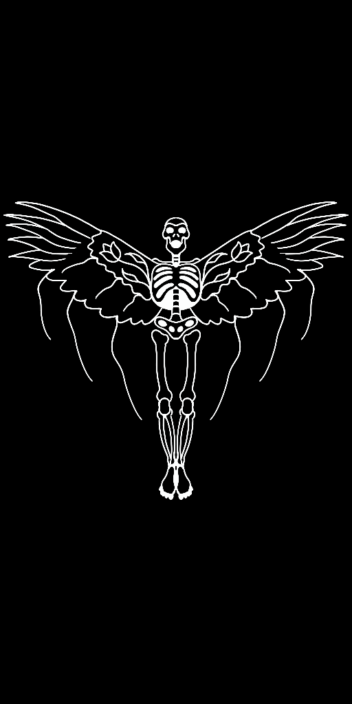

##### Bzhêké

Potawatomi: Bzhêké ([pronunciation](https://wiwkwebthegen.com/dictionary-word/bzh%C3%AAk%C3%A9-n%C3%ABgos))

English Translation: Bison

Corresponding Western Constellation: Taurus

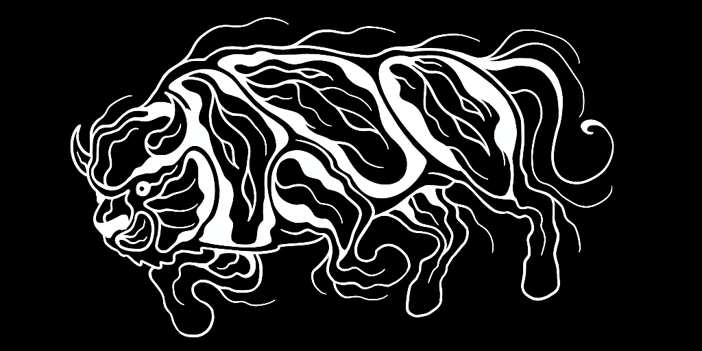

##### Gigo

Potawatomi: Gigo ([pronunciation](https://wiwkwebthegen.com/dictionary-word/gigo-n%C3%ABgos))

English Translation: Fish

Corresponding Western Constellation: Delphinus

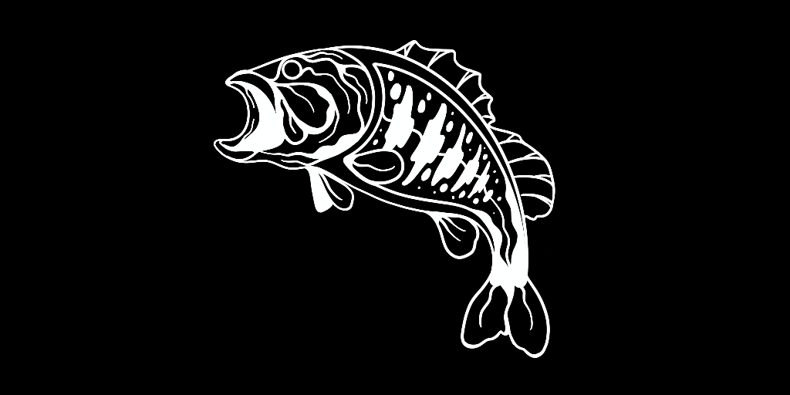

##### Pondésé / Ktthe Sabé / Nenikboz

Potawatomi: Pondésé ([pronunciation](https://wiwkwebthegen.com/dictionary-word/pond%C3%A9s%C3%A9-n%C3%ABgos)) / Ktthe Sabé ([pronunciation](https://wiwkwebthegen.com/dictionary-word/ktthe-sab%C3%A9-n%C3%ABgos)) / Nenikboz ([pronunciation](https://wiwkwebthegen.com/dictionary-word/nenikboz-n%C3%ABgos))

English Translation: Winter Maker / Bigfoot / Nanabozho

Corresponding Western Constellation: Orion (does not have a bow like Nenikboz/Nanabozho does)

##### Mang

Potawatomi: Mang ([pronunciation](https://wiwkwebthegen.com/dictionary-word/mang-n%C3%ABgos))

English Translation: Loon

Corresponding Western Constellation: Ursa Minor

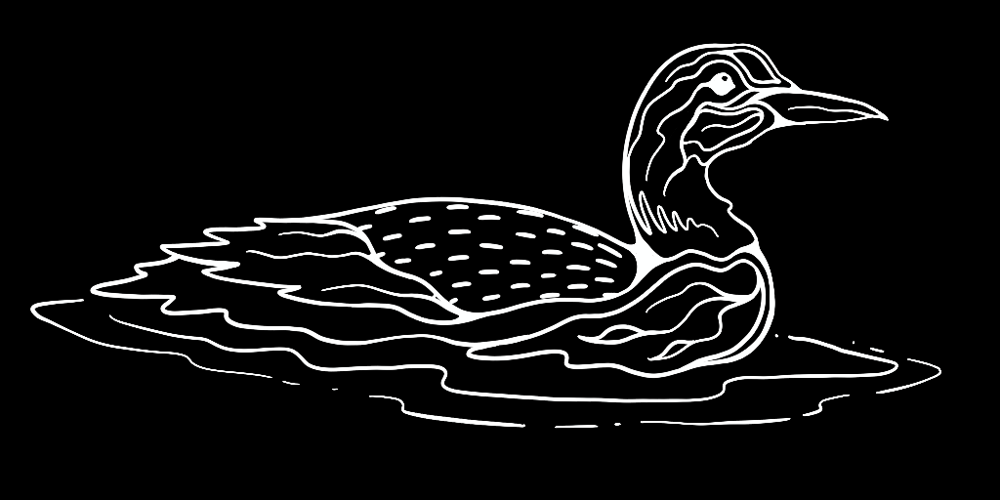

##### Mdodo Senik

Potawatomi: Mdodo Senik ([pronunciation](https://wiwkwebthegen.com/dictionary-word/mdodosenik))

English Translation: Sweat Lodge Stones

Corresponding Western Constellation: Pleiades

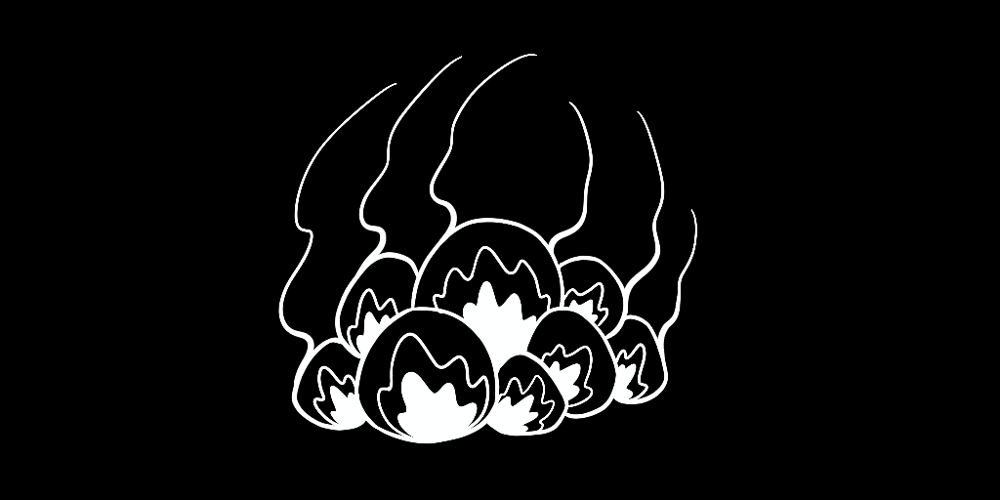

##### Mdodoswen

Potawatomi: Mdodoswen ([pronunciation](https://wiwkwebthegen.com/dictionary-word/mdodoswen))

English Translation: Sweat Lodge

Corresponding Western Constellation: Corona Borealis

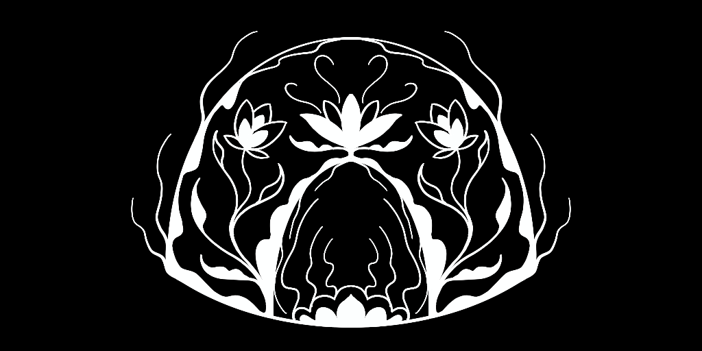

##### Mëk

Potawatomi: Mëk ([pronunciation](https://wiwkwebthegen.com/dictionary-word/m%C3%ABk-n%C3%ABgos))

English Translation: Beaver

Corresponding Western Constellation: Gemini

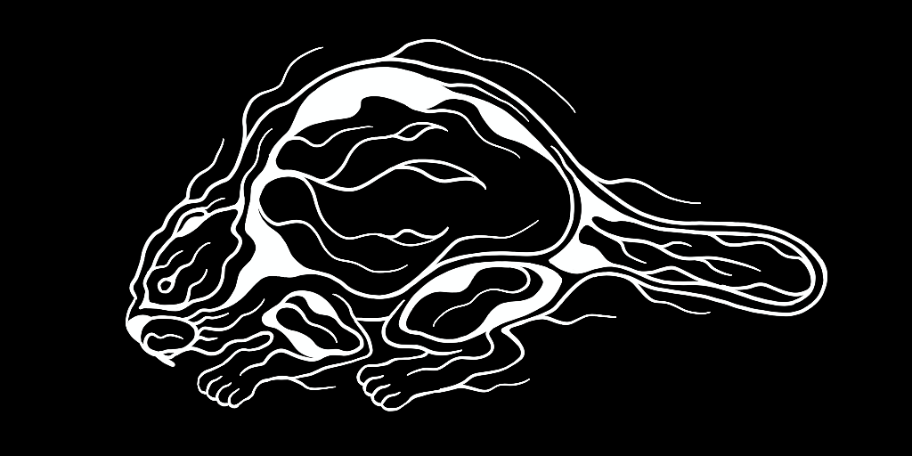

##### Mko Shtegwan

Potawatomi: Mko Shtegwan ([pronunciation](https://wiwkwebthegen.com/dictionary-word/mko-shtegwan))

English Translation: Bear Head

Corresponding Western Constellation: Summer Triangle

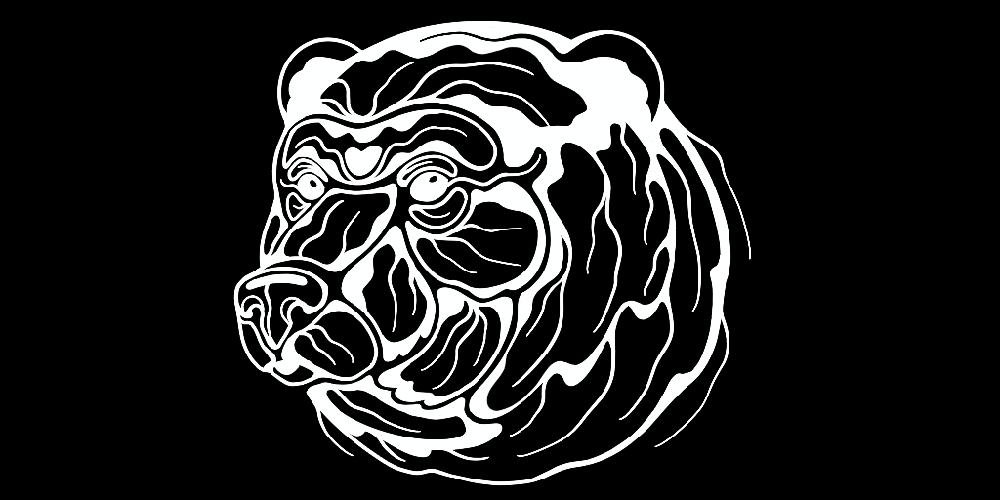

##### Mo’ëwé

Potawatomi: Mo’ëwé ([pronunciation](https://wiwkwebthegen.com/dictionary-word/mo%E2%80%99%C3%ABw%C3%A9-n%C3%ABgos))

English Translation: Wolf

Corresponding Western Constellation: Canis Major

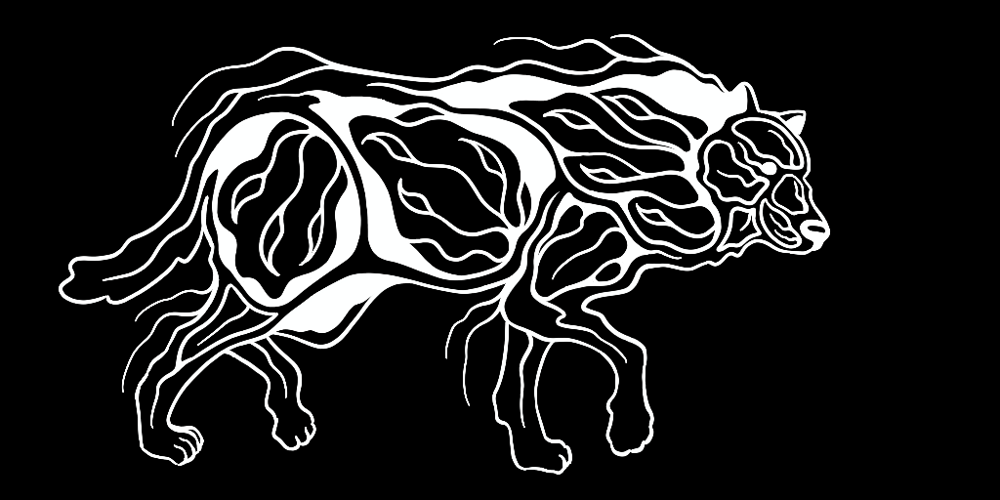

##### Moz

Potawatomi: Moz ([pronunciation](https://wiwkwebthegen.com/dictionary-word/moz-n%C3%ABgos))

English Translation: Moose

Corresponding Western Constellation: Pegasus

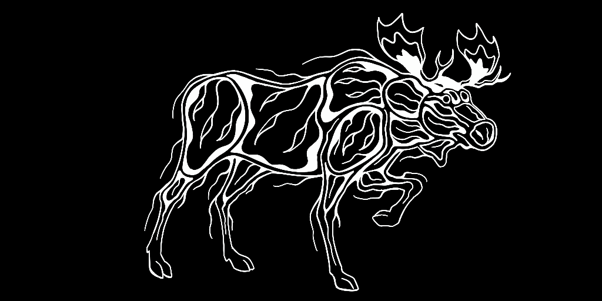

##### Mshignébêk

Potawatomi: Mshignébêk ([pronunciation](https://wiwkwebthegen.com/dictionary-word/mshign%C3%A9b%C3%AAk-n%C3%ABgos))

English Translation: Big Snake

Corresponding Western Constellation: Hydra

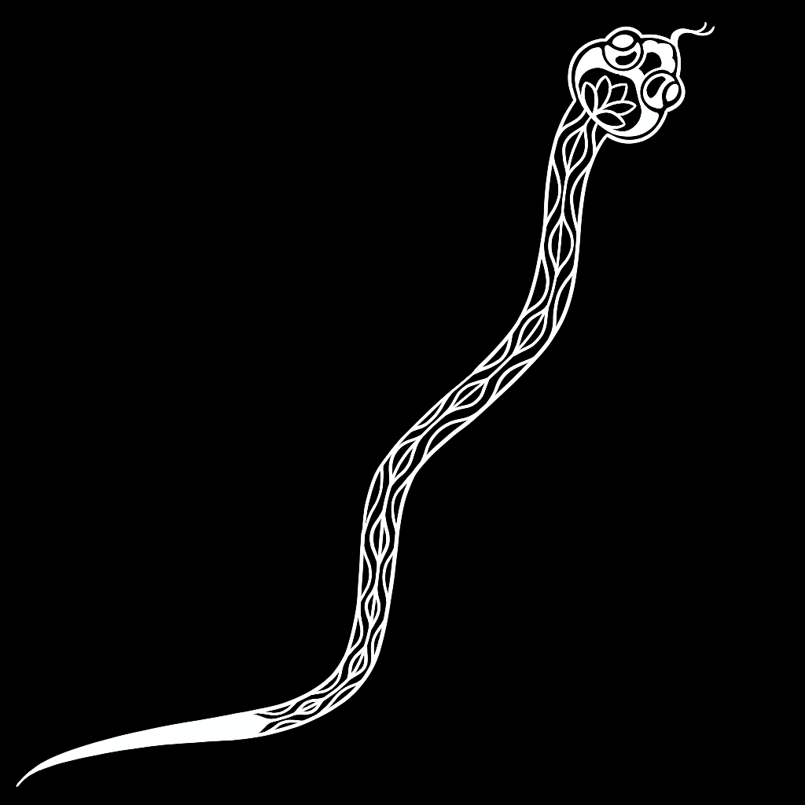

##### Mshiké

Potawatomi: Mshiké ([pronunciation](https://wiwkwebthegen.com/dictionary-word/mshik%C3%A9))

English Translation: Turtle

Corresponding Western Constellation: Auriga

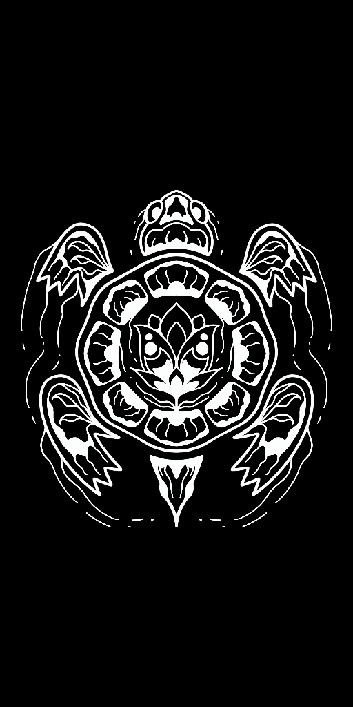

##### Nambezho

Potawatomi: Nambezho ([pronunciation](https://wiwkwebthegen.com/dictionary-word/nambezho-n%C3%ABgos))

English Translation: Underwater panther

Corresponding Western Constellation: Leo

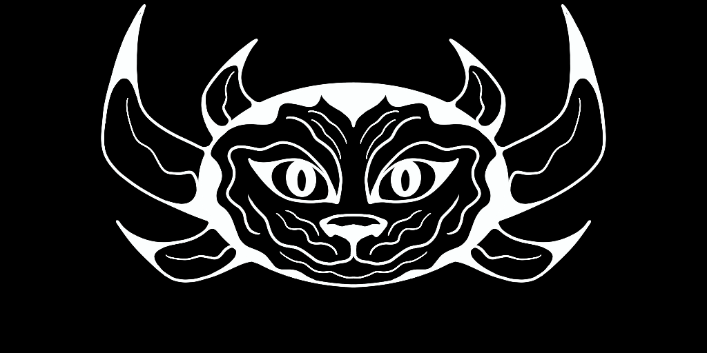

##### Nenikboz

Potawatomi: Nenikboz ([pronunciation](https://wiwkwebthegen.com/dictionary-word/nenikboz-n%C3%ABgos-0))

English Translation: Nanabozho

Corresponding Western Constellation: Scorpius

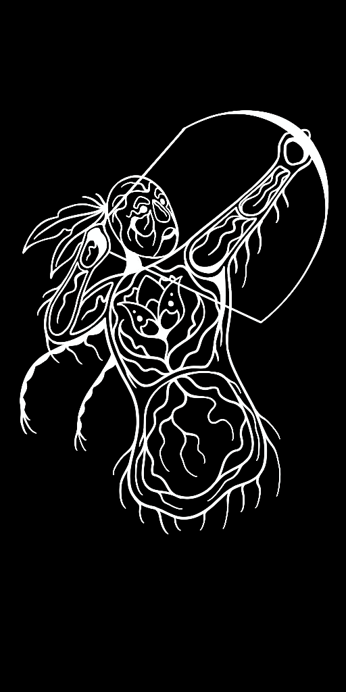

##### Shkenigshêk égi-nsogmowat

Potawatomi: Shkenigshêk égi-nsogmowat ([pronunciation](https://wiwkwebthegen.com/dictionary-word/shkenigsh%C3%AAk-gi-nsogmowat))

English Translation: Three Brothers Floating in a Canoe

Corresponding Western Constellation: Cassiopeia

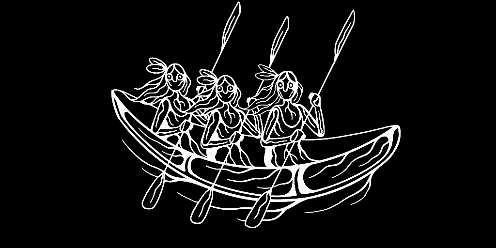

##### Wénondeshik

Potawatomi: Wénondeshik ([pronunciation](https://wiwkwebthegen.com/dictionary-word/w%C3%A9nondeshik))

English Translation: One Who is Exhausted

Corresponding Western Constellation: Hercules

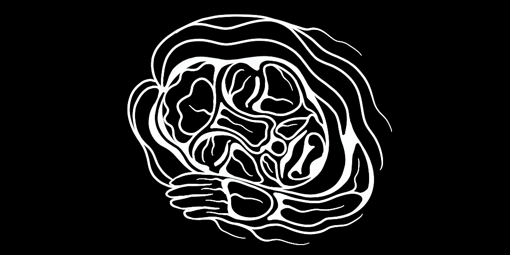

##### Wthik

Potawatomi: Wthik ([pronunciation](https://wiwkwebthegen.com/dictionary-word/wthik-n%C3%ABgos))

English Translation: Fisher

Corresponding Western Constellation: Ursa Major

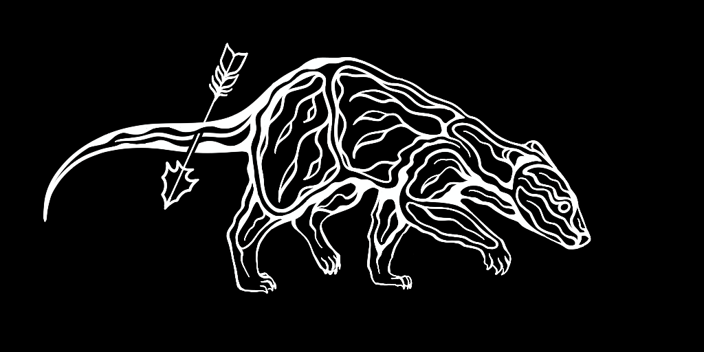

## List of Potawatomi Moons (Months)

| Potawatomi Moon Name                                                                                  | English Translation                 | Corresponding Gregorian Month(s) |
|-------------------------------------------------------------------------------------------------------|-------------------------------------|----------------------------------|
| Mko gizes ([pr](https://wiwkwebthegen.com/dictionary-word/mko-gizes-mi))                              | Bear moon                           | January                          |
| Gon gizes ([pr](https://wiwkwebthegen.com/dictionary-word/gon-gizes-mi))                              | Snow moon                           | February                         |
| Thethak gizes ([pr](https://wiwkwebthegen.com/dictionary-word/thethak-gizes-mi))                      | Crane moon                          | March                            |
| Bkonké gizes ([pr](https://wiwkwebthegen.com/dictionary-word/bkonk%C3%A9-gizes-mi))                   | Making separate (of tree bark) moon | April                            |
| É'démnëké gizes ([pr](https://wiwkwebthegen.com/dictionary-word/ed%C3%A9mn%C3%ABk%C3%A9-gizes-mi))    | Strawberry picking moon             | May                              |
| Mskwëmnëké gizes ([pr](https://wiwkwebthegen.com/dictionary-word/mskw%C3%ABmn%C3%ABk%C3%A9-gizes-mi)) | Raspberry picking moon              | June                             |
| Nibnë gizes ([pr](https://wiwkwebthegen.com/dictionary-word/nibn%C3%AB-gizes-mi))                     | Summer (plentiful) moon             | July                             |
| Nmégwzé gizes ([pr](https://wiwkwebthegen.com/dictionary-word/nm%C3%A9gwz%C3%A9-gizes-mi))            | Lake trout moon                     | August                           |
| Mzhéwé gizes ([pr](https://wiwkwebthegen.com/dictionary-word/mzh%C3%A9w%C3%A9-gizes-mi))              | Elk moon                            | September                        |
| Mnomnëké gizes ([pr](https://wiwkwebthegen.com/dictionary-word/mnomn%C3%ABk%C3%A9))                   | Wild rice harvesting moon           | September/October                |
| Damno gizes ([pr](https://wiwkwebthegen.com/dictionary-word/damno-gizes-mi))                          | Active deer moon                    | October                          |
| Bné ona gizes ([pr](https://wiwkwebthegen.com/dictionary-word/bn%C3%A9-ona-gizes-mi))                 | Smoked turkey moon                  | November                         |
| Ktthë mko gizes ([pr](https://wiwkwebthegen.com/dictionary-word/ktthe-mko-gizes-mi))                  | Big bear moon                       | December                         |

This list derives from Daniel Bourassa (1843)[^1] who was educated at Carey Mission in Niles, and later in New York and Oklahoma. Different Potawatomi communities (and different families) may have other names for these months.

[^1]: “A Vocabulary of the Po-Da-Wahd-Mih Language for Project 6697 | Smithsonian Digital Volunteers,” accessed February 17, 2026, https://transcription.si.edu/project/6697.

## Authors and Project Team

Neshnabé Nengosêk Kenomagéwen (Potawatomi Star Knowledge) Project Team:

Blaire Morseau, PI morseaub@msu.edu

John Foerch, Programmmer

Aaron Martin, Artist

Advisory Board: Michael Zimmerman Jr., Bmejwen Kyle Malott, DeJonay Morseau

## License

License (artwork): CC BY-NC-SA 4.0

The artwork in this Sky Culture may be shared, copied, redistributed, and adapted (remix, tweak, build upon) for non-commercial purposes. It requires proper attribution to the creator, indication of changes made, and that new creations are licensed under identical terms.

License (Sky Culture): CC BY-SA 4.0

The information in this Sky Culture may be shared, copied, redistributed, and adapted (remix, tweak, build upon) for commercial and non-commercial purposes. It requires proper attribution to the creator, indication of changes made, and that new creations are licensed under identical terms.

### Licenses and Permissions Justification

The artist, Aaron Martin, holds the copyright to his artwork. However, with his permission the visual elements of this sky culture have been made available to the public for educational purposes. We use both a Creative Commons License and Traditional Knowledge Labels to ensure respectful terms of use that align with Potawatomi cultural protocols. For more information, please visit: https://creativecommons.org/ and https://localcontexts.org/labels/traditional-knowledge-labels/

Neshnabé Nengosêk Kenomagéwen (Potawatomi Star Knowledge) Constellation Artwork © 2025 by Aaron Martin is licensed under CC BY-NC-SA 4.0. To view a copy of this license, visit https://creativecommons.org/licenses/by-nc-sa/4.0/

#### TK Seasonal (TK S)

This Label is being used to indicate that this material traditionally and usually is heard and/or utilized at a particular time of year and in response to specific seasonal changes and conditions. For instance, many important ceremonies are held at very specific times of the year. This Label is being used to indicate sophisticated relationships between land and knowledge creation. It is also being used to highlight the relationships between recorded material and the specific contexts where it derives, especially the interconnected and embodied teachings that it conveys.

#### TK Non-Commercial (TK NC)

This material has been designated as being available for non-commercial use. You are allowed to use this material for non-commercial purposes including for research, study, or public presentation and/or online in blogs or non-commercial websites. This Label asks you to think and act with fairness and responsibility towards this material and the original custodians.

#### TK Creative (TK CR)

This Label is being used to acknowledge the relationship between the creative practices of Aaron Martin and Pokagon Band of Potawatomi Indians and the larger Potawatomi nation and the associated cultural responsibilities.

#### TK Community Voice (TK CV)

This Label is being used to encourage the sharing of stories and voices about this material. The Label indicates that existing knowledge or descriptions are incomplete or partial. Any community member is invited and welcome to contribute to our community knowledge about this event, photograph, recording or heritage item. Sharing our voices helps us reclaim our histories and knowledge. This sharing is an internal process.
