# Tibetan

## Introduction

*This is unfinished work and only a tentative solution. Please help us improve! (see below)*

During a travel to the Tibetan Autonomous Region of China (TAR) in 2019, I was confronted with a highly complex system of astronomy and calendar computations which has a long tradition in Tibet.

Traditional Tibetan astronomy is largely influenced by the Kalacakra Tantra which has been imported from India, mixed with some Chinese influence.

## Description

<table class="layout">
<tr>
	<td>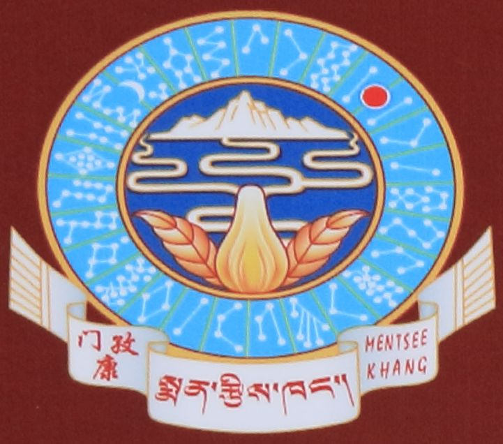</td>
	<td>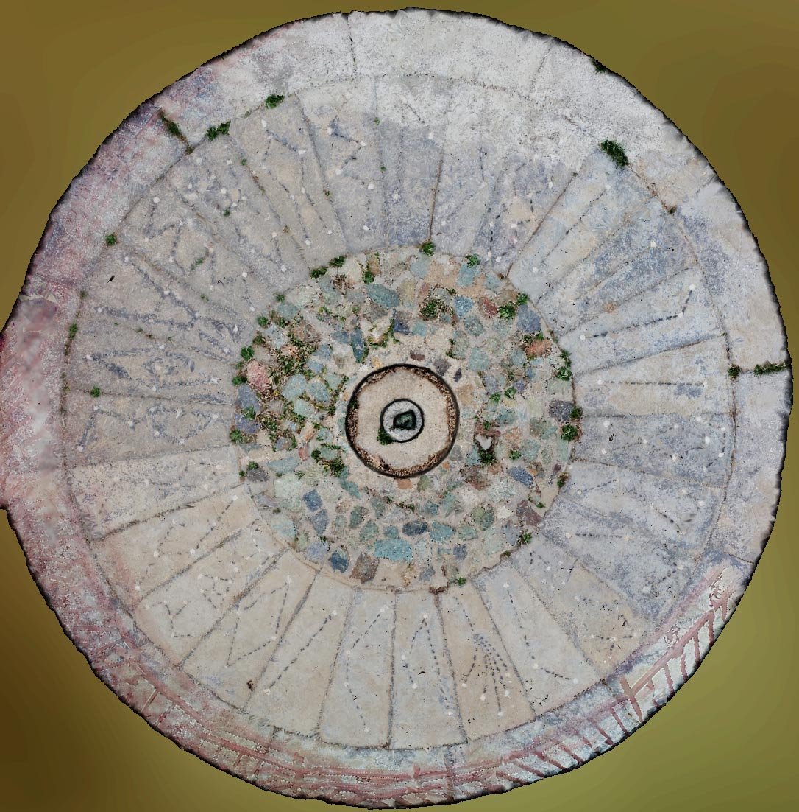</td>
</tr>
<tr>
	<td>Emblem on the door sign of Men Tsee Khang institute in Lhasa</td>
	<td>Stag Phu observatory Platform. The traditional stone for the shadow observation has been embedded in a concrete platform which shows the lunar mansions. The outermost circle shows figures of the 12 Zodiacal signs (barely visible but enlarged below).</td>
</tr>
</table>
 The Men Tsee Khang Institute for Astro and Medicine in Lhasa, TAR, is the central authority for traditional Tibetan medicine and astrology, two fields of research which are closely related in Tibetan tradition. The institute is in charge of editing the annual Tibetan calendar. Although this can be described algorithmically, in 2009 Men Tsee Khang experts have re-erected a calendar observatory in Stag Phu monastery, where a sunrise observation is performed on each March 17th for calibrating the calendar. On this day, just as the sun climbs over a mountain ridge, its first rays are cast through a window in the observatory tower onto a particular rock which has been embedded into a circular platform.

### The Zodiac

The zodiac is partitioned into 12 figures largely identical to the classical figures of the zodiac known in Europe. The following table is from Cornu, with photographs showing the figures illustrated in the circular platform. Note the unexpected appearance of Cancer. Is it a frog?
 <table class="layout">
<tr><th colspan="2">IAU</th><th>Tibetan</th><th>Indian</th><th>Platform Illustration</th>
</tr>
<tr>
	<td><notr> 1</notr></td>
	<td>Ari</td>
	<td>Luk</td>
	<td>Meṣa</td>
	<td>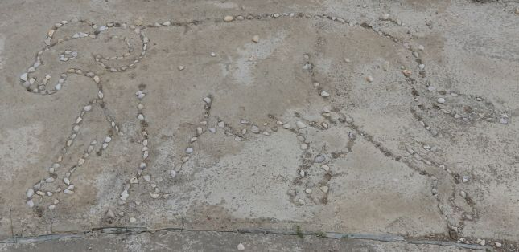</td>
</tr>
<tr>
	<td><notr> 2</notr></td>
	<td>Tau</td>
	<td>Lang</td>
	<td>Vṛṣa</td>
	<td>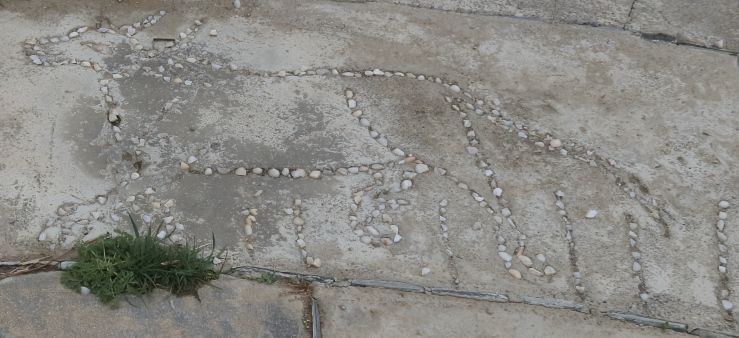</td>
</tr>
<tr>
	<td><notr> 3</notr></td>
	<td>Gem</td>
	<td>Trik</td>
	<td>Mithuna</td>
	<td>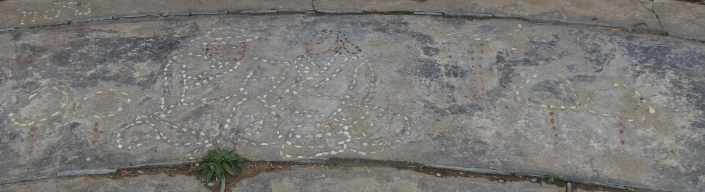</td>
</tr>
<tr>
	<td><notr> 4</notr></td>
	<td>Cnc</td>
	<td>Karkata</td>
	<td>Karka</td>
	<td>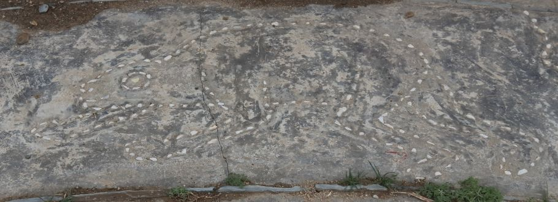</td>
</tr>
<tr>
	<td><notr> 5</notr></td>
	<td>Leo</td>
	<td>Senge</td>
	<td>Simha</td>
	<td>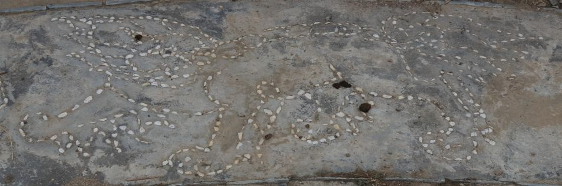</td>
</tr>
<tr>
	<td><notr> 6</notr></td>
	<td>Vir</td>
	<td>Pumo</td>
	<td>Kanyā</td>
	<td>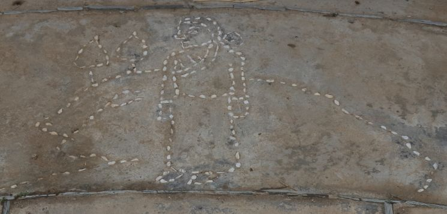</td>
</tr>
<tr>
	<td><notr> 7</notr></td>
	<td>Lib</td>
	<td>Sangwa</td>
	<td>Tulā</td>
	<td>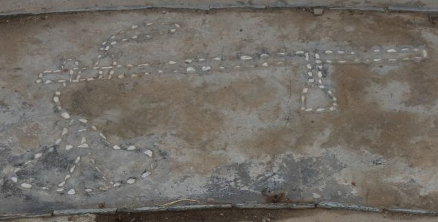</td>
</tr>
<tr>
	<td><notr> 8</notr></td>
	<td>Sco</td>
	<td>Dikpa</td>
	<td>Vṛscika</td>
	<td>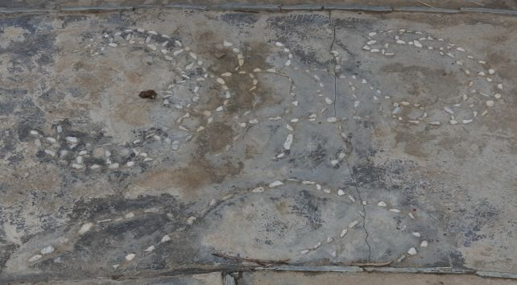</td>
</tr>
<tr>
	<td><notr> 9</notr></td>
	<td>Sgr</td>
	<td>Zhu</td>
	<td>Dhanus</td>
	<td>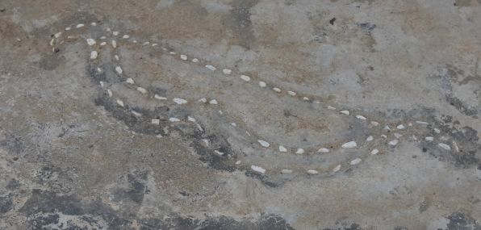</td>
</tr>
<tr>
	<td><notr>10</notr></td>
	<td>Cap</td>
	<td>Chusin</td>
	<td>Makara</td>
	<td>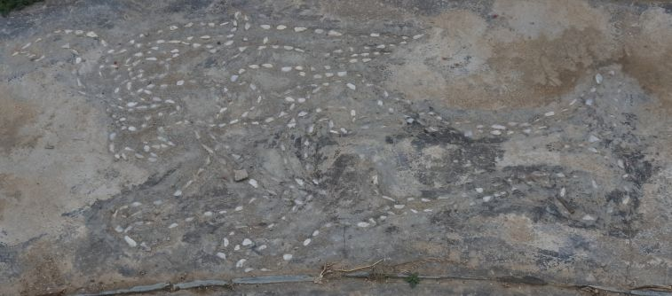</td>
</tr>
<tr>
	<td><notr>11</notr></td>
	<td>Aqr</td>
	<td>Bumpa</td>
	<td>Kumbha</td>
	<td>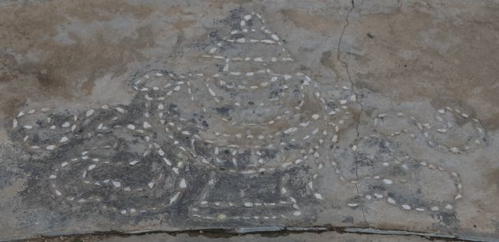</td>
</tr>
<tr>
	<td><notr>12</notr></td>
	<td>Psc</td>
	<td>Nya</td>
	<td>Mīna</td>
	<td>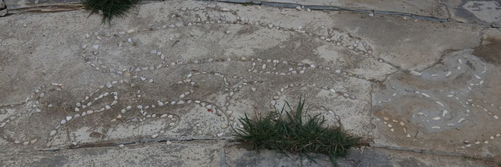</td>
</tr>
</table>

### The Lunar Mansions

Ancient Indian literature records two traditions regarding the number of lunar mansions: 27 and 28. Tibetan sources similarly preserve both counts. When 27 mansions are enumerated, the two asterisms **Drozhin** (གྲོ་བཞིན) and **Jizhin** (བྱི་བཞིན) are conventionally merged into a single mansion. Thus there is no real contradiction between the 28- and 27-mansion systems. The Kālacakra Tantra states that "Drozhin and Jizhin together occupy the span of a single mansion, without taking up extra space." Several Chinese Buddhist scriptures, such as the *Xiuyao Jing* (Sūtra of Lunar Mansions and Planets) and the *Modengjia Jing* (Mātanga Sūtra), also employ the 27-mansion scheme when describing the relationship between the lunar mansion system and the twelve zodiacal signs.

The Men Tsee Khang emblem shows 27 stick figures for the Lunar mansions arranged in a circle around the central figure. The same figures are also laid out in cement with bright stones connected by black lines in the circular platform which has been erected when the observatory was rebuilt. These 27 *gyukar* figures are described as being equal to the Indian *Nakṣatras* and represent sections of 13°20' longitude along the ecliptic. Actually, one of the *gyukars* consists of 2 asterisms, therefore 28 *lunar asterisms* are named.

However, not much is known of the exact identification of the Tibetan Lunar Stations outside of Tibet. Most literature is Tibetan or Chinese only, and there were no Tibetan star maps available. Also our guides could not explain any of the following to us.

The following table was taken from Cornu. Note that Tibetans start counting at zero, while the Indians count from 1.
 <table class="layout">
<tr><th colspan="2">Gyukar</th><th colspan="2">Nakshatra</th><th>Stars</th>
</tr>
<tr>
	<td align="right"><notr> 0</notr></td>
	<td>Takar, Yugu</td>
	<td align="right"><notr> 1</notr></td>
	<td>Aśvini</td>
	<td> &beta; Ari Sheratan</td>
</tr>
<tr>
	<td align="right"><notr> 1</notr></td>
	<td>Dranye</td>
	<td align="right"><notr> 2</notr></td>
	<td>Bharaṇī</td>
	<td> 35 Ari</td>
</tr>
<tr>
	<td align="right"><notr> 2</notr></td>
	<td>Mindruk</td>
	<td align="right"><notr> 3</notr></td>
	<td>Kṛttikā</td>
	<td> Pleiades</td>
</tr>
<tr>
	<td align="right"><notr> 3</notr></td>
	<td>Narma</td>
	<td align="right"><notr> 4</notr></td>
	<td>Rohiṇī</td>
	<td> &alpha; Tau Aldebaran</td>
</tr>
<tr>
	<td align="right"><notr> 4</notr></td>
	<td>Go</td>
	<td align="right"><notr> 5</notr></td>
	<td>Mṛgaśirā</td>
	<td> &lambda; Ori</td>
</tr>
<tr>
	<td align="right"><notr> 5</notr></td>
	<td>Lak</td>
	<td align="right"><notr> 6</notr></td>
	<td>Ārdrā</td>
	<td> &alpha; Ori Betelgeuse</td>
</tr>
<tr>
	<td align="right"><notr> 6</notr></td>
	<td>Nabso, Gyaltö</td>
	<td align="right"><notr> 7</notr></td>
	<td>Punarvasū</td>
	<td> &beta; Gem Pollux</td>
</tr>
<tr>
	<td align="right"><notr> 7</notr></td>
	<td>Gyal, Gyalme</td>
	<td align="right"><notr> 8</notr></td>
	<td>Puṣya</td>
	<td> 5 Cnc</td>
</tr>
<tr>
	<td align="right"><notr> 8</notr></td>
	<td>Kak, Wa</td>
	<td align="right"><notr> 9</notr></td>
	<td>Aśleṣa</td>
	<td> &alpha; Hya</td>
</tr>
<tr>
	<td align="right"><notr> 9</notr></td>
	<td>Chu, Ta chen</td>
	<td align="right"><notr>10</notr></td>
	<td>Maghā</td>
	<td> &alpha; Leo Regulus</td>
</tr>
<tr>
	<td align="right"><notr>10</notr></td>
	<td>Dre, Ta chung</td>
	<td align="right"><notr>11</notr></td>
	<td>Purva-Phālgunī</td>
	<td> &delta; Leo Zosma</td>
</tr>
<tr>
	<td align="right"><notr>11</notr></td>
	<td>Wo</td>
	<td align="right"><notr>12</notr></td>
	<td>Uttara-Phālgunī</td>
	<td> &beta; Leo Denebola</td>
</tr>
<tr>
	<td align="right"><notr>12</notr></td>
	<td>Mezhi</td>
	<td align="right"><notr>13</notr></td>
	<td>Hasta</td>
	<td> &delta; Crv Algorab</td>
</tr>
<tr>
	<td align="right"><notr>13</notr></td>
	<td>Nakpa</td>
	<td align="right"><notr>14</notr></td>
	<td>Citrā</td>
	<td> &alpha; Vir Spica</td>
</tr>
<tr>
	<td align="right"><notr>14</notr></td>
	<td>Sari</td>
	<td align="right"><notr>15</notr></td>
	<td>Svātī</td>
	<td> &alpha; Boo Arcturus</td>
</tr>
<tr>
	<td align="right"><notr>15</notr></td>
	<td>Saga</td>
	<td align="right"><notr>16</notr></td>
	<td>Viśākhā</td>
	<td> &alpha; Lib</td>
</tr>
<tr>
	<td align="right"><notr>16</notr></td>
	<td>Lhatsam</td>
	<td align="right"><notr>17</notr></td>
	<td>Anurādhā</td>
	<td> &delta; Sco</td>
</tr>
<tr>
	<td align="right"><notr>17</notr></td>
	<td>Nrön, Deu</td>
	<td align="right"><notr>18</notr></td>
	<td>Jyeṣṭhā</td>
	<td> &alpha; Sco Antares</td>
</tr>
<tr>
	<td align="right"><notr>18</notr></td>
	<td>Nup</td>
	<td align="right"><notr>19</notr></td>
	<td>Mūla</td>
	<td> &lambda; Sco Shaula</td>
</tr>
<tr>
	<td align="right"><notr>19</notr></td>
	<td>Chutö</td>
	<td align="right"><notr>20</notr></td>
	<td>Purvāṣadhā</td>
	<td> &delta; Sgr</td>
</tr>
<tr>
	<td align="right"><notr>20</notr></td>
	<td>Chume</td>
	<td align="right"><notr>21</notr></td>
	<td>Uttarāṣadhā</td>
	<td> &sigma; Sgr</td>
</tr>
<tr>
	<td align="right"><notr>21</notr></td>
	<td>Drozhin + Jizhin</td>
	<td align="right"><notr>22</notr></td>
	<td>Uttara-Āṣādhā + Śravaṇa</td>
	<td> &alpha; Lyr Vega + &alpha; Aql Altair</td>
</tr>
<tr>
	<td align="right"><notr>22</notr></td>
	<td>Möndre</td>
	<td align="right"><notr>23</notr></td>
	<td>Dhaniāsṭha</td>
	<td> &beta; Del</td>
</tr>
<tr>
	<td align="right"><notr>23</notr></td>
	<td>Möndru</td>
	<td align="right"><notr>24</notr></td>
	<td>Satabhiṣak</td>
	<td> &lambda; Aqr</td>
</tr>
<tr>
	<td align="right"><notr>24</notr></td>
	<td>Trumtö</td>
	<td align="right"><notr>25</notr></td>
	<td>Purvabāadrapada</td>
	<td> &alpha; Peg Markab</td>
</tr>
<tr>
	<td align="right"><notr>25</notr></td>
	<td>Trume</td>
	<td align="right"><notr>26</notr></td>
	<td>Uttarabhādrapada</td>
	<td> &gamma; Peg, &alpha; And</td>
</tr>
<tr>
	<td align="right"><notr>26</notr></td>
	<td>Namdru, Shesa</td>
	<td align="right"><notr>27</notr></td>
	<td>Revati</td>
	<td> &sigma; Psc</td>
</tr>
</table>
The star figures for Lunar Mansions in this skyculture are shown as asterisms among the traditional 12 Ptolemaic zodiacal constellations. It is assumed that most originate from the Indian traditions, esp. Kalacakra Tantra, but it appears that some Chinese influence is also present, e.g. Nr. 11. Only for the Zodiacal constellations artwork is provided. A few more constellations in Ptolemaic tradition are displayed in the northern sky to allow easier orientation, but with their names suppressed. We have no information about their names, relevance or even publicity of these in Tibet.

### Please help us

The figures are my own attempt of identification of the Lunar mansion figures. We can be sure about the placement of only those which can also be found in other sky cultures, e.g. Japanese Moon Stations which stem from Chinese tradition. Many stars are rather dim, and the figures in the emblem apparently have to be rotated in arbitrary ways, like *gyukar 3*=Hyades. Others require considerable liberties to accept a topological match. Alternative matches with stars in similar topology arranged in the orientation shown in the emblem (north=outer circle) have been found only in neighboring areas of the sky, making a match rather unlikely. Others appear to have been taken over from Chinese tradition, e.g. Nr. 11. LM21 can be explained only if we accept two separate figures which are not aligned as shown in the concrete figure. Then they represent Chinese constellations *Ox* and *Girl* (which is also Japanese Lunar station *Woman*).

We have supplemented the Tibetan names with native script (Dung dkar Blo bzang 'phrin las, 2002, p. 328), transliteration, and IPA. The "native" field contains the original Tibetan spelling in Tibetan characters. It should be noted that many fonts do not render Tibetan script correctly; we have preserved the correct Unicode codepoints in the file for reference. The "transliteration" follows the Tibetan Pinyin system (Zangyu Hanyu Pinyin Zimu Yinyi Zhuanxie Fa), which is based on the Lhasa pronunciation and adopts a Hanyu Pinyin-like scheme for transcribing Tibetan pronunciation. Several different romanisation systems exist for Tibetan; the scheme adopted here, while close to Hanyu Pinyin, may not be the most intuitive for Western readers. The "sci. translit." field uses the Wylie transliteration system, which is specifically designed for Tibetan orthography and allows a lossless conversion of Tibetan script into Latin letters. It is important to note that Tibetan pronunciation and spelling are not consistent — Tibet has not undergone systematic orthographic reform for over a millennium, and the current spelling reflects Old Tibetan pronunciation. We therefore use Wylie to represent the written form and Tibetan Pinyin to represent the contemporary Lhasa pronunciation.

We would welcome input from native Tibetan speakers regarding the meanings of the Tibetan lunar mansion names. So far, we have been able to determine the semantics of only a few, for example མགོ (mgo, go) meaning "head." The Tibetan lunar stations are closely related to both the Indian Nakṣatras and the Chinese lunar mansion traditions, and they share some semantic parallels with both—yet they are not entirely identical to either, each displaying distinctive cultural characteristics. At present, the mansions are identified by their numerical designations; we hope to replace these with their actual semantic names in the future.

Alternative figures can be found in the old configuration files. We would welcome verification and corrections from experts in Tibetan astronomy, covering both the identification of the lunar mansions and the review of Tibetan script, transliteration, and IPA.

The *zodiac* and *gyukar* bands have been taken over from Indian tradition. The number of gyukars is given as 27. However, as noted above, the 28-mansion count is equally valid, provided Drozhin and Jizhin are separated. The link "Spica=180°" is also set here for both circles, but should be confirmed.

#### Further reading

This work accompanies a 3D model of the Stag Phu observatory for use with the Scenery3D plugin, downloadable from https://stellarium.org and described in:

Georg Zotti, Guntram Hazod, Martin Gamon and Hubert Feiglstorfer (2024), "A Calendar Observatory in Tibet". In: Marc Fr&icirc;ncu (coordinator), 
Proceedings of the 29th Conference of the European Society for Astronomy in Culture (SEAC) Timisoara 2022,  
Editura Universit&#x103;&#x163;ii de Vest din Timi&#x15F;oara} (pages 123-136).  ISBN 978-630-327-107-1.

## References

 - [#1]: Burgess, E. (1860). Translation of the Surya-Siddhanta, a Text-Book of Hindu Astronomy. New Haven.
 - [#2]: Cornu, P. (2002). Tibetan Astrology. Boston & London: Shambhala.
 - [#3]: [Reingold, Edward M. and Nachum Dershowitz (2018). Calendrical Calculations: The Ultimate Edition. Cambridge: Cambridge University Press. ](https://dx.doi.org/10.1017/9781107415058)
 - [#4]: [Suolang, S., Gelang, Nanmujia, & Jilü. (2017). Zangzu chuantong tianwen lical zhong de ershiba xiu tixi yanjiu [A study on the system of the twenty-eight lunar mansions in traditional Tibetan astronomy and calendrical calculations]. *Xizang Daxue Xuebao (Shehui Kexue Ban) / Journal of Tibet University (Social Sciences Edition)*, (4), 57–66](https://doi.org/10.16249/j.cnki.1005-5738.2017.04.009).
 - [#5]: Dung dkar Blo bzang 'phrin las (Dungkar Lozang Trinlé). (Ed.). (2002). Dung dkar tshig mdzod chen mo [Dung dkar great dictionary of Tibetan studies]. China Tibetology Publishing House.

## Authors

Georg Zotti on May 21, 2019, reworked July-October 2023. *Zodiac* and *Gyukars* added in V25.2. 

Lyu Haocheng [lvhc2016@126.com](mailto:lvhc2016@126.com) supplemented the Tibetan names of the twelve zodiacal signs and the 28 (27) lunar mansions with native script, transliteration, and IPA. Specialist review is still requested.

## License

CC BY-SA
