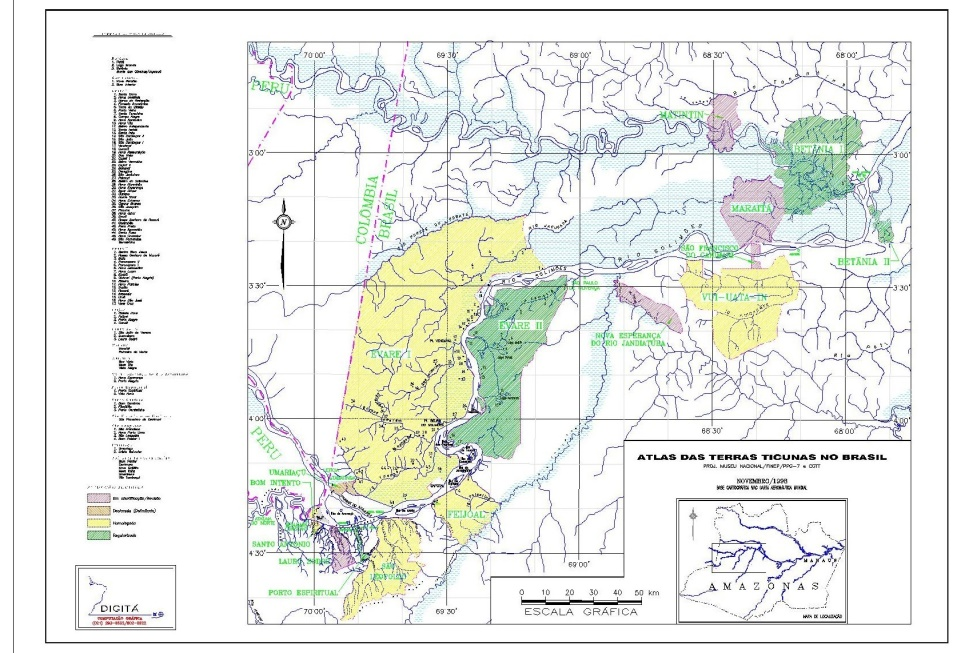

# Tikuna

## Introduction

The Tikuna indigenous people have inhabited the region of the Upper Solimões river for the past 2,000 years. They currently occupy a territory where the political borders of three countries converge: Brazil, Colombia, and Peru. This is the reason why the Tikuna recognize themselves as a differentiated indigenous group, while also identifying with the national identities related to these three countries.

## Description

Tikuna territory encompasses a region 600 kilometers long, running west to east from the Chimbote region in Peru—along the emptiness of the Amazonas-Solimões valley, in the so-called Trapézio Amazônico (Colombian Amazonian Trapezoid)—to the Barreira da Missão region, in the municipality of Tefé, in the Brazilian state of Amazonas (See The Ticuna Atlas, Figure I).

 

 <em>Figure 1: The Tikuna Atlas<cite id="cit1a">[**1**](#cit1)</cite> </em>

The agencies and researchers that deal with them estimate that more than 53,544 (Siasi/Sesai, 2014) Tikunas live in Brazil (FUNASA, 2009), 8.000 in Colombia (Goulard, 2010), and 6.982 in Peru (INEL, 2007)<cite id="cit2a">[**2**](#cit2)</cite>. Together, they constitute the largest Amazonian indigenous population. Aside from their own Tikuna language, they also speak Spanish and Portuguese, depending on whether they live in Colombia and Peru or in Brazil.

The Tikuna live in riverside villages along the Amazonas-Solimões and its tributaries, called igarapés. Their daily life revolve around the cultivation cycles of different agricultural goods; specially, manioc, used to produce the flour the Tikuna sell in the markets of the region’s main cities. They are also fishers, hunters, and gatherers of the forest products. The women make hammocks, bags, and other objects with plant fibers; and the men paint on tururi fiber and fabricate arrows, paddles, and canoes.

It should be noted that, in Brazil, the Tikuna Indians live in indigenous lands recognized by Brazil’s indigenous policy. They are located in “terrestrial islands” among non-indigenous territories occupied by the Brazilian Population, from Tabatinga to Manaus (as illustrated in the Brazilian Tikuna Atlas).

### The Astronomical Correlations

The movements of the Tikuna constellations correspond to an interpretation of the seasonality of rainfall, as the Tikuna narratives suggest. These constellations are related to myths referencing the ascension and fall of Wücütcha (a heavenly beast related to the Jaguar Clan), Coyatchicüra (Caiman’s Jaw) and Baweta (Tracajá, the Aquatic Turtle Collective), the Anteater’s fight with the Jaguar, and the Way of the Tapir.

According to the testimony of the Tikuna indigenous people, Baweta (the Pleiades Star Cluster) appears in the eastern sky towards the end of November, at nightfall. After Baweta rises, Caiman’s Jaw rises. Wücütcha’s leg corresponds to a portion of The Orion Constellation; and it begins to disappear from the western sky around the 20th of May, at nightfall. About one month earlier, the Caiman’s Jaw, corresponding to The Hyades Star Cluster in Taurus, also disappears to the West.

According to Vieira’s interpretation, the form of Baweta (the Turtle Collective) is associated with the stars within the asterisms of the Pleiades and of Perseus. Baweta’s eyes are the feet of Perseus (Omicron Persei - Atik and ζ (Zeta) Persei). The “V” shape that Western astronomy relates to the head of Taurus is called Coyatchicüra (Caiman’s Jaw). Wücütcha’s Leg corresponds to the stars that groups as Orion. Its toes are Orion’s Belt and the bend of the legs are ι (iota) Orionis; κ (kappa) Orionis; η (eta) Leporis and δ (delta) Leporis.

During the summer, the fight between the Anteater (Tchatü) and the Jaguar (Ai) occurs. The end of the battle coincides with the death and ascension of Wücütcha. The eyes of the Anteater are located in β (beta) of Triangulum Australe; his claw and body is in the constellations Norma and Ara. The right foot of the Jaguar is in Scorpio’s α (Antares), σ (Sigma), and τ (tau); its eyes are in ε (epsilon) and μ (mu) Scorpii; and its left paw is in λ (Shaula), υ (upsilon Sco – Lesath) and κ (kappa) of the same constellation. Wücütcha (the Jaguar’s leg) represents the beginning of the rains in late September; and its reappearance to the east follows the setting of Tchatü in the west, at nightfall, in the end of November. Those correlations are illuminated by indigenous testimony reproduced below:

> “The stars fit into their respective constellations. First is Wücütcha. After winter, summer begins to walk. It is the Jaguar. After him, comes Coyathicüra in the month of May, at nightfall, when the Caiman’s Jaw appears on the beach. Baweta appears in September, the month of the turtle. In May, Wücütcha and Coyatchicüra fall. They all fall together at the end of May. In July, they come again. Baweta already begins to appear in July. When Wücütcha falls, beginning in May, caimans and turtles begin to appear. The apex is in September.”
>
> “In May, all the constellations fall, together with their planets. It is summertime. Later, in July, they appear again for the New Year. Coya and Wücütcha leave the sky from May to September. Later, in July, they appear again.”
>
> Fernando Marques or Ütchancu – translated by Lucho

The Tikuna interpret processes affected by a succession of meteorological changes that, in turn, determine the rainy and the dry seasons. In this region of Western Amazon, the rainy season runs from December to March and the dry season from June to September. During April, May, October, and November the rainfall is intermediate. In November, the water level starts to rise and in late December the tides occur. During the month of May, the water level drops until September, the peak of the drought. The periods of El Niño imply a rain deficit, causing the extreme drought of the great river; during La Niña, the cooling of the Pacific increases the amount of water, causing dramatic tides and floods.

Although dependent on weather variability, at the September Equinox the Tikuna observe how fog affects how they see in early morning; the Pleiades star cluster disappears on the morning horizon in early June and reappears in the evening, in late November. The goal of the Tikuna is to predict the intensity of the coming rains in order to negotiate with the entity Mawü, the “Master of Rain,” the effects of the floods on their subsistence activities.

According to the explanations found in Enepü (a Tikuna community in the indigenous Land Eware II, in the Brazilian State of Amazon, in Western Amazonia), the influence of seasonality upon Tikuna subsistence activities is more prevalent along the Solimões. In the headwaters of the igarapés, where Enepü is situated, plenty of food exists all year long. In Enepü, trees and palms, such as the ingá and açaí, are fertile all year long due to the “virginity” and the enrichment of the soil by natural compost. The same thing occurs with the fishing in Lake Preto, within the limits of Enepü, where they can supply themselves abundantly with fish all year long. On the Solimões, however, one finds fish only from April to July, when the water level drops. Abundance in the hunt is also from April to July (or September, at most), along the Solimões. Fishing becomes more difficult when the river is high. The fruit of the native açaí palm is collected in summer, and customarily saved for preparation during winter—time of poor hunting and fishing. Through planning and regular gardening, harvests are available all year long. The harvest of cultivated plants also occurs during the drought months. There is a certain degree of flexibility in adapting the agricultural calendar to the rainy season (when fishing and hunting are not productive) and the dry season, (when fishing is more abundant); however, difficulties involving navigation and transport grow as the water level drops along the igarapés linking the river. Traditional culture, however, is not prepared for unforeseen alterations in the rainy season, such as it occurred in 2002. In that year, July saw the beginning of the repiquete (the rise on water levels), which normally occurs in September. This destroyed the short-range agricultural cycle and made the fish scarcer, changing alimentary habits.
 
<notr><a href="#cit1a"><B>1</B></a></notr><cite>This work adopts linguistic convention when writing Tikuna, even though several Anthropologists and Indigenous experts use the vernacular form (Ticuna).</cite>

 
<notr><a href="#cit2a"><B>2</B></a></notr><cite> According to socioambiental.org, consulted on 08/05/2019.</cite>

## References

 - [#1]: FAULHABER, Priscila, 2004. As estrelas eram terrenas. Antropologia do clima, da iconografia e das constelações Tikuna. Revista de Antropologia, (2): 379-426.
 - [#2]: FAULHABER, Priscila, 2011. Ticuna knowledge, Worecü stars and sky movements. Proceedings of the International Astronomical Union / Volume 7 / Symposium S278, pp 58 – 64.
 - [#3]: FAULHABER, Priscila, 2015. Ticuna Astronomy, Mythology and Cosmovision. In: C.L.N. Ruggles (ed.), Handbook of Archaeoastronomy and Ethnoastronomy, New York, Springer, 2015,  pp 953 – 957.
 - [#4]: Leitura Interpretativa sobre Relações Céu-Terra entre os Índios Tikuna. In: FAULHABER, Priscila; LOPEZ, Alejandro; ATHIAS, Renato (Orgs.). Dossiê sobre Antropologia e Astronomia Cultural. Recife, Revista Anthropológicas, Ano 21, volume 28 (1), Junho, 2017: 73-104.
 - [#5]: [2021  Sol e Lua na iconografia Tikuna. Revista Cosmovisiones/Cosmovisões. Ano 1, n,1 La Plata, Universidade de La Plata, Argentina, 2020, pp 90-104  acesso em 23 de agosto de 2021](http://museo.fcaglp.unlp.edu.ar/ojs/index.php/Cosmovisiones/article/view/8/4)
 - [#6]: [FAULHABER e CAMPOS·Identificando Corpos Celestes no Ponto de Vista da Iconografia Tikuna. Revista Avá, Missiones, Argentina, 2020, pp 90-104.](https://www.ava.unam.edu.ar/images/35/n35a07.pdf)
 - [#7]: GOULARD, Jean-Pierre. “Entre Mortales e Inmortales: El ser según los Tikuna de la Amazonía”. Mundo Amazonico,  2010, 1:359-361.
 - [#8]: OLIVEIRA FILHO, João Pacheco de (Coord.) (1998) – ATLAS DAS TERRAS TICUNA. Projeto Museu Nacional/FINEP/PPG-7- CGTT. Rio de Janeiro.
 - [#9]: NIMUENDAJÚ, Curt 1952 – “The Tukuna”. Publications in American Archaeology and Ethnology volume XLV (org: Robert Lowie). Berkeley and Los Angeles, University of California Press.

## Authors

**Priscila Faulhaber** (Museum of Astronomy and Related Sciences)

**Fernando Vieira** (Astronomer and Former Coordinator of Astronomy in The Planetarium Foundation of the City of Rio de Janeiro) helped with the interpretation of the astronomical correlations between Western and Tikuna constellations, identified by the Tikuna in November 2002, during a research visit at the Science Center and Planetarium of the Universidade do Pará (Belém/Brazil), using the Starry Night System. Vieira plotted the correspondence between the traces of Tikuna mythical animals and the Official IAU constellations of western astronomy. He also reviewed this text for any skyscape incongruences related to corresponding Western astronomy and Tikuna cosmovision.

We are integrating in this investigation **Walmir Thomazi Cardoso**, a Physics Professor in the Postgraduate Program in History of Sciences and Techniques and Epistemology at the Federal University of Rio de Janeiro (HCTE-UFRJ) and researcher of astronomy in culture; he made some reinterpretations in a collaborative work with physics undergraduate students; and **Youssif Ghantous Filho**, adapting and anchoring original drawings to Stellarium. Nevertheless, every sky interpretation is contextual and circumstantial. Current collaborative investigations are looking for new astronomical observation together with the Tikuna, which will improve the initial findings.

 The data used in **Cardoso & Ghantous Filho** were a reinterpretation of charts used by the Tikunas, **Pedro Inácio Pinheiro** and **Luís Angel Ramos**, to interpret Tikuna constellations. The calculations were established based upon coordinates 70° W and 3°S with the help of Oswaldo dos Santos Barros, Pará State (CCPP). The different interpretations of the drawings developed from the ongoing collaborative investigation with Walmir T. Cardoso, researcher of astronomy in Culture, takes into consideration some changes, such as the ones shown in this work. <!-- GZ: I have removed this as there is no panorama horizon included. Such acknowledgement would be applicable in a separate "landscape" contribution. --> <!-- Barthelemy D’Ans (Instituto Peruano de Astronomia, Planetarium Maria Reich Lima-Ica-Nasca-Colca-Cusco), edited the panoramic picture and adapted it to the horizons of the Stellarium Astronomy Software. --> **Marcio D´Olne Campos** (UNICAMP and SULear/SOUTHing Proposal) helped map the location of the Tikuna village and define their latitude and longitude coordinates (See Tikuna Lands Atlas).

The recording of this myth and the identification of the Jaguar’s eyes was inspired by Curt Nimuendajú, (1952 p.143).

## License

CC BY-SA 4.0
