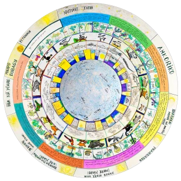

# Tukano

## Introduction

Tukano is the common name for a group of indigenous tribes who live around the
northwestern region of Brazil, near Colombia and Venezuela. The group shown in
this work live on the banks of the Rio Tiquié within the Rio Negro bay in the
Amazonas State, Brazil.

## Description

One circular calendar developed in 2007 [#1][#2].
{: .img_and_caption }

### Tukano Constellations

Constellations within Tukano astronomical culture are related with natural
phenomena as a whole. We gathered twelve constellations with a group who speaks
Tukano language. This is not the definitive number of constellations. There
are, surely, more constellations to be described. We presented here essentially
"the main cycle" [#2] of the Tukano constellations. Sometimes someone relates
new discoveries about these Indians sky concepts or presents new constellation
descriptions. Though we are establishing limits and configurations to these
constellations that are new to us (non- Indians), they don’t organize this body
of knowledge in the same way. Their conceptions about sky and Universe are
different when compared with ours. They don’t organize and conceive ideas about
the Universe as a whole, like us.

Hereby we present few data from a research carried out with living people and
this data may be variable in near future. We worked with basic school students,
elders and story tellers comparing the talks and summarizing it as you’ll see
below.

In general, we can say that a Tukano constellation, or parts of it, are
observed when its setting occurs, like the sunset (heliacal setting) during the
short period of an year. There are an amount of natural phenomena related to
this astronomical event. For example we can consider Aña’s head setting during
November and its relation with the increase and decrease of the Tiquié river
level. The variation of the river level is accompanied with an emerging of
different fishes which appear as the result of these changeable natural
conditions. Other larger fishes follow the first group for multiple purposes
(eating smaller ones for example). All of them eat some fruits which eventually
fall over the river surface. Ground animals and microorganisms are interested
on these fruits, as well as either. So, a phenomenon first described as an
astronomical set for us can be seen inside a more complex behavior for Tukanos
and their neighbors around this region. Animals, plants and also spiritual
manifestations are in a complex relationship under the cosmological view that
we can’t ignore anymore.

### Sources

This work is part of an amount of researches developed as a survey, conducted
between 2005 and 2007 that resulted in a doctoral/PhD thesis (Cardoso, 2007).
Relying on Ethnomatematics sources (D’ambrosio, 2002), in practical sky
observation activities and on classical sources about constellations observed
in Brazil’s Amazon region, we accomplished a sky mapping of these Indian
ethnicity: Tukano, Dessano and Tuyuka but in particular, the first one. From
the description of many constellations we created an astronomical events and
climate calendar along with students from differentiated Yupuri’s indigenous
school. Rain periods, drought, planting and harvesting are marked by the sunset
and sunrise of the major constellations created by Amazonia northwest Indians.

## Constellations

##### Aña

A big snake that is found in part of our Scorpius, Sagittarius and Corona
Australis constellations. Its setting with the sunset correspond of the
beginning of the year to this group of Tukanos.

##### Pamõ

This constellation is found in the modern constellations of the Dolphin and
parts of Aquila constellation. This group of faint stars is placed inside a
poor stellar field with exception of the bright Altair (Alfa Aquilae).

##### Mhua

Both constellations are joined together in a few bright stars of the Aquarius
and Pisces area. As they are faint, it is a wonderful challenge to try to see
it during the night.

##### Yai

It is a big constellation – one of the biggest – inside the north portions of
night skies. All night long near the horizon, the big puma is described inside
our Cepheus, Cassiopeia and Perseus constellations.

##### Yhé

The real position of this constellation is still in discussion: are those stars
in the Berenices' hair region or inside the Corvus? We choose the first
region because it was present as the real one by the Tukanos of São José II
tribe.

##### Yurara

This constellation is described as the occidental Southern Cross constellation.
Sometimes this traditional occidental constellation also meant an Otter or a
turtle for the Tukano people.

##### Nhorkoatero

The translation of _nhorkoatero_ is literally 'group of stars'. Identified as
our Pleiades this is very significant as a time keeper within a complex
calendar to Tukano people. It is also used as a harbinger of the rainy period.

##### Waikhasa

A _Waikase_ (Moquém) in portuguese is a kind of grill to cook fish. It is
identified with the Hyades open cluster of stars in Taurus and with the bright
star Aldebaran which follows the Pleiades. This is an asterism easy to be seen
all over the sky.

##### Sioyahpu

As a part of Orion belt and two of the others brightest stars of this
constellation – our Betelgeuse and Bellatrix – this constellation represents a
part of a tool which is used to carve wood.

### Sipé Phairo

This snake corresponds to the brightest stars of the Big Dipper. In a legend
when this constellation touches the horizon after the sunset almost all fishes
in the main river are swallowed by it.

##### Diayo

Described as our Southern Cross by part of the Tukanos in half Tiquié river,
this constellation is also associated with star as Sirius in Canis Major in
that region.

##### Kai Sariró

Those stars are mainly at Orion constellation and mean a circle of dances in
some special Tukano ceremonies.

## References

 - [#1]: Cardoso, Walmir Thomazi. Sao Paulo, 2007. [Thesis Abstract](https://www.sapientia.pucsp.br/handle/handle/11272)
 - [#2]: Cardoso, Walmir Thomazi. Sao Paulo, 2007. [Thesis](https://www.sapientia.pucsp.br/bitstream/handle/11272/1/Walmir%20Thomazi%20Cardoso.pdf)

## Authors

[Walmir Thomazi Cardoso](mailto:walmir.astronomia@gmail.com) gathered this
information in a survey that is part of his PhD. Thesis of Ethnomathematics.

Illustrations were made by Antonio Gumercindo Taques dos Santos (Ticão) and
[Youssif Ganthous Filho](mailto:youssif@gmail.com).

Technical adaption: Stellarium's team

## License

Text, lines and illustrations: CC BY-SA
