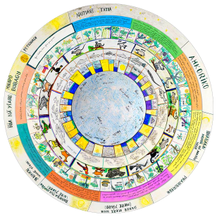

# Tukano

## Introduction

[Tukano](https://en.wikipedia.org/wiki/Tucano_people) is the common name for a group of indigenous tribes who live around the northwestern region of Brazil, near Colombia and Venezuela. The group shown in this work live on the banks of the Rio Tiquié within the Rio Negro bay in the Amazonas State, Brazil.

 *One circular calendar developed in 2007.*

## Description

### Constellations

Constellations within Tukano astronomical culture are related with natural phenomena as a whole. We gathered twelve constellations with a group who speaks Tukano language. This is not the definitive number of constellations. There are, surely, more constellations to be described. We presented here essentially “the main cycle” (CARDOSO, 2007) of the Tukano constellations. Sometimes someone relate new discoveries about these Indians sky conceptions or presents new constellation descriptions. Though we are establishing limits and configurations to these constellations that are new to us (non- Indians), they don’t organize this body of knowledge in the same way. Their conceptions about sky and Universe are different when compared with ours. They don’t organize and conceive ideas about the Universe as a whole, like us.

Hereby we present few data from a research carried out with living people and this data may be variable in near future. We worked with basic school students, elders and story tellers comparing the talks and summarizing it as you’ll see below.

In general, we can say that a Tukano constellation, or parts of it, are observed when its setting occurs, like the sunset (heliacal setting) during the short period of an year. There are an amount of natural phenomena related with this astronomical event. For example we can consider Aña’s head setting during November and its relation with the increase and decrease of the Tiquié river level. The variation of the river level is accompanied with an emerging of different fishes which appear as the result of these changeable natural conditions. Other larger fishes follow the first group for multiple purposes (eating smaller ones for example). All of them eat some fruits which eventually fall over the river surface. Ground animals and microorganisms are interested on these fruits, as well as either. So, a phenomenon first described as an astronomical set for us can be seen inside a more complex behavior for Tukanos and their neighbors around this region. Animals, plants and also spiritual manifestations are in a complex relationship under the cosmological view that we can’t more ignore.

The name of each constellation was written in this sequence: Tukano, Portuguese and English. Ex. Pamõ\Tatu\Armadillo.

### Aña or Aña Diaso\Jararaca\Fer-de-lance

### [Aña - Jararaca - Jararaca (snake)](http://en.wikipedia.org/wiki/Bothrops_jararaca)

A big snake that is found in part of our Scorpius, Sagittarius and Corona Australis constellations. Its setting with the sunset correspond of the beginning of the year to this group of Tukanos.

### Pamõ\Tatu\Armadillo

### [Pamõ - Tatu - Armadillo](http://en.wikipedia.org/wiki/Armadillo)

This constellation is found in our Dolphin constellation and part of Aquila constellation. This group of faint stars takes place inside a poor stellar field with exception of the bright Altair (Alfa Aquilae).

### Darsiu\camarão de rio\freshwater shrimp

### [Darsiu - Pitu - Caridean Shrimp](http://en.wikipedia.org/wiki/Caridea)

### Mhua\Jacundá (peixe)\A kind of fish

### [Mhua - Jacundá (peixe) - Jacundá (a kind of fish)](http://pt.wikipedia.org/wiki/Jacund%C3%A1)

Both constellations are jointed together in a few bright stars of Aquarius and Pisces area. But it is a wonderful challenge to try to see it during the night.

### Yai\onça\puma or jaguar

### [Yai - Onça - Jaguar](http://en.wikipedia.org/wiki/Jaguar)

It is a big constellation – one of the biggest – inside the north portions of night skies. All night long near the horizon, the big puma is described inside our Cepheus, Cassiopeia and Perseus constellations.

### Yhe\garça\egret

### [Yhé - Garça - Egret](http://en.wikipedia.org/wiki/Egret)

It is still in discussion the real position of this constellation, if those stars are in the Berenices’ hair region or inside the Corvus. We choose the first region because it was present as the real one by the Tukanos of São José II tribe.

### Yurara\tartaruga\turtle

### [Yurara - Cágado - Tortoise](http://en.wikipedia.org/wiki/Tortoise)

This constellation is described as the occidental Southern Cross constellation. Sometimes this traditional occidental constellation also means an Otter or a turtle by the Tukano people.

### Nhorkoatero\grupo de estrelas\Pleiades

### Nhorkoatero - Grupo de Estrelas - Group of Stars

The translation of *nhorkoatero* is literally group of stars. Identified as our Pleiades this is very significant as a time keeper within a complex calendar to Tukano people. It is also used as a rainy period pointer.

### Waikhasa\moquém\a kind of recipient to cook fish

### [Waikasa - Moquém - Moquém (a kind of grill to cook fish)](http://cozinhacomz.com.br/?food=muquiar-ou-moquear)

It is identified with our Taurus Hyades open cluster of stars with the bright Aldebaran following the Pleiades. This is an easy asterism to be seen all over the sky.

### Sioyahpu\enxó\instrument do carve wood

### [Sioyahpu - Cabo do Enxó - Adze Handle](http://en.wikipedia.org/wiki/Adze)

As a part of Orion belt and two of the others brightest stars of this constellation – our Betelgeuse and Bellatrix – this constellation represents to Tukano group a part of a tool which is used to carve wood.

### Sipé Phairo\cobra de ânus grande\a snake

### Sipé Phairo - Cobra de Ânus Grande - Snake Large Anus

This snake corresponds to our brightest Big Dipper stars. In a legend when this constellation touches the horizon after the sunset almost all fishes in the main river are swallowed by it.

### Diayo/lontra/otter

Described as our Southern Cross by part of the Tukanos in half Tiquié river, this constellation is also associated with star as Sirius in Canis Major in that region.

### Kai Sariró/Circulo de dança/Circle dances

Those stars are mainly at Orion constellation and mean a circle of dances in some special Tukano ceremonies.

## References

 - [#1]: [Cardoso, Walmir Thomazi. Sao Paulo, 2007. Thesis Abstract](http://www.sapientia.pucsp.br/tde_busca/processaPesquisa.php?listaDetalhes[]=4584&processar=Processar)
 - [#2]: [Cardoso, Walmir Thomazi. Sao Paulo, 2007. Thesis](http://www.sapientia.pucsp.br/tde_busca/arquivo.php?codArquivo=5684)
 - [#3]: [Cardoso, W. (2016). Constellations and Time Keeping used by Indigenous Communities in the Northwestern Amazonian Region. Journal of Astronomy in Culture, 1(1).](https://escholarship.org/content/qt7qn7t90d/qt7qn7t90d_noSplash_9570d6c8c98f36ee3070b0dd62580aec.pdf?t=oaw7e7)

## Authors

#### SOME WORDS ABOUT OUR RESEARCH WITHIN NORTWESTERN AMAZONIAN INDIANS

This work is part of an amount of researches developed as a survey, conducted between 2005 and 2007 that resulted in a doctoral/PhD thesis (Cardoso, 2007). Relying on Ethnomatematics sources (D’ambrosio, 2002), in practical sky observation activities and on classical sources about constellations observed in Brazil’s Amazon region, we accomplished a sky mapping of these Indian ethnicity: Tukano, Dessano and Tuyuka but in special, the first one. From the description of many constellations we created an astronomical events and climate calendar along with students from differentiated Yupuri’s indigenous school. Rain periods, drought, planting and harvesting are marked by the sunset and sunrise of the major constellations created by Amazonia northwest Indians.

Scholarly Paper: [#3].

Walmir Thomazi Cardoso gathered this information in a survey that is part of his PhD. Thesis of Ethnomathematics (walmir.astronomia@gmail.com)

Displays were made by Antonio Gumercindo Taques dos Santos (Ticão) and Youssif Ganthous Filho (youssif@gmail.com).

## License

CC BY-SA 4.0
