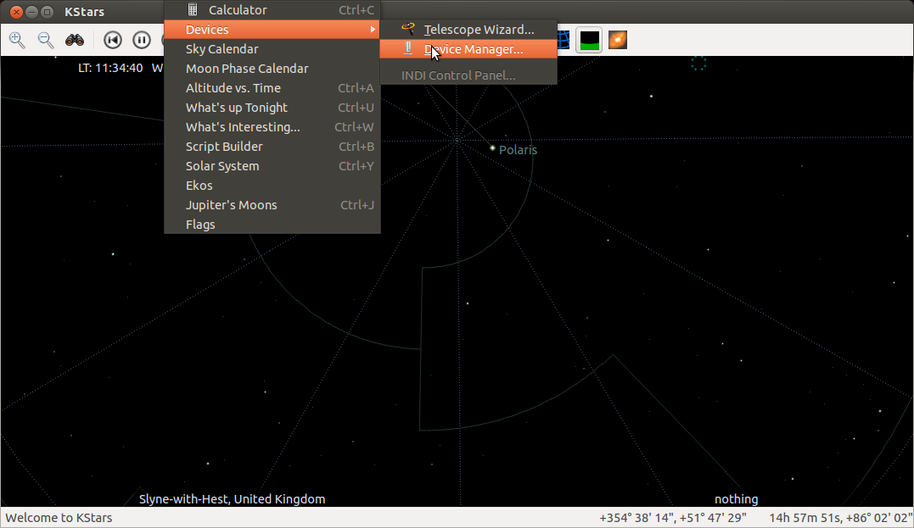
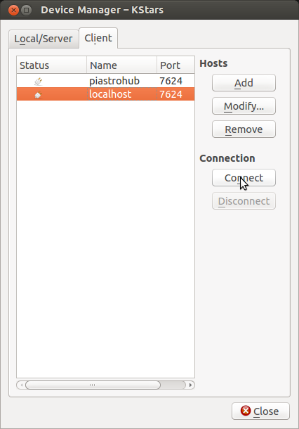
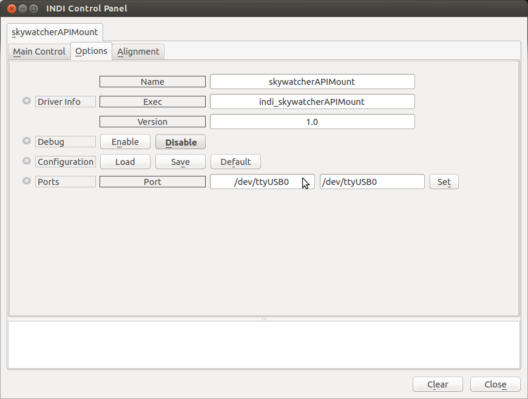
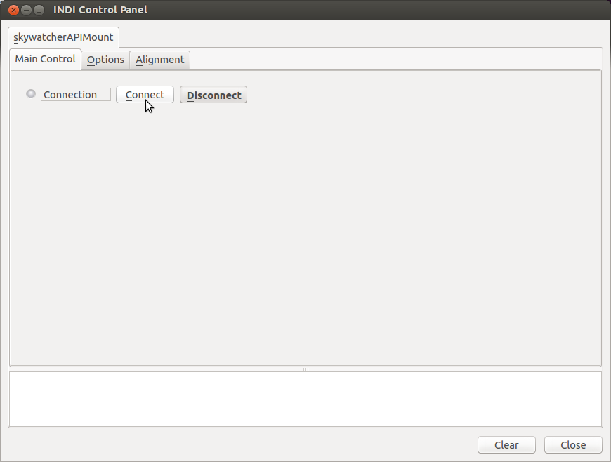
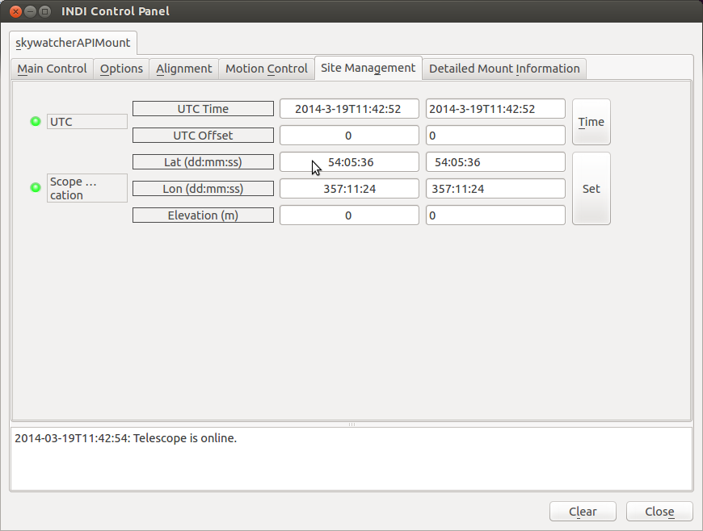
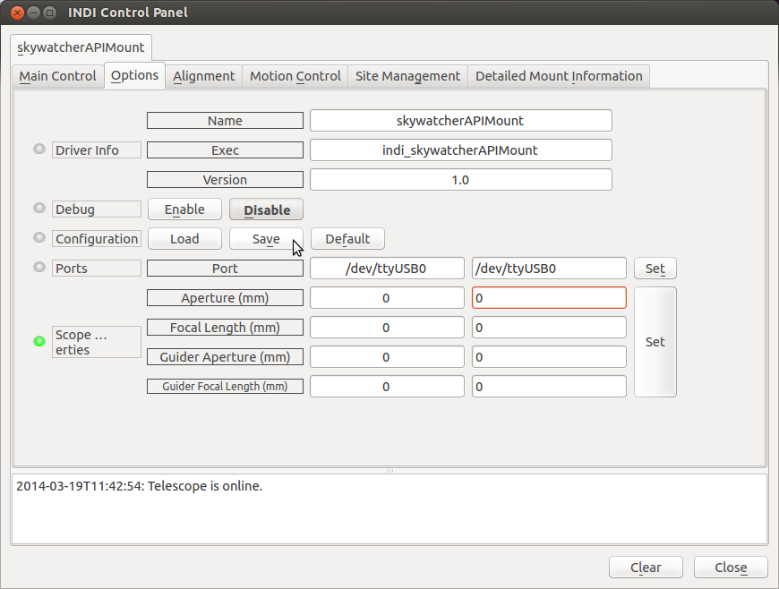
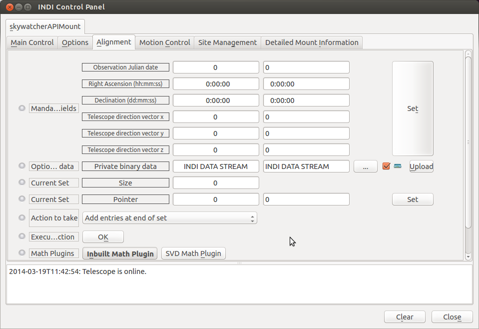
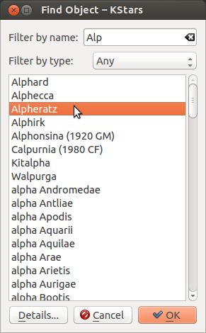
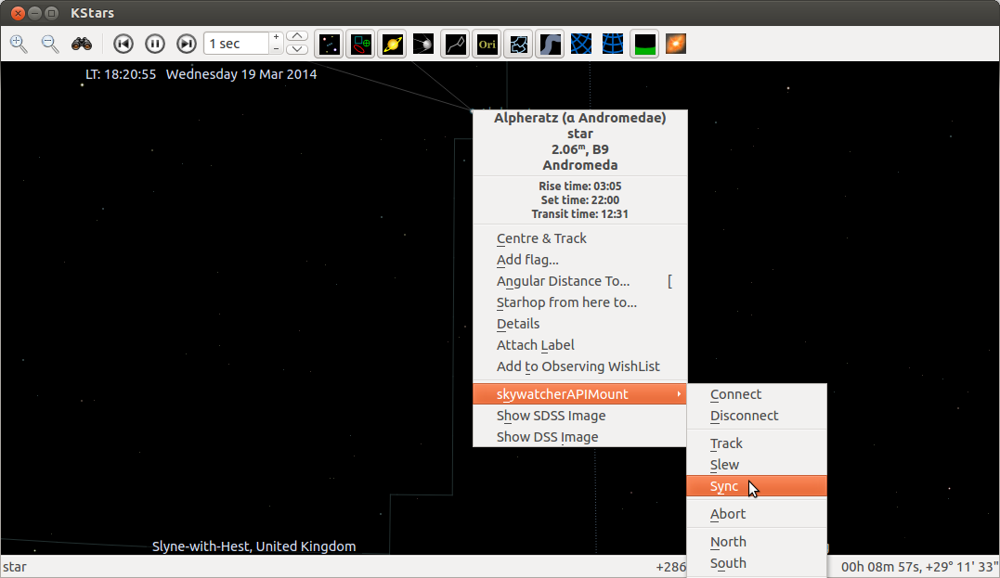
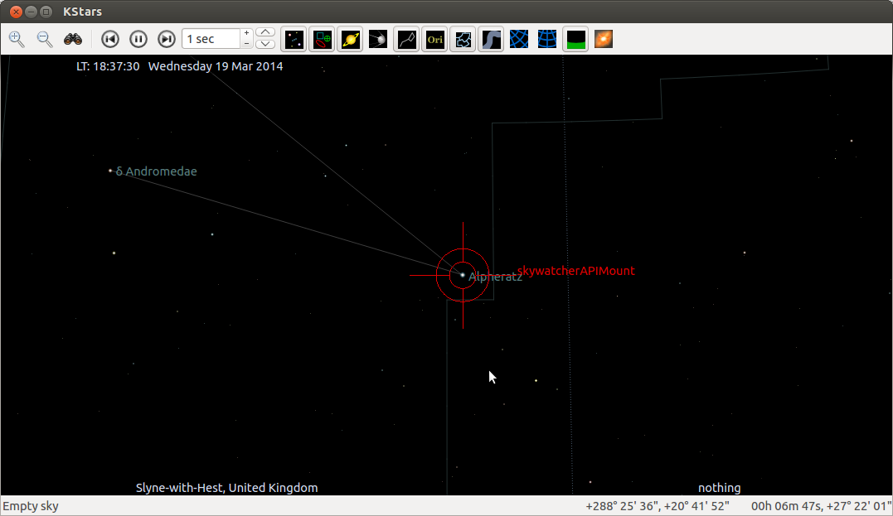

# INDI Alignment Subsystem

## Introduction
The INDI alignment subsystem is a collection of classes that together provide support for telescope alignment using a database of stored sync points. Support is also provided for "Math Plugin Modules". One of these runtime loadable modules is active at any one time. The currently loaded module uses the sync point database to provide conversion functions to and from coordinates in the celestial reference frame and the telescope mount's local reference frame.

During observing runs the sync point database is held in memory within the INDI device driver. It can also be loaded and saved to and from a file on the system the driver is running. The database can be edited via INDI properties (for details of the properties see the class MapPropertiesToInMemoryDatabase), by an API class for use in INDI drivers(InMemoryDatabase), or an API class for use in INDI clients(ClientAPIForAlignmentDatabase).

The current math plugin module can be selected and initialised via INDI properties (for details of the properties see the class MathPluginManagement), by and API class for use in INDI drivers(MathPluginManagement), or by an API class for use in INDI clients(ClientAPIForMathPluginManagement).

## Math Plugins
The following math plugins are included in the first release.

### Built in math plugin
This is the default plugin which is used if no other plugin has been loaded. The plugin is normally initialised or re-initialised when the database has been loaded or when a new sync point has been added. The initialisation process scans the current database and builds a number of transformation matrices depending on how many sync points are present. Before the matrices are computed all celestial reference frame Right Ascension and Declination coordinates are transformed to horizontal Altitude Azimuth coordinates using the julian date stored in the sync point entry. This means that all transformations using the computed transformation matrices will be to and from a zenith aligned celestial reference frame and the telescope mounts local reference frame. This has the advantage of incorporating in the transformation any systematic alignment errors which occur due to the direction the mount is pointing relative to the zenith. Examples of such errors include those due to atmospheric refraction, and those due the effect of gravity on the telescope and mount. All transformation matrices are computed using the simple method proposed by [Toshimi Taki](http://www.geocities.jp/toshimi_taki/matrix/matrix_method_rev_e.pdf). This is quick and dirty but can result in matrices that are not true transforms. These will be reported as errors and an identity matrix will be substituted.

#### No sync points present

No action is taken. 

#### One sync point present

A transformation matrix is computed using a hint to mounts approximate alignment supplied by the driver, this can either be ZENITH, NORTH_CELESTIAL_POLE or SOUTH_CELESTIAL_POLE. The hint is used to make a dummy second sync point entry. A dummy third entry is computed from the cross product of the first two. A single transformation matrix and its inverse is computed from these three points. 

#### Two sync points present

A transformation matrix is computed using the two sync points and a dummy third sync point computed from the cross product of the first two. A single transformation matrix and its inverse is computed from these three points.

#### Three sync points present

A single transformation matrix and its inverse is computed from the three sync points.

#### Four or more sync points present

Two convex hulls are computed. One from the zenith aligned celestial reference frame sync point coordinates plus a dummy nadir, and the other from the mounts local reference frame sync point coordinates plus a dummy nadir. These convex hulls are made up of triangular facets. Forward and inverse transformation matrices are then computed for each corresponding pair of facets and stored alongside the facet in the relevant convex hull.

#### Coordinate conversion

If when the plugin is asked to translate a coordinate it only has a single conversion matrix (the one, two and three sync points case) this will be used. Otherwise (the four or more sync points case) a ray will shot from the origin of the requested source reference frame in the requested direction into the relevant convex hull and the transformation matrix from the facet it intersects will be used for the conversion.

### SVD math plugin
This plugin works in an identical manner to the built in math plugin. The only difference being that [Markley's Singular Value Decomposition algorithm](http://www.control.auc.dk/~tb/best/aug23-Bak-svdalg.pdf) is used to calculate the transformation matrices. This is a highly robust method and forms the basis of the pointing system used in many professional telescope installations.

## Using the Alignment Subsystem from KStars
The easiest way to use a telescope driver that supports the Alignment Subsystem is via an INDI aware client such as KStars. The following example uses the indi_SkywatcherAltAzMount driver and a Synscan 114GT mount. If you are using a different driver then the name of that driver will appear in KStars not "skywatcherAPIMount".

1. Firstly connect the mount to the computer that is to run the driver. I use a readily available PL2303 chip based serial to USB converter cable.
2. From the handset utility menu select PC direct mode. As it is the computer that will be driving the mount not the handset, you can enter whatever values you want to get through the handset initialisation process.
3. Start indiserver and the indi_SkyWatcherAPIMount driver. Using the following command in a terminal:

        indiserver indi_skywatcherAPIMount

4. Start KStars and from the tools menu select "Devices" and then "Device Manager".

5. In the device manager window select the "Client" tab, and in the client tab select the host that indiserver is running on. Click on connect.

6. An INDI Control Panel window should open with a skywatcherAPIMount tab. Select the "Options" subtab (I think I have invented this word!). Ensure that the port property is set to the correct serial device. My PL2303 usb cable always appears as /dev/ttyUSB0.

7. Select the "Main Control" tab and click on connect.

8. After a few seconds pause (whilst the driver determines what type of motor board is in use) a number of extra tabs should appear. One of these should be the "Site Management" tab. Select this and ensure that you have correct values entered for "Scope Location", you can safely ignore elevation at this time.

9. At this point it is probably wise to save the configuration. Return to the "Options" tab and click on "Configuration" "Save".

10. Check that the "Alignment" tab is present and select it. Using the controls on this tab you can view and manipulate the entries in the alignment database, and select which math plugin you want to use. It probably best to ignore this tab for the time being and use KStars to create sync points to align your mount.

11. To create a sync point using KStars. First ensure your target star is visible in the KStars display. I usually do this using the "Pointing...Find Object" tool.

12. Once you have the target in the KStars window right click on it and then hover your mouse over the "Sync" option in the "skywatcherAltAzMount" sub-menu. Do not left click on the "Sync" option yet. N.B. The "Centre and Track" item in the main popup menu is nothing to do with your mount. It merely tells KStars to keep this object centered in the display window.

13. Go back to your scope and centre the target in the eyepiece. Quickly get back to your computer and left click the mouse (be careful not to move it off the Sync menu item or you will have to right click to bring it up again). If you have been successful you should see the KStars telescope crosshairs displayed around the target.
.

14. The Alignment Subsystem is now in "one star" alignment mode. You can try this out by right clicking on your target star or a nearby star and selecting "Track" from the "skywatcherAltAzMount" sub-menu. The further away the object you track is from the sync point star the less accurate the initial slew will be and the more quickly the tracked star will drift off centre. To correct this you need to add more sync points.

15. To add another sync point you can select a new target star in KStars and use the slew command from the "skywatcherAltAzMount" sub-menu to approximately slew your scope onto the target. The procedure for adding the sync point is the same as before. With the default math plugin one achieves maximum accuracy for a particular triangular patch of sky when it is surrounded by three sync points. If more than three sync points are defined then more triangular patches will be added to the mesh.

16. If would be very useful if you could collect information on how well the alignment mechanism holds a star centred, measured in degrees of drift per second. Please share these on the indi-devel list.

## Adding Alignment Subsystem support to an INDI driver
The Alignment Subsystem provides two API classes and a support function class for use in drivers. These are MapPropertiesToInMemoryDatabase, MathPluginManagement, and TelescopeDirectionVectorSupportFunctions. Driver developers can use these classes individually, however, the easiest way to use them is via the AlignmentSubsystemForDrivers class. To use this class simply ensure that is a parent of your driver class.

    class ScopeSim : public INDI::Telescope, public INDI::GuiderInterface, public INDI::AlignmentSubsystem::AlignmentSubsystemForDrivers

Somewhere in your drivers initProperties function add a call to AlignmentSubsystemForDrivers::InitAlignmentProperties.

    bool ScopeSim::initProperties()
    {
        /* Make sure to init parent properties first */
        INDI::Telescope::initProperties();

        ...

        /* Add debug controls so we may debug driver if necessary */
        addDebugControl();

        // Add alignment properties
        InitAlignmentProperties(this);

        return true;
    }

Hook the alignment subsystem into your drivers processing of properties by putting calls to AlignmentSubsystemForDrivers::ProcessNumberProperties,
AlignmentSubsystemForDrivers::ProcessSwitchProperties, AlignmentSubsystemForDrivers::ProcessBLOBProperties AlignmentSubsystemForDrivers::ProcessTextProperties, in the relevant routines.

    bool ScopeSim::ISNewNumber (const char *dev, const char *name, double values[], char *names[], int n)
    {
        //  first check if it's for our device

        if(strcmp(dev,getDeviceName())==0)
        {
            ...

            // Process alignment properties
            ProcessNumberProperties(this, name, values, names, n);

        }

        //  if we didn't process it, continue up the chain, let somebody else
        //  give it a shot
        return INDI::Telescope::ISNewNumber(dev,name,values,names,n);
    }

    bool ScopeSim::ISNewSwitch (const char *dev, const char *name, ISState *states, char *names[], int n)
    {
        if(strcmp(dev,getDeviceName())==0)
        {
            ...
            // Process alignment properties
            ProcessSwitchProperties(this, name, states, names, n);
        }

        //  Nobody has claimed this, so, ignore it
        return INDI::Telescope::ISNewSwitch(dev,name,states,names,n);
    }

    bool ScopeSim::ISNewBLOB (const char *dev, const char *name, int sizes[], int blobsizes[], char *blobs[], char *formats[], char *names[], int n)
    {
        if(strcmp(dev,getDeviceName())==0)
        {
            // Process alignment properties
            ProcessBlobProperties(this, name, sizes, blobsizes, blobs, formats, names, n);
        }
        // Pass it up the chain
        return INDI::Telescope::ISNewBLOB(dev, name, sizes, blobsizes, blobs, formats, names, n);
    }

    bool ScopeSim::ISNewText (const char *dev, const char *name, char *texts[], char *names[], int n)
    {
        if(strcmp(dev,getDeviceName())==0)
        {
            // Process alignment properties
            ProcessTextProperties(this, name, texts, names, n);
        }
        // Pass it up the chain
        return INDI::Telescope::ISNewText(dev, name, texts, names, n);
    }
    
Then make sure you override the INDI::Telescope::updateLocation function and call the AligmmentSubsystemForDrivers::UpdateLocation function.

    bool ScopeSim::updateLocation(double latitude, double longitude, double elevation)
    {
        UpdateLocation(latitude, longitude, elevation);
        return true;
    }

The next step is to add the handling of sync points into your drivers Sync function.

    bool ScopeSim::Sync(double ra, double dec)
    {
        struct ln_hrz_posn AltAz;
        AltAz.alt = double(CurrentEncoderMicrostepsDEC) / MICROSTEPS_PER_DEGREE;
        AltAz.az = double(CurrentEncoderMicrostepsRA) / MICROSTEPS_PER_DEGREE;

        AlignmentDatabaseEntry NewEntry;
        NewEntry.ObservationJulianDate = ln_get_julian_from_sys();
        NewEntry.RightAscension = ra;
        NewEntry.Declination = dec;
        NewEntry.TelescopeDirection = TelescopeDirectionVectorFromAltitudeAzimuth(AltAz);
        NewEntry.PrivateDataSize = 0;

        if (!CheckForDuplicateSyncPoint(NewEntry))
        {

            GetAlignmentDatabase().push_back(NewEntry);

            // Tell the client about size change
            UpdateSize();

            // Tell the math plugin to reinitialise
            Initialise(this);

            return true;
        }
        return false;
    }

The final step is to add coordinate conversion to ReadScopeStatus, TimerHit (for tracking), and Goto.

    bool ScopeSim::ReadScopeStatus()
    {
        struct ln_hrz_posn AltAz;
        AltAz.alt = double(CurrentEncoderMicrostepsDEC) / MICROSTEPS_PER_DEGREE;
        AltAz.az = double(CurrentEncoderMicrostepsRA) / MICROSTEPS_PER_DEGREE;
        TelescopeDirectionVector TDV = TelescopeDirectionVectorFromAltitudeAzimuth(AltAz);

        double RightAscension, Declination;
        if (!TransformTelescopeToCelestial( TDV, RightAscension, Declination))
        {
            if (TraceThisTick)
                DEBUG(DBG_SIMULATOR, "ReadScopeStatus - TransformTelescopeToCelestial failed");

            bool HavePosition = false;
            ln_lnlat_posn Position;
            if ((NULL != IUFindNumber(&LocationNP, "LAT")) && ( 0 != IUFindNumber(&LocationNP, "LAT")->value)
                && (NULL != IUFindNumber(&LocationNP, "LONG")) && ( 0 != IUFindNumber(&LocationNP, "LONG")->value))
            {
                // I assume that being on the equator and exactly on the prime meridian is unlikely
                Position.lat = IUFindNumber(&LocationNP, "LAT")->value;
                Position.lng = IUFindNumber(&LocationNP, "LONG")->value;
                HavePosition = true;
            }
            struct ln_equ_posn EquatorialCoordinates;
            if (HavePosition)
            {
                if (TraceThisTick)
                    DEBUG(DBG_SIMULATOR, "ReadScopeStatus - HavePosition true");
                TelescopeDirectionVector RotatedTDV(TDV);
                switch (GetApproximateMountAlignment())
                {
                    case ZENITH:
                        if (TraceThisTick)
                            DEBUG(DBG_SIMULATOR, "ReadScopeStatus - ApproximateMountAlignment ZENITH");
                        break;

                    case NORTH_CELESTIAL_POLE:
                        if (TraceThisTick)
                            DEBUG(DBG_SIMULATOR, "ReadScopeStatus - ApproximateMountAlignment NORTH_CELESTIAL_POLE");
                        // Rotate the TDV coordinate system anticlockwise (positive) around the y axis by 90 minus
                        // the (positive)observatory latitude. The vector itself is rotated clockwise
                        RotatedTDV.RotateAroundY(90.0 - Position.lat);
                        AltitudeAzimuthFromTelescopeDirectionVector(RotatedTDV, AltAz);
                        break;

                    case SOUTH_CELESTIAL_POLE:
                        if (TraceThisTick)
                            DEBUG(DBG_SIMULATOR, "ReadScopeStatus - ApproximateMountAlignment SOUTH_CELESTIAL_POLE");
                        // Rotate the TDV coordinate system clockwise (negative) around the y axis by 90 plus
                        // the (negative)observatory latitude. The vector itself is rotated anticlockwise
                        RotatedTDV.RotateAroundY(-90.0 - Position.lat);
                        AltitudeAzimuthFromTelescopeDirectionVector(RotatedTDV, AltAz);
                        break;
                }
                ln_get_equ_from_hrz(&AltAz, &Position, ln_get_julian_from_sys(), &EquatorialCoordinates);
            }
            else
            {
                if (TraceThisTick)
                    DEBUG(DBG_SIMULATOR, "ReadScopeStatus - HavePosition false");

                // The best I can do is just do a direct conversion to RA/DEC
                EquatorialCoordinatesFromTelescopeDirectionVector(TDV, EquatorialCoordinates);
            }
            // libnova works in decimal degrees
            RightAscension = EquatorialCoordinates.ra * 24.0 / 360.0;
            Declination = EquatorialCoordinates.dec;
        }

        if (TraceThisTick)
            DEBUGF(DBG_SIMULATOR, "ReadScopeStatus - RA %lf hours DEC %lf degrees", RightAscension, Declination);

        NewRaDec(RightAscension, Declination);

        return true;
    }

    bool ScopeSim::Sync(double ra, double dec)
    {
        struct ln_hrz_posn AltAz;
        AltAz.alt = double(CurrentEncoderMicrostepsDEC) / MICROSTEPS_PER_DEGREE;
        AltAz.az = double(CurrentEncoderMicrostepsRA) / MICROSTEPS_PER_DEGREE;

        AlignmentDatabaseEntry NewEntry;
        NewEntry.ObservationJulianDate = ln_get_julian_from_sys();
        NewEntry.RightAscension = ra;
        NewEntry.Declination = dec;
        NewEntry.TelescopeDirection = TelescopeDirectionVectorFromAltitudeAzimuth(AltAz);
        NewEntry.PrivateDataSize = 0;

        if (!CheckForDuplicateSyncPoint(NewEntry))
        {

            GetAlignmentDatabase().push_back(NewEntry);

            // Tell the client about size change
            UpdateSize();

            // Tell the math plugin to reinitialise
            Initialise(this);

            return true;
        }
        return false;
    }

    void ScopeSim::TimerHit()
    {
        // Simulate mount movement
        
        ...

        INDI::Telescope::TimerHit(); // This will call ReadScopeStatus

        // OK I have updated the celestial reference frame RA/DEC in ReadScopeStatus
        // Now handle the tracking state
        switch(TrackState)
        {
            case SCOPE_SLEWING:
                if ((STOPPED == AxisStatusRA) && (STOPPED == AxisStatusDEC))
                {
                    if (ISS_ON == IUFindSwitch(&CoordSP,"TRACK")->s)
                    {
                        // Goto has finished start tracking
                        DEBUG(DBG_SIMULATOR, "TimerHit - Goto finished start tracking");
                        TrackState = SCOPE_TRACKING;
                        // Fall through to tracking case
                    }
                    else
                    {
                        TrackState = SCOPE_IDLE;
                        break;
                    }
                }
                else
                    break;

            case SCOPE_TRACKING:
            {
                // Continue or start tracking
                // Calculate where the mount needs to be in POLLMS time
                // POLLMS is hardcoded to be one second
                double JulianOffset = 1.0 / (24.0 * 60 * 60); // TODO may need to make this longer to get a meaningful result
                TelescopeDirectionVector TDV;
                ln_hrz_posn AltAz;
                if (TransformCelestialToTelescope(CurrentTrackingTarget.ra, CurrentTrackingTarget.dec,
                                                    JulianOffset, TDV))
                    AltitudeAzimuthFromTelescopeDirectionVector(TDV, AltAz);
                else
                {
                    // Try a conversion with the stored observatory position if any
                    bool HavePosition = false;
                    ln_lnlat_posn Position;
                    if ((NULL != IUFindNumber(&LocationNP, "LAT")) && ( 0 != IUFindNumber(&LocationNP, "LAT")->value)
                        && (NULL != IUFindNumber(&LocationNP, "LONG")) && ( 0 != IUFindNumber(&LocationNP, "LONG")->value))
                    {
                        // I assume that being on the equator and exactly on the prime meridian is unlikely
                        Position.lat = IUFindNumber(&LocationNP, "LAT")->value;
                        Position.lng = IUFindNumber(&LocationNP, "LONG")->value;
                        HavePosition = true;
                    }
                    struct ln_equ_posn EquatorialCoordinates;
                    // libnova works in decimal degrees
                    EquatorialCoordinates.ra = CurrentTrackingTarget.ra * 360.0 / 24.0;
                    EquatorialCoordinates.dec = CurrentTrackingTarget.dec;
                    if (HavePosition)
                        ln_get_hrz_from_equ(&EquatorialCoordinates, &Position,
                                                ln_get_julian_from_sys() + JulianOffset, &AltAz);
                    else
                    {
                        // No sense in tracking in this case
                        TrackState = SCOPE_IDLE;
                        break;
                    }
                }

                // My altitude encoder runs -90 to +90
                if ((AltAz.alt > 90.0) || (AltAz.alt < -90.0))
                {
                    DEBUG(DBG_SIMULATOR, "TimerHit tracking - Altitude out of range");
                    // This should not happen
                    return;
                }

                // My polar encoder runs 0 to +360
                if ((AltAz.az > 360.0) || (AltAz.az < -360.0))
                {
                    DEBUG(DBG_SIMULATOR, "TimerHit tracking - Azimuth out of range");
                    // This should not happen
                    return;
                }

                if (AltAz.az < 0.0)
                {
                    DEBUG(DBG_SIMULATOR, "TimerHit tracking - Azimuth negative");
                    AltAz.az = 360.0 + AltAz.az;
                }

                long AltitudeOffsetMicrosteps = int(AltAz.alt * MICROSTEPS_PER_DEGREE - CurrentEncoderMicrostepsDEC);
                long AzimuthOffsetMicrosteps = int(AltAz.az * MICROSTEPS_PER_DEGREE - CurrentEncoderMicrostepsRA);

                DEBUGF(DBG_SIMULATOR, "TimerHit - Tracking AltitudeOffsetMicrosteps %d AzimuthOffsetMicrosteps %d",
                        AltitudeOffsetMicrosteps, AzimuthOffsetMicrosteps);

                if (0 != AzimuthOffsetMicrosteps)
                {
                    // Calculate the slewing rates needed to reach that position
                    // at the correct time. This is simple as interval is one second
                    if (AzimuthOffsetMicrosteps > 0)
                    {
                        if (AzimuthOffsetMicrosteps < MICROSTEPS_PER_REVOLUTION / 2.0)
                        {
                            // Foward
                            AxisDirectionRA = FORWARD;
                            AxisSlewRateRA = AzimuthOffsetMicrosteps;
                        }
                        else
                        {
                            // Reverse
                            AxisDirectionRA = REVERSE;
                            AxisSlewRateRA = MICROSTEPS_PER_REVOLUTION - AzimuthOffsetMicrosteps;
                        }
                    }
                    else
                    {
                        AzimuthOffsetMicrosteps = abs(AzimuthOffsetMicrosteps);
                        if (AzimuthOffsetMicrosteps < MICROSTEPS_PER_REVOLUTION / 2.0)
                        {
                            // Foward
                            AxisDirectionRA = REVERSE;
                            AxisSlewRateRA = AzimuthOffsetMicrosteps;
                        }
                        else
                        {
                            // Reverse
                            AxisDirectionRA = FORWARD;
                            AxisSlewRateRA = MICROSTEPS_PER_REVOLUTION - AzimuthOffsetMicrosteps;
                        }
                    }
                    AxisSlewRateRA = abs(AzimuthOffsetMicrosteps);
                    AxisDirectionRA = AzimuthOffsetMicrosteps > 0 ? FORWARD : REVERSE;  // !!!! BEWARE INERTIA FREE MOUNT
                    AxisStatusRA = SLEWING;
                    DEBUGF(DBG_SIMULATOR, "TimerHit - Tracking AxisSlewRateRA %lf AxisDirectionRA %d",
                        AxisSlewRateRA, AxisDirectionRA);
                }
                else
                {
                    // Nothing to do - stop the axis
                    AxisStatusRA = STOPPED; // !!!! BEWARE INERTIA FREE MOUNT
                    DEBUG(DBG_SIMULATOR, "TimerHit - Tracking nothing to do stopping RA axis");
                }

                if (0 != AltitudeOffsetMicrosteps)
                {
                     // Calculate the slewing rates needed to reach that position
                    // at the correct time.
                    AxisSlewRateDEC = abs(AltitudeOffsetMicrosteps);
                    AxisDirectionDEC = AltitudeOffsetMicrosteps > 0 ? FORWARD : REVERSE;  // !!!! BEWARE INERTIA FREE MOUNT
                    AxisStatusDEC = SLEWING;
                    DEBUGF(DBG_SIMULATOR, "TimerHit - Tracking AxisSlewRateDEC %lf AxisDirectionDEC %d",
                        AxisSlewRateDEC, AxisDirectionDEC);
                }
                else
                {
                    // Nothing to do - stop the axis
                    AxisStatusDEC = STOPPED;  // !!!! BEWARE INERTIA FREE MOUNT
                    DEBUG(DBG_SIMULATOR, "TimerHit - Tracking nothing to do stopping DEC axis");
                }

                break;
            }

            default:
                break;
        }

    bool ScopeSim::Goto(double ra,double dec)
    {

        DEBUGF(DBG_SIMULATOR, "Goto - Celestial reference frame target right ascension %lf(%lf) declination %lf", ra * 360.0 / 24.0, ra, dec);

        if (ISS_ON == IUFindSwitch(&CoordSP,"TRACK")->s)
        {
            char RAStr[32], DecStr[32];
            fs_sexa(RAStr, ra, 2, 3600);
            fs_sexa(DecStr, dec, 2, 3600);
            CurrentTrackingTarget.ra = ra;
            CurrentTrackingTarget.dec = dec;
            DEBUG(DBG_SIMULATOR, "Goto - tracking requested");
        }

        // Call the alignment subsystem to translate the celestial reference frame coordinate
        // into a telescope reference frame coordinate
        TelescopeDirectionVector TDV;
        ln_hrz_posn AltAz;
        if (TransformCelestialToTelescope(ra, dec, 0.0, TDV))
        {
            // The alignment subsystem has successfully transformed my coordinate
            AltitudeAzimuthFromTelescopeDirectionVector(TDV, AltAz);
        }
        else
        {
            // The alignment subsystem cannot transform the coordinate.
            // Try some simple rotations using the stored observatory position if any
            bool HavePosition = false;
            ln_lnlat_posn Position;
            if ((NULL != IUFindNumber(&LocationNP, "LAT")) && ( 0 != IUFindNumber(&LocationNP, "LAT")->value)
                && (NULL != IUFindNumber(&LocationNP, "LONG")) && ( 0 != IUFindNumber(&LocationNP, "LONG")->value))
            {
                // I assume that being on the equator and exactly on the prime meridian is unlikely
                Position.lat = IUFindNumber(&LocationNP, "LAT")->value;
                Position.lng = IUFindNumber(&LocationNP, "LONG")->value;
                HavePosition = true;
            }
            struct ln_equ_posn EquatorialCoordinates;
            // libnova works in decimal degrees
            EquatorialCoordinates.ra = ra * 360.0 / 24.0;
            EquatorialCoordinates.dec = dec;
            if (HavePosition)
            {
                ln_get_hrz_from_equ(&EquatorialCoordinates, &Position, ln_get_julian_from_sys(), &AltAz);
                TDV = TelescopeDirectionVectorFromAltitudeAzimuth(AltAz);
                switch (GetApproximateMountAlignment())
                {
                    case ZENITH:
                        break;

                    case NORTH_CELESTIAL_POLE:
                        // Rotate the TDV coordinate system clockwise (negative) around the y axis by 90 minus
                        // the (positive)observatory latitude. The vector itself is rotated anticlockwise
                        TDV.RotateAroundY(Position.lat - 90.0);
                        break;

                    case SOUTH_CELESTIAL_POLE:
                        // Rotate the TDV coordinate system anticlockwise (positive) around the y axis by 90 plus
                        // the (negative)observatory latitude. The vector itself is rotated clockwise
                        TDV.RotateAroundY(Position.lat + 90.0);
                        break;
                }
                AltitudeAzimuthFromTelescopeDirectionVector(TDV, AltAz);
            }
            else
            {
                // The best I can do is just do a direct conversion to Alt/Az
                TDV = TelescopeDirectionVectorFromEquatorialCoordinates(EquatorialCoordinates);
                AltitudeAzimuthFromTelescopeDirectionVector(TDV, AltAz);
            }
        }

        // My altitude encoder runs -90 to +90
        if ((AltAz.alt > 90.0) || (AltAz.alt < -90.0))
        {
            DEBUG(DBG_SIMULATOR, "Goto - Altitude out of range");
            // This should not happen
            return false;
        }

        // My polar encoder runs 0 to +360
        if ((AltAz.az > 360.0) || (AltAz.az < -360.0))
        {
            DEBUG(DBG_SIMULATOR, "Goto - Azimuth out of range");
            // This should not happen
            return false;
        }

        if (AltAz.az < 0.0)
        {
            DEBUG(DBG_SIMULATOR, "Goto - Azimuth negative");
            AltAz.az = 360.0 + AltAz.az;
        }

        DEBUGF(DBG_SIMULATOR, "Goto - Scope reference frame target altitude %lf azimuth %lf", AltAz.alt, AltAz.az);

        GotoTargetMicrostepsDEC = int(AltAz.alt * MICROSTEPS_PER_DEGREE);
        if (GotoTargetMicrostepsDEC == CurrentEncoderMicrostepsDEC)
            AxisStatusDEC = STOPPED;
        else
        {
            if (GotoTargetMicrostepsDEC > CurrentEncoderMicrostepsDEC)
                AxisDirectionDEC = FORWARD;
            else
                AxisDirectionDEC = REVERSE;
            AxisStatusDEC = SLEWING_TO;
        }
        GotoTargetMicrostepsRA = int(AltAz.az * MICROSTEPS_PER_DEGREE);
        if (GotoTargetMicrostepsRA == CurrentEncoderMicrostepsRA)
            AxisStatusRA = STOPPED;
        else
        {
            if (GotoTargetMicrostepsRA > CurrentEncoderMicrostepsRA)
                AxisDirectionRA = (GotoTargetMicrostepsRA - CurrentEncoderMicrostepsRA) < MICROSTEPS_PER_REVOLUTION / 2.0 ? FORWARD : REVERSE;
            else
                AxisDirectionRA = (CurrentEncoderMicrostepsRA - GotoTargetMicrostepsRA) < MICROSTEPS_PER_REVOLUTION / 2.0 ? REVERSE : FORWARD;
            AxisStatusRA = SLEWING_TO;
        }

        TrackState = SCOPE_SLEWING;

        EqNP.s    = IPS_BUSY;

        return true;
    }

## Developing Alignment Subsystem clients
The Alignment Subsystem provides two API classes for use in clients. These are ClientAPIForAlignmentDatabase and ClientAPIForMathPluginManagement. Client developers can use these classes individually, however, the easiest way to use them is via the AlignmentSubsystemForClients class. To use this class simply ensure that is a parent of your client class.

	class LoaderClient : public INDI::BaseClient, INDI::AlignmentSubsystem::AlignmentSubsystemForClients

Somewhere in the initialisation of your client make a call to the Initalise method of the AlignmentSubsystemForClients class for example:

    void LoaderClient::Initialise(int argc, char* argv[])
    {
        std::string HostName("localhost");
        int Port = 7624;

        if (argc > 1)
            DeviceName = argv[1];
        if (argc > 2)
            HostName = argv[2];
        if (argc > 3)
        {
            std::istringstream Parameter(argv[3]);
            Parameter >> Port;
        }

        AlignmentSubsystemForClients::Initialise(DeviceName.c_str(), this);

        setServer(HostName.c_str(), Port);

        watchDevice(DeviceName.c_str());

        connectServer();

        setBLOBMode(B_ALSO, DeviceName.c_str(), NULL);
    }

To hook the Alignment Subsystem into the clients property handling you must ensure that the following virtual functions are overriden.

    virtual void newBLOB(IBLOB *bp);
    virtual void newDevice(INDI::BaseDevice *dp);
    virtual void newNumber(INumberVectorProperty *nvp);
    virtual void newProperty(INDI::Property *property);
    virtual void newSwitch(ISwitchVectorProperty *svp);

A call to the Alignment Subsystems property handling functions must then be placed in the body of these functions.

    void LoaderClient::newBLOB(IBLOB *bp)
    {
        ProcessNewBLOB(bp);
    }

    void LoaderClient::newDevice(INDI::BaseDevice *dp)
    {
        ProcessNewDevice(dp);
    }

    void LoaderClient::newNumber(INumberVectorProperty *nvp)
    {
        ProcessNewNumber(nvp);
    }

    void LoaderClient::newProperty(INDI::Property *property)
    {
        ProcessNewProperty(property);
    }

    void LoaderClient::newSwitch(ISwitchVectorProperty *svp)
    {
        ProcessNewSwitch(svp);
    }

See the documentation for the ClientAPIForAlignmentDatabase and ClientAPIForMathPluginManagement to see what other functionality is available.
